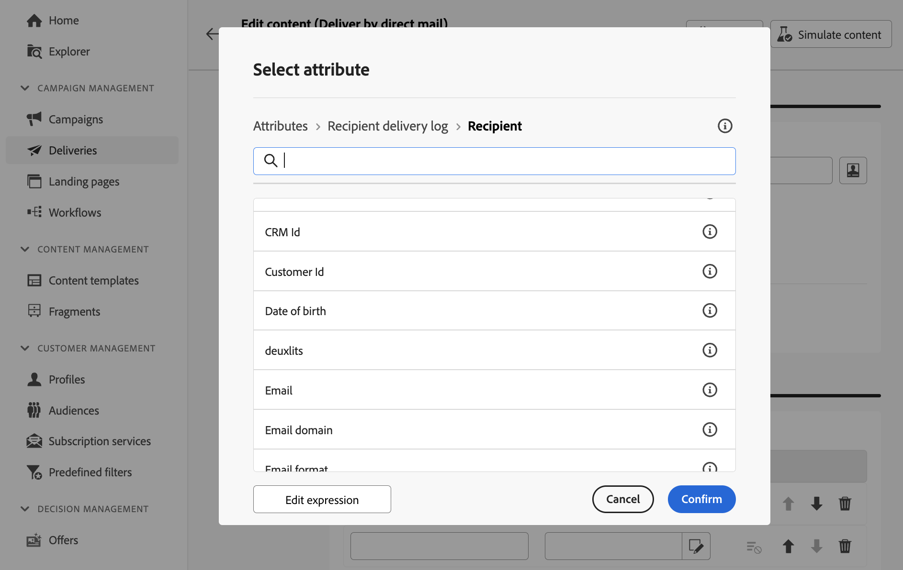

# 추출 파일 설계 {#design-direct-mail}

>[!CONTEXTUALHELP]
>id="acw_directmail_content"
>title="추출 파일 콘텐츠"
>abstract="**콘텐츠 편집** 버튼을 클릭하여 다이렉트 메일 제공업체에서 요구하는 추출 파일 설계를 시작합니다. 이를 통해 레이블 및 형식과 같은 파일 속성을 정의하고 파일에 포함할 열을 지정할 수 있습니다."

>[!CONTEXTUALHELP]
>id="acw_directmail_properties_file"
>title="파일 속성"
>abstract="이름, 형식 등 추출 파일의 속성을 구성합니다. 표현식 편집기를 사용하여 데이터베이스의 속성을 사용해 파일 이름을 개인화할 수 있습니다."

>[!CONTEXTUALHELP]
>id="acw_directmail_properties_content"
>title="콘텐츠"
>abstract="이 섹션에서는 추출 파일에 표시할 열을 지정합니다. 완료하면 **콘텐츠 시뮬레이션** 버튼을 사용하여 추출 파일의 미리보기를 확인할 수 있습니다."

DM 게재에서 생성된 추출 파일의 콘텐츠를 디자인하려면 게재 페이지에서 **[!UICONTROL 콘텐츠 편집]** 단추를 클릭한 다음 파일 속성 및 콘텐츠를 구성하십시오.

## 추출 파일 속성 구성 {#properties}

1. **[!UICONTROL 파일 이름]** 필드에서 추출 파일에 대해 원하는 이름을 지정합니다. 데이터베이스의 속성을 사용하여 파일 이름을 개인화할 수 있습니다. 이렇게 하려면 **[!UICONTROL 개인화 대화 상자 열기]** 아이콘을 클릭하여 표현식 편집기를 엽니다. [콘텐츠 개인화 방법 알아보기](../personalization/personalize.md)

1. **[!UICONTROL 파일 형식]** 필드에서 추출 파일에 대해 원하는 형식을 선택합니다. **텍스트**, **고정 너비 열을 사용하는 텍스트**, **CSV(Excel)** 또는 **XML**.

1. **[!UICONTROL 추출 형식]** 섹션을 확장하여 추출 파일의 형식과 관련된 특정 옵션에 액세스합니다. 사용 가능한 값은 선택한 형식에 따라 다릅니다.

+++ 사용 가능한 추출 형식 옵션

   * **[!UICONTROL 첫 번째 줄을 열 머리글로 사용]**(텍스트/CSV(Excel) 형식): 첫 번째 열을 머리글로 사용하려면 이 옵션을 켜거나 끕니다.
   * **[!UICONTROL 열 구분 기호]**(텍스트 형식): 추출 파일에서 열 구분 기호로 사용할 문자를 지정합니다.
   * **[!UICONTROL 문자열 구분 기호]**(텍스트 형식): 추출 파일에서 문자열을 구분하는 방법을 지정하십시오.
   * **[!UICONTROL 줄의 끝]**(텍스트 형식): 추출 파일에서 줄의 끝을 구분하는 방법을 지정하십시오.
   * **[!UICONTROL 인코딩]**: 추출 파일의 인코딩을 선택합니다.
   * **[!UICONTROL 날짜 형식 및 구분 기호]**: 추출 파일에서 날짜 형식을 지정하는 방법을 지정하십시오.
   * **[!UICONTROL 숫자 형식]**: 추출 파일에서 숫자의 형식을 지정할 방법을 지정합니다.
   * **[!UICONTROL 열거형의 내부 값 대신 레이블 내보내기]**: 열거형 값을 내보내고 내부 ID가 아닌 이해하기 쉬운 열 레이블을 검색하려는 경우 이 옵션을 켜십시오.

+++

1. **[!UICONTROL 요청 수량]** 옵션을 전환하여 게재의 수신자 수를 제한합니다.

   {zoomable="yes"}

## 추출 파일 열 구성 {#content}

**[!UICONTROL 콘텐츠]** 섹션에서 추출 파일에 표시할 열을 지정합니다. 이렇게 하려면 다음 단계를 수행합니다.

1. 새 열을 만들려면 **[!UICONTROL 특성 추가]** 단추를 클릭하십시오.
1. 열에 표시할 속성을 선택한 다음 확인합니다. 표현식 편집기를 사용하여 **[!UICONTROL 표현식 편집]** 단추를 클릭하여 특성을 선택할 수 있습니다. [특성을 선택하고 즐겨찾기에 추가하는 방법 알아보기](../get-started/attributes.md)

   

1. 열이 추가되면 해당 레이블을 변경하고 편집 아이콘을 사용하여 관련 속성을 수정할 수 있습니다.
1. 추출 파일에 필요한 수만큼 열을 추가하려면 이 단계를 반복합니다.
1. 열 중 하나를 사용하여 추출 파일을 정렬하려면 **[!UICONTROL 정렬]** 열의 아이콘을 클릭하고 원하는 정렬 방법을 선택하십시오.
1. 열의 위치를 변경하려면 위쪽 및 아래쪽 화살표를 사용합니다.

이제 추출 파일을 미리 보고 게재를 전송하여 추출 파일을 생성할 수 있습니다. [DM 메시지를 테스트하고 보내는 방법 알아보기](send-direct-mail.md)