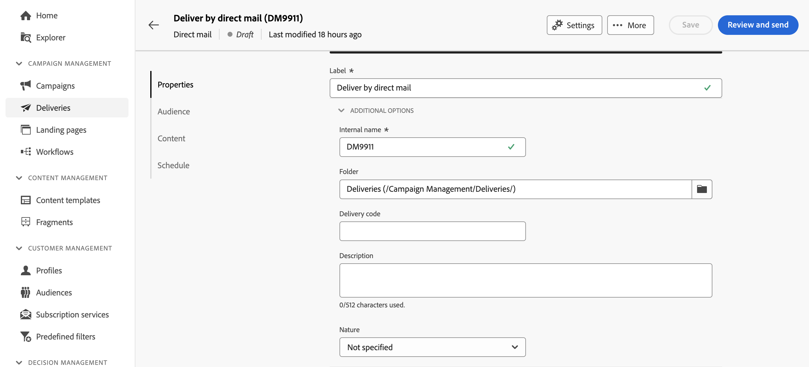
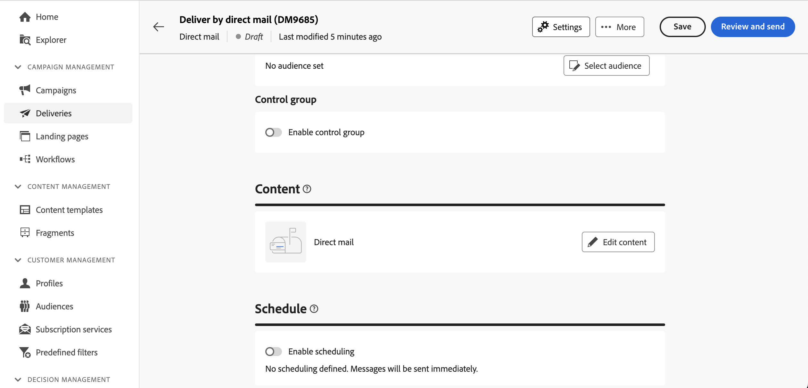

# 다이렉트 메일(DM) 게재 만들기 {#create-direct-mail}

독립형 DM 게재를 만들거나 캠페인 워크플로우 컨텍스트에서 DM 게재를 만들 수 있습니다. 아래 단계에서는 독립 실행형(일회성) DM 게재 절차를 자세히 설명합니다. 캠페인 워크플로우의 컨텍스트에서 작업하는 경우 만들기 단계는 [이 섹션](../workflows/activities/channels.md#create-a-delivery-in-a-campaign-workflow)에 자세히 설명되어 있습니다.

새 독립 실행형 DM 게재를 만들려면 다음 단계를 수행합니다.

1. 왼쪽 레일의 **[!UICONTROL 게재]** 메뉴로 이동한 다음 **[!UICONTROL 게재 만들기]** 단추를 클릭합니다.

1. **[!UICONTROL 채널]** 섹션에서 **[!UICONTROL DM]**&#x200B;을(를) 채널로 선택하고 템플릿을 선택합니다. [템플릿에 대해 자세히 알아보기](../msg/delivery-template.md)

1. **[!UICONTROL 게재 만들기]** 버튼을 클릭하여 확인합니다.

   DM 게재 만들기를 보여 주는 {zoomable="yes"}

1. 게재할 **[!UICONTROL 레이블]**&#x200B;을 입력하고 **[!UICONTROL 추가 옵션]** 드롭다운에 액세스합니다. 게재가 확장된 스키마를 기반으로 하는 경우 특정 **사용자 지정 옵션** 필드를 사용할 수 있습니다.

   DM 게재에 대한 속성 구성을 보여 주는 {zoomable="yes"}

   +++요구 사항에 따라 다음 설정을 구성합니다.
   * **[!UICONTROL 내부 이름]**: 게재에 고유 식별자를 할당합니다.
   * **[!UICONTROL 폴더]**: 게재를 특정 폴더에 저장합니다.
   * **[!UICONTROL 게재 코드]**: 고유한 명명 규칙을 사용하여 게재를 구성합니다.
   * **[!UICONTROL 설명]**: 게재에 대한 설명을 입력합니다.
   * **[!UICONTROL 특성]**: 분류 목적으로 게재 특성을 지정합니다.
   +++

1. 기존 대상을 타깃팅하거나 직접 만들려면 **[!UICONTROL 대상 선택]** 단추를 클릭하십시오.

   * [기존 대상자를 선택하는 방법 알아보기](../audience/add-audience.md)
   * [새 대상자를 만드는 방법 알아보기](../audience/one-time-audience.md)

   {zoomable="yes"}

   >[!NOTE]
   >
   >DM 수신자는 최소한 이름과 우편 주소를 포함해야 합니다. 이름, ZIP/우편 번호 필드 및 구/군/시 필드가 비어 있지 않으면 주소는 완료된 것으로 간주됩니다. 주소가 불완전한 수신자는 DM 게재에서 제외됩니다.

1. 게재의 영향을 측정하는 컨트롤 그룹을 설정하려면 **[!UICONTROL 컨트롤 그룹 사용]** 옵션을 켜십시오. 메시지가 해당 컨트롤 그룹으로 전송되지 않으므로 메시지를 받은 모집단의 행동과 받지 않은 연락처의 행동을 비교할 수 있습니다. [컨트롤 그룹으로 작업하는 방법 알아보기](../audience/control-group.md)

1. 추출 파일로 내보낼 정보(열)를 정의하려면 **[!UICONTROL 콘텐츠 편집]**&#x200B;을(를) 클릭합니다. [자세히 알아보기](content-direct-mail.md)

   {zoomable="yes"}

1. 특정 일자 및 시간에 게재를 예약하려면 **[!UICONTROL 예약 활성화]** 옵션을 켭니다. 게재를 시작하면 사용자가 정의한 정확한 날짜 및 시간에 추출 파일이 자동으로 생성됩니다. [게재를 예약하는 방법을 알아봅니다](../msg/gs-deliveries.md#gs-schedule).

   >[!NOTE]
   >
   >워크플로우의 컨텍스트에서 게재를 보낼 때는 **스케줄러** 활동을 사용해야 합니다. [이 페이지](../workflows/activities/scheduler.md)에 대해 자세히 알아보세요.

1. **[!UICONTROL 설정]**&#x200B;을 클릭하여 게재 템플릿과 관련된 고급 옵션에 액세스합니다. [자세히 알아보기](../advanced-settings/delivery-settings.md)

   {zoomable="yes"}

1. DM 게재가 준비되면 **[!UICONTROL 검토 및 보내기]** 단추를 클릭하여 게재를 확인 및 보내고 추출 파일을 생성합니다. [DM 게재를 미리 보고 보내는 방법 알아보기](send-direct-mail.md)