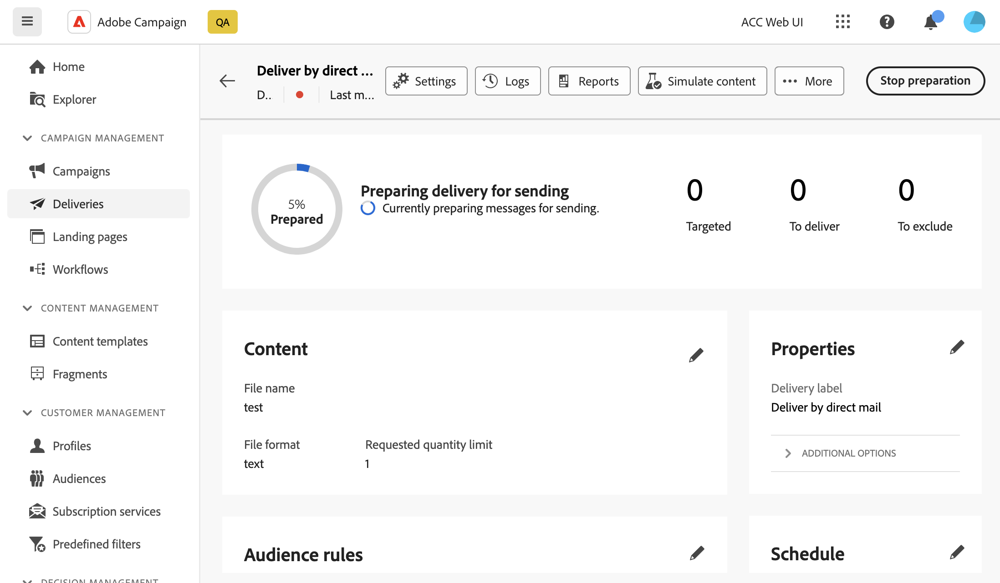

# DM 게재 미리 보기 및 보내기 {#send-direct-mail}

DM 게재에 대한 추출 파일을 구성했으면 테스트 프로필을 사용하여 미리 볼 수 있습니다. 개인화된 콘텐츠를 포함한 경우 테스트 프로필 데이터를 사용하여 이 콘텐츠가 열에 표시되는 방식을 검사할 수 있습니다. 이렇게 하면 파일 콘텐츠가 올바로 렌더링되고 개인화된 요소가 적절하게 통합되는지 확인할 수 있습니다.

추출 파일이 준비되면 DM 게재를 전송하여 파일을 생성하고 DM 공급자와 공유할 수 있습니다. [DM 게재를 보내는 방법 알아보기](#dm-send)

## 추출 파일 미리 보기 {#preview-dm}

추출 파일을 미리 보는 주요 단계는 다음과 같습니다. 게재 미리 보기 방법에 대한 자세한 내용은 [이 섹션](../preview-test/preview-content.md)에서 확인할 수 있습니다.

1. 게재 콘텐츠 페이지에서 **[!UICONTROL 콘텐츠 시뮬레이션]**&#x200B;을 사용하여 개인화된 콘텐츠를 미리 봅니다.

   {zoomable="yes"}

1. 추출 파일 콘텐츠에서 데이터를 미리 볼 하나 이상의 프로필을 선택하려면 **[!UICONTROL 테스트 프로필 추가]**&#x200B;를 클릭하십시오.

1. 오른쪽 창에는 추출 파일의 미리보기가 있습니다. 여기서 개인화된 요소는 선택한 프로필의 데이터로 동적으로 대체됩니다.

   {zoomable="yes"}

## 증명 보내기 {#test-dm}

**Adobe Campaign**&#x200B;을(를) 사용하면 증명을 주요 대상자에게 보내기 전에 보낼 수 있습니다. 이 단계는 게재의 유효성을 검사하고 문제를 식별하는 데 중요합니다. 테스트 수신자는 개인화 설정과 같은 요소를 검토하여 최적의 성능을 보장하고 오류를 감지할 수 있습니다. 이 프로세스는 주요 대상에게 도달하기 전에 추출 파일을 구체화하고 최적화하는 데 도움이 됩니다.

DM 게재의 경우 증명을 보내면 선택한 테스트 프로필의 데이터를 사용하여 추출 파일 샘플이 생성됩니다. 액세스하려면 다음 단계를 따르십시오.

1. 콘텐츠 시뮬레이션 화면에서 **[!UICONTROL 증명 보내기]** 단추를 클릭하고 모든 유형의 게재와 동일한 단계에 따라 증명을 보냅니다. [증명을 보내는 방법 알아보기](../preview-test/test-deliveries.md)

1. 증명이 전송되면 **[!UICONTROL 증명 보기]** 버튼 또는 게재 목록에서 액세스할 수 있습니다. [보낸 증명에 액세스하는 방법 알아보기](../preview-test/test-deliveries.md#access-test-deliveries)

1. 증명 게재 대시보드에서 **[!UICONTROL 파일 미리 보기]** 단추를 클릭하여 추출 파일 미리 보기에 액세스합니다.

   {zoomable="yes"}

   >[!NOTE]
   >
   >처음 100줄만 미리보기 파일에 표시됩니다.

## DM 게재 보내기 {#send-dm}

고객에게 DM을 보낼 준비가 되면 게재를 전송하여 지정된 추출 파일에서 데이터 추출을 시작할 수 있습니다. 이렇게 하려면 다음 단계를 수행합니다.

1. 추출 파일의 콘텐츠를 디자인한 후 **[!UICONTROL 게재]** 페이지에서 **[!UICONTROL 검토 및 보내기]**&#x200B;를 클릭하세요.

   {zoomable="yes"}

1. **[!UICONTROL 준비]**&#x200B;를 클릭하고 제공된 진행률과 통계를 모니터링합니다.

   오류가 발생하면 오류에 대한 자세한 내용은 **[!UICONTROL 로그]** 메뉴를 참조하십시오.

   {zoomable="yes"}

1. 마지막 전송 프로세스를 진행하려면 **[!UICONTROL 보내기]**&#x200B;를 클릭하여 메시지를 보냅니다.

1. **[!UICONTROL 보내기]**&#x200B;를 클릭하여 보내기 작업을 확인합니다.

   DM 게재를 예약한 경우 **[!UICONTROL 예약된 대로 보내기]** 단추를 클릭합니다. [이 섹션](../msg/gs-messages.md#schedule-the-delivery-sending)에서 게재 예약에 대해 자세히 알아보세요.

게재를 전송하면 추출 파일이 자동으로 생성되고 게재 템플릿의 [고급 설정](../advanced-settings/delivery-settings.md)에서 선택한 **[!UICONTROL 라우팅]** 외부 계정에 지정된 위치로 내보내집니다.

게재 페이지에서 KPI(주요 성능 지표) 데이터를 추적하고 **[!UICONTROL 로그]** 메뉴에서 데이터를 추적할 수 있습니다.

기본 제공 보고서를 통해 메시지의 영향을 측정할 수도 있습니다. [자세히 알아보기](../reporting/direct-mail.md)
