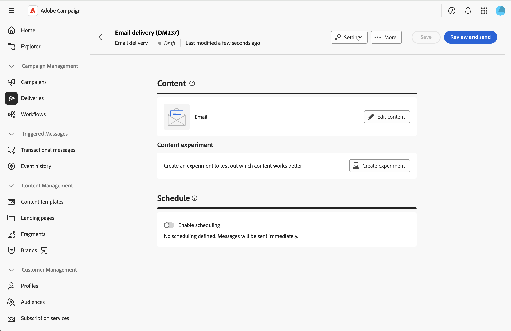
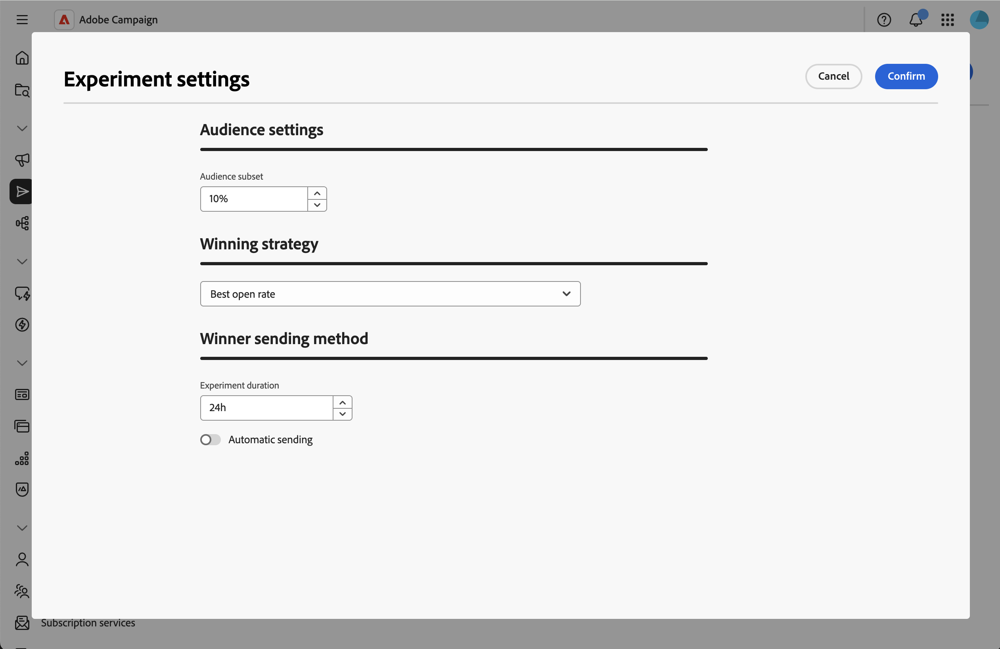
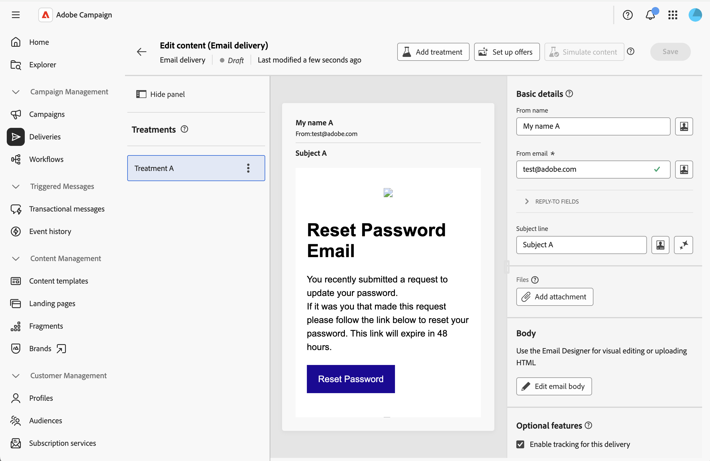
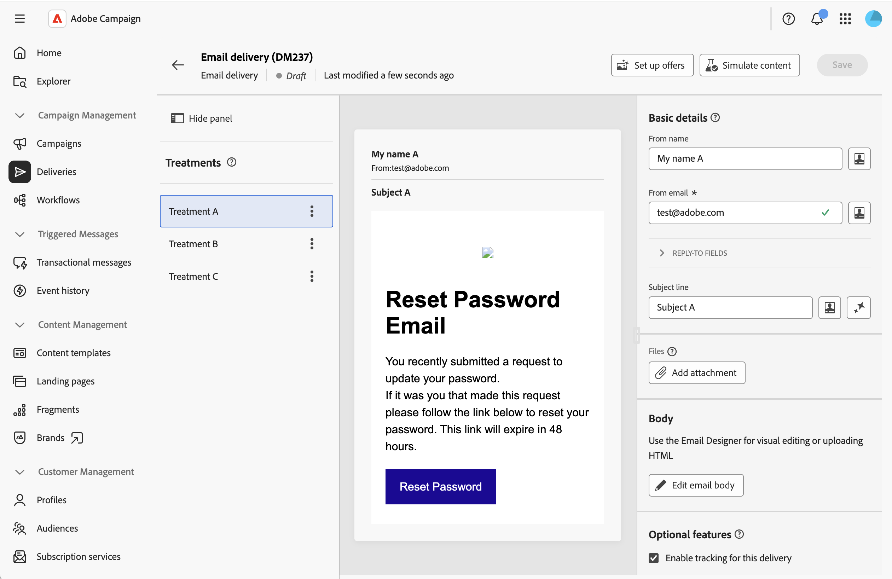
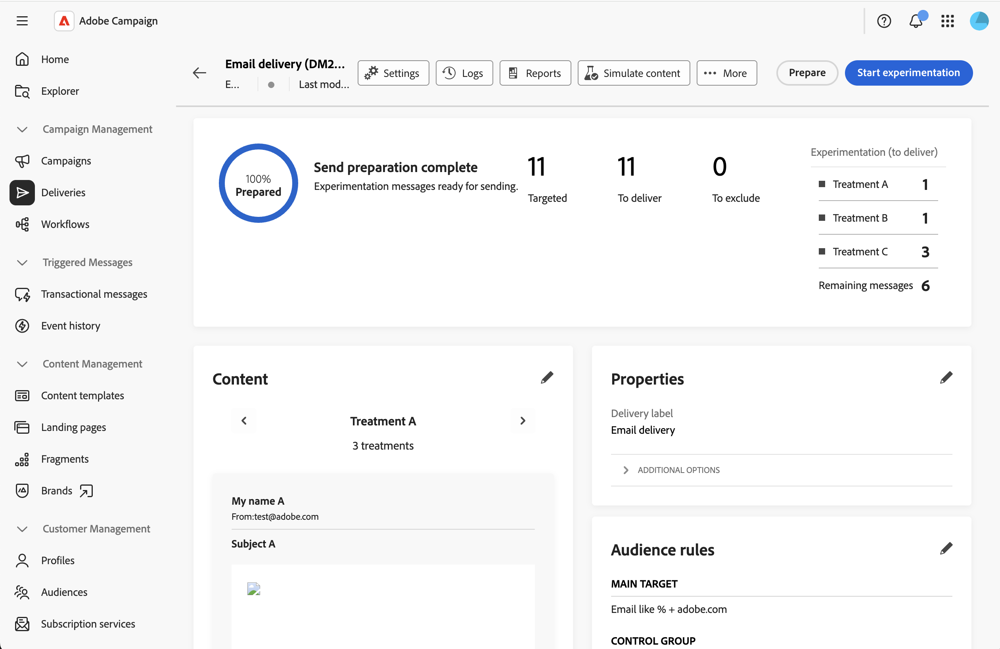

# 콘텐츠 실험 만들기 {#content-experiment}

>[!CONTEXTUALHELP]
>id="acw_homepage_welcome_rn4"
>title="콘텐츠 실험 - A/B 테스트"
>abstract="이제 여러 게재 변형을 정의하여 가장 성과가 좋은 게재를 테스트할 수 있습니다. 이메일 요소에 따라 콘텐츠, 제목 또는 발신자를 달라서 최적의 결과를 결정합니다."
>additional-url="https://experienceleague.adobe.com/docs/campaign-web/v8/release-notes/release-notes.html?lang=ko" text="릴리스 정보 참조"

## 콘텐츠 실험 정보 {#about-content-experiment}

Adobe Campaign 웹의 콘텐츠 실험을 사용하면 타겟 대상자에게 가장 적합한 성과를 측정하기 위해 여러 A/B 테스트 게재 변형을 정의할 수 있습니다. 게재 콘텐츠, 제목 또는 발신자를 다양하게 하여 다양한 버전을 테스트하고 가장 좋은 결과를 도출하는 변형을 결정할 수 있습니다.

다음과 같은 다양한 이메일 요소에 대해 A/B 테스트를 수행할 수 있습니다.

* **제목 줄**: 서로 다른 전자 메일 제목 줄을 테스트하여 가장 높은 열기 속도를 생성하는 항목을 확인합니다
* **보낸 사람 이름**: 다른 보낸 사람 조합을 실험해 보세요.
* **이메일 본문 콘텐츠**: 클릭스루 비율이 가장 높은 항목을 식별하기 위해 여러 콘텐츠 버전을 만듭니다.

>[!NOTE]
>
>* 콘텐츠 실험은 현재 이메일 채널에만 사용할 수 있습니다.
>* A/B 테스트는 트랜잭션 메시지에 대해 지원되지 않습니다.
>* 실험당 최대 3개의 처리(변형).

## 콘텐츠 실험 만들기 {#create-content-experiment}

이메일 게재에 콘텐츠 실험을 추가하려면 다음 단계를 수행합니다.

1. 이메일 게재를 만들거나 기존 초안 게재를 엽니다. [전자 메일을 만드는 방법 알아보기](create-email.md)

1. 전자 메일 게재 속성 페이지에서 **[!UICONTROL 콘텐츠]** 섹션에 있는 **[!UICONTROL 실험 만들기]** 단추를 클릭합니다.

   {zoomable="yes"}

## 실험 설정 구성 {#configure-experiment}

다음 섹션을 사용하여 실험을 구성합니다.

{zoomable="yes"}

### 대상자 설정 {#audience-settings}

실험 변형을 받을 타겟 모집단의 백분율을 정의합니다.

대상 크기를 설정할 값을 입력합니다. 테스트 단계 동안 실험 변형 중 하나를 받을 수신자의 비율을 나타냅니다.

* **최소**: 1%
* **최대값**: 100%
* **기본값**: 10%

나머지 대상(기본적으로 90%)은 실험이 완료되고 우승자가 결정되면 채택 변형을 받게 됩니다.

예를 들어 대상 대상이 10,000명이고 대상 크기가 10%인 경우 1,000명의 수신자가 실험에 참여하도록 무작위로 선택됩니다. 나머지 9,000명의 수신자는 실험이 종료된 후 채택 변형을 받게 됩니다.

### 우승 전략 {#winning-strategy}

채택 변형을 결정하는 데 사용할 지표를 선택합니다.

* **[!UICONTROL 최고 열기 비율]**(기본값): 이메일 열기 비율이 가장 높은 변형이 wins를 차지합니다.
* **[!UICONTROL 최고 클릭스루 비율]**: 이메일 WINS에서 클릭률이 가장 높은 변형
* **[!UICONTROL 가장 약한 구독 취소 비율]**: 가장 낮은 구독 취소 비율을 갖는 변형 승수

시스템은 실험 중에 이러한 지표를 자동으로 추적하고 선택한 기준에 따라 성과가 가장 좋은 변형을 계산합니다.

### 우승자 전송 방법 {#sending-method}

실험이 실행되는 시간을 정의하고 전송 방법을 선택합니다.

1. 기간 값을 시간 단위로 입력합니다. 가장 성과가 좋은 변형을 결정하기 전에 이 기간 동안 실험이 실행됩니다.

   * **최소**: 3시간
   * **최대**: 240시간(10일)
   * **기본값**: 24시간

   >[!NOTE]
   >
   >의미 있는 데이터를 수집할 수 있을 만큼 충분한 실험 기간을 확보하십시오. 특히 누적되는 데 더 오래 걸릴 수 있는 클릭스루율과 같은 지표에 대해 짧은 기간은 충분한 통계적 유의성을 제공하지 않을 수 있습니다.

1. 채택 변형을 나머지 모집단으로 보내는 방법을 선택합니다.

   * **[!UICONTROL 자동 전송]** 활성화됨: 실험이 종료되면 시스템에서 채택 변형을 나머지 대상자에게 자동으로 전송합니다.
   * **[!UICONTROL 자동 보내기]** 비활성화됨: 실험 결과를 검토한 후 가장 성과가 좋은 변형을 보내려면 **[!UICONTROL 보내기]** 단추를 수동으로 클릭해야 합니다.

실험이 끝날 때까지 다른 변수보다 훨씬 더 좋은 결과를 얻는 변형이 없으면 시스템은 첫 번째 변형을 나머지 모집단으로 보냅니다. 이 [섹션](#send-deliveries)을 참조하십시오.

## 콘텐츠 처리 정의 {#define-content}

실험 설정을 저장하면 기본적으로 첫 번째 처리가 만들어집니다. 이제 다른 처리(최대 3개)를 추가하고 특정 콘텐츠를 정의해야 합니다.

1. 게재 속성에서 **[!UICONTROL 콘텐츠 편집]**&#x200B;을 클릭합니다. 치료는 왼쪽에 진열되어 있습니다.

   {zoomable="yes"}

1. **[!UICONTROL 처리 추가]** 단추를 클릭하고 이름을 정의합니다. 추가해야 하는 모든 치료에 대해 이 작업을 반복합니다. 그런 다음 이름을 변경하고 복제한 다음 제거할 수 있습니다.

1. 각 처리를 클릭하고 다음 항목을 사용자 지정합니다.

   * **보낸 사람 이름**: 전자 메일의 출처를 사용자 지정합니다.
   * **제목 줄**: 각 처리에 대해 고유한 제목 줄을 작성하십시오.
   * **전자 메일 본문**: 전자 메일 Designer을 사용하여 다른 콘텐츠 버전을 디자인합니다.

   {zoomable="yes"}

1. 처리를 클릭한 다음 **[!UICONTROL 콘텐츠 시뮬레이션]**&#x200B;을 클릭하여 각 처리를 미리 봅니다.

## 실험 시작 및 결과 모니터링 {#validate-start}

모든 콘텐츠 처리를 정의했으면 유효성을 검사하고 실험을 시작할 수 있습니다.

1. 게재 속성에서 **[!UICONTROL 검토 및 보내기]**&#x200B;를 클릭한 다음 **[!UICONTROL 준비]**&#x200B;를 클릭합니다.

1. 그런 다음 **[!UICONTROL 실험 시작]**&#x200B;을 클릭하여 A/B 테스트를 시작합니다.

   {zoomable="yes"}

1. 실험이 실행되면 게재 대시보드에 표시된 여러 지표를 모니터링합니다.

실험이 실행되면 **[!UICONTROL 전송 중지]**&#x200B;를 클릭하여 실험을 종료할 수 있습니다. **[!UICONTROL 선택해서 우승자에게 보내기]**&#x200B;를 클릭하여 실험이 끝나기 전에 수동으로 보내도록 결정할 수도 있습니다.

>[!NOTE]
>
>결과는 수신자가 이메일과 상호 작용할 때 거의 실시간으로 업데이트됩니다. 그러나 초기 결과는 통계적 유의성을 갖지 않을 수 있습니다. 최종 결정을 내리기 전에 실험 기간이 완료될 때까지 기다리는 것이 좋습니다.

## 게재 보내기 {#send-deliveries}

**[!UICONTROL 우승자 전송 메서드]** 설정에서 선택한 내용에 따라 전송을 자동 또는 수동으로 수행할 수 있습니다. 이 [섹션](#sending-method)을 참조하십시오.

### 자동 전송 {#automatic-sending}

자동 전송에는 시스템이 귀하의 성공 전략에 따라 결과를 분석하고 우승 치료를 결정합니다. 우수성이 검증된 치료는 나머지 대상자에게 자동으로 전송됩니다. 뚜렷한 승자가 나타나지 않으면 1차 변종을 택하는 식이다.

### 수동 전송 {#manual-sending}

수동 전송을 구성한 경우 실험이 종료될 때 결과를 검토하고 **[!UICONTROL 전송]**&#x200B;을 클릭하여 가장 성과가 좋은 처리를 전송하십시오. 뚜렷한 승자가 나타나지 않으면 기본적으로 첫 번째 치료를 선택하지만 다른 치료를 선택할 수 있다.

## 최종 결과 보기 {#final-results}

실험이 완료되고 게재가 완전히 전송되면 포괄적인 보고서에 액세스할 수 있습니다.

1. 게재 대시보드에서 **[!UICONTROL 보고서]**&#x200B;를 클릭합니다.

1. 각 처리에 대한 주요 성능 지표를 표시하려면 **[!UICONTROL 실험]** 보고서 탭으로 이동합니다.

## 모범 사례 {#best-practices}

콘텐츠 실험을 만들 때 다음 권장 사항을 고려하십시오.

* **한 번에 하나의 요소를 테스트합니다**: 명확한 결과를 얻으려면 여러 요소가 아닌 단일 요소(예: 제목 줄만 또는 콘텐츠 전용)의 변형을 동시에 테스트하십시오.

* **적절한 기간 선택**: 통계적 중요도에 충분한 시간 허용:
   * 개방률 테스트의 경우: 보통 12-24시간이면 충분합니다
   * 클릭스루 비율 테스트의 경우: 24-48시간 이상이 필요할 수 있습니다
   * 대상이 클수록 시간이 적게 소요될 수 있으며, 대상이 작을 경우 시간이 오래 걸릴 수 있습니다

* **대상자의 적절한 크기 조정**:
   * 실험 대상자(테스트에 할당된 백분율)가 의미 있는 결과를 생성할 수 있을 만큼 충분히 큰지 확인하십시오
   * 일반 지침: 신뢰할 수 있는 결과를 위해 치료당 최소 1,000명의 수신자

* **정기적으로 테스트하지만 과도하게 테스트하지 않음**: 중요한 캠페인에 대해 실험을 수행하되, 효과적인 의사 결정에 리소스를 집중하기 위해 모든 전송 작업을 테스트하는 것은 피하십시오.

* **학습 기록 작성**: 향후 캠페인 전략을 알리기 위해 실험 결과 기록을 보관합니다.

## 관련 항목 {#related-topics}

* [첫 이메일 만들기](create-email.md)
* [이메일 콘텐츠 구성](edit-content.md)
* [이메일 미리 보기 및 보내기](../monitor/prepare-send.md)
* [이메일 게재 보고서](../reporting/email-report.md)
