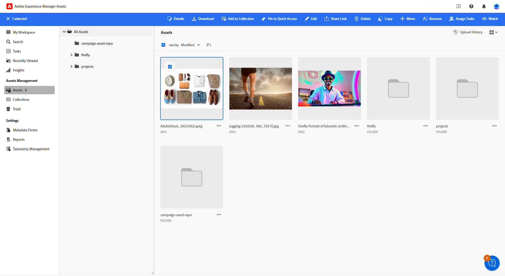

# 자산 관리 [!DNL Adobe Experience Manager Assets as a Cloud Service]{#aem-assets}

## [!DNL Adobe Experience Manager Assets as a Cloud Service] 시작 {#get-started-assets-essentials}

[!DNL Adobe Experience Manager Assets as a Cloud Service] 는 크리에이티브 워크플로를 간소화하고 디지털 자산을 중앙 집중화하여 원활한 경험 전달을 제공하도록 설계된 통합 협업 플랫폼입니다. 승인된 프로덕션 자산의 구성, 태깅 및 검색을 단순화하여 팀 간의 브랜드 일관성을 보장합니다. 사용자에게 친숙한 인터페이스를 통해 [!DNL Assets as Cloud Service] 을 사용하면 Adobe 크리에이티브 및 Experience Cloud 애플리케이션 내에서 자산에 즉시 액세스하고 공유할 수 있습니다.

다음에서 자세히 알아보기 [Adobe Experience Manager Assets as a Cloud Service 설명서](https://experienceleague.adobe.com/docs/experience-manager-cloud-service/content/assets/home.html){target="_blank"}.

## 에셋 업로드 및 삽입{#add-asset}

파일을 가져올 위치 [!DNL Assets as Cloud Service], 먼저 저장하려는 폴더를 찾아보거나 만들어야 합니다. 그러면 이메일 콘텐츠에 삽입할 수 있습니다.

에셋을 업로드하는 방법에 대한 자세한 내용은 [Adobe Experience Manager Assets as a Cloud Service 설명서](https://experienceleague.adobe.com/docs/experience-manager-cloud-service/content/assets/assets-view/add-delete-assets-view.html){target="_blank"}.

1. 홈 페이지에서 고급 메뉴에 액세스하고 을 선택합니다. [!DNL Experience Manager Assets].

   {zoomable=&quot;yes&quot;}

1. 아래 **Assets 관리**, 클릭 **에셋** Adobe Campaign에서 에셋에 대한 저장소를 선택합니다.

1. 중앙 섹션 또는 트리 보기에서 폴더를 클릭하여 엽니다.

   다음을 클릭할 수도 있습니다. **[!UICONTROL 폴더 만들기]** 새 폴더를 만듭니다.

1. 선택한 폴더 또는 만든 폴더에서 **[!UICONTROL 에셋 추가]** 을 클릭하여 새 에셋을 폴더에 업로드합니다.

   {zoomable=&quot;yes&quot;}

1. 다음에서 **[!UICONTROL 파일 업로드]**, 클릭 **[!UICONTROL 찾아보기]** 원하는 경우 선택 **[!UICONTROL 파일 찾아보기]** 또는 **[!UICONTROL 폴더 찾아보기]**.

1. 업로드할 파일을 선택합니다. 완료되면 다음을 클릭합니다. **[!UICONTROL 업로드]**.

   {zoomable=&quot;yes&quot;}

1. 고급 에셋 관리 메뉴에 액세스하려면 방금 업로드한 에셋을 선택합니다.

   에셋 관리 방법에 대한 자세한 내용은 다음을 참조하십시오. [페이지](https://experienceleague.adobe.com/docs/experience-manager-cloud-service/content/assets/assets-view/manage-organize-assets-view.html).

   {zoomable=&quot;yes&quot;}

1. Adobe Photoshop Express으로 에셋을 추가로 편집하려면 에셋을 더블 클릭합니다. 그런 다음 오른쪽 메뉴에서 **[!UICONTROL 편집 모드]** 아이콘. [자세히 알아보기](https://experienceleague.adobe.com/docs/experience-manager-cloud-service/content/assets/assets-view/edit-images-assets-view.html#edit-using-express){target="_blank"}.

1. 출처: [!DNL Adobe Campaign]를 선택하고 **[!UICONTROL 자산 선택기]** 메뉴 아래의 제품에서 사용할 수 있습니다.

   {zoomable=&quot;yes&quot;}

1. 이전에 만든 항목 선택 **[!UICONTROL 에셋]** 폴더를 삭제합니다. 검색 창에서 에셋 또는 폴더를 검색할 수도 있습니다.

   필요한 경우  **[!UICONTROL 에셋 관리]** 에 직접 액세스 [!DNL Adobe Experience Manager Assets] 작업 영역.

1. 이메일 콘텐츠에서 에셋을 끌어다 놓습니다.

   {zoomable=&quot;yes&quot;}

1. 를 사용하여 외부 링크 또는 텍스트 추가와 같은 에셋을 추가로 사용자 정의할 수 있습니다. **[!UICONTROL 설정]** 및 **[!UICONTROL 스타일]** 탭. [구성 요소 설정에 대해 자세히 알아보기](../email/content-components.md)

   {zoomable=&quot;yes&quot;}
