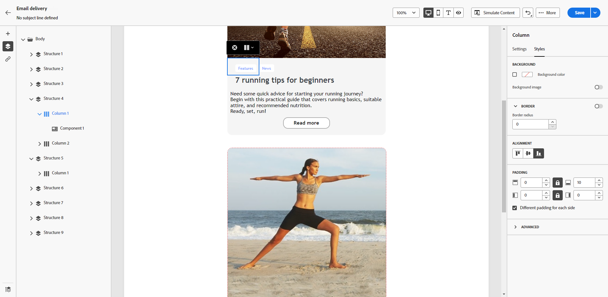

# 수직 정렬 및 패딩 조정 {#alignment-and-padding}

이 예에서는 3개의 열로 구성된 구조 구성 요소 내에서 패딩 및 수직 정렬을 조정합니다.

1. 이메일에서 구조 구성 요소를 직접 선택하거나 왼쪽 창에서 사용할 수 있는 **[!UICONTROL 탐색 트리]**&#x200B;를 사용하십시오.

   탐색 트리에서 구조 구성 요소 선택을 보여 주는 {zoomable="yes"}

1. 상황별 도구 모음에서 **[!UICONTROL 열 선택]**&#x200B;을 클릭하고 편집할 열을 선택합니다. 왼쪽의 구조 트리에서 선택할 수도 있습니다.

   상황별 도구 모음에서 열 선택을 보여 주는 {zoomable="yes"}

1. 선택한 열에 대해 편집 가능한 매개 변수가 **[!UICONTROL 스타일]** 탭에 표시됩니다. 전용 섹션을 사용하여 **[!UICONTROL 정렬]**&#x200B;을 조정합니다.

   {zoomable="yes"}

   예를 들어 **[!UICONTROL 아래쪽]**&#x200B;을 선택하면 콘텐츠 구성 요소가 열 아래쪽으로 이동합니다.

1. **[!UICONTROL 패딩]**&#x200B;에서 열 내부의 위쪽 패딩을 정의하고 해당 열의 왼쪽 및 오른쪽 패딩을 설정합니다.

   >[!NOTE]
   >
   >잠금 아이콘을 클릭하여 위쪽 및 아래쪽 또는 왼쪽 및 오른쪽 패딩 간의 동기화를 중단합니다.

   {zoomable="yes"}

1. 다른 열의 정렬 및 패딩을 같은 방식으로 조정합니다.

1. 변경 사항을 저장합니다.