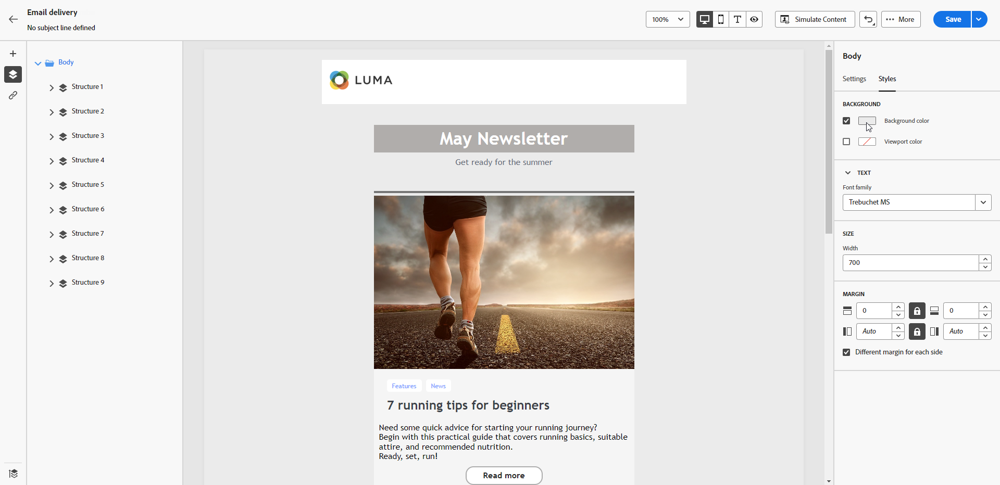
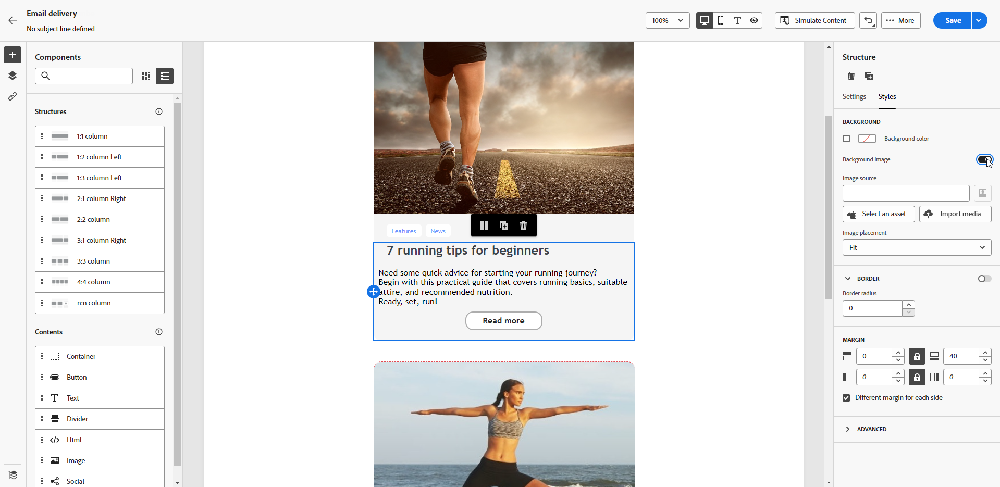

# 이메일 배경 개인화 {#backgrounds}

>[!CONTEXTUALHELP]
>id="ac_edition_backgroundimage"
>title="배경 설정"
>abstract="콘텐츠 배경색 또는 배경 이미지를 개인화할 수 있습니다. 배경 이미지는 모든 이메일 클라이언트에서 지원되지 않습니다."

이메일 디자이너로 배경을 설정할 때 Adobe에서 권장하는 방법은 다음과 같습니다.

1. 디자인에 필요한 경우 이메일 본문에 배경색을 적용합니다.
1. 일반적으로 배경색은 열 수준에서 설정합니다.
1. 이미지나 텍스트 구성 요소는 관리하기 어려우므로 배경색을 사용하지 마십시오.

다음은 사용할 수 있는 배경 설정입니다.

* 이메일 전체에 대한 **[!UICONTROL 배경색]**&#x200B;을 설정합니다. 왼쪽 창에서 액세스할 수 있는 탐색 트리에서 본문 설정을 선택했는지 확인하십시오.

  {zoomable="yes"}

* 모든 구조 구성 요소에 대해 동일한 배경색을 설정하려면 **[!UICONTROL 뷰포트 배경색]**&#x200B;을 선택합니다. 이 옵션을 사용하면 배경색과 다른 설정을 선택할 수 있습니다.

  {zoomable="yes"}

* 각 구조 구성 요소에 대해 서로 다른 배경색을 설정합니다. 해당 구조에만 특정 배경색을 적용하려면 왼쪽 창의 탐색 트리에서 구조를 선택합니다.

  {zoomable="yes"}

  >[!NOTE]
  >
  >뷰포트 배경색은 구조 배경색을 숨길 수 있으므로 설정하지 않도록 합니다.

* 구조 구성 요소의 콘텐츠에 대해 **[!UICONTROL 배경 이미지]**&#x200B;를 설정합니다.

  {zoomable="yes"}

  >[!NOTE]
  >
  >일부 이메일 프로그램은 배경 이미지를 지원하지 않습니다. 지원되지 않는 경우 행 배경색이 대신 사용됩니다. 이미지를 표시할 수 없는 경우 적절한 대체 배경색을 선택해야 합니다.

* 열 수준에서 배경색을 설정합니다.

  {zoomable="yes"}

  >[!NOTE]
  >
  >이는 가장 일반적인 사용 사례입니다. Adobe는 열 수준에서 배경색을 설정할 것을 권장합니다. 이렇게 하면 전체 이메일 콘텐츠를 편집할 때 더 유연하게 작업할 수 있습니다.

  배경 이미지도 열 수준에서 설정할 수 있지만 이러한 방법은 거의 사용되지 않습니다.
