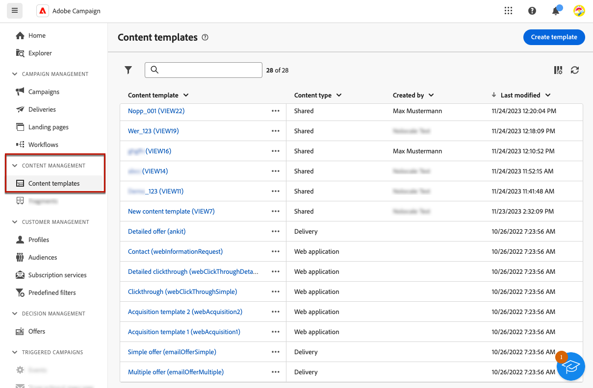
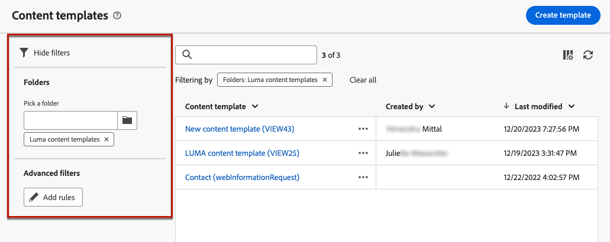

# 콘텐츠 템플릿으로 작업 {#content-templates}

>[!CONTEXTUALHELP]
>id="acw_contenttemplate_menu"
>title="콘텐츠 템플릿"
>abstract="디자인 프로세스를 가속화하고 개선하기 위해 독립 실행형 이메일 템플릿을 만들어 Adobe Campaign에서 사용자 정의 콘텐츠를 쉽게 재사용할 수 있습니다. 이러한 콘텐츠 템플릿은 기본 제공 또는 사용자 정의 템플릿을 기반으로 처음부터 디자인하거나, 기존 콘텐츠에서 생성하거나, 콘텐츠 템플릿 편집기에서 가져올 수 있습니다."

디자인 프로세스를 가속화하고 개선하기 위해 독립 실행형 템플릿을 만들어 [!DNL Adobe Campaign]에서 사용자 지정 콘텐츠를 쉽게 재사용할 수 있습니다. 이러한 콘텐츠 템플릿은 기본 제공 또는 사용자 정의 템플릿을 기반으로 처음부터 디자인하거나, 기존 콘텐츠에서 생성하거나, 콘텐츠 템플릿 편집기에서 가져올 수 있습니다.

이 기능을 통해 콘텐츠 중심 사용자는 독립 실행형 템플릿에서 작업할 수 있으므로 마케팅 사용자는 이메일 캠페인 내에서 이를 재사용하고 조정할 수 있습니다.

>[!NOTE]
>
>현재 **전자 메일** 콘텐츠 템플릿만 지원됩니다.

## 콘텐츠 템플릿 액세스 {#access-templates}

>[!CONTEXTUALHELP]
>id="acw_contenttemplate_edition"
>title="템플릿 콘텐츠 편집"
>abstract="이메일 디자이너로 콘텐츠를 업데이트하려면 **콘텐츠 편집** 버튼을 클릭합니다."

콘텐츠 템플릿 목록에 액세스하려면 왼쪽 레일에서 **[!UICONTROL 콘텐츠 관리]** > **[!UICONTROL 콘텐츠 템플릿]** 메뉴로 이동하십시오.

{zoomable="yes"}

이 대시보드는 사용 가능한 모든 콘텐츠 템플릿을 목록으로 표시합니다. 드롭다운 목록을 사용하여 특정 [폴더](../get-started/permissions.md#folders)를 필터링하거나 [쿼리 모델러](../query/query-modeler-overview.md)를 사용하여 규칙을 추가할 수 있습니다.

{zoomable="yes"}

목록에서 기존 콘텐츠 템플릿을 편집, 복제 또는 삭제할 수 있습니다. 상위 섹션의 버튼을 사용하여 콘텐츠 템플릿을 만듭니다.

### 읽기 전용 모드의 콘텐츠 템플릿 {#template-readonly}

액세스 권한은 콘텐츠 템플릿에 적용될 수 있습니다.

특정 콘텐츠 템플릿에 대한 편집 권한이 없는 경우 콘텐츠 템플릿이 **읽기 전용 모드**&#x200B;로 표시됩니다. 이 경우 **[!UICONTROL 콘텐츠 편집]** 단추가 **[!UICONTROL 콘텐츠 보기]** 단추로 바뀌므로 변경하지 않고 템플릿을 볼 수 있습니다.

{zoomable="yes"}

아래 표시된 대로 모든 기능 아이콘이 비활성화되어 상호 작용이 보기 전용으로 제한됩니다.

{zoomable="yes"}

## 콘텐츠 템플릿 만들기 {#create-content-templates}

>[!CONTEXTUALHELP]
>id="acw_contenttemplate_design"
>title="콘텐츠 템플릿 디자인"
>abstract="이메일 콘텐츠 템플릿을 디자인합니다."

>[!CONTEXTUALHELP]
>id="acw_contenttemplate_selection"
>title="콘텐츠 템플릿 선택"
>abstract="이메일 콘텐츠 템플릿을 선택합니다."

콘텐츠 템플릿은 [기존 전자 메일을 템플릿으로 저장](#save-as-template)하거나 전자 메일 템플릿 목록에서 **콘텐츠 템플릿 만들기** 단추를 통해 만들 수 있습니다. [아래 자세히 설명](#create-template-from-scratch).

저장하면 이제 [!DNL Adobe Campaign] 내에 [전자 메일](../email/create-email.md)을(를) 빌드할 때 이 템플릿을 사용할 수 있습니다. [방법 알아보기](use-email-templates.md)

>[!NOTE]
>
>* 콘텐츠 템플릿에 대한 변경 사항은 이메일에 전파되지 않습니다.
>
>* 마찬가지로 전자 메일에서 템플릿을 사용하는 경우 전자 메일 콘텐츠를 편집해도 이전에 사용한 콘텐츠 템플릿에는 영향을 주지 않습니다.

### 새 콘텐츠 템플릿 만들기 {#create-template-from-scratch}

>[!CONTEXTUALHELP]
>id="acw_contenttemplate_properties"
>title="템플릿 속성 정의"
>abstract="필요할 때 쉽게 검색할 이메일 콘텐츠 템플릿 속성을 정의합니다."

콘텐츠 템플릿 대시보드에서 새 콘텐츠 템플릿을 만들려면 다음 단계를 수행하십시오.

1. **[!UICONTROL 콘텐츠 관리]** > **[!UICONTROL 콘텐츠 템플릿]** 왼쪽 레일에서 콘텐츠 템플릿 목록으로 이동합니다.

1. **[!UICONTROL 템플릿 만들기]**&#x200B;를 선택합니다.

   {zoomable="yes"}

1. 템플릿 레이블 및 속성을 입력합니다. 템플릿을 저장할 폴더를 선택할 수 있습니다. 기본적으로 콘텐츠 템플릿은 Adobe Campaign 계층의 전용 폴더에 저장됩니다. **[!UICONTROL 탐색기]** > **[!UICONTROL 리소스]** > **[!UICONTROL 템플릿]** > **[!UICONTROL 콘텐츠 템플릿]**. [이 페이지](../get-started/permissions.md#folders)의 폴더에 대해 자세히 알아보기

   {zoomable="yes"}

1. **[!UICONTROL 만들기]**&#x200B;를 클릭하고 다른 옵션에서 서식 파일을 디자인할 방법을 선택하십시오.

   * 전자 메일 Designer 인터페이스를 통해 [콘텐츠를 처음부터 디자인](create-email-content.md)합니다.

   * [원시 HTML을 전자 메일 Designer에 직접 코딩하거나 복사하여 붙여 넣기](code-content.md)합니다.

   * [파일 또는 .zip 폴더에서 기존 HTML 내용을 가져옵니다](existing-content.md).

   * 기본 제공 또는 사용자 지정 템플릿 목록의 기존 콘텐츠를 사용합니다. 전자 메일에서 콘텐츠 템플릿을 사용하는 단계는 [이 섹션](use-email-templates.md)에 설명되어 있습니다.

   {zoomable="yes"}

1. 이메일 Designer 가 표시됩니다. 선택한 옵션에 따라 이메일에 대해 수행하는 것과 동일한 방식으로 콘텐츠를 필요에 따라 편집합니다. [이 섹션](get-started-email-designer.md)에서 전자 메일 Designer을 사용하는 방법을 알아보세요.

   <!--You can test your content if needed. [Learn how](#test-template)-->

1. 템플릿이 준비되면 **[!UICONTROL 저장]**&#x200B;을 클릭합니다.

   필요한 경우 템플릿 이름 옆에 있는 화살표를 클릭하여 **[!UICONTROL 세부 정보]** 화면으로 돌아가 템플릿을 편집합니다.

   {zoomable="yes"}

**[!UICONTROL 콘텐츠 템플릿]** 목록에서 템플릿을 사용할 수 있습니다. [자세히 알아보기](#access-templates)

이제 이 템플릿을 사용하여 새 콘텐츠를 작성할 수 있습니다. 전자 메일 Designer의 **[!UICONTROL 저장된 템플릿]** 탭에서 사용할 수 있습니다. [방법 알아보기](use-email-templates.md)

### 이메일 콘텐츠를 템플릿으로 저장 {#save-as-template}

[전자 메일을 디자인함](create-email-content.md)하면 나중에 다시 사용할 수 있도록 이 콘텐츠를 템플릿으로 저장할 수 있습니다. Adobe Campaign 환경의 모든 사용자는 저장된 템플릿을 사용할 수 있습니다.

이메일 내용을 템플릿으로 저장하려면 다음 단계를 따르십시오.

1. 전자 메일 디자이너에서 화면 오른쪽 상단의 **[!UICONTROL 자세히]** 단추를 클릭합니다.

1. 드롭다운 메뉴에서 **[!UICONTROL 콘텐츠 템플릿으로 저장]**&#x200B;을 선택합니다.

   {zoomable="yes"}

1. 이 템플릿의 이름을 입력하고 저장합니다.

   {zoomable="yes"}

템플릿이 **[!UICONTROL 콘텐츠 템플릿]** 목록에 저장되고 표시됩니다. 이 템플릿은 목록에 있는 다른 항목으로 액세스, 편집 및 삭제할 수 있는 독립 실행형 콘텐츠 템플릿이 됩니다. [자세히 알아보기](#access-manage-templates)

이제 이 템플릿을 사용하여 새 콘텐츠를 작성할 수 있습니다. 전자 메일 Designer의 **[!UICONTROL 저장된 템플릿]** 탭에서 사용할 수 있습니다. [방법 알아보기](use-email-templates.md)

{zoomable="yes"}

>[!NOTE]
>
>새 템플릿에 대한 변경 사항은 원래 이메일에 전파되지 않습니다. 마찬가지로 원본 콘텐츠가 해당 이메일 내에서 편집되는 경우 새 템플릿은 수정되지 않습니다.

<!--

Test your content template {#test-template}

You can test the rendering of any email content template, whether created from scratch or from an email. To do so, follow the steps below.

1. Access the content template list.

1. Click **[!UICONTROL Edit content]** from the **[!UICONTROL Template properties]**.

1. Click **[!UICONTROL Simulate Content]** and select a test profile to check your email rendering. You can choose the desktop or mobile view.

1. You can send a proof to test your content and have it approved by some internal users before using it. To do so, click the **[!UICONTROL Send proof]** button and follow the steps described in .

-->

## 콘텐츠 템플릿 수정 {#modify-delete}

기존 콘텐츠 템플릿을 업데이트하려면 다음 단계를 따르십시오.

1. 콘텐츠 템플릿 목록에서 수정하려는 템플릿의 레이블을 클릭하여 편집합니다.

1. **[!UICONTROL 콘텐츠 편집]** 단추를 클릭하여 [전자 메일 Designer](get-started-email-designer.md)(으)로 콘텐츠를 업데이트합니다.

{zoomable="yes"}

>[!NOTE]
>
>콘텐츠 템플릿에 대한 변경 사항은 이 콘텐츠 템플릿을 사용하는 이메일에 전파되지 않습니다.

## 콘텐츠 템플릿 삭제 {#content-delete}

다음 두 가지 방법으로 콘텐츠 템플릿을 삭제할 수 있습니다.

* 콘텐츠 템플릿 목록에서 줄임표 버튼을 클릭한 다음 **삭제**&#x200B;를 선택합니다

  

* 콘텐츠 템플릿 자체에서 **자세히** 단추를 클릭한 다음 **삭제**&#x200B;를 선택합니다

>[!NOTE]
>
>콘텐츠 템플릿을 삭제해도 이 템플릿을 사용하여 만든 게재에는 영향을 주지 않습니다.

## 콘텐츠 템플릿 복제 {#content-duplicate}

다음 두 가지 방법으로 콘텐츠 템플릿을 복제할 수 있습니다.

* 콘텐츠 템플릿 목록에서 줄임표 버튼을 클릭한 다음 **복제**&#x200B;를 선택합니다

* 콘텐츠 템플릿 자체에서 **자세히** 단추를 클릭한 다음 **복제**&#x200B;를 선택합니다

두 경우 모두 복제를 확인하여 새 콘텐츠 템플릿을 만듭니다. 새 콘텐츠 템플릿의 레이블은 `<label of the initial campaign`**의**&#x200B;복사본입니다. 템플릿 설정으로 이동하여 이 레이블을 업데이트합니다.

