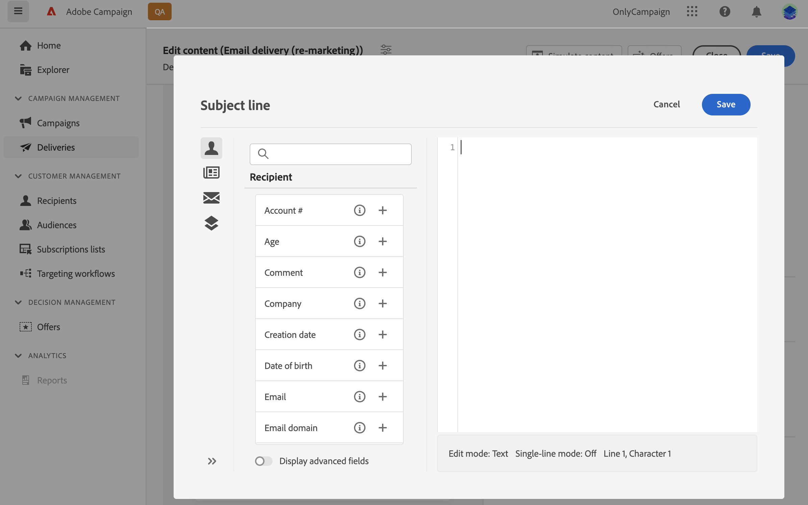
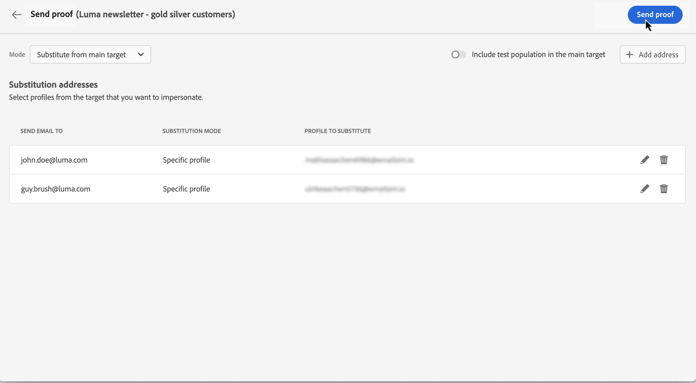
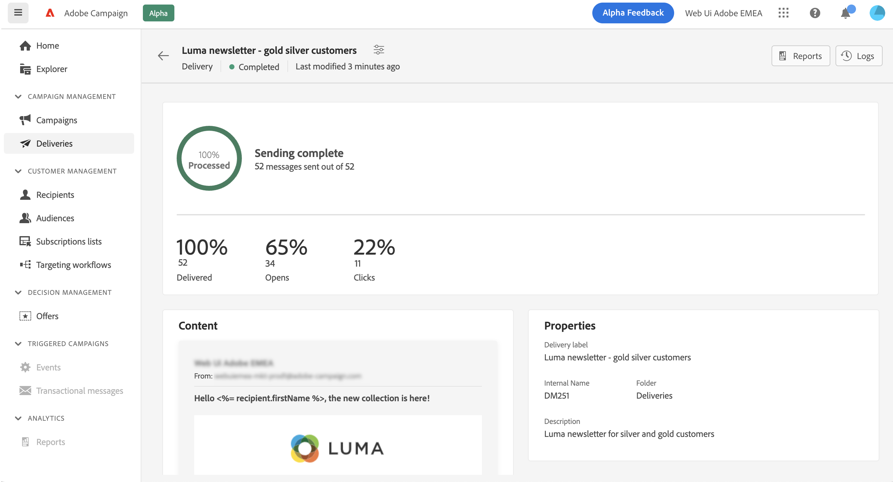

# 첫 이메일 보내기 {#first-email}

>[!CONTEXTUALHELP]
>id="acw_homepage_card2"
>title="이메일 콘텐츠용 Gen AI"
>abstract="Gen AI 기술은 고급 알고리즘을 활용하여 매우 매력적이며 개인화된 콘텐츠를 생성합니다. Gen AI의 지능형 콘텐츠 생성을 통해 열람율, 클릭스루 비율 및 전환율을 높여 보십시오. 이메일 콘텐츠용 Gen AI를 통해 경쟁에서 앞서 나가고 이메일 마케팅을 개선하십시오."

첫 번째 타겟팅된 이메일을 작성하는 방법에 대해 알아봅니다. 이 사용 사례에서는 특정 일자에 실버 및 골드 충성도 회원에게 이메일을 전송하도록 예약합니다.

미리 정의된 디자인 템플릿에 따라, 이메일에는 고객 프로필 속성을 기반으로 개인화된 콘텐츠도 포함되어 있습니다.

## 이메일 작성 게재 {#create-email}

>[!CONTEXTUALHELP]
>id="acw_deliveries_email_template_selection"
>title="이메일 템플릿 선택"
>abstract="이메일 템플릿은 유형화 규칙, 개인화 또는 라우팅 매개변수와 같은 미리 정의된 설정을 포함하는 특정 게재 구성입니다. 템플릿은 Campaign 클라이언트 콘솔에서 정의됩니다."

>[!CONTEXTUALHELP]
>id="acw_deliveries_email_properties"
>title="이메일 속성"
>abstract="속성은 게재 이름을 지정하고 분류하는 데 도움이 되는 일반적인 게재 매개변수입니다. Adobe Campaign v8 Console에 정의된 확장된 스키마를 기반으로 하는 게재인 경우, 일부 특정 **사용자 정의 옵션** 필드를 사용할 수 있습니다."

독립형 이메일 게재를 만들거나 캠페인 워크플로우의 컨텍스트에서 이메일을 만들 수 있습니다. 아래 단계에서는 독립 실행형(일회성) 이메일 게재 절차를 자세히 설명합니다. 캠페인 워크플로우의 컨텍스트에서 작업 중인 경우 만들기 단계는 의 세부 정보입니다. [이 섹션](../workflows/activities/channels.md#create-a-delivery-in-a-campaign-workflow).

새 독립 실행형 이메일 게재를 만들려면 다음 단계를 수행하십시오.

1. 다음으로 이동 **[!UICONTROL 게재]** 왼쪽 레일에서 메뉴를 클릭하고  **[!UICONTROL 게재 만들기]** 단추를 클릭합니다.

1. 선택 **[!UICONTROL 이메일]** 을(를) 채널로 설정하고 목록에서 이메일 게재 템플릿을 선택합니다.

   >[!NOTE]
   >
   >템플릿은 나중에 사용할 수 있도록 미리 구성된 게재 설정입니다. [자세히 알아보기](../msg/delivery-template.md)

   

1. **[!UICONTROL 게재 만들기]** 버튼을 클릭하여 확인합니다.
1. 게재 레이블을 입력하고 필요에 따라 추가 옵션을 구성합니다.

   * **[!UICONTROL 내부 이름]**: 게재에 고유 식별자를 할당합니다.
   * **[!UICONTROL 폴더]**: 게재를 특정 폴더에 저장합니다.
   * **[!UICONTROL 게재 코드]**: 고유한 명명 규칙에 따라 게재를 구성하려면 이 필드를 사용합니다.
   * **[!UICONTROL 설명]**: 게재에 대한 설명을 지정합니다.
   * **[!UICONTROL 특성]**: 분류 목적으로 이메일의 특성을 지정합니다.<!--The content of the list is defined in the delivery template selected when creating the email.-->

   >[!NOTE]
   >
   >특정 사용자 정의 필드로 스키마를 확장한 경우 **[!UICONTROL 사용자 정의 옵션]** 섹션에서 해당 필드에 액세스할 수 있습니다.

   

   또한 게재 이름 옆에 있는 버튼을 클릭하여 유형 규칙 및 대상 매핑과 같은 고급 설정에 액세스할 수 있습니다. 이러한 설정은 선택한 템플릿에 미리 구성되어 있지만 필요에 따라 이 특정 이메일에 대해 편집할 수 있습니다.

## 이메일 콘텐츠 정의 {#create-content}

이메일 콘텐츠를 만들려면 아래 단계를 수행하십시오.

<!--Detailed instructions on how to configure the email content are available in [this section](../content/edit-content.md).-->

이 사용 사례에서는 사전 정의된 이메일을 사용합니다 [게재 템플릿](../msg/delivery-template.md) 이메일을 디자인할 수 있습니다.

1. 이메일 게재 대시보드에서 **[!UICONTROL 콘텐츠 편집]** 단추를 클릭합니다.

   

   이렇게 하면 이메일 콘텐츠를 구성하고 이메일 디자이너에 액세스할 수 있는 전용 인터페이스로 이동합니다. [자세히 알아보기](../content/edit-content.md)

   

1. 이메일 제목 줄을 입력하고 표현식 편집기를 사용하여 개인화합니다. [콘텐츠 개인화 방법 알아보기](../personalization/personalize.md)

   

1. 이메일 콘텐츠를 디자인하려면 **[!UICONTROL 이메일 본문 편집]** 버튼을 클릭합니다.

   이메일 콘텐츠를 만드는 데 사용할 방법을 선택합니다. 이 예에서는 [사전 정의된 콘텐츠 템플릿](../msg/delivery-template.md).

   

1. 템플릿을 선택하면 해당 템플릿이에 표시됩니다. [이메일 디자이너](../content/create-email-content.md)필요한 편집을 하고 개인화를 추가할 수 있는 곳입니다.

   예를 들어 이메일 제목에 개인화를 추가하려면 구성 요소 블록을 선택하고 **[!UICONTROL 개인화 추가]**&#x200B;를 클릭하십시오.

   

1. 만족스러운 콘텐츠를 만들었다면 디자인을 저장하고 닫습니다. 이메일 생성 화면으로 돌아가려면 **[!UICONTROL 저장]**&#x200B;을 클릭합니다.

   

## 대상자 정의 {#define-audience}

>[!CONTEXTUALHELP]
>id="acw_deliveries_email_audience"
>title="대상자 정의"
>abstract="마케팅 메시지에 적합한 대상자를 선택합니다. Campaign v8 인스턴스 또는 Adobe Experience Platform에서 이미 정의된 기존 대상자를 선택하거나 규칙 빌더를 사용하여 새 대상자를 만들 수 있습니다. 컨트롤 그룹은 “파일에서 선택”에서는 활성화되지 않으며 그 반대의 경우도 마찬가지입니다."

이 사용 사례에서는 기존 대상자에게 이메일을 전송합니다. 대상자와 작업하는 방법에 대한 추가적인 지침은 [이 섹션](../audience/about-audiences.md)에서 확인할 수 있습니다.

1. 이메일의 대상자를 선택하려면 **[!UICONTROL 대상자 선택]** 버튼을 클릭하고 목록에서 기존 대상자를 선택합니다.

   이 예에서는 실버 및 골드 충성도 점수 수준에 속하는 고객을 대상으로 기존 대상자를 사용하려고 합니다.

   

   >[!NOTE]
   >
   >목록에서 사용할 수 있는 대상자는 Campaign v8 인스턴스 또는 Adobe Experience Platform(대상/소스 통합이 인스턴스에 구성되어 있는 경우)에서 발생합니다.
   >
   >대상/소스 통합을 통해 Experience Platform 세그먼트를 Adobe Campaign으로 전송하고 캠페인 게재 및 추적 로그를 Adobe Experience Platform으로 전송할 수 있습니다. 에서 Campaign 및 Adobe Experience Platform을 사용하여 작업하는 방법을 알아봅니다 [Campaign v8(클라이언트 콘솔) 설명서](https://experienceleague.adobe.com/docs/campaign/campaign-v8/connect/ac-aep.html){target="_blank"}.

1. 대상자를 선택하면 추가 규칙을 적용하여 대상을 더 구체화할 수 있습니다.

   또한 타겟팅되지 않은 사람들과 비교하여 이메일 수신자의 동작을 분석하도록 컨트롤 그룹을 설정할 수도 있습니다. [컨트롤 그룹으로 작업하는 방법 알아보기](../audience/control-group.md)

   

## 전송 예약 {#schedule}

이메일 전송을 예약하려면 이메일 게재를 열고 **예약** 섹션을 찾습니다.

에서 게재 전송을 예약하는 방법 알아보기 [이 섹션](../msg/gs-messages.md#gs-schedule)

## 이메일 미리보기 및 테스트 {#preview-test}

이메일을 전송하기 전에 미리 보고 테스트하여 기대치를 충족하는지 확인할 수 있습니다.

이 사용 사례에서는 일부 타겟팅된 프로필을 가장하여 이메일을 미리 보고 특정 이메일 주소로 테스트 버전을 전송합니다.

이메일을 미리 보고 테스트하는 방법에 대한 추가 정보는 [이 섹션](../preview-test/preview-test.md)에서 확인할 수 있습니다.

1. 이메일을 검토하려면 **[!UICONTROL 검토 및 전송]**&#x200B;을 클릭합니다. 이렇게 하면 구성된 모든 속성, 대상자 및 일정과 함께 이메일 미리보기가 표시됩니다. 수정 버튼을 클릭하여 이 중 원하는 요소를 편집할 수 있습니다.

1. 이메일을 미리 보고 테스트 버전을 전송하려면 **[!UICONTROL 콘텐츠 시뮬레이션]** 버튼을 클릭합니다.

   

1. 왼쪽에서 이메일을 미리 보는 데 사용할 프로필을 선택합니다.

   오른쪽 창에는 선택한 프로필을 기반으로 이메일 미리보기가 표시됩니다. 여러 프로필을 추가한 경우 프로필 간에 전환하여 해당 이메일을 미리 볼 수 있습니다.

   

   <!--Additionally, the **[!UICONTROL Render email]** button allows you to preview the email using mutiple devices or mail providers. Learn on how to preview email rendering
    -->

1. 이메일의 테스트 버전을 전송하려면 **[!UICONTROL 테스트]** 버튼을 클릭한 다음 사용할 모드를 선택합니다.

   이 예에서는 이메일에 의해 타겟팅된 프로필 중 일부를 가장하면서 특정 이메일 주소로 테스트 버전을 전송하는 **[!UICONTROL 기본 대상에서 대체]** 모드를 사용합니다.

   

1. **[!UICONTROL 주소 추가]**&#x200B;를 클릭하고 테스트 버전을 수신하는 이메일 주소를 지정합니다.

   각 이메일 주소에 대해 가장할 프로필을 선택합니다. Adobe Campaign이 대상에서 임의 프로필을 선택하도록 할 수도 있습니다.

   

1. **[!UICONTROL 테스트 이메일 전송]**&#x200B;을 클릭하고 전송을 확인합니다.

   테스트 버전이 선택한 프로필을 사용하여 **[Proof x]** 접두사와 함께 지정된 이메일 주소로 전송됩니다.

   

   콘텐츠 시뮬레이션 화면의 **[!UICONTROL 테스트 이메일 로그 보기]** 버튼을 클릭하여 언제든지 전송 상태를 확인하고 전송된 테스트 이메일에 액세스할 수 있습니다.

## 이메일 전송 및 모니터링 {#prepare-send}

이메일을 검토하고 테스트한 다음에는 준비를 시작하고 전송할 수 있습니다.

1. 이메일 준비를 시작하려면 **[!UICONTROL 준비]**&#x200B;를 클릭합니다. [이메일 준비 방법 알아보기](../monitor/prepare-send.md)

   

1. 이메일을 전송할 준비가 되면 **[!UICONTROL 전송]** 버튼(또는 전송을 예약한 경우 **[!UICONTROL 예약된 대로 전송]**)을 클릭하고 전송을 확인합니다.

1. 전송 프로세스 중에 이 화면에서 진행 상황을 추적하고 실시간으로 통계를 볼 수 있습니다.

   

   또한 **[!UICONTROL 로그]** 버튼을 클릭하여 전송에 대한 자세한 정보에 액세스할 수 있습니다. [게재 로그 모니터링 방법 알아보기](../monitor/delivery-logs.md)

1. 이메일이 전송된 다음에는 **[!UICONTROL 보고]** 버튼을 클릭하여 추가 분석을 위해 전용 보고서에 액세스할 수 있습니다.

