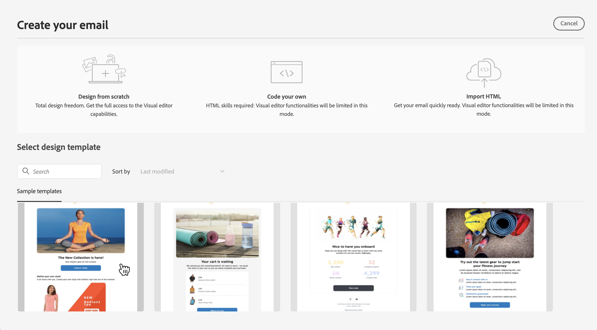

# 첫 이메일 만들기 {#first-email}

>[!CONTEXTUALHELP]
>id="acw_homepage_learning_card3"
>title="이메일 시작"
>abstract="독립 실행형 이메일 게재를 만들거나 캠페인 워크플로의 컨텍스트에서 이메일을 작성할 수 있습니다. 게재를 만들고, 대상자를 선택하고, 이메일 콘텐츠를 디자인하는 방법에 대해 알아봅니다."

첫 번째 타겟팅된 이메일을 작성하는 방법에 대해 알아봅니다. 이 사용 사례에서는 특정 일자에 실버 및 골드 충성도 회원에게 이메일을 전송하도록 예약합니다.

미리 정의된 [디자인 템플릿](../email/create-email-templates.md)을 기반으로 이메일에는 고객 프로필 특성을 기반으로 개인화된 콘텐츠도 포함됩니다.

➡️ [비디오에서 이 기능 살펴보기](#video)

## 이메일 게재 만들기 {#create-email}

>[!CONTEXTUALHELP]
>id="acw_deliveries_email_template_selection"
>title="이메일 템플릿 선택"
>abstract="이메일 템플릿은 유형화 규칙, 개인화 또는 라우팅 매개변수와 같은 미리 정의된 설정을 포함하는 특정 게재 구성입니다. 템플릿은 Campaign 클라이언트 콘솔에서 정의됩니다."

>[!CONTEXTUALHELP]
>id="acw_deliveries_email_properties"
>title="이메일 속성 정의"
>abstract="속성은 게재 이름을 지정하고 분류하는 데 도움이 되는 일반적인 게재 매개변수입니다. 추가 설정은 선택 사항입니다. Adobe Campaign v8 Console에 정의된 확장된 스키마를 기반으로 하는 게재인 경우, 일부 특정 **사용자 정의 옵션** 필드를 사용할 수 있습니다."

독립 실행형 이메일 게재를 만들거나 캠페인 워크플로의 컨텍스트에서 이메일을 작성할 수 있습니다. 아래 단계에서는 독립 실행형(일회성) 이메일 게재 절차를 자세히 설명합니다. [이 페이지](../msg/gs-deliveries.md)에서 Adobe Campaign의 게재 만들기 단계에 대해 자세히 알아보세요.

새 독립 실행형 이메일 게재를 만들려면 아래 단계를 수행하십시오.

1. 왼쪽 레일의 **[!UICONTROL 게재]** 메뉴로 이동한 다음 **[!UICONTROL 게재 만들기]** 단추를 클릭합니다.

   

1. **[!UICONTROL 전자 메일]**&#x200B;을(를) 채널로 선택하고 목록에서 전자 메일 게재 템플릿을 선택하십시오.

   >[!NOTE]
   >
   >템플릿은 나중에 사용할 수 있도록 미리 구성된 게재 설정입니다. [자세히 알아보기](../msg/delivery-template.md)

   전자 메일 채널 및 템플릿 선택을 보여 주는 {zoomable="yes"}

1. **[!UICONTROL 게재 만들기]** 버튼을 클릭하여 확인합니다.
1. 게재 레이블을 입력하고 필요에 따라 추가 옵션을 구성합니다.

   * **[!UICONTROL 내부 이름]**: 게재에 고유 식별자를 할당합니다.
   * **[!UICONTROL 폴더]**: 게재를 특정 폴더에 저장합니다.
   * **[!UICONTROL 게재 코드]**: 이 필드를 사용하여 고유한 명명 규칙에 따라 게재를 구성하십시오.
   * **[!UICONTROL 설명]**: 게재에 대한 설명을 지정합니다.
   * **[!UICONTROL 특성]**: 분류 목적으로 전자 메일의 특성을 지정하십시오.<!--The content of the list is defined in the delivery template selected when creating the email.-->

   >[!NOTE]
   >
   >특정 사용자 정의 필드로 스키마를 확장한 경우 **[!UICONTROL 사용자 정의 옵션]** 섹션에서 해당 필드에 액세스할 수 있습니다.

   {zoomable="yes"}

1. 또한 유형화 규칙 및 대상 매핑과 같은 고급 설정은 화면 오른쪽 상단의 **[!UICONTROL 설정]** 단추를 통해 액세스할 수 있습니다. 이러한 설정은 선택한 템플릿에 미리 구성되어 있지만, 필요에 따라 이 특정 이메일에 편집할 수 있습니다. [자세히 알아보기](../advanced-settings/delivery-settings.md)

## 대상자 정의 {#define-audience}

>[!CONTEXTUALHELP]
>id="acw_deliveries_email_audience"
>title="게재에 대한 대상자를 선택합니다."
>abstract="마케팅 메시지에 적합한 대상자를 선택합니다. Campaign v8 인스턴스 또는 Adobe Experience Platform에서 이미 정의된 기존 대상자를 선택하거나, 쿼리 모델러를 사용하여 새 대상자를 만들거나, 대상자가 포함된 파일을 업로드할 수 있습니다. 컨트롤 그룹은 **“파일에서 선택”** 옵션에서는 활성화되지 않으며 그 반대의 경우도 마찬가지입니다."
>additional-url="https://experienceleague.adobe.com/docs/campaign-web/v8/audiences/target-audiences/add-audience.html?lang=ko" text="기본 대상자 선택"
>additional-url="https://experienceleague.adobe.com/docs/campaign-web/v8/audiences/target-audiences/control-group.html?lang=ko" text="컨트롤 그룹 설정"

이 사용 사례에서는 기존 대상자에게 이메일을 보냅니다.

대상자와 작업하는 방법에 대한 추가적인 지침은 [이 섹션](../audience/about-recipients.md)에서 확인할 수 있습니다.

1. 전자 메일의 대상자를 선택하려면 **[!UICONTROL 대상자 선택]** 단추를 클릭하고 목록에서 기존 대상자를 선택하십시오.

   이 예에서는 실버 및 골드 충성도 포인트 수준에 속하는 고객을 타겟팅하는 기존 대상을 사용하려고 합니다.

   대상 선택 프로세스를 보여 주는 {zoomable="yes"}

   >[!NOTE]
   >
   >목록에서 사용할 수 있는 대상은 Campaign v8 인스턴스 또는 대상/Source 통합이 인스턴스에 구성된 경우 Adobe Experience Platform에서 가져옵니다. 이 통합을 통해 Experience Platform 세그먼트를 Adobe Campaign에 보내고, 캠페인 게재 및 추적 로그를 Adobe Experience Platform에 보낼 수 있습니다. [Campaign v8(클라이언트 콘솔) 설명서](https://experienceleague.adobe.com/docs/campaign/campaign-v8/connect/ac-aep/ac-aep.html?lang=ko){target="_blank"}에서 Campaign 및 Adobe Experience Platform을 사용하여 작업하는 방법을 알아봅니다.

1. 대상자를 선택하면 추가 규칙을 적용하여 대상을 더 구체화할 수 있습니다.

   대상 세분화 프로세스를 보여 주는 {zoomable="yes"}

1. 또한 타겟팅되지 않은 사람들과 비교하여 이메일 수신자의 동작을 분석하도록 컨트롤 그룹을 설정할 수도 있습니다. [컨트롤 그룹으로 작업하는 방법 알아보기](../audience/control-group.md)

## 이메일 콘텐츠 정의 {#create-content}

이메일 콘텐츠를 만들려면 아래 단계를 수행하십시오. 이 사용 사례에서는 미리 정의된 이메일 [게재 템플릿](../msg/delivery-template.md)을(를) 사용하여 이메일을 디자인합니다.<!--TBC delivery template or email content template?-->

<!--Detailed instructions on how to configure the email content are available in [this section](../email/edit-content.md).-->

1. 전자 메일 게재 대시보드에서 **[!UICONTROL 콘텐츠 편집]** 단추를 클릭합니다.

   {zoomable="yes"}

   이렇게 하면 이메일 콘텐츠를 구성하고 이메일 Designer에 액세스할 수 있는 전용 인터페이스로 이동합니다. [자세히 알아보기](edit-content.md)

   {zoomable="yes"}

1. 이메일의 제목 줄을 입력하고 표현식 편집기를 사용하여 개인화합니다. [콘텐츠 개인화 방법 알아보기](../personalization/personalize.md)

   {zoomable="yes"}

1. 이메일 콘텐츠를 디자인하려면 **[!UICONTROL 이메일 본문 편집]** 버튼을 클릭합니다.

   이메일 콘텐츠를 만드는 데 사용할 방법을 선택합니다. 이 예제에서는 [미리 정의된 콘텐츠 템플릿](create-email-templates.md)을(를) 사용합니다.

   미리 정의된 콘텐츠 템플릿 선택을 보여 주는 {zoomable="yes"}

1. 템플릿을 선택하면 [전자 메일 Designer](create-email-content.md)에 표시되어 필요한 편집 작업을 수행하고 개인 설정을 추가할 수 있습니다.

   예를 들어 전자 메일 제목에 개인화를 추가하려면 구성 요소 블록을 선택하고 **[!UICONTROL Personalization 추가]**&#x200B;를 클릭합니다.

   {zoomable="yes"}

1. 만족스러운 콘텐츠를 만들었다면 디자인을 저장하고 닫습니다. 이메일 생성 화면으로 돌아가려면 **[!UICONTROL 저장]**&#x200B;을 클릭합니다.

   {zoomable="yes"}

## 전송 예약 {#schedule}

워크플로우의 컨텍스트에서 게재를 보낼 때는 **스케줄러** 활동을 사용해야 합니다. 자세한 내용은 [이 페이지](../workflows/activities/scheduler.md)를 참조하세요. 아래 단계는 독립형 게재에만 적용됩니다.

1. 게재 속성의 **[!UICONTROL 일정]** 섹션으로 이동합니다.

1. **[!UICONTROL 예약 활성화]** 토글을 사용하여 활성화하십시오.

1. 원하는 전송 날짜 및 시간을 설정합니다.

   {zoomable="yes"}

게재를 전송하면 정의한 연락 날짜에 실제 전송이 시작됩니다.

[이 섹션](../msg/gs-deliveries.md#schedule-the-delivery-sending)에서 게재 예약에 대해 자세히 알아보세요.

## 이메일 미리 보기 및 증명 보내기 {#preview-test}

이메일을 전송하기 전에 미리 보고 테스트하여 기대치를 충족하는지 확인할 수 있습니다.

이 사용 사례에서는 타겟팅된 프로필 중 일부를 가장하는 동안 이메일을 미리 보고 특정 이메일 주소로 증명을 보냅니다.

전자 메일을 미리 보고 증명을 보내는 방법에 대한 추가 정보는 [이 섹션](../preview-test/preview-test.md)에서 확인할 수 있습니다.

1. 이메일을 검토하려면 **[!UICONTROL 검토 및 전송]**&#x200B;을 클릭합니다. 구성된 모든 속성, 대상자 및 일정과 함께 이메일 미리보기가 표시됩니다. 수정 버튼을 클릭하여 이 중 원하는 요소를 편집할 수 있습니다.

1. 전자 메일을 미리 보고 증명을 보내려면 **[!UICONTROL 콘텐츠 시뮬레이션]** 단추를 클릭하세요.

   {zoomable="yes"}

   >[!NOTE]
   >
   >특정 컨텍스트에서는 **[!UICONTROL 콘텐츠 시뮬레이션]** 단추를 사용할 수 없습니다. 제한 사항은 이 섹션[&#128279;](#content-simulation-limitations)의 에 자세히 설명되어 있습니다.

1. 왼쪽에서 이메일을 미리 보는 데 사용할 프로필을 선택합니다.

   오른쪽 창에는 선택한 프로필을 기반으로 이메일 미리보기가 표시됩니다. 여러 프로필을 추가한 경우 프로필 간에 전환하여 해당 이메일을 미리 볼 수 있습니다.

   {zoomable="yes"}

   <!--Additionally, the **[!UICONTROL Render email]** button allows you to preview the email using multiple devices or mail providers. Learn on how to preview email rendering
    -->

1. 증명을 보내려면 **[!UICONTROL 증명 보내기]** 단추를 클릭한 다음 사용할 모드를 선택하십시오.

   이 예제에서는 **[!UICONTROL 기본 대상에서 대체]** 모드를 사용하십시오. 이 모드에서는 전자 메일의 타겟으로 지정된 프로필 중 일부를 가장하는 동안 특정 전자 메일 주소로 증명을 보냅니다.

   증명 전송 모드 선택을 보여 주는 {zoomable="yes"}

1. **[!UICONTROL 주소 추가]**&#x200B;를 클릭하고 증명을 받을 전자 메일 주소를 지정하십시오.

   각 이메일 주소에 대해 가장할 프로필을 선택합니다. Adobe Campaign이 대상에서 임의 프로필을 선택하도록 할 수도 있습니다.

   증명에 대한 이메일 주소 추가를 보여 주는 {zoomable="yes"}

1. **[!UICONTROL 증명 보내기]**&#x200B;를 클릭하고 전송을 확인합니다.

   선택한 프로필에 **[증명 x]** 접두사를 사용하여 지정된 전자 메일 주소로 증명을 보냅니다.

   증명 전송 확인을 보여 주는 {zoomable="yes"}

   언제든지 콘텐츠 시뮬레이션 화면에서 **[!UICONTROL 증명 보기]** 버튼을 클릭하여 전송 상태를 확인하고 보낸 증명에 액세스할 수 있습니다.

### 콘텐츠 시뮬레이션 제한 사항 {#content-simulation-limitations}

>[!CONTEXTUALHELP]
>id="acw_simulation_limitation_multilingual"
>title="콘텐츠 시뮬레이션이 지원되지 않음"
>abstract="다국어 게재에는 로케일이 하나만 포함되어 있으므로 **콘텐츠 시뮬레이션** 버튼이 비활성화되어 있습니다."

>[!CONTEXTUALHELP]
>id="acw_simulation_limitation_reconcilied_deliveries"
>title="콘텐츠 시뮬레이션이 지원되지 않음"
>abstract="**콘텐츠 시뮬레이션** 버튼은 이 단계에서 조정된 게재와 호환되지 않으므로 비활성화되어 있습니다."

>[!CONTEXTUALHELP]
>id="acw_simulation_limitation_ffda"
>title="콘텐츠 시뮬레이션이 지원되지 않음"
>abstract="**콘텐츠 시뮬레이션** 버튼은 Campaign Enterprise FFDA(Full Federated Access) 모드에서 지원되지 않으므로 비활성화되어 있습니다."

>[!CONTEXTUALHELP]
>id="acw_simulation_limitation_no_file"
>title="콘텐츠 시뮬레이션이 지원되지 않음"
>abstract="**콘텐츠 시뮬레이션** 버튼은 콘텐츠가 업로드되지 않았기 때문에 비활성화되어 있습니다."

경우에 따라 콘텐츠 시뮬레이션을 수행할 수 없으며 **[!UICONTROL 콘텐츠 시뮬레이션]** 버튼이 비활성화됩니다.

다음과 같은 경우에는 콘텐츠 시뮬레이션이 지원되지 않습니다.

<!--* When a multilingual delivery contains only one locale,-->
* 조정된 게재 사용,
* Campaign 배포 모델이 [Adobe Campaign Enterprise FFDA(Full Federated Access)](https://experienceleague.adobe.com/ko/docs/campaign/campaign-v8/config/architecture/ffda/enterprise-deployment){target="_blank"}인 경우
* 파일이 업로드되지 않은 경우.

## 이메일 전송 및 모니터링 {#prepare-send}

이메일을 검토하고 테스트한 다음에는 준비를 시작하고 전송할 수 있습니다.

1. 이메일 준비를 시작하려면 **[!UICONTROL 준비]**&#x200B;를 클릭합니다. [이메일 준비 방법 알아보기](../monitor/prepare-send.md)

   {zoomable="yes"}

1. 전자 메일을 보낼 준비가 되면 **[!UICONTROL 보내기]** 단추(또는 전송을 예약한 경우 **[!UICONTROL 일정대로 보내기]**)를 클릭하고 전송을 확인합니다.

1. 전송 프로세스 중에 이 화면에서 진행 상황을 추적하고 실시간으로 통계를 볼 수 있습니다.

   {zoomable="yes"}

   <!--
    {zoomable="yes"}-->

   또한 **[!UICONTROL 로그]** 버튼을 클릭하여 전송에 대한 자세한 정보에 액세스할 수 있습니다. [게재 로그 모니터링 방법 알아보기](../monitor/delivery-logs.md)

1. 이메일이 전송된 다음에는 **[!UICONTROL 보고]** 버튼을 클릭하여 추가 분석을 위해 전용 보고서에 액세스할 수 있습니다.

{zoomable="yes"}

## 사용 방법 비디오 {#video}

이메일 게재를 처음부터 새로 만들고, 대상자를 정의하고, 콘텐츠를 디자인하고, 미리 보기를 시뮬레이션하고, 교정쇄를 보내는 방법을 알아봅니다.

>[!VIDEO](https://video.tv.adobe.com/v/3425866/?quality=12)