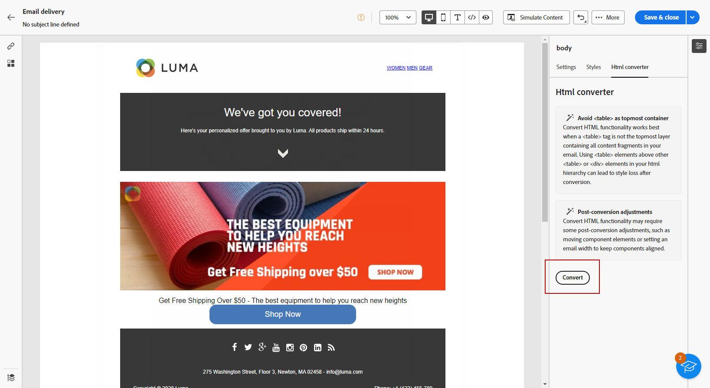

# 이메일 콘텐츠 가져오기 {#existing-content}

>[!CONTEXTUALHELP]
>id="acw_deliveries_email_import_content"
>title="기존 이메일 콘텐츠 사용"
>abstract="이메일 디자이너를 사용하면 기존 HTML 콘텐츠를 가져올 수 있습니다. 이 콘텐츠는 스타일 시트가 통합된 HTML 파일이거나 HTML 파일, 스타일 시트(.css) 및 이미지가 있는 .zip 폴더일 수 있습니다."

이메일 Designer에서 기존 HTML 콘텐츠를 가져올 수 있습니다. 이 콘텐츠는 다음 중 하나일 수 있습니다.

* 통합된 스타일 시트가 있는 **HTML 파일**
* HTML 파일, 스타일 시트(.css) 및 이미지가 포함된 **.zip 폴더**.

>[!NOTE]
>
>.zip 파일 구조에는 제한 사항이 없습니다. 그러나 참조는 상대적이어야 하며 .zip 폴더의 트리 구조 내에 맞춰져야 합니다.

➡️ [비디오에서 이 기능 살펴보기](#video)

HTML 콘텐츠가 포함된 파일을 가져오려면 아래 단계를 따르십시오.

1. [전자 메일 Designer](get-started-email-designer.md) 홈 페이지에서 **[!UICONTROL HTML 가져오기]**&#x200B;를 선택합니다.

   {zoomable="yes"}

1. HTML 콘텐츠가 포함된 HTML 또는 .zip 파일을 드래그 앤 드롭한 다음 **[!UICONTROL 가져오기]**&#x200B;를 클릭합니다.

1. HTML 콘텐츠가 업로드되면 콘텐츠가 **[!UICONTROL 호환성 모드]**&#x200B;가 됩니다.

   이 모드에서는 텍스트를 개인화하거나, 링크를 추가하거나, 콘텐츠에 에셋을 포함할 수 있습니다.

   {zoomable="yes"}

1. 이메일 Designer 콘텐츠 구성 요소를 활용하려면 **[!UICONTROL HTML 변환기]** 탭에 액세스하여 **[!UICONTROL 변환]**&#x200B;을 클릭합니다.

   {zoomable="yes"}

>[!NOTE]
>
>`<table>` 태그를 HTML 파일의 첫 번째 레이어로 사용하면 맨 위 레이어 태그의 배경 및 너비 설정을 포함하여 스타일이 손실될 수 있습니다.

1. 이메일 Designer 기능을 사용하여 필요에 따라 가져온 파일을 개인화합니다. [자세히 알아보기](content-components.md)

## 사용 방법 비디오 {#video}

HTML을 업로드하여 이메일을 만들고, 이메일 Designer과 호환되도록 하며, 템플릿으로 변환하는 방법에 대해 알아봅니다.

>[!VIDEO](https://video.tv.adobe.com/v/3447039/?quality=12&captions=kor)