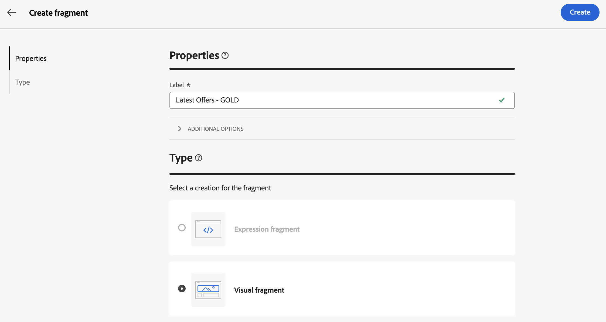

# 콘텐츠 조각 만들기 {#fragments}

>[!CONTEXTUALHELP]
>id="acw_fragments_menu"
>title="나만의 조각 정의"
>abstract="조각은 캠페인 간 하나 이상의 이메일에서 참조할 수 있는 재사용 가능한 구성 요소입니다."

>[!CONTEXTUALHELP]
>id="acw_fragments_save"
>title="조각 저장"
>abstract="조각 저장"

>[!CONTEXTUALHELP]
>id="acw_fragments_create"
>title="나만의 조각 정의"
>abstract="조각은 캠페인 간 하나 이상의 이메일에서 참조할 수 있는 재사용 가능한 구성 요소입니다."

>[!CONTEXTUALHELP]
>id="acw_fragments_properties"
>title="조각 속성"
>abstract="조각 속성"

>[!CONTEXTUALHELP]
>id="acw_fragments_type"
>title="조각 유형"
>abstract="조각 유형을 선택합니다. 지금은 이메일에 대한 시각적 조각만 사용할 수 있습니다."

>[!CONTEXTUALHELP]
>id="acw_fragments_list"
>title="나만의 조각 정의"
>abstract="조각은 캠페인 간 하나 이상의 이메일에서 참조할 수 있는 재사용 가능한 구성 요소입니다. 이메일 템플릿에서 조각을 사용할 수도 있습니다. 현재 시각적 조각만 사용할 수 있습니다."

>[!CONTEXTUALHELP]
>id="acw_fragments_details"
>title="조각 세부 정보"
>abstract="조각 세부 정보"

>[!CONTEXTUALHELP]
>id="acw_create_fragment"
>title="나만의 조각 정의"
>abstract="조각은 캠페인 간 하나 이상의 이메일에서 참조할 수 있는 재사용 가능한 구성 요소입니다."

조각은 캠페인 간 하나 이상의 이메일에서 참조할 수 있는 재사용 가능한 구성 요소입니다. 조각을 수정할 때 조각을 사용하는 모든 콘텐츠가 업데이트됩니다.

이 기능을 사용하면 마케팅 사용자가 향상된 디자인 프로세스에서 이메일 콘텐츠를 빠르게 조합하는 데 사용할 수 있는 여러 사용자 지정 콘텐츠 블록을 미리 빌드할 수 있습니다.

조각을 최대한 활용하려면 다음을 수행하십시오.

* 아래에 자세히 설명된 대로 고유한 시각적 조각을 만듭니다.
* 이메일 디자이너를 통해 콘텐츠에서 필요한 횟수만큼 사용합니다. 다음을 참조하십시오 [이메일에 시각적 조각 추가](../email/use-visual-fragments.md).

## 시각적 조각 만들기 {#create-fragments}

조각을 만드는 방법에는 두 가지가 있습니다.

* 조각을 사용하여 처음부터 새로 만들기 **[!UICONTROL 조각]** 전용 메뉴. [방법 알아보기](#create-from-scratch)

* 콘텐츠를 디자인할 때 콘텐츠의 일부를 조각으로 저장합니다. [방법 알아보기](#save-as-fragment)

저장되면 이메일 또는 이메일 템플릿에서 조각을 사용할 수 있습니다. 처음부터 만들거나 기존 콘텐츠에서 만든 경우 이제 Campaign 내에서 콘텐츠를 작성할 때 이 조각을 사용할 수 있습니다. 다음을 참조하십시오 [시각적 조각 추가](../email/use-visual-fragments.md).

### 처음부터 조각 만들기 {#create-from-scratch}

조각을 처음부터 만들려면 아래 단계를 수행합니다.

1. [조각 목록 액세스](#access-manage-fragments) 다음을 통해 **[!UICONTROL 콘텐츠 관리]** > **[!UICONTROL 조각]** 왼쪽 메뉴.

   

1. 선택 **[!UICONTROL 조각 만들기]**.

1. 조각 레이블을 입력합니다.

   

1. 필요한 경우 조각 내부 이름, 해당 폴더 및 설명과 같은 추가 옵션을 정의할 수 있습니다.

   >[!NOTE]
   >
   >지금은 시각적 조각만 만들 수 있습니다.

1. 다음을 클릭합니다. **만들기** 버튼을 클릭하여 조각의 콘텐츠를 구성합니다.

1. 다음 [이메일 디자이너](../email/get-started-email-designer.md) 표시됩니다. 캠페인 내의 이메일에 대해 수행하는 것과 동일한 방식으로 필요에 따라 콘텐츠를 편집합니다. 이미지, 링크, 개인화 필드 및 다이내믹 콘텐츠를 추가할 수 있습니다.

   

1. 조각이 준비되면 **[!UICONTROL 저장 및 닫기]**. 에 추가됩니다. [조각 목록](#access-manage-fragments).

이제 이 조각을 작성할 때 사용할 준비가 되었습니다. [이메일](../email/get-started-email-designer.md) 또는 [콘텐츠 템플릿](use-email-templates.md) Campaign 내에서 [방법 알아보기](../email/use-visual-fragments.md)

### 콘텐츠를 조각으로 저장 {#save-as-fragment}

모든 이메일 콘텐츠는 나중에 다시 사용할 수 있도록 조각으로 저장할 수 있습니다. 디자인 시 [콘텐츠 템플릿](use-email-templates.md) 또는 [이메일](../email/get-started-email-designer.md) 게재를 사용하면 콘텐츠의 일부를 시각적 조각으로 저장할 수 있습니다. 이렇게 하려면 아래 단계를 수행합니다.

1. 다음에서 [이메일 디자이너](../email/get-started-email-designer.md)를 클릭하고 **자세히** 화면 오른쪽 상단의 단추.

1. 선택 **[!UICONTROL 조각으로 저장]** 드롭다운 메뉴에서 을(를) 선택합니다.

   

1. 다음 **[!UICONTROL 조각으로 저장]** 화면이 표시됩니다. 여기에서 개인화 필드 및 다이내믹 콘텐츠를 포함하여 조각에 포함할 요소를 선택합니다.

   >[!CAUTION]
   >
   >서로 인접한 섹션만 선택할 수 있습니다. 빈 구조나 다른 조각은 선택할 수 없습니다.

   

1. Click **[!UICONTROL Create]**. 조각 이름을 입력하고 저장합니다.

   

   이 콘텐츠는 이제 독립 실행형 조각 이므로 [조각 목록](#manage-fragments)전용 메뉴에서 액세스할 수 있습니다. 이제 작성할 때 이 조각을 사용할 수 있습니다. [이메일](../email/get-started-email-designer.md) 또는 [콘텐츠 템플릿](use-email-templates.md) Campaign 내에서 [방법 알아보기](../email/use-visual-fragments.md)

>[!NOTE]
>
>해당 새 조각에 대한 모든 변경 사항은 원래 이메일이나 템플릿에 전파되지 않습니다. 마찬가지로 원래 콘텐츠가 해당 이메일 또는 템플릿 내에서 편집되는 경우 새 조각은 수정되지 않습니다.

## 조각 관리 {#manage-fragments}

조각 목록에서 조각을 편집, 업데이트, 복제 또는 삭제할 수 있습니다.

### 조각 편집 및 업데이트 {#edit-fragments}

조각을 편집하려면 아래 단계를 따르십시오.

1. 에서 편집할 조각의 이름을 클릭합니다. **[!UICONTROL 조각]** 목록을 표시합니다.
1. 다음을 클릭합니다. **콘텐츠 편집** 버튼을 클릭하여 이 조각의 콘텐츠를 엽니다.

   

1. 필요한 사항을 변경하고 수정 사항을 저장합니다.

>[!CAUTION]
>
>조각에 대한 모든 변경 사항은 이를 사용하는 이메일 게재 또는 템플릿에 전파됩니다.

### 조각 삭제 {#delete-fragments}

조각을 삭제하려면 다음 단계를 수행합니다.

1. 조각 목록으로 이동한 다음 **[!UICONTROL 추가 작업]** 삭제할 조각 옆에 있는 단추입니다.
1. 클릭 **삭제** 확인.

   

>[!CAUTION]
>
>콘텐츠 조각을 삭제하면 이메일 게재 및 이를 사용하는 템플릿이 업데이트되고 해당 조각이 메시지 콘텐츠에서 제거됩니다. 필요한 경우 상속을 중단할 수 있습니다. [자세히 알아보기](use-visual-fragments.md#break-inheritance)
>

### 조각 복제 {#duplicate-fragments}

조각을 쉽게 복제하여 새 조각을 만들 수 있습니다. 기존 조각을 복제하려면 다음 단계를 수행합니다.

1. 조각 목록으로 이동한 다음 **[!UICONTROL 추가 작업]** 삭제할 조각 옆에 있는 단추입니다.
1. 클릭 **복제** 확인.
1. 새 조각의 레이블을 입력하고 변경 사항을 저장합니다.

   조각이 조각 목록에 추가됩니다. 필요에 따라 편집하고 구성할 수 있습니다.
