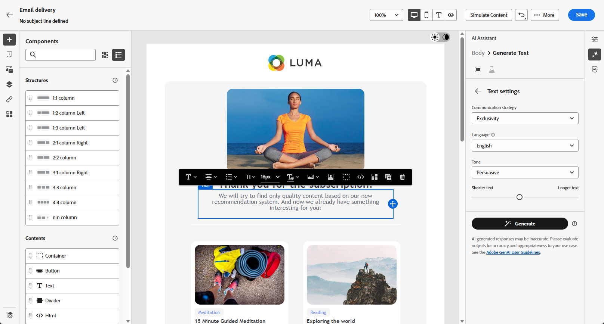

# AI 어시스턴트로 이메일 생성 {#generative-content}

>[!BEGINSHADEBOX]

**목차**

* [AI 어시스턴트 시작하기](generative-gs.md)
* AI 어시스턴트로 이메일 생성
* [AI 어시스턴트와 함께하는 SMS 세대](generative-sms.md)
* [AI 어시스턴트로 푸시 알림 생성](generative-push.md)

>[!ENDSHADEBOX]

>[!NOTE]
>
>이 기능의 사용을 시작하기 전에 관련 [보호 기능 및 제한 사항](generative-gs.md#generative-guardrails)을 읽어 보십시오.

이메일을 만들고 개인화한 후에는 생성 AI에서 제공하는 Campaign의 AI Assistant를 사용하여 콘텐츠를 한 차원 끌어올리십시오.

AI Assistant를 사용하면 전체 이메일, 타겟팅된 텍스트 콘텐츠 및 대상자와 공감을 이루도록 특별히 맞춤화된 이미지를 생성하여 게재의 영향을 최적화하는 데 도움이 될 수 있습니다. 이렇게 하면 이메일 캠페인이 최적화되어 참여도가 향상됩니다.

이메일 캠페인을 통해 AI Assistant를 사용하여 전체 이메일, 텍스트 또는 이미지를 생성할 수 있습니다. Campaign에서 AI Assistant를 사용하는 방법을 알려면 아래 탭을 살펴보십시오.

>[!BEGINTABS]

>[!TAB 전체 전자 메일 생성]

다음 예에서는 AI 도우미를 활용하여 기존 이메일을 구체화하고, 특별한 이벤트를 위해 사용자 지정합니다.

1. 전자 메일 게재를 만들고 구성한 후 **[!UICONTROL 콘텐츠 편집]**&#x200B;을 클릭하세요.

   전자 메일 게재를 구성하는 방법에 대한 자세한 내용은 [이 페이지](../email/create-email-content.md)를 참조하세요.

1. 필요에 따라 이메일을 개인화하고 **[!UICONTROL AI 길잡이]** 메뉴에 액세스합니다.

   {zoomable="yes"}

1. AI 관리자가 **[!UICONTROL 원본 콘텐츠 사용]** 옵션을 사용하여 게재, 게재 이름 및 선택한 대상을 기반으로 새 콘텐츠를 개인화할 수 있습니다.

   프롬프트는 항상 현재 콘텐츠에 연결되어야 합니다.

1. **[!UICONTROL 프롬프트]** 필드에 생성할 내용을 설명하여 내용을 미세 조정하십시오.

   프롬프트 작성에 도움이 필요한 경우 게재 개선을 위한 다양한 프롬프트 아이디어를 제공하는 **[!UICONTROL 프롬프트 라이브러리]**&#x200B;에 액세스하십시오.

   {zoomable="yes"}

1. **[!UICONTROL 제목 줄]** 또는 **[!UICONTROL 사전 머리글]**&#x200B;을 전환하여 변형 생성에 포함할 수 있습니다.

1. AI Assistant에 추가 컨텍스트를 제공하거나 이전에 업로드한 항목을 선택할 수 있는 콘텐츠가 포함된 브랜드 자산을 추가하려면 **[!UICONTROL 브랜드 자산 업로드]**&#x200B;를 클릭하십시오.

   {zoomable="yes"}

1. 프롬프트를 다음과 같은 다양한 옵션으로 사용자 지정합니다.

   * **[!UICONTROL 커뮤니케이션 전략]**: 생성된 텍스트에 가장 적합한 커뮤니케이션 스타일을 선택합니다.
   * **[!UICONTROL 언어]**: 콘텐츠를 생성할 언어를 선택하십시오.
   * **[!UICONTROL 음색]**: 전자 메일의 음색이 대상자에게 울려 퍼집니다. AI 어시스턴트는 여러분이 유익하거나, 장난스럽거나, 설득력 있게 들리기를 원하든 상관없이 메시지를 그에 따라 조정할 수 있습니다.
   * **[!UICONTROL 길이]**: 범위 슬라이더를 사용하여 원하는 콘텐츠 길이를 선택합니다.

   {zoomable="yes"}

1. 메시지가 준비되면 **[!UICONTROL 생성]**&#x200B;을 클릭합니다.

1. 생성된 **[!UICONTROL 변형]**&#x200B;을 찾은 다음 **[!UICONTROL 미리 보기]**&#x200B;를 클릭하여 선택한 변형의 전체 화면 버전을 봅니다.

1. 추가 사용자 지정 기능에 액세스하려면 **[!UICONTROL 미리 보기]** 창 내에서 **[!UICONTROL 다시 정의]** 옵션으로 이동하십시오.

   * **[!UICONTROL 참조 콘텐츠로 사용]**: 선택한 변형이 다른 결과를 생성하기 위한 참조 콘텐츠로 사용됩니다.

   * **[!UICONTROL 구문 변경]**: AI Assistant는 다양한 방식으로 메시지를 다시 구문 처리하여 쓰기를 신선하게 유지하고 다양한 대상자를 유혹할 수 있습니다.

   * **[!UICONTROL 더 간단한 언어 사용]**: AI Assistant를 사용하여 언어를 단순화함으로써, 더 많은 대상자가 명확하고 쉽게 사용할 수 있습니다.

   {zoomable="yes"}

1. 적절한 콘텐츠를 찾으면 **[!UICONTROL 선택]**&#x200B;을 클릭합니다.

1. 개인화 필드를 삽입하여 프로필 데이터를 기반으로 이메일 콘텐츠를 사용자 정의합니다. 그런 다음 **[!UICONTROL 콘텐츠 시뮬레이션]** 단추를 클릭하여 렌더링을 제어하고 테스트 프로필로 개인화 설정을 확인합니다. [자세히 알아보기](../preview-test/preview-content.md)

   {zoomable="yes"}

콘텐츠, 대상자 및 일정을 정의했으면 이메일 게재를 준비할 준비가 되었습니다. [자세히 알아보기](../monitor/prepare-send.md)

>[!TAB 텍스트 생성]

다음 예에서는 AI 도우미를 활용하여 예정된 이벤트에 대한 이메일 초대 콘텐츠를 개선합니다.

1. 전자 메일 게재를 만들고 구성한 후 **[!UICONTROL 콘텐츠 편집]**&#x200B;을 클릭하세요.

   전자 메일 게재를 구성하는 방법에 대한 자세한 내용은 [이 페이지](../email/create-email-content.md)를 참조하세요.

1. 특정 콘텐츠만 타겟팅하려면 **[!UICONTROL 텍스트 구성 요소]**&#x200B;를 선택하십시오. **[!UICONTROL AI Assistant]** 메뉴에 액세스합니다.

   {zoomable="yes"}

1. AI 관리자가 **[!UICONTROL 원본 콘텐츠 사용]** 옵션을 사용하여 게재, 게재 이름 및 선택한 대상을 기반으로 새 콘텐츠를 개인화할 수 있습니다.

   프롬프트는 항상 현재 콘텐츠에 연결되어야 합니다.

1. **[!UICONTROL 프롬프트]** 필드에 생성할 내용을 설명하여 내용을 미세 조정하십시오.

   프롬프트 작성에 도움이 필요한 경우 게재 개선을 위한 다양한 프롬프트 아이디어를 제공하는 **[!UICONTROL 프롬프트 라이브러리]**&#x200B;에 액세스하십시오.

   {zoomable="yes"}

1. AI Assistant에 추가 컨텍스트를 제공할 수 있는 콘텐츠가 포함된 브랜드 자산을 추가하려면 **[!UICONTROL 브랜드 자산 업로드]**&#x200B;를 클릭하십시오.

   {zoomable="yes"}

1. 프롬프트를 다음과 같은 다양한 옵션으로 사용자 지정합니다.

   * **[!UICONTROL 통신 전략]**: 생성된 텍스트에 대해 원하는 통신 접근 방식을 선택하십시오.
   * **[!UICONTROL 언어]**: 변형 콘텐츠의 언어를 선택하십시오.
   * **[!UICONTROL 색조]**: 텍스트가 대상자와 목적에 적합한지 확인하십시오.
   * **[!UICONTROL 길이]**: 범위 슬라이더를 사용하여 콘텐츠의 길이를 선택합니다.

   {zoomable="yes"}

1. 메시지가 준비되면 **[!UICONTROL 생성]**&#x200B;을 클릭합니다.

1. 생성된 **[!UICONTROL 변형]**&#x200B;을 찾은 다음 **[!UICONTROL 미리 보기]**&#x200B;를 클릭하여 선택한 변형의 전체 화면 버전을 봅니다.

1. 추가 사용자 지정 기능에 액세스하려면 **[!UICONTROL 미리 보기]** 창 내에서 **[!UICONTROL 다시 정의]** 옵션으로 이동하십시오.

   * **[!UICONTROL 참조 콘텐츠로 사용]**: 선택한 변형이 다른 결과를 생성하기 위한 참조 콘텐츠로 사용됩니다.

   * **[!UICONTROL 정교함]**: AI 도우미는 특정 주제를 확장하고 더 나은 이해와 참여를 위해 추가 세부 정보를 제공하는 데 도움이 될 수 있습니다.

   * **[!UICONTROL 요약]**: 정보가 길면 전자 메일 수신자에게 과부하가 걸릴 수 있습니다. AI Assistant를 사용하여 주요 사항을 명확하고 간결한 요약으로 요약하여 주목 받고 더 자세히 읽을 수 있도록 장려합니다.

   * **[!UICONTROL 구문 변경]**: AI 도우미는 다양한 방식으로 메시지를 다시 구문 처리하여 쓰기를 신선하게 유지하고 다양한 대상자를 유혹할 수 있습니다.

   * **[!UICONTROL 더 간단한 언어 사용]**: AI Assistant를 사용하여 언어를 단순화함으로써, 더 많은 대상자가 명확하고 쉽게 사용할 수 있습니다.

   {zoomable="yes"}

1. 적절한 콘텐츠를 찾으면 **[!UICONTROL 선택]**&#x200B;을 클릭합니다.

1. 개인화 필드를 삽입하여 프로필 데이터를 기반으로 이메일 콘텐츠를 사용자 정의합니다. 그런 다음 **[!UICONTROL 콘텐츠 시뮬레이션]** 단추를 클릭하여 렌더링을 제어하고 테스트 프로필로 개인화 설정을 확인합니다. [자세히 알아보기](../preview-test/preview-content.md)

   {zoomable="yes"}

콘텐츠, 대상자 및 일정을 정의했으면 이메일 게재를 준비할 준비가 되었습니다. [자세히 알아보기](../monitor/prepare-send.md)

>[!TAB 이미지 생성]

아래 예에서는 AI Assistant를 활용하여 에셋을 최적화하고 개선하여 보다 사용자 친화적인 경험을 제공하는 방법에 대해 알아봅니다.

1. 전자 메일 게재를 만들고 구성한 후 **[!UICONTROL 콘텐츠 편집]**&#x200B;을 클릭하세요.

   전자 메일 게재를 구성하는 방법에 대한 자세한 내용은 [이 페이지](../email/create-email-content.md)를 참조하세요.

1. 게재할 **[!UICONTROL 기본 세부 정보]**&#x200B;를 입력하십시오. 완료되면 **[!UICONTROL 전자 메일 콘텐츠 편집]**&#x200B;을 클릭하세요.

1. AI Assistant를 사용하여 변경할 에셋을 선택합니다.

1. 오른쪽 메뉴에서 **[!UICONTROL AI 길잡이]**&#x200B;를 선택합니다.

   {zoomable="yes"}

1. **[!UICONTROL 프롬프트]** 필드에 생성할 내용을 설명하여 내용을 미세 조정하십시오.

   프롬프트 작성에 도움이 필요한 경우 게재 개선을 위한 다양한 프롬프트 아이디어를 제공하는 **[!UICONTROL 프롬프트 라이브러리]**&#x200B;에 액세스하십시오.

   {zoomable="yes"}

1. AI Assistant에 추가 컨텍스트를 제공할 수 있는 콘텐츠가 포함된 브랜드 자산을 추가하려면 **[!UICONTROL 브랜드 자산 업로드]**&#x200B;를 클릭하십시오.

   프롬프트는 항상 특정 컨텍스트에 연결되어 있어야 합니다.

1. 프롬프트를 다음과 같은 다양한 옵션으로 사용자 지정합니다.

   * **[!UICONTROL 종횡비]**: 에셋의 너비와 높이를 결정합니다. 16:9, 4:3, 3:2 또는 1:1과 같은 일반적인 비율 중에서 선택할 수 있는 옵션이 있거나 사용자 지정 크기를 입력할 수 있습니다.
   * **[!UICONTROL 색상 및 색조]**: 이미지 내의 전체 색상 모양과 이미지 내의 분위기 또는 분위기를 전달합니다.
   * **[!UICONTROL 콘텐츠 형식]**: 이 옵션은 시각적 요소의 특성을 분류하여 사진, 그래픽 또는 미술과 같은 시각적 표현의 다른 형식을 구분합니다.
   * **[!UICONTROL 조명]**: 이미지에 있는 번개(대기의 모양과 특정 요소의 강조 표시)를 나타냅니다.
   * **[!UICONTROL 컴포지션]**: 이미지 프레임 내의 요소 배열을 참조합니다

   {zoomable="yes"}

1. 프롬프트 구성에 만족하면 **[!UICONTROL 생성]**&#x200B;을 클릭합니다.

1. **[!UICONTROL 변형 제안]**&#x200B;을 검색하여 원하는 자산을 찾습니다.

   선택한 변형의 전체 화면 버전을 보려면 **[!UICONTROL 미리 보기]**&#x200B;를 클릭하십시오.

   {zoomable="yes"}

1. 이 변형과 관련된 이미지를 보려면 **[!UICONTROL 유사 항목 표시]**&#x200B;를 선택하십시오.

1. 적절한 콘텐츠를 찾으면 **[!UICONTROL 선택]**&#x200B;을 클릭합니다.

   {zoomable="yes"}

1. 메시지 콘텐츠를 정의한 후 **[!UICONTROL 콘텐츠 시뮬레이션]** 단추를 클릭하여 렌더링을 제어하고 테스트 프로필로 개인화 설정을 확인합니다.  [자세히 알아보기](../preview-test/preview-content.md)

   {zoomable="yes"}

1. 콘텐츠, 대상자 및 일정을 정의했으면 이메일 게재를 준비할 준비가 되었습니다. [자세히 알아보기](../monitor/prepare-send.md)

>[!ENDTABS]

## 사용법 비디오 {#video}

AI Assistant를 사용하여 전체 이메일 콘텐츠, 텍스트 및 이미지를 생성하는 방법을 알아봅니다.

>[!VIDEO](https://video.tv.adobe.com/v/3428984)

