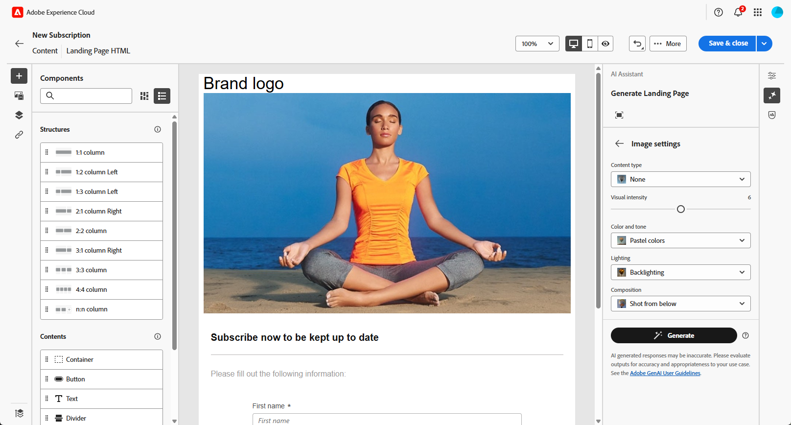
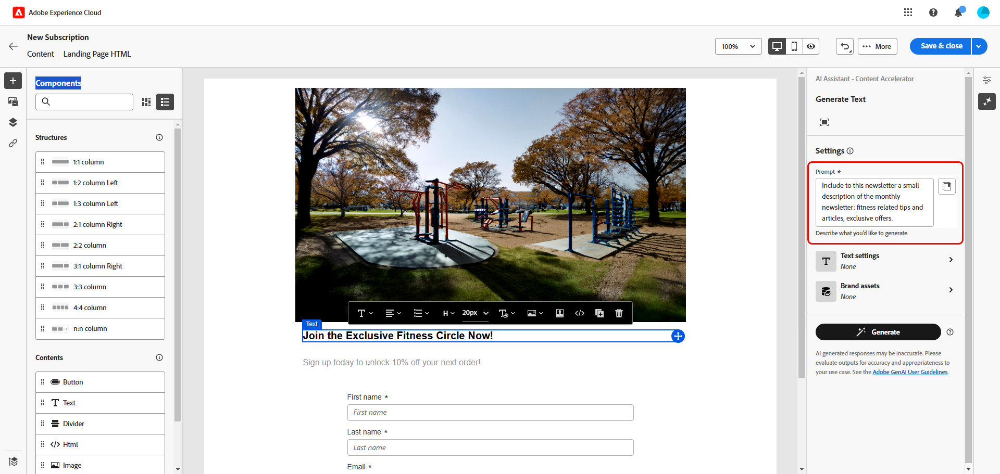

# AI 어시스턴트 콘텐츠 가속기를 사용한 랜딩 페이지 생성 {#generative-lp}

>[!CONTEXTUALHELP]
>id="acw_homepage_welcome_rn5"
>title="AI로 랜딩 페이지 생성"
>abstract="이제 AI Assistant Content Accelerator를 사용하여 랜딩 페이지 게재를 만들 수 있으며, 이를 통해 텍스트, 이미지 또는 전체 페이지 레이아웃을 생성할 수 있습니다."
>additional-url="https://experienceleague.adobe.com/docs/campaign-web/v8/release-notes/release-notes.html?lang=ko" text="릴리스 정보 참조"

>[!IMPORTANT]
>
>이 기능의 사용을 시작하기 전에 관련 [보호 기능 및 제한 사항](generative-gs.md#generative-guardrails)을 읽어 보십시오.
> 
>
>Adobe Campaign 웹에서 AI Assistant Content Accelerator를 사용하려면 먼저 [사용자 계약](https://www.adobe.com/kr/legal/licenses-terms/adobe-dx-gen-ai-user-guidelines.html)에 동의해야 합니다. 자세한 내용은 Adobe 담당자에게 문의하세요.

생성 AI에서 제공하는 Adobe Campaign 웹의 AI Assistant Content Accelerator를 사용하여 랜딩 페이지를 탈바꿈합니다.

완벽한 페이지, 맞춤화된 텍스트 조각, 대상자와 공감하는 사용자 지정된 시각적 요소 등 효과적인 콘텐츠를 손쉽게 제작하여 참여도와 상호 작용을 향상시킵니다.

Adobe Campaign 웹에서 AI Assistant Content Accelerator를 사용하는 방법을 알아보려면 아래 탭을 살펴보십시오.

>[!BEGINTABS]

>[!TAB 전체 랜딩 페이지 생성]

다음 예에서는 AI Assistant Content Accelerator를 활용하여 기존 랜딩 페이지 템플릿을 구체화합니다.

1. 랜딩 페이지를 만들고 구성한 후 **[!UICONTROL 콘텐츠 편집]**&#x200B;을 클릭합니다.

   랜딩 페이지를 구성하는 방법에 대한 자세한 내용은 [이 페이지](../landing-pages/create-lp.md)를 참조하세요.

1. 필요에 따라 레이아웃을 개인화하고 **[!UICONTROL AI 길잡이]** 메뉴에 액세스합니다.

   {zoomable="yes"}

1. AI Assistant Content Accelerator에서 **[!UICONTROL 원본 콘텐츠 사용]** 옵션을 활성화하여 선택한 콘텐츠를 기반으로 새 콘텐츠를 개인화합니다.

1. **[!UICONTROL 프롬프트]** 필드에 생성할 내용을 설명하여 내용을 미세 조정하십시오.

   프롬프트 작성에 도움이 필요한 경우 랜딩 페이지를 개선하기 위한 다양한 프롬프트 아이디어를 제공하는 **[!UICONTROL 프롬프트 라이브러리]**&#x200B;에 액세스하십시오.

   {zoomable="yes"}

1. Tailor your prompt with the **[!UICONTROL Text settings]** option:

   * **[!UICONTROL Communication strategy]**: Choose the most suitable communication style for your generated text.
   * **[!UICONTROL Tone]**: The tone of your landing page should resonate with your audience. Whether you want to sound informative, playful, or persuasive, the AI Assistant can adapt the message accordingly.

   {zoomable="yes"}

1. Choose your **[!UICONTROL Image settings]**:

   * **[!UICONTROL Content type]**: This categorizes the nature of the visual element, distinguishing between different forms of visual representation such as photos, graphics, or art.
   * **[!UICONTROL Visual intensity]**: You can control the image&#39;s impact by adjusting its intensity. A lower setting (2) will create a softer, more restrained appearance, while a higher setting (10) will make the image more vibrant and visually powerful.
   * **[!UICONTROL Color &amp; tone]**: The overall appearance of the colors within an image and the mood or atmosphere it conveys.
   * **[!UICONTROL Lighting]**: This refers to the lightning present in an image, which shapes its atmosphere and highlights specific elements.
   * **[!UICONTROL Composition]**: This refers to the arrangement of elements within the frame of an image

   {zoomable="yes"}

1. From the **[!UICONTROL Brand assets]** menu, click **[!UICONTROL Upload brand asset]** to add any brand asset which contains content that can provide additional context the AI Assistant or select a previously uploaded one.

   이전에 업로드한 파일은 **[!UICONTROL 업로드된 브랜드 자산]** 드롭다운에서 사용할 수 있습니다. 세대에 포함할 자산을 전환하기만 하면 됩니다.

   {zoomable="yes"}

1. 메시지가 준비되면 **[!UICONTROL 생성]**&#x200B;을 클릭합니다.

1. 생성된 **[!UICONTROL 변형]**&#x200B;을 찾은 다음 **[!UICONTROL 미리 보기]**&#x200B;를 클릭하여 선택한 변형의 전체 화면 버전을 봅니다.

1. 추가 사용자 지정 기능에 액세스하려면 **[!UICONTROL 미리 보기]** 창 내에서 **[!UICONTROL 다시 정의]** 옵션으로 이동하십시오.

   * **[!UICONTROL 구문 변경]**: AI Assistant는 다양한 방식으로 메시지를 다시 구문 처리하여 쓰기를 신선하게 유지하고 다양한 대상자를 유혹할 수 있습니다.

   * **[!UICONTROL 더 간단한 언어 사용]**: AI Assistant를 사용하여 언어를 단순화함으로써, 더 많은 대상자가 명확하고 쉽게 사용할 수 있습니다.

   텍스트의 **[!UICONTROL 색조]** 및 **[!UICONTROL 통신 전략]**&#x200B;을 변경할 수도 있습니다.

   {zoomable="yes"}

1. 적절한 콘텐츠를 찾으면 **[!UICONTROL 선택]**&#x200B;을 클릭합니다.

1. 개인화 필드를 삽입하여 프로필 데이터를 기반으로 랜딩 페이지 콘텐츠를 사용자 지정합니다. 그런 다음 **[!UICONTROL 콘텐츠 시뮬레이션]** 단추를 클릭하여 렌더링을 제어하고 테스트 프로필로 개인화 설정을 확인합니다. [자세히 알아보기](../landing-pages/create-lp.md#test-landing-page)

랜딩 페이지가 준비되면 이를 게시하여 메시지에 사용할 수 있도록 할 수 있습니다. [자세히 알아보기](../landing-pages/create-lp.md#publish-landing-page)

>[!TAB 텍스트 전용 생성]

다음 예제에서는 AI Assistant Content Accelerator 를 활용하여 랜딩 페이지의 콘텐츠를 개선합니다.

1. 랜딩 페이지를 만들고 구성한 후 **[!UICONTROL 콘텐츠 편집]**&#x200B;을 클릭합니다.

   랜딩 페이지를 구성하는 방법에 대한 자세한 내용은 [이 페이지](../landing-pages/create-lp.md)를 참조하세요.

1. 특정 콘텐츠만 타겟팅하려면 **[!UICONTROL 텍스트 구성 요소]**&#x200B;를 선택하십시오. **[!UICONTROL AI Assistant]** 메뉴에 액세스합니다.

   {zoomable="yes"}

1. AI Assistant Content Accelerator에서 **[!UICONTROL 원본 콘텐츠 사용]** 옵션을 활성화하여 선택한 콘텐츠를 기반으로 새 콘텐츠를 개인화합니다.

1. **[!UICONTROL 프롬프트]** 필드에 생성할 내용을 설명하여 내용을 미세 조정하십시오.

   프롬프트 작성에 도움이 필요한 경우 랜딩 페이지를 개선하기 위한 다양한 프롬프트 아이디어를 제공하는 **[!UICONTROL 프롬프트 라이브러리]**&#x200B;에 액세스하십시오.

   {zoomable="yes"}

1. **[!UICONTROL 텍스트 설정]** 옵션을 사용하여 메시지를 사용자 지정합니다.

   * **[!UICONTROL 커뮤니케이션 전략]**: 생성된 텍스트에 가장 적합한 커뮤니케이션 스타일을 선택합니다.
   * **[!UICONTROL 음색]**: 랜딩 페이지의 음색이 대상자에게 울려 퍼져야 합니다. AI 어시스턴트는 여러분이 유익하거나, 장난스럽거나, 설득력 있게 들리기를 원하든 상관없이 메시지를 그에 따라 조정할 수 있습니다.
   * **텍스트 길이**: 슬라이더를 사용하여 원하는 텍스트 길이를 선택합니다.

   {zoomable="yes"}

1. **[!UICONTROL 브랜드 자산]** 메뉴에서 **[!UICONTROL 브랜드 자산 업로드]**&#x200B;를 클릭하여 AI Assistant에 추가 컨텍스트를 제공하거나 이전에 업로드한 것을 선택할 수 있는 콘텐츠가 포함된 브랜드 자산을 추가합니다.

   이전에 업로드한 파일은 **[!UICONTROL 업로드된 브랜드 자산]** 드롭다운에서 사용할 수 있습니다. 세대에 포함할 자산을 전환하기만 하면 됩니다.

   {zoomable="yes"}

1. 메시지가 준비되면 **[!UICONTROL 생성]**&#x200B;을 클릭합니다.

1. 생성된 **[!UICONTROL 변형]**&#x200B;을 찾은 다음 **[!UICONTROL 미리 보기]**&#x200B;를 클릭하여 선택한 변형의 전체 화면 버전을 봅니다.

1. 추가 사용자 지정 기능에 액세스하려면 **[!UICONTROL 미리 보기]** 창 내에서 **[!UICONTROL 다시 정의]** 옵션으로 이동하십시오.

   * **[!UICONTROL 참조 콘텐츠로 사용]**: 선택한 변형이 다른 결과를 생성하기 위한 참조 콘텐츠로 사용됩니다.

   * **[!UICONTROL 정교함]**: AI 도우미는 특정 주제를 확장하고 더 나은 이해와 참여를 위해 추가 세부 정보를 제공하는 데 도움이 될 수 있습니다.

   * **[!UICONTROL 요약]**: 정보가 길면 랜딩 페이지 수신자에게 과부하가 걸릴 수 있습니다. AI Assistant를 사용하여 주요 사항을 명확하고 간결한 요약으로 요약하여 주목 받고 더 자세히 읽을 수 있도록 장려합니다.

   * **[!UICONTROL 구문 변경]**: AI 도우미는 다양한 방식으로 메시지를 다시 구문 처리하여 쓰기를 신선하게 유지하고 다양한 대상자를 유혹할 수 있습니다.

   * **[!UICONTROL 더 간단한 언어 사용]**: AI Assistant를 사용하여 언어를 단순화함으로써, 더 많은 대상자가 명확하고 쉽게 사용할 수 있습니다.

   텍스트의 **[!UICONTROL 색조]** 및 **[!UICONTROL 통신 전략]**&#x200B;을 변경할 수도 있습니다.

   {zoomable="yes"}

1. 적절한 콘텐츠를 찾으면 **[!UICONTROL 선택]**&#x200B;을 클릭합니다.

1. 개인화 필드를 삽입하여 프로필 데이터를 기반으로 랜딩 페이지 콘텐츠를 사용자 지정합니다. 그런 다음 **[!UICONTROL 콘텐츠 시뮬레이션]** 단추를 클릭하여 렌더링을 제어하고 테스트 프로필로 개인화 설정을 확인합니다. [자세히 알아보기](../landing-pages/create-lp.md#test-landing-page)

랜딩 페이지가 준비되면 이를 게시하여 메시지에 사용할 수 있도록 할 수 있습니다. [자세히 알아보기](../landing-pages/create-lp.md#publish-landing-page)

>[!TAB 이미지 전용 생성]

아래 예에서는 AI Assistant Content Accelerator를 활용하여 에셋을 최적화하고 개선하여 보다 사용자 친화적인 환경을 구현하는 방법을 알아봅니다.

1. 랜딩 페이지를 만들고 구성한 후 **[!UICONTROL 콘텐츠 편집]**&#x200B;을 클릭합니다.

   랜딩 페이지를 구성하는 방법에 대한 자세한 내용은 [이 페이지](../landing-pages/create-lp.md)를 참조하세요.

1. AI Assistant Content Accelerator 로 변경할 에셋을 선택합니다.

1. 오른쪽 메뉴에서 **[!UICONTROL AI 길잡이]**&#x200B;를 선택합니다.

   {zoomable="yes"}

1. AI Assistant Content Accelerator에서 **[!UICONTROL 참조 스타일]** 옵션을 활성화하여 참조 콘텐츠를 기반으로 새 콘텐츠를 개인화할 수 있습니다. 이미지를 업로드하여 변형에 컨텍스트를 추가할 수도 있습니다.

1. Fine tune the content by describing what you want to generate in the **[!UICONTROL Prompt]** field.

   If you are looking for assistance in crafting your prompt, access the **[!UICONTROL Prompt Library]** which provides a diverse range of prompt ideas to improve your landing pages.

   {zoomable="yes"}

1. Tailor your prompt with the **[!UICONTROL Image settings]** option:

   * **[!UICONTROL Aspect ratio]**: This determines the width and height of the asset. You have the option to choose from common ratios such as 16:9, 4:3, 3:2, or 1:1, or you can enter a custom size.
   * **[!UICONTROL 콘텐츠 형식]**: 이 옵션은 시각적 요소의 특성을 분류하여 사진, 그래픽 또는 미술과 같은 시각적 표현의 다른 형식을 구분합니다.
   * **[!UICONTROL Visual intensity]**: You can control the image&#39;s impact by adjusting its intensity. A lower setting (2) will create a softer, more restrained appearance, while a higher setting (10) will make the image more vibrant and visually powerful.
   * **[!UICONTROL Color &amp; tone]**: The overall appearance of the colors within an image and the mood or atmosphere it conveys.
   * **[!UICONTROL Lighting]**: This refers to the lightning present in an image, which shapes its atmosphere and highlights specific elements.
   * **[!UICONTROL Composition]**: This refers to the arrangement of elements within the frame of an image

   {zoomable="yes"}

1. From the **[!UICONTROL Brand assets]** menu, click **[!UICONTROL Upload brand asset]** to add any brand asset which contains content that can provide additional context the AI Assistant or select a previously uploaded one.

   이전에 업로드한 파일은 **[!UICONTROL 업로드된 브랜드 자산]** 드롭다운에서 사용할 수 있습니다. 세대에 포함할 자산을 전환하기만 하면 됩니다.

1. 프롬프트 구성에 만족하면 **[!UICONTROL 생성]**&#x200B;을 클릭합니다.

1. **[!UICONTROL 변형 제안]**&#x200B;을 검색하여 원하는 자산을 찾습니다.

   선택한 변형의 전체 화면 버전을 보려면 **[!UICONTROL 미리 보기]**&#x200B;를 클릭하십시오.

1. 이 변형과 관련된 이미지를 보려면 **[!UICONTROL 유사 항목 생성]**&#x200B;을 선택하십시오.

   {zoomable="yes"}

1. 적절한 콘텐츠를 찾으면 **[!UICONTROL 선택]**&#x200B;을 클릭합니다.

1. After defining your message content, click the **[!UICONTROL Simulate content]** button to control the rendering, and check personalization settings with test profiles. [자세히 알아보기](../landing-pages/create-lp.md#test-landing-page)

Once your landing page is ready, you can publish it to make it available for use in a message. [자세히 알아보기](../landing-pages/create-lp.md#publish-landing-page)

>[!ENDTABS]
