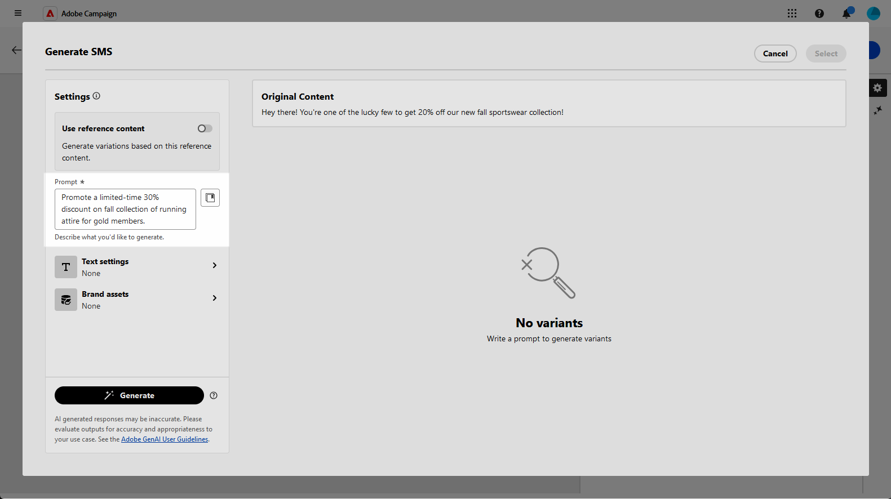
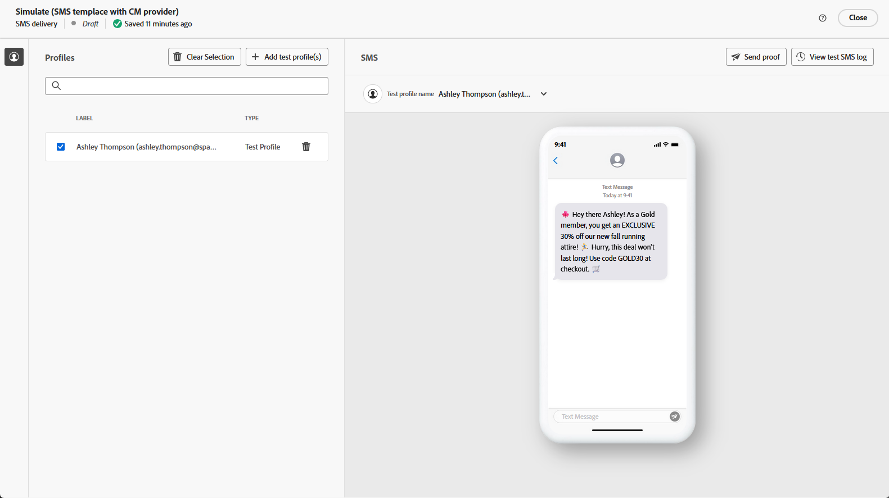

# AI Assistant를 사용하여 SMS 생성 {#generative-sms}

>[!IMPORTANT]
>
>이 기능의 사용을 시작하기 전에 관련 [보호 기능 및 제한 사항](generative-gs.md#generative-guardrails)을 읽어 보십시오.
> 
>
>Adobe Campaign 웹에서 AI Assistant를 사용하기 전에 [사용자 계약](https://www.adobe.com/kr/legal/licenses-terms/adobe-dx-gen-ai-user-guidelines.html)에 동의해야 합니다. 자세한 내용은 Adobe 담당자에게 문의하세요.

대상자에 맞게 SMS 메시지를 만들고 개인화하면 혁신적인 AI 기술을 기반으로 하는 Adobe Campaign 웹의 AI Assistant와의 커뮤니케이션을 향상시킵니다.

이 도구는 메시지가 효과적으로 울리고 참여를 극대화하도록 콘텐츠를 구체화하는 데 필요한 지능적인 제안을 제공합니다.

>[!BEGINTABS]

>[!TAB 전체 SMS 생성]

1. SMS 게재를 만들고 구성한 후 **[!UICONTROL 콘텐츠 편집]**&#x200B;을 클릭하세요.

   SMS 게재 구성에 대한 자세한 내용은 [이 페이지](../sms/create-sms.md)를 참조하세요.

1. 게재할 **[!UICONTROL 기본 세부 정보]**&#x200B;를 입력하십시오. 완료되면 **[!UICONTROL 콘텐츠 편집]**&#x200B;을 클릭하세요.

1. **[!UICONTROL AI Assistant 표시]** 메뉴에 액세스합니다.

   {zoomable="yes"}

1. **[!UICONTROL Prompt]** 필드에 생성할 내용을 설명하여 내용을 미세 조정하십시오.

   프롬프트를 만드는 데 도움이 필요한 경우 게재를 개선하기 위한 다양한 프롬프트 아이디어를 제공하는 **[!UICONTROL 프롬프트 라이브러리]**&#x200B;에 액세스하십시오.

   {zoomable="yes"}

1. **[!UICONTROL 텍스트 설정]** 옵션을 사용하여 메시지를 사용자 지정합니다.

   * **[!UICONTROL 커뮤니케이션 전략]**: 생성된 텍스트에 가장 적합한 커뮤니케이션 스타일을 선택합니다.
   * **[!UICONTROL 음색]**: 전자 메일의 음색이 대상자에게 울려 퍼지도록 합니다. AI Assistant는 유익하거나, 유쾌하거나, 설득력 있게 들리고자 할 때 메시지를 적절히 조정합니다.
   * **텍스트 길이**: 슬라이더를 사용하여 원하는 텍스트 길이를 선택합니다.

   {zoomable="yes"}

1. **[!UICONTROL 브랜드 에셋]** 메뉴에서 **[!UICONTROL 브랜드 에셋 업로드]**&#x200B;를 클릭하여 추가 컨텍스트를 제공하는 콘텐츠가 포함된 브랜드 에셋을 AI Assistant에 추가하거나 이전에 업로드한 에셋을 선택합니다.

   이전에 업로드한 파일은 **[!UICONTROL 업로드된 브랜드 자산]** 드롭다운에서 사용할 수 있습니다. 세대에 포함할 자산을 전환합니다.

1. 메시지가 준비되면 **[!UICONTROL 생성]**&#x200B;을 클릭합니다.

1. 생성된 **[!UICONTROL 변형]**&#x200B;을 찾은 다음 **[!UICONTROL 미리 보기]**&#x200B;를 클릭하여 선택한 변형의 전체 화면 버전을 봅니다.

   {zoomable="yes"}

1. **[!UICONTROL 미리 보기]** 창 내에서 **[!UICONTROL 세분화]** 옵션으로 이동하여 추가 사용자 지정 기능에 액세스하고 변형을 환경 설정에 맞게 세부 조정하십시오.

   * **[!UICONTROL 참조 콘텐츠로 사용]**: 선택한 변형을 다른 결과를 생성하기 위한 참조 콘텐츠로 사용합니다.
   * **[!UICONTROL 간단한 언어 사용]**: AI Assistant를 사용하면 모든 사람이 이해할 수 있는 명확하고 간결한 메시지를 작성할 수 있습니다.
   * **[!UICONTROL 구문 변경]**: AI Assistant는 다른 대상자에게 계속 참여하도록 메시지를 다시 구문 분석합니다.

   텍스트의 **[!UICONTROL 색조]** 및 **[!UICONTROL 통신 전략]**&#x200B;을 변경할 수도 있습니다.

   개선 옵션을 보여 주는 {zoomable="yes"}

1. 적절한 콘텐츠를 찾으면 **[!UICONTROL 선택]**&#x200B;을 클릭합니다.

1. 프로필 데이터를 기반으로 SMS 콘텐츠를 사용자 지정하려면 개인화 필드를 삽입합니다. [콘텐츠 개인화에 대해 자세히 알아보세요](../personalization/personalize.md).

   {zoomable="yes"}

1. 메시지 콘텐츠를 정의한 후 **[!UICONTROL 콘텐츠 시뮬레이션]** 단추를 클릭하여 렌더링을 제어하고 테스트 프로필로 개인화 설정을 확인합니다. [자세히 알아보기](../preview-test/preview-content.md).

   {zoomable="yes"}

콘텐츠, 대상자 및 일정을 정의하면 SMS 게재를 준비합니다. [자세히 알아보기](../monitor/prepare-send.md).

>[!TAB 텍스트 전용 생성]

1. SMS 게재를 만들고 구성한 후 **[!UICONTROL 콘텐츠 편집]**&#x200B;을 클릭하세요.

   SMS 게재 구성에 대한 자세한 내용은 [이 페이지](../sms/create-sms.md)를 참조하세요.

1. 게재할 **[!UICONTROL 기본 세부 정보]**&#x200B;를 입력하십시오. 완료되면 **[!UICONTROL 콘텐츠 편집]**&#x200B;을 클릭하세요.

1. 필요에 따라 SMS 메시지를 개인화합니다. [자세히 알아보기](../sms/content-sms.md).

1. **[!UICONTROL 메시지]** 필드 옆에 있는 **[!UICONTROL AI 길잡이]** 메뉴에 액세스합니다.

   {zoomable="yes"}

1. AI Assistant가 선택한 콘텐츠를 기반으로 새 콘텐츠를 개인화하려면 **[!UICONTROL 참조 콘텐츠 사용]** 옵션을 활성화하십시오.

1. **[!UICONTROL Prompt]** 필드에 생성할 내용을 설명하여 내용을 미세 조정하십시오.

   프롬프트를 만드는 데 도움이 필요한 경우 캠페인을 개선하기 위한 다양한 프롬프트 아이디어를 제공하는 **[!UICONTROL 프롬프트 라이브러리]**&#x200B;에 액세스하십시오.

   {zoomable="yes"}

1. **[!UICONTROL 텍스트 설정]** 옵션을 사용하여 메시지를 사용자 지정합니다.

   * **[!UICONTROL 통신 전략]**: 생성된 텍스트에 대해 원하는 통신 접근 방식을 선택하십시오.
   * **[!UICONTROL 언어]**: 변형 콘텐츠의 언어를 선택하십시오.
   * **[!UICONTROL 색조]**: 텍스트가 대상자와 목적에 적합한지 확인하십시오.
   * **[!UICONTROL 길이]**: 범위 슬라이더를 사용하여 콘텐츠의 길이를 선택합니다.

   {zoomable="yes"}

1. **[!UICONTROL 브랜드 에셋]** 메뉴에서 **[!UICONTROL 브랜드 에셋 업로드]**&#x200B;를 클릭하여 추가 컨텍스트를 제공하는 콘텐츠가 포함된 브랜드 에셋을 AI Assistant에 추가하거나 이전에 업로드한 에셋을 선택합니다.

   이전에 업로드한 파일은 **[!UICONTROL 업로드된 브랜드 자산]** 드롭다운에서 사용할 수 있습니다. 세대에 포함할 자산을 전환합니다.

1. 메시지가 준비되면 **[!UICONTROL 생성]**&#x200B;을 클릭합니다.

1. 생성된 **[!UICONTROL 변형]**&#x200B;을 찾은 다음 **[!UICONTROL 미리 보기]**&#x200B;를 클릭하여 선택한 변형의 전체 화면 버전을 봅니다.

1. **[!UICONTROL 미리 보기]** 창 내에서 **[!UICONTROL 세분화]** 옵션으로 이동하여 추가 사용자 지정 기능에 액세스하고 변형을 환경 설정에 맞게 세부 조정하십시오.

   * **[!UICONTROL 참조 콘텐츠로 사용]**: 선택한 변형을 다른 결과를 생성하기 위한 참조 콘텐츠로 사용합니다.
   * **[!UICONTROL 구문 변경]**: AI Assistant는 다양한 방식으로 메시지를 다시 구문 처리하여 쓰기를 신선하게 유지하고 다양한 대상자를 유혹할 수 있습니다.
   * **[!UICONTROL 더 간단한 언어 사용]**: AI Assistant를 사용하여 언어를 단순화함으로써 더 많은 대상자가 명확하고 쉽게 사용할 수 있습니다.

   텍스트의 **[!UICONTROL 색조]** 및 **[!UICONTROL 통신 전략]**&#x200B;을 변경할 수도 있습니다.

   개선 옵션을 보여 주는 {zoomable="yes"}

1. 적절한 콘텐츠를 찾으면 **[!UICONTROL 선택]**&#x200B;을 클릭합니다.

1. 프로필 데이터를 기반으로 SMS 콘텐츠를 사용자 지정하려면 개인화 필드를 삽입합니다. [콘텐츠 개인화에 대해 자세히 알아보세요](../personalization/personalize.md).

1. 메시지 콘텐츠를 정의한 후 **[!UICONTROL 콘텐츠 시뮬레이션]** 단추를 클릭하여 렌더링을 제어하고 테스트 프로필로 개인화 설정을 확인합니다. [자세히 알아보기](../preview-test/preview-content.md).

   {zoomable="yes"}

콘텐츠, 대상자 및 일정을 정의하면 SMS 게재를 준비합니다. [자세히 알아보기](../monitor/prepare-send.md).

>[!ENDTABS]