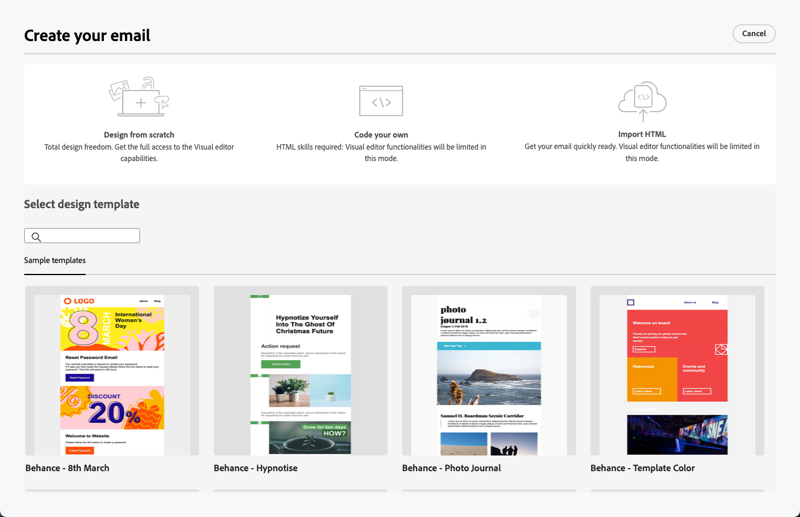

# 이메일 디자이너 시작 {#get-started-email-designer}

>[!CONTEXTUALHELP]
>id="acw_homepage_welcome_rn3"
>title="새 이메일 디자이너"
>abstract="Campaign 이메일 디자이너를 사용하여 직관적인 드래그 앤 드롭 인터페이스를 통해 매력적인 개별 맞춤형 이메일을 만들 수 있습니다. 처음부터 빈 화면으로 시작하고 기존 콘텐츠를 가져오거나 기존 템플릿을 활용하는 경우 모든 이메일 콘텐츠를 디자인하고 세부적으로 조정할 수 있습니다."
>additional-url="https://experienceleague.adobe.com/docs/campaign-web/v8/whats-new.html?lang=ko" text="릴리스 정보 참조"

<!--TO REMOVE BELOW-->
>[!CONTEXTUALHELP]
>id="acw_homepage_rn3"
>title="새 이메일 디자이너"
>abstract="Campaign 이메일 디자이너를 사용하여 직관적인 드래그 앤 드롭 인터페이스를 통해 매력적인 개별 맞춤형 이메일을 만들 수 있습니다. 처음부터 빈 화면으로 시작하고 기존 콘텐츠를 가져오거나 기존 템플릿을 활용하는 경우 모든 이메일 콘텐츠를 디자인하고 세부적으로 조정할 수 있습니다."
>additional-url="https://experienceleague.adobe.com/docs/campaign-web/v8/whats-new.html?lang=ko" text="릴리스 정보 참조"

<!--TO REMOVE ABOVE-->

Adobe Campaign에서 이메일을 만든 후에는 해당 콘텐츠를 정의해야 합니다.

이메일 디자이너를 사용하여 직관적인 드래그 앤 드롭 인터페이스를 통해 매력적인 개별 맞춤형 이메일을 만들 수 있습니다. 처음부터 빈 화면으로 시작하고 기존 콘텐츠를 가져오거나 기존 템플릿을 활용하는 경우 프로모션 또는 트랜잭션 방식으로 모든 이메일 콘텐츠를 디자인하고 세부적으로 조정할 수 있습니다.

<!--Built to deliver HTML optimized for responsive design, the Email Designer allows you to easily define and apply visibility conditions and dynamic content to an email, template, or fragment directly through the user interface. You can seamlessly switch between the drag and drop interface and HTML code at the click of a button.

The Email Designer allows you to create email content and email content templates. It is compatible with simple emails, transactional emails, A/B test emails, multilingual emails, and recurring emails.-->

* [!DNL Campaign] 이메일 디자인 기능을 사용하여 반응형 이메일을 쉽게 작성합니다. [자세히 알아보기](create-email-content.md)

* 프로필 속성을 기반으로 개인화된 경험을 만들어 고객 경험을 개선합니다. [자세히 알아보기](../personalization/personalize.md)

* 조건부 콘텐츠 필드를 구성하여 수신자 프로필을 기반으로 다이내믹 개인화를 만듭니다. [자세히 알아보기](../personalization/conditions.md)

## 이메일 디자인 모범 사례 {#best-practices}

이메일 전송 시 수신자가 이메일을 전달할 수 있다는 것을 고려해야 합니다. 이로 인해 이메일 렌더링에 문제가 발생하는 경우도 있습니다. “is-desktop-hidden” CSS 클래스를 사용하여 모바일 디바이스에 이미지를 숨기는 경우와 같이, 이는 특히 이메일 공급자가 지원할 수 없는 전달용 CSS 클래스를 사용하는 경우에 해당됩니다.

이러한 렌더링 문제를 최소화하려면 이메일 디자인 구조를 최대한 단순하게 유지합니다. 데스크탑과 모바일 디바이스 모두에 적합한 단일 디자인을 사용하고 복잡한 CSS 클래스나, 모든 이메일 클라이언트에서 전폭 지원할 수 없는 다른 디자인 요소를 사용하지 마십시오. 이 모범 사례를 따르면 수신자의 이메일 확인 또는 전달 방법에 관계없이 이메일이 일관되게 렌더링되고 있는지 확인할 수 있습니다.

## 콘텐츠 작성 시작 {#start-authoring}

이메일 게재 대시보드에서 [콘텐츠 편집](edit-content.md) 화면으로 이동하여 이메일 디자이너 홈 페이지를 엽니다. 여기에서 다음 옵션 중 이메일을 디자인할 방법을 선택합니다.

* 이메일 디자이너의 인터페이스를 통해 **처음부터 이메일을 디자인합니다**. [이 섹션](create-email-content.md)에서 이메일 콘텐츠를 디자인하는 방법에 대해 알아봅니다.

* 이메일 디자이너에서 직접 **원시 HTML을 코딩하거나 붙여넣습니다**. [이 섹션](code-content.md)에서 자체 콘텐츠를 코딩하는 방법에 대해 알아봅니다.

* 파일 또는 .zip 폴더에서 **기존 HTML 콘텐츠를 가져옵니다**. [이 섹션](existing-content.md)에서 이메일 콘텐츠를 가져오는 방법에 대해 알아봅니다.

* 기본 제공 또는 사용자 정의 템플릿에서 **기존 콘텐츠를 선택합니다**. [이 섹션](create-email-templates.md)에서 이메일 템플릿으로 작업하는 방법에 대해 알아봅니다.

  {zoomable=&quot;yes&quot;}
