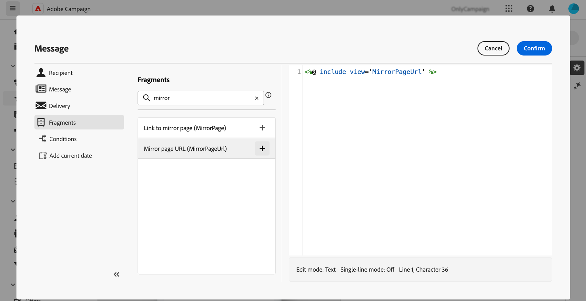

# 미러 페이지에 대한 링크 추가{#mirror-page}

미러 페이지는 이메일의 온라인 버전입니다.

대부분의 이메일 클라이언트는 문제 없이 이미지를 렌더링하지만 일부 사전 설정 사용 시 보안상의 이유로 이미지를 표시하지 못할 수도 있습니다. 받은 편지함에서 이메일을 보려고 할 때 렌더링에 실패하거나 이미지가 깨지는 등의 문제가 발생하는 경우, 사용자는 이메일의 미러 페이지를 대신 탐색할 수 있습니다. 접근성 개선을 개선하거나 소셜 공유를 장려하기 위해서도 온라인 버전을 제공하는 것이 좋습니다.

Adobe Campaign에서 생성한 미러 페이지에는 모든 개인화 데이터가 포함되어 있습니다.

{width="600" align="left"}

## 미러 페이지에 대한 링크 추가{#link-to-mirror-page}

미러 페이지에 대한 링크를 삽입하는 것이 좋습니다. 이 링크는 예컨대 “브라우저에서 이 이메일 보기” 또는 “온라인에서 읽기”일 수 있으며, 이메일의 머리글이나 바닥글에 있는 경우가 많습니다.

Adobe Campaign에서는 전용 **개인 맞춤화 블록**&#x200B;을 사용하여 이메일 콘텐츠에 미러 페이지에 대한 링크를 삽입할 수 있습니다. 내장된 **미러 페이지 링크** 개인 맞춤화 블록은 이메일 콘텐츠에 다음 코드를 삽입합니다. `<%@ include view='MirrorPage' %>`

이메일에 미러 페이지에 대한 링크를 추가하려면 다음 작업을 수행하십시오.

1. 요소를 선택하고 상황별 도구 모음에서 **[!UICONTROL 링크 삽입]**&#x200B;을 클릭합니다.

   {zoomable="yes"}

1. **[!UICONTROL 개인화 추가]** 아이콘을 선택하여 개인화 메뉴에 액세스합니다.

   {zoomable="yes"}

1. **[!UICONTROL 콘텐츠 블록]** 메뉴에서 **[!UICONTROL 미러 페이지 URL]**&#x200B;을 선택한 다음 **[!UICONTROL 추가]**&#x200B;를 클릭합니다.

   {zoomable="yes"}

   사용자 정의 콘텐츠 블록 삽입에 대한 자세한 내용은 [이 섹션](../personalization/personalize.md#personalize-emails)을 참조하십시오.

미러 페이지가 자동으로 생성됩니다.

>[!IMPORTANT]
>
>미러 페이지 링크는 자동 생성되며 편집할 수 없습니다. 여기에는 원본 이메일을 렌더링하는 데 필요한 모든 암호화 및 개인화된 데이터가 포함되어 있습니다. 따라서 값이 큰 개인화된 속성을 사용하면 미러 페이지 URL이 길어질 수 있으며 이로 인해 최대 URL 길이 제한이 있는 웹 브라우저에서 링크가 작동하지 않을 수 있습니다.

이메일이 전송된 후 수신자가 미러 페이지 링크를 클릭하면 이메일 콘텐츠가 기본 웹 브라우저에 표시됩니다.

>[!NOTE]
>
>테스트 프로필로 전송된 증명에서 미러 페이지에 대한 링크가 활성화되지 않았습니다. 최종 메시지에서만 활성화됩니다.

기본적으로 미러 페이지의 유지 기간은 60일입니다. 해당 기간 이후에는 미러 페이지를 더 이상 사용할 수 없습니다.

## 미러 페이지 생성{#mirror-page-generation}

기본적으로 이메일 콘텐츠가 비어 있지 않고 미러 페이지에 대한 링크(미러 링크)가 포함된 경우 Adobe Campaign에서 미러 페이지가 자동으로 생성됩니다.

사용자는 이메일 미러 페이지의 생성 모드를 제어할 수 있습니다. 옵션은 게재 속성에서 사용할 수 있습니다. [자세히 알아보기](../advanced-settings/delivery-settings.md#mirror)
