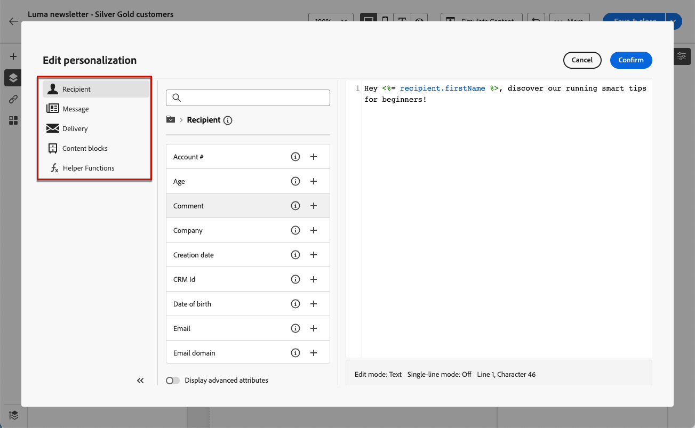

# 이메일에 프리 헤더 추가 {#preheader}

>[!CONTEXTUALHELP]
>id="ac_edition_preheader"
>title="프리 헤더 추가"
>abstract="프리 헤더는 이메일 클라이언트에서 이메일을 표시할 때 제목 줄 뒤에 나오는 짧은 요약 텍스트입니다. 대부분의 경우 프리 헤더는 이메일에 대한 간략한 요약을 제공하고 일반적으로 한 문장으로 구성됩니다."

프리 헤더는 주요 이메일 클라이언트에서 이메일을 볼 때 제목 줄 다음에 오는 짧은 텍스트입니다.

많은 경우, 그것은 컨텐츠의 짧은 요약을 제공하고, 전형적으로 한 문장의 길이이다.

>[!NOTE]
>
>일부 이메일 클라이언트에서는 프리 헤더가 지원되지 않습니다. 지원되지 않는 경우에는 프리 헤더가 표시되지 않습니다.

이메일 사전 헤더를 정의하려면 아래 단계를 수행합니다.

1. [이메일 Designer](create-email-content.md)에서 **[!UICONTROL 구조]** 구성 요소 이상을 추가하여 이메일 디자인을 시작합니다.

1. 왼쪽 창에서 **[!UICONTROL 탐색 트리]** 아이콘을 클릭하고 **[!UICONTROL 본문]**&#x200B;을 선택합니다.

   {zoomable="yes"}

1. **[!UICONTROL 설정]** 탭에서 사전 헤더에 사용할 텍스트를 입력하십시오.

1. 추가로 개인화하려면 **[!UICONTROL 사전 머리글]** 필드 왼쪽에 있는 **[!UICONTROL 개인화 추가]** 아이콘을 클릭하십시오.

   {zoomable="yes"}

1. **[!UICONTROL Personalization 편집]** 창에서 왼쪽의 전용 항목을 사용하여 [개인화 필드](../personalization/personalize.md), [콘텐츠 블록](../personalization/content-blocks.md) 및 [조건부 콘텐츠](../personalization/conditions.md)를 추가할 수 있습니다.

   {zoomable="yes"}

1. **[!UICONTROL 확인]**&#x200B;을 클릭합니다.

이제 프리 헤더가 이메일에 대해 구성되었습니다.
