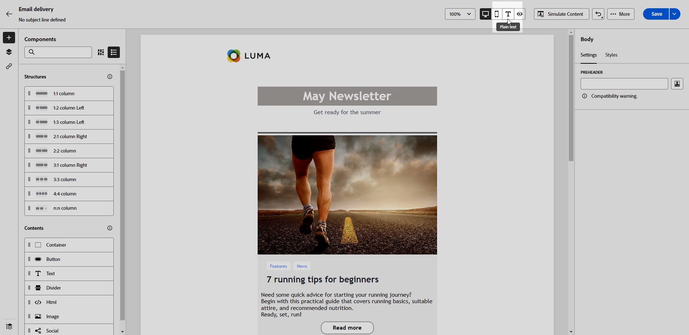

# 이메일의 텍스트 버전 만들기 {#text-version-email}

이메일 본문의 텍스트 버전을 만들어 두면 HTML 콘텐츠를 표시할 수 없을 때 사용할 수 있습니다.

기본적으로 이메일 디자이너는 개인화 필드를 포함한 이메일의 **[!UICONTROL 일반 텍스트]** 버전을 생성합니다. 이 버전은 자동으로 생성되고 콘텐츠의 HTML 버전과 동기화됩니다.

일반 텍스트 버전에 대해 다른 콘텐츠를 사용하려는 경우 아래 단계를 따르십시오.

1. 이메일에서 **[!UICONTROL 일반 텍스트]** 탭을 선택합니다.

   {zoomable="yes"}

1. **[!UICONTROL HTML과 동기화]** 토글을 사용하여 동기화를 비활성화합니다.

   {zoomable="yes"}

1. 확인 표시를 클릭하여 선택을 확인합니다.

   {zoomable="yes"}

1. 원하는 대로 일반 텍스트 버전을 편집합니다.

>[!CAUTION]
>
>* **[!UICONTROL 일반 텍스트]** 보기에서 변경한 내용은 HTML 보기에 반영되지 않습니다.
>
>* 일반 텍스트 콘텐츠를 업데이트한 후 **[!UICONTROL HTML과 동기화]** 옵션을 다시 사용하도록 설정하면 변경 내용이 손실되어 HTML 버전에서 생성된 텍스트 콘텐츠로 바뀝니다.