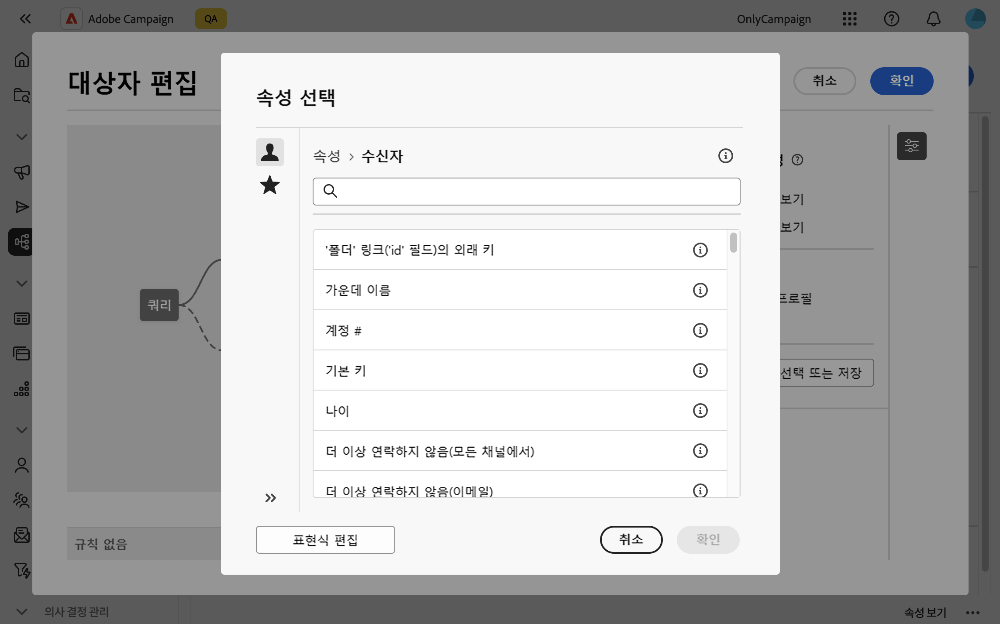
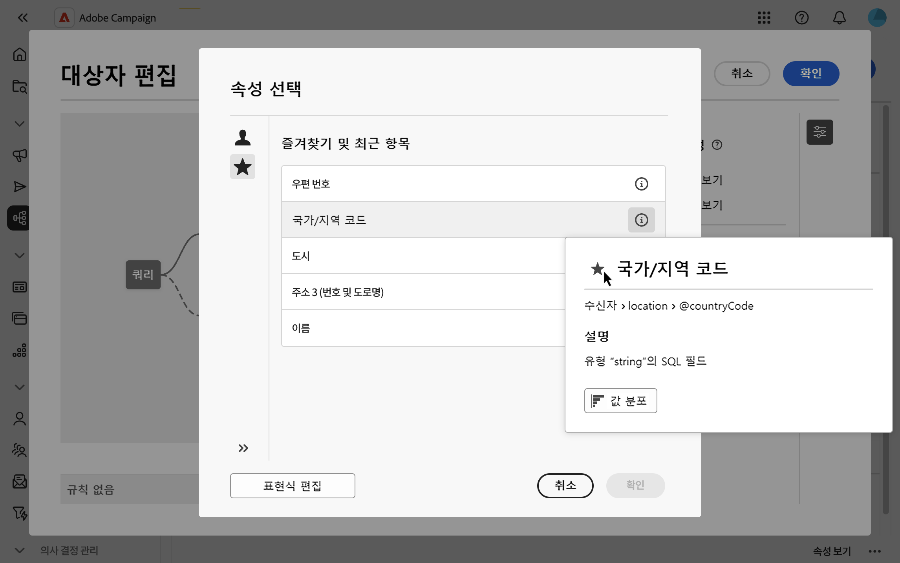
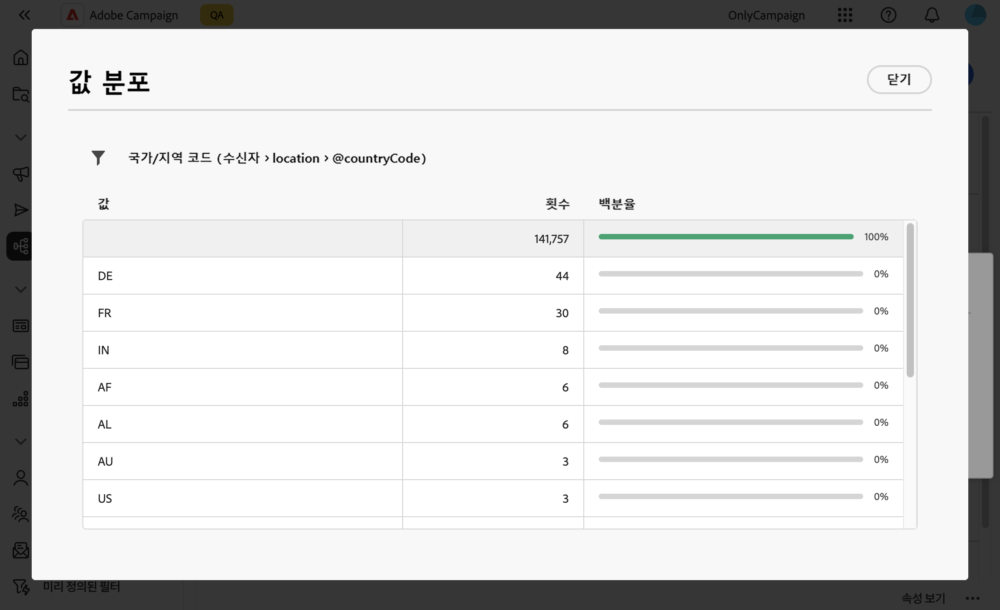

# 속성을 선택하고 즐겨찾기에 추가 {#folders}

Campaign 웹 사용자 인터페이스를 사용하면 수행하려는 작업에 따라 다양한 위치의 데이터베이스에서 속성을 선택할 수 있습니다. 예를 들어 추출할 DM 게재 또는 파일에 대한 출력 열을 정의할 때 속성을 선택할 수 있습니다. 마찬가지로 쿼리 모델러를 사용하여 규칙, 필터 또는 대상을 작성할 때 속성을 선택할 수 있습니다.

자주 사용하는 특성을 빠르게 재사용하려면 해당 특성을 즐겨찾기에 추가할 수 있습니다. 이렇게 하면 향후 작업에 간편하게 액세스할 수 있습니다. 즐겨찾기 외에도 가장 최근에 선택한 속성을 조회하고 사용할 수 있습니다.

또한 인터페이스에서 값 분포 도구를 제공하므로 표 내에서 속성 값의 분포를 시각화할 수 있습니다. 이 도구를 사용하면 값의 범위와 빈도를 식별하여 쿼리나 표현식을 만들 때 데이터 일관성을 유지할 수 있습니다.

## 즐겨찾기 및 최근 속성 {#favorites}

>[!CONTEXTUALHELP]
>id="acw_attribute_picker_favorites_recents"
>title="즐겨찾기 및 최근 항목"
>abstract="특성 선택기의 **[!UICONTROL 즐겨찾기 및 최근 항목]** 메뉴에서는 즐겨찾기에 추가한 특성에 대한 구성 보기 및 최근에 사용한 특성 목록을 제공합니다. 즐겨찾는 속성이 먼저 나타나고 최근에 사용된 속성이 이어서 필요한 속성을 쉽게 찾을 수 있습니다."

특성 선택기의 **[!UICONTROL 즐겨찾기 및 최근 항목]** 메뉴에서는 즐겨찾기에 추가한 특성에 대한 구성 보기 및 최근에 사용한 특성 목록을 제공합니다. 즐겨찾는 속성이 먼저 나타나고 최근에 사용된 속성이 이어서 필요한 속성을 쉽게 찾을 수 있습니다.

즐겨찾기에 속성을 추가하려면 해당 정보 단추를 마우스로 가리킨 다음 별 아이콘을 선택합니다. 그러면 속성이 즐겨찾기 목록에 자동으로 추가됩니다. 더 이상 속성을 즐겨찾기로 유지하지 않으려면 별 아이콘을 다시 선택하여 제거할 수 있습니다.

최대 20개의 속성 즐겨찾기를 추가할 수 있습니다. 즐겨찾기 및 최근 속성은 조직 내의 각 사용자와 연결됩니다. 즉, 서로 다른 시스템에서 액세스할 수 있으므로 여러 장치에서 원활한 경험을 보장할 수 있습니다.

## 테이블 내 값 분포 식별 {#distribution}

특성 정보 창에서 사용할 수 있는 **값 분포** 단추를 사용하면 테이블 내에서 해당 특성에 대한 값 분포를 분석할 수 있습니다. 이 기능은 사용 가능한 값, 카운트 및 백분율을 이해하는 데 특히 유용합니다. 또한 쿼리를 작성하거나 표현식을 만들 때 일치하지 않는 대문자나 맞춤법과 같은 문제를 방지하는 데 도움이 됩니다.

값이 많은 속성의 경우 처음 20개만 표시됩니다. 이러한 경우 **[!UICONTROL 부분 로드]** 알림이 표시되어 이 제한을 나타냅니다. 고급 필터를 적용하여 표시된 결과를 구체화하고 특정 값 또는 데이터 하위 집합에 집중할 수 있습니다. 필터 사용에 대한 자세한 지침은 [여기](../get-started/work-with-folders.md#filter-the-values)에서 확인할 수 있습니다.

다른 컨텍스트에서 값 분포 도구를 사용하는 방법에 대한 자세한 내용은 다음 섹션을 참조하십시오.

- [폴더 내 값의 분포](../get-started/work-with-folders.md##distribution-values-folder)
- [쿼리의 값 분포](../query/build-query.md#distribution-values-query)
