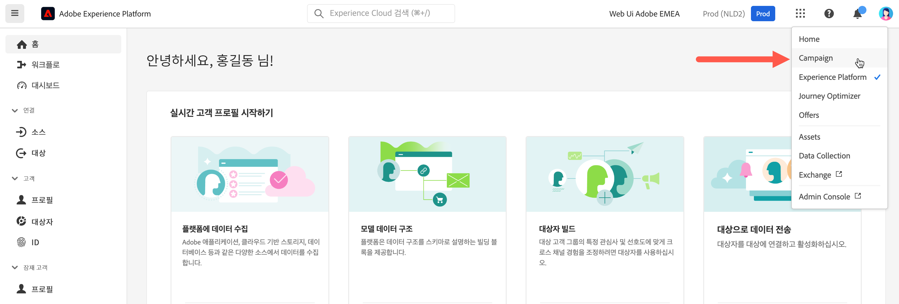

# Adobe Campaign에 연결 {#connect-to-campaign}

Experience Cloud는 Adobe의 디지털 마케팅 애플리케이션, 제품 및 서비스 통합 제품군입니다. 직관적인 인터페이스에서 클라우드 애플리케이션, 제품 기능, 서비스에 빠르게 액세스할 수 있습니다. 이 페이지에서는 Adobe Experience Cloud에 접속하여 Adobe Campaign Web 인터페이스에 액세스하는 방법을 알아봅니다.

## Adobe Experience Cloud에 로그인 {#sign-in-to-exc}

SSO(Single Sign-On)만 사용하여 Campaign에 접속할 수도 있습니다. 보통은 Experience Cloud 관리자가 애플리케이션 및 서비스에 대한 액세스 권한을 부여합니다. Experience Cloud 초대 이메일에 나온 단계를 따르면 됩니다.

Adobe Experience Cloud에 로그인하기 위한 기본 단계는 다음과 같습니다.

1. [Adobe Experience Cloud](https://experience.adobe.com/){target="_blank"}로 이동합니다.

1. Adobe ID 또는 Enterprise ID를 사용하여 로그인합니다. Adobe의 ID 종류에 대해 자세히 알아보려면 [이 문서](https://helpx.adobe.com/kr/enterprise/using/identity.html){target="_blank"}를 참조하십시오.

   Experience Cloud에 로그인하면 모든 솔루션 및 앱에 빠르게 액세스할 수 있습니다.

   {zoomable="yes"}

1. 올바른 조직에 속해 있는지 확인해야 합니다.

   {zoomable="yes"}{width="50%" align="left"}

   Adobe Experience Cloud의 조직에 대한 자세한 내용은 [이 문서](https://experienceleague.adobe.com/docs/core-services/interface/administration/organizations.html?lang=ko){target="_blank"}를 참조하십시오.

## Adobe Campaign 액세스 {#access-to-campaign}

Campaign 환경에 액세스하려면 Adobe Experience Cloud 홈페이지의 **빠른 액세스** 섹션에서 **캠페인**&#x200B;을 선택합니다.

다른 Adobe Experience Cloud 솔루션에 이미 연결된 경우 화면 오른쪽 상단의 솔루션 스위처에서 Campaign 환경으로 이동할 수도 있습니다.

{zoomable="yes"}

Campaign 컨트롤 패널을 포함한 여러 환경에 액세스할 수 있는 경우 적절한 인스턴스의 **시작** 버튼을 클릭합니다.

{zoomable="yes"}

이제 Campaign에 연결되었습니다. [이 페이지](user-interface.md)에서 사용자 인터페이스 사용 방법에 대해 알아보십시오.

### 액세스 제어 {#access-control}

>[!CONTEXTUALHELP]
>id="acw_explorer_permissions_create"
>title="권한 필요"
>abstract="오브젝트를 만들려면 먼저 관리자가 권한을 부여해야 합니다."

>[!CONTEXTUALHELP]
>id="acw_audiences_read_only"
>title="이 대상자는 읽기 전용입니다."
>abstract="이 대상자를 편집할 권한이 없습니다. 필요한 경우 관리자에게 액세스 권한을 요청하십시오."

>[!CONTEXTUALHELP]
>id="acw_subscription_services_read_only"
>title="이 서비스는 읽기 전용입니다."
>abstract="이 서비스를 편집할 권한이 없습니다. 필요한 경우 관리자에게 액세스 권한을 요청하십시오."

>[!CONTEXTUALHELP]
>id="acw_recipients_readonlyprofile"
>title="수신자 읽기 전용 프로필"
>abstract="이 프로필을 편집할 권한이 없습니다. 필요한 경우 관리자에게 액세스 권한을 요청하십시오."

>[!CONTEXTUALHELP]
>id="acw_campaign_read_only"
>title="이 캠페인은 읽기 전용입니다."
>abstract="이 캠페인을 편집할 권한이 없습니다. 필요한 경우 관리자에게 액세스 권한을 요청하십시오."

>[!CONTEXTUALHELP]
>id="acw_deliveries_read_only"
>title="이 게재는 읽기 전용입니다."
>abstract="이 게재를 편집할 권한이 없습니다. 필요한 경우 관리자에게 액세스 권한을 요청하십시오."

>[!CONTEXTUALHELP]
>id="acw_wf_read_only"
>title="이 워크플로는 읽기 전용입니다."
>abstract="이 워크플로를 편집할 권한이 없습니다. 필요한 경우 관리자에게 액세스 권한을 요청하십시오."

액세스 제어를 통해 게재, 수신자 또는 워크플로와 같은 주요 목록의 오브젝트 및 데이터에 대한 액세스를 제한할 수 있습니다. 이러한 제한 사항은 Explorer의 탐색 트리에도 적용됩니다. 또한 사용자 인터페이스에서 오브젝트를 생성, 삭제, 복제 및 편집하려면 권한이 필요합니다.

Campaign Web의 모든 권한은 Campaign 클라이언트 콘솔 권한과 동기화됩니다. Campaign 관리자만 사용자 권한을 정의하고 수정할 수 있습니다.

Campaign Web 사용자 인터페이스를 탐색할 때 주어진 권한에 따라 데이터, 오브젝트 및 기능에 액세스할 수 있습니다. 예를 들어 폴더에 대한 액세스 권한이 없으면 해당 폴더를 볼 수 없습니다. 권한은 오브젝트 및 데이터 관리에도 영향을 미칩니다. 특정 폴더에 대한 쓰기 권한이 없으면 사용자 인터페이스에서 표시되더라도 해당 폴더에서 게재를 생성할 수 없습니다.

[여기에서 권한을 조회하고 관리](permissions.md)하는 방법을 알아볼 수 있습니다.

## Adobe Experience Cloud 상단 탐색 {#top-bar}

인터페이스의 상단 막대를 탐색하여 다음과 같은 작업을 수행할 수 있습니다.

* Campaign Web 사용자 인터페이스에 대한 피드백 공유
* 조직 간 전환
* Adobe Experience Cloud 솔루션과 앱 간 전환
* [Adobe Experience League](https://experienceleague.adobe.com/docs/?lang=ko)에서 도움말 검색{target="_blank"}
* 제품 알림 확인
* Adobe 프로필을 편집 및 [선호하는 언어 업데이트](#language-pref) 또는 [밝은/어두운 테마로 전환](#dark-theme) 등의 설정 관리

{zoomable="yes"}{width="50%" align="left"}

## 지원되는 브라우저 {#browsers}

Adobe Campaign Web은 최신 버전의 Google Chrome, Safari 및 Microsoft Edge에서 최적으로 작동하도록 디자인되었습니다. 이전 버전이나 다른 브라우저에서는 특정 기능 사용 시 문제가 발생할 수 있습니다.

## 언어 환경 설정 {#language-pref}

Adobe Campaign Web은 현재 다음 언어로 제공됩니다.

* 영어(미국) - EN-US
* 프랑스어 - FR
* 독일어 - DE
* 이탈리아어 - IT
* 스페인어 - ES
* 포르투갈어(브라질) - PTBR
* 일본어 - JP
* 한국어 - KR
* 중국어 간체 - CHS
* 중국어 번체 - CHT

Campaign Web의 기본 언어는 사용자 프로필에 지정된 기본 언어에 따라 결정됩니다. Campaign 서버 및 클라이언트 콘솔의 언어와 관련이 없습니다.

언어를 변경하려면 다음 작업을 수행하십시오.

1. 오른쪽 상단의 프로필 아이콘을 클릭한 다음 **환경 설정**&#x200B;을 선택합니다.
1. 그런 다음 이메일 주소 아래에 표시되는 언어 링크를 클릭합니다.
1. 원하는 언어를 선택하고 **저장**&#x200B;을 클릭합니다. 사용 중인 구성 요소가 첫 번째 언어로 현지화되어 있지 않은 경우 두 번째 언어를 선택할 수 있습니다.

<!--
>[!CAUTION]
>
>If you plan to use [AI-powered contextual help](using-ai.md) capabilities, you must set your prefered language to English. Other languages are not supported.
>
-->

## 어두운 테마 및 밝은 테마 {#dark-theme}

Adobe Campaign은 밝은 테마와 어두운 테마로 제공됩니다. 기본적으로 사용자 인터페이스는 밝은 테마로 활성화됩니다. 어두운 테마로 전환하려면 프로필 아이콘을 클릭하고 **어두운 테마** 토글을 사용하여 활성화/비활성화합니다.

사용자 프로필 설정 및 계정 환경 설정은 [이 섹션](https://experienceleague.adobe.com/docs/core-services/interface/experience-cloud.html?lang=ko#preferences){target="_blank"}에서 자세히 설명합니다.

Experience Cloud 중앙 인터페이스 구성 요소에 대한 자세한 내용은 [이 설명서](https://experienceleague.adobe.com/docs/core-services/interface/experience-cloud.html?lang=ko){target="_blank"}를 참조하십시오.
