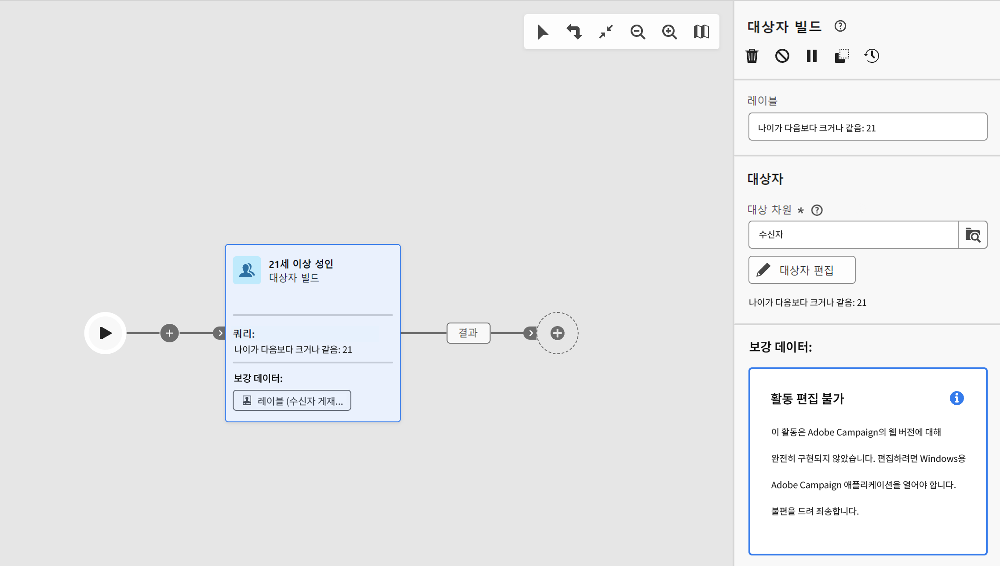

# 보호 기능 및 제한 사항 {#guardrails-limitations}

Campaign 클라이언트 콘솔에서 만들거나 수정한 워크플로우로 Campaign 웹 사용자 인터페이스에서 작업할 때 아래 나열된 보호 기능 및 제한 사항이 적용됩니다.

이 페이지에서는 콘솔 및 웹 사용자 인터페이스의 워크플로우로 작업할 때 고려해야 할 주요 사항을 확인하지만 두 인터페이스 간의 잠재적 비호환성을 모두 포함하는 것은 아닙니다.

## 워크플로 활동 {#wkf-activities}

Campaign 웹에서 아직 지원되지 않는 워크플로우 활동은 읽기 전용이며 호환되지 않는 활동으로 표시됩니다. 워크플로를 실행하고, 메시지를 전송하고, 로그를 확인하는 등의 작업은 수행할 수 있습니다. Campaign 웹과 클라이언트 콘솔에서 모두 사용할 수 있는 워크플로우 활동을 편집할 수 있습니다.

Campaign 웹 사용자 인터페이스에서 아직 지원되지 않는 워크플로우 활동은 읽기 전용이며 호환되지 않는 활동으로 표시됩니다. 워크플로를 실행하고, 메시지를 전송하고, 로그를 확인하는 등의 작업은 수행할 수 있습니다. Campaign 웹 사용자 인터페이스와 Campaign 클라이언트 콘솔 모두에서 사용할 수 있는 워크플로우 활동을 편집할 수 있습니다.

| 콘솔 | 웹 |
| --- | --- |
| {width="800px" align="left" zoomable="yes"} | {width="800px" align="left" zoomable="yes"} |

다음과 같은 경우 **쿼리** 또는 **데이터 보강** 활동은 콘솔에 추가 데이터로 구성되어 있으며 데이터 보강 데이터는 Campaign 웹에서 고려되어 아웃바운드 전환으로 전달되지만 편집할 수 없습니다.

| 콘솔 | 웹 |
| --- | --- |
| {width="800px" align="left" zoomable="yes"} | {width="800px" align="left" zoomable="yes"} |

콘솔에서 **보강** 활동을 통해 조정 및 보강을 모두 수행할 수 있습니다. 클라이언트 콘솔에서 을 정의한 경우 **데이터 보강** 활동은 다음과 같이 표시됩니다. **조정** Campaign 웹 사용자 인터페이스의 활동.

| 콘솔 | 웹 |
| --- | --- |
| {width="800px" align="left" zoomable="yes"} | {width="800px" align="left" zoomable="yes"} |

## 워크플로 캔버스 {#wkf-canvas}

Campaign 웹 사용자 인터페이스에서 새 워크플로우를 만들 때 캔버스는 하나의 진입점만 지원합니다. 하지만 콘솔에 여러 진입점이 있는 워크플로를 만든 경우에는 Campaign 웹 사용자 인터페이스에서 워크플로를 열고 편집할 수 있습니다.

| 콘솔 | 웹 |
| --- | --- |
| {width="800px" align="left" zoomable="yes"} | {width="800px" align="left" zoomable="yes"} |

활동이 추가되거나 제거될 때마다 노드 위치가 새로 고쳐집니다. 콘솔에서 워크플로우를 만들고 Campaign 웹 사용자 인터페이스를 사용하여 수정한 후 콘솔에서 다시 열면 몇 가지 사소한 위치 지정 불완결성을 볼 수 있습니다. 이는 워크플로의 프로세스 및 작업에 영향을 주지 않습니다.

| 초기 워크플로 | 위치 변경 |
| --- | --- |
| {width="800px" align="left" zoomable="yes"} | {width="800px" align="left" zoomable="yes"} |
