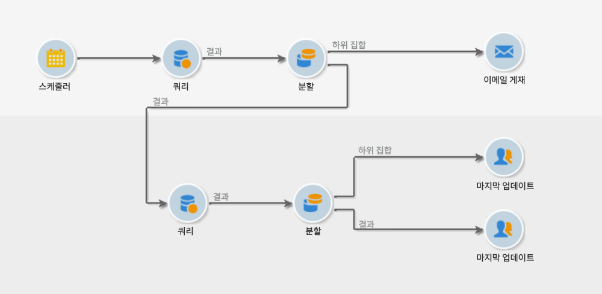

# 보호 기능 및 제한 사항 {#guardrails-limitations}

Campaign 클라이언트 콘솔에서 만들거나 수정한 구성 요소로 Campaign 웹 UI에서 작업하는 경우 아래 나열된 보호 기능 및 제한 사항이 적용됩니다.

## 워크플로 {#wf-guardrails-limitations}

### 활동

웹 UI에서 아직 지원되지 않는 워크플로우 활동은 읽기 전용이며 호환되지 않는 활동으로 표시됩니다. 워크플로우를 실행하고, 메시지를 보내고, 로그를 확인하는 등의 작업을 수행할 수 있습니다. 웹 UI와 클라이언트 콘솔에서 모두 사용할 수 있는 워크플로우 활동을 편집할 수 있습니다.

| 콘솔 | 웹 UI |
| --- | --- |
| {width="800px" align="left" zoomable="yes"} | {width="800px" align="left" zoomable="yes"} |

웹 UI에서 아직 지원되지 않는 워크플로우 활동 설정은 표시되지 않습니다. 그러나 워크플로우를 실행하면 이러한 설정이 적용됩니다.

| 콘솔 | 웹 UI |
| --- | --- |
| {width="800px" align="left" zoomable="yes"} | {width="800px" align="left" zoomable="yes"} |

콘솔에서 **데이터 보강** 활동은 조정과 데이터 보강 모두를 수행할 수 있습니다. 웹 UI에서 조정 기능을 아직 사용할 수 없습니다. 콘솔에서 을 정의한 경우 **데이터 보강** 활동은 웹 UI에서 호환되지 않는 읽기 전용 활동으로 표시됩니다.

| 콘솔 | 웹 UI |
| --- | --- |
| {width="800px" align="left" zoomable="yes"} | {width="800px" align="left" zoomable="yes"} |

### 캔버스

웹 UI에서 새 워크플로를 만들 때 캔버스는 하나의 진입점만 지원합니다. 그러나 콘솔에서 여러 진입점을 가진 워크플로를 만든 경우에는 웹 UI에서 열고 편집할 수 있습니다.

| 콘솔 | 웹 UI |
| --- | --- |
| {width="800px" align="left" zoomable="yes"} | {width="800px" align="left" zoomable="yes"} |

루프는 아직 웹 UI에서 사용할 수 없습니다. 콘솔을 사용하여 루프가 포함된 워크플로를 만든 경우 웹 UI에서 액세스할 수 없습니다. 오류 메시지가 표시됩니다.

| 콘솔 | 웹 UI |
| --- | --- |
| {width="800px" align="left" zoomable="yes"} | {width="800px" align="left" zoomable="yes"} |

활동이 추가되거나 제거될 때마다 노드의 위치가 새로 고쳐집니다. 콘솔에서 워크플로우를 만들고 웹 UI를 사용하여 수정한 후 콘솔에서 다시 열면 몇 가지 사소한 위치 지정 불완결성을 볼 수 있습니다. 이 작업은 워크플로에 영향을 주지 않습니다.

| 초기 워크플로우 | 위치 변경 |
| --- | --- |
| {width="800px" align="left" zoomable="yes"} | {width="800px" align="left" zoomable="yes"} |

## 사전 정의된 필터 {#filters-guardrails-limitations}

게재 대상을 선택하거나 워크플로우에서 대상을 구축할 때 해당 제품 버전의 사용자 인터페이스에서 사전 정의된 일부 필터를 사용할 수 없습니다.

특정 오류 메시지가 표시됩니다.

{width="70%" align="left"}

규칙 빌더에서 쿼리의 그래픽 표현을 볼 수 없고 필터를 편집할 수 없는 경우에도 여전히 사용할 수 있으며 의 필터링 조건을 볼 수 있습니다. **속성** 섹션에 있는 마지막 항목이 될 필요가 없습니다.

{width="70%" align="left"}

SQL 쿼리에 액세스하여 정확한 설정을 확인할 수도 있습니다. 이렇게 하려면 **코드 보기** 단추를 클릭합니다.

{width="70%" align="left"}

다음을 클릭합니다. **계산** 필터의 기준을 충족하는 항목 수를 확인하는 버튼입니다.

{width="70%" align="left"}

사용 **결과 보기** 단추를 클릭하여 해당 항목을 표시합니다.

{width="70%" align="left"}

웹 인터페이스에서 필터를 빌드하고 지원되지 않는 특성을 사용하여 콘솔에서 수정하는 경우 웹 인터페이스에서 더 이상 그래픽 표현을 사용할 수 없습니다. 어떤 경우든 필터를 계속 사용할 수 있습니다.

지원되지 않는 속성은 아래에 나열되어 있습니다.

### 지원되지 않는 데이터 유형 {#unsupported-data-type}

웹 인터페이스에 필터 또는 규칙을 표시할 때 클라이언트 콘솔에서 사용할 수 있는 다음 데이터 유형은 지원되지 않습니다.

* datetime
* 시간
* timespan
* 더블
* 부동

### 지원되지 않는 필터링 기능 {#unsupported-filtering-capabilities}

클라이언트 콘솔에서 복잡한 표현식과 함수를 사용하여 필터를 빌드하면 웹 인터페이스에서 편집할 수 없습니다.

또한 다음 연산자는 지원되지 않습니다.

* 숫자 유형
   * 포함 위치:
   * 에 없음

* 문자열 유형
   * 다음보다 큼
   * 다음보다 작음:
   * 다음보다 크거나 같음
   * 다음보다 작거나 같음
   * 좋아요
   * 비슷하지 않음

* 날짜 유형
   * 다음 또는 이후
   * 다음 또는 이전
   * 다음과 같지 않음
   * 비어 있음
   * 비어 있지 않음
   * 포함 위치:
   * 다음에 없음
   * 마지막

* 1-N 링크
   * COUNT, SUM, AVG, 최소, MAX