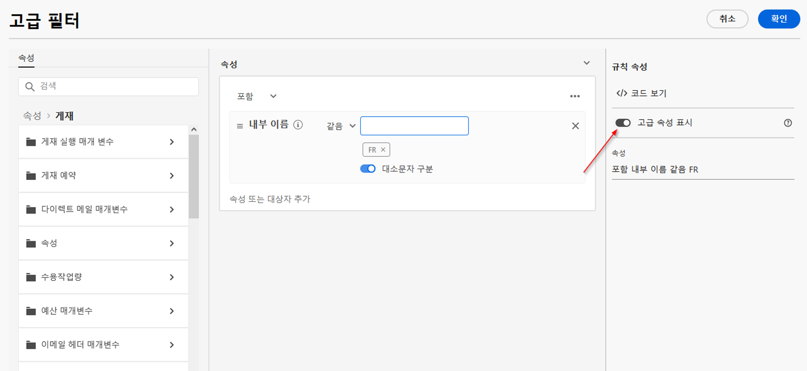

# 목록 찾아보기 및 필터링 {#list-screens}

왼쪽 탐색 메뉴의 대부분 링크에는 **게재** 또는 **캠페인** 목록 등 오브젝트 목록이 표시됩니다. 이들 중 일부 목록 화면은 읽기 전용입니다. 아래 설명대로 목록 표시를 사용자 정의하고 해당 목록을 필터링할 수 있습니다.

## 목록 화면 사용자 정의 {#custom-lists}

목록은 열에 표시됩니다. 열 구성을 변경하여 추가 정보를 표시할 수 있습니다. 이렇게 하려면 목록의 오른쪽 상단에 있는 **사용자 정의 레이아웃에 대한 열 구성** 아이콘을 클릭합니다.

{zoomable=&quot;yes&quot;}{width="70%" align="left" zoomable="yes"}

**열 구성** 화면에서 열을 추가 또는 제거하고 열이 표시되는 순서를 변경합니다.

예를 들어 이 설정의 경우

{zoomable=&quot;yes&quot;}{width="70%" align="left" zoomable="yes"}

목록에는 다음 열이 표시됩니다.

{zoomable=&quot;yes&quot;}{width="70%" align="left" zoomable="yes"}

## 데이터 정렬 {#sort-lists}

열 머리글을 클릭하여 목록의 항목을 정렬할 수도 있습니다. 목록이 해당 열에 정렬되어 있음을 나타내는 화살표(위 또는 아래)가 표시됩니다.

숫자 또는 날짜 열의 경우 **위쪽** 화살표는 목록이 오름차순으로 정렬됨을 나타내고 **아래쪽** 화살표는 내림차순으로 정렬됨을 나타냅니다. 문자열 또는 영숫자 열의 경우 값이 알파벳순으로 나열됩니다.

## 필터 {#list-built-in-filters}

검색 창을 사용하거나 내장된 필터 및 맞춤형 필터를 사용하여 상황별 기준에 따라 목록을 조정하여 항목을 더 빨리 찾을 수 있습니다.

{zoomable=&quot;yes&quot;}{width="70%" align="left" zoomable="yes"}

필터를 사용하고 나만의 맞춤형 필터를 만드는 방법에 대한 자세한 내용은 [이 섹션](../query/filter.md)에서 확인할 수 있습니다.

<!--
## Use advanced attributes {#adv-attributes}

>[!CONTEXTUALHELP]
>id="acw_attributepicker_advancedfields"
>title="Display advanced attributes"
>abstract="Only the most common attributes are displayed by default in the attribute list. Activate the **Display advanced attributes** toggle to see all available attributes for the current list in the left palette of the rule builder, such as nodes, groupings, 1-1 links, 1-N links."

>[!CONTEXTUALHELP]
>id="acw_rulebuilder_advancedfields"
>title="Rule builder advanced fields"
>abstract="Only the most common attributes are displayed by default in the attribute list. Activate the **Display advanced attributes** toggle to see all available attributes for the current list in the left palette of the rule builder, such as nodes, groupings, 1-1 links, 1-N links."

>[!CONTEXTUALHELP]
>id="acw_rulebuilder_properties_advanced"
>title="Rule builder advanced attributes"
>abstract="Only the most common attributes are displayed by default in the attribute list. Activate the **Display advanced attributes** toggle to see all available attributes for the current list in the left palette of the rule builder, such as nodes, groupings, 1-1 links, 1-N links."

Only most common attributes are displayed by default in the attribute list and filter configuration screens. Attributes which were set as `advanced` attributes in the data schema are hidden from the configuration screens. 

Activate the **Display advanced attributes** toggle to see all available attributes for the current list in the left palette of the rule builder, such as nodes, groupings, 1-1 links, 1-N links. The attribute list is updated instantly.

{zoomable="yes"}{width="70%" align="left" zoomable="yes"}
-->