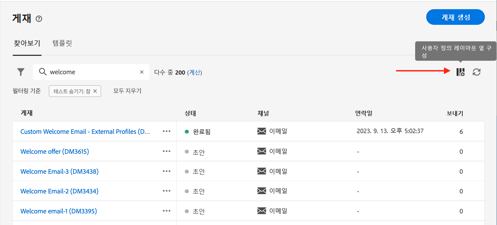
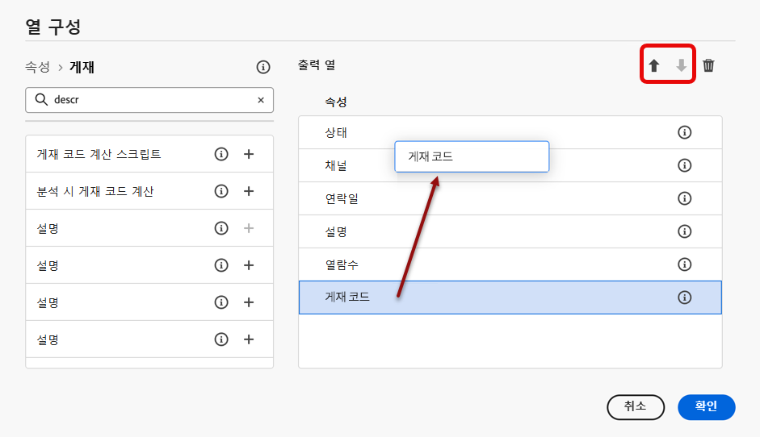
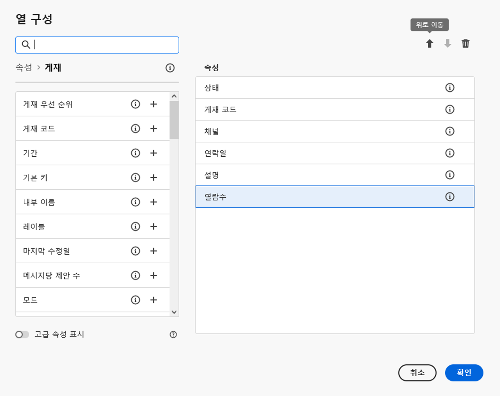
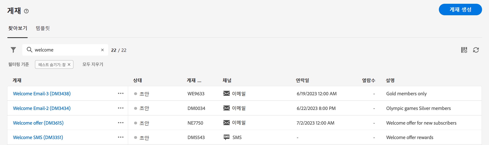
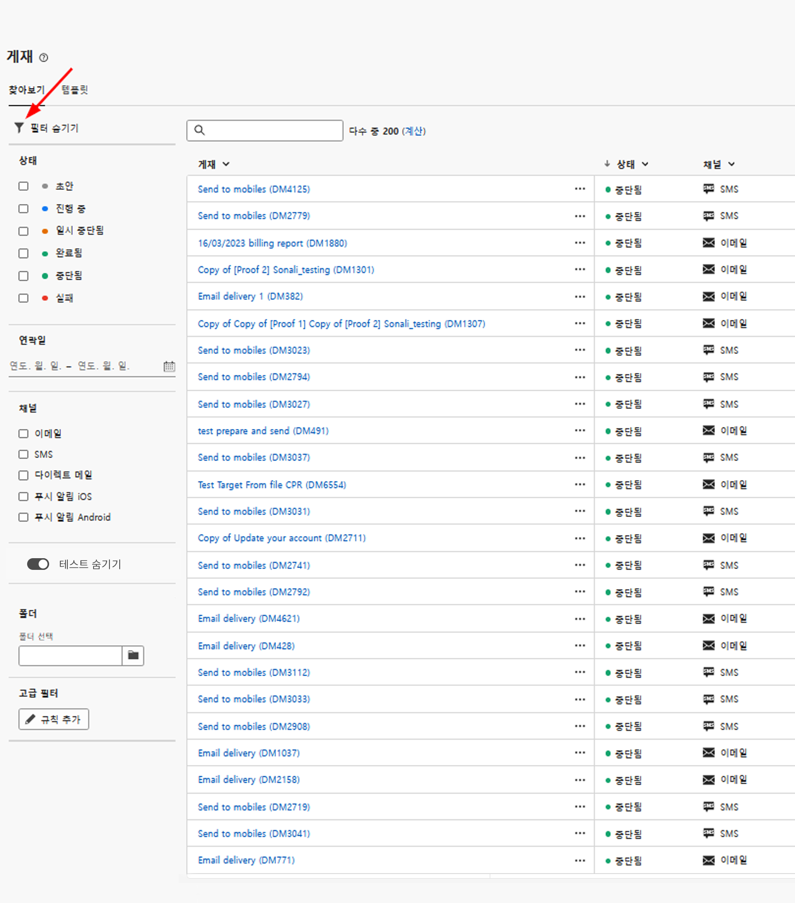
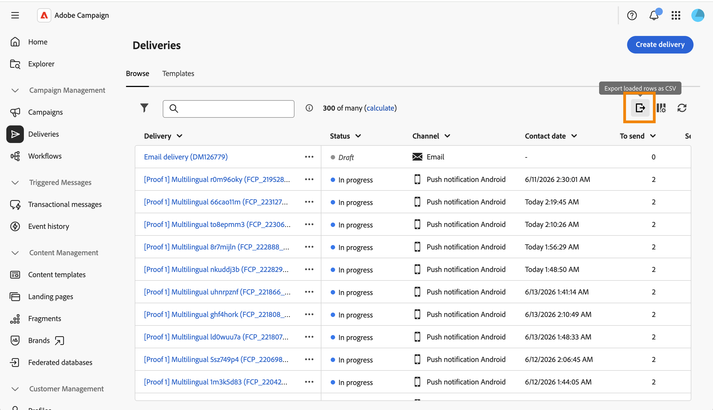

# 목록 찾아보기 및 필터링 {#list-screens}

왼쪽 탐색 메뉴의 대부분 링크에는 **게재** 또는 **캠페인** 목록 등 오브젝트 목록이 표시됩니다. 이들 중 일부 목록 화면은 읽기 전용입니다. 아래에 자세히 설명된 대로 목록 표시 방식을 맞춤화하고, 이들 목록을 필터링하고, 목록 데이터를 CSV 파일로 내보낼 수 있습니다.

## 목록 화면 사용자 정의 {#custom-lists}

목록은 열에 표시됩니다. 열 구성을 변경하여 추가 정보를 표시할 수 있습니다. 이렇게 하려면 목록의 오른쪽 상단에 있는 **사용자 정의 레이아웃에 대한 열 구성** 아이콘을 클릭합니다.

{zoomable="yes"}{width="70%"}

**열 구성** 화면에서 열을 추가 또는 제거하고 열이 표시되는 순서를 변경합니다.

아래와 같이 **드래그 앤 드롭**&#x200B;하거나 **위쪽 및 아래쪽 화살표**&#x200B;를 사용하여 목록의 순서를 변경할 수 있습니다.

{zoomable="yes"}{width="70%"}

예를 들어 이 설정의 경우

{zoomable="yes"}{width="70%" zoomable="yes"}

목록에는 다음 열이 표시됩니다.

{zoomable="yes"}{width="70%"}

## 데이터 정렬 {#sort-lists}

열 머리글을 클릭하여 목록의 항목을 정렬할 수 있습니다. 목록이 해당 열에 정렬되어 있음을 나타내는 화살표(위 또는 아래)가 표시됩니다.

숫자 또는 날짜 열의 경우 **위쪽** 화살표는 목록이 오름차순으로 정렬됨을 나타내고 **아래쪽** 화살표는 내림차순으로 정렬됨을 나타냅니다. 문자열 또는 영숫자 열의 경우 값이 알파벳순으로 나열됩니다.

## 필터 {#list-built-in-filters}

검색 창을 사용하거나 기본 제공 필터 및 맞춤형 필터를 사용하여 상황별 기준에 따라 목록을 조정하여 항목을 더 빨리 찾습니다.

{zoomable="yes"}{width="70%"}

필터를 사용하고 나만의 맞춤형 필터를 만드는 방법에 대한 자세한 내용은 [이 섹션](../query/filter.md)에서 확인할 수 있습니다.

## 목록 데이터 내보내기 {#export-list}

추적 로그를 포함한 모든 목록 화면에서 데이터를 내보낼 수 있습니다. 목록을 내보내려면 다음 단계를 따르십시오.

1. 내보낼 목록을 엽니다.
1. 표시된 열을 조정하고 원하는 검색 또는 필터를 적용합니다. 내보내기는 화면에 표시되는 열과 모든 활성 검색 또는 필터를 고려합니다.
1. 필요한 경우 아래로 스크롤하여 더 많은 행을 표시합니다. 현재 목록에 로드된 행만 내보내집니다.
1. 목록 위에 있는 **로드된 행을 CSV로 내보내기** 버튼을 클릭합니다. 파일이 브라우저의 기본 다운로드 폴더에 저장됩니다.

{zoomable="yes"}

<!--
## Use advanced attributes {#adv-attributes}

>[!CONTEXTUALHELP]
>id="acw_attributepicker_advancedfields"
>title="Display advanced attributes"
>abstract="Only the most common attributes are displayed by default in the attribute list. Activate the **Display advanced attributes** toggle to see all available attributes for the current list in the left palette of the rule builder, such as nodes, groupings, 1-1 links, 1-N links."

>[!CONTEXTUALHELP]
>id="acw_rulebuilder_advancedfields"
>title="Rule builder advanced fields"
>abstract="Only the most common attributes are displayed by default in the attribute list. Activate the **Display advanced attributes** toggle to see all available attributes for the current list in the left palette of the rule builder, such as nodes, groupings, 1-1 links, 1-N links."

>[!CONTEXTUALHELP]
>id="acw_rulebuilder_properties_advanced"
>title="Rule builder advanced attributes"
>abstract="Only the most common attributes are displayed by default in the attribute list. Activate the **Display advanced attributes** toggle to see all available attributes for the current list in the left palette of the rule builder, such as nodes, groupings, 1-1 links, 1-N links."

Only the most common attributes are displayed by default in the attribute list and filter configuration screens. Attributes set as `advanced` attributes in the data schema are hidden from the configuration screens.

Activate the **Display advanced attributes** toggle to see all available attributes for the current list in the left palette of the rule builder, such as nodes, groupings, 1-1 links, 1-N links. The attribute list updates instantly.

[The screenshot shows the Display advanced attributes toggle used to reveal hidden attributes in the rule builder palette.](assets/adv-toggle.png){zoomable="yes"}{width="70%" zoomable="yes"}
-->