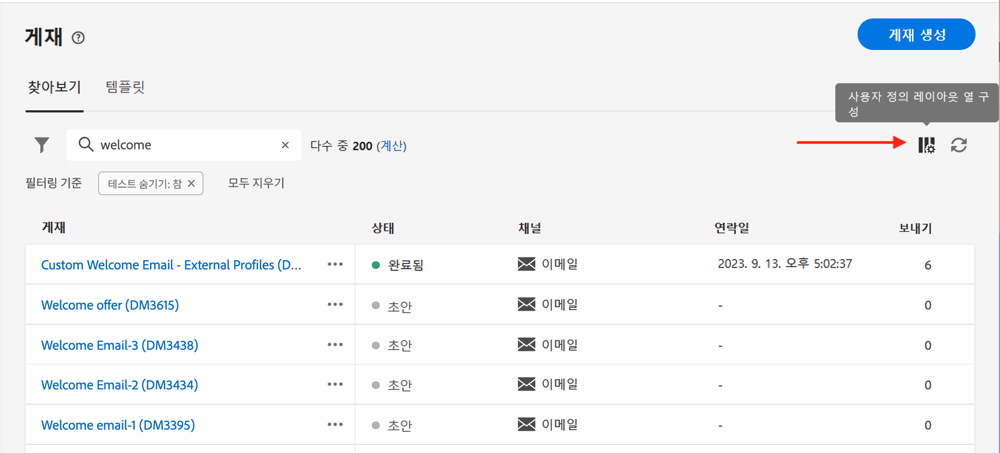
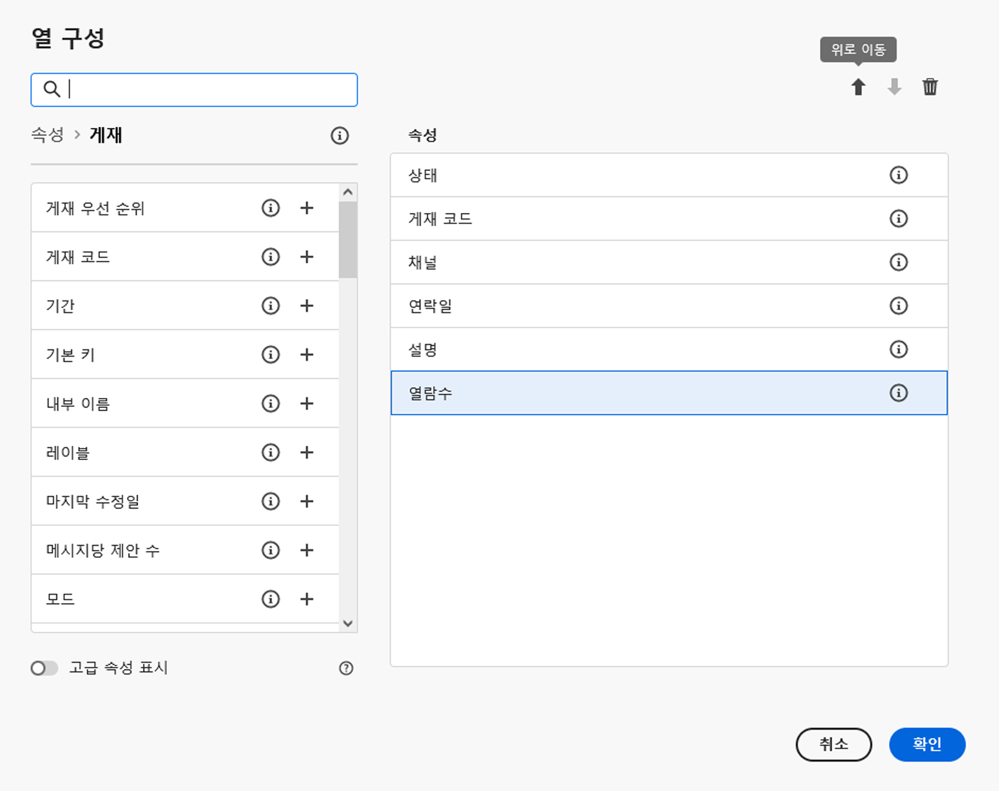
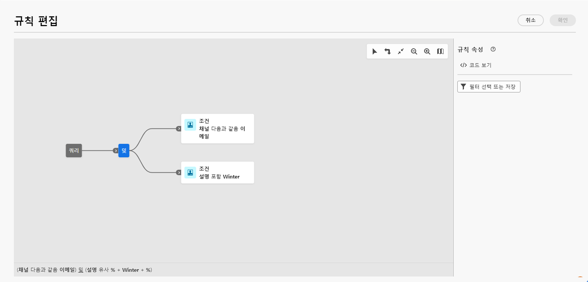

# 목록 검색 및 필터링 {#list-screens}

왼쪽 탐색 메뉴의 링크 대부분은 다음과 같은 객체 목록을 표시합니다. **게재** 또는 **캠페인**. 이러한 목록 화면 중 일부는 읽기 전용입니다. 목록 표시를 사용자 지정하고 아래에 자세히 설명된 대로 이러한 목록을 필터링할 수 있습니다.

필터를 제거하려면 **모두 지우기** 단추를 클릭합니다.

## 목록 화면 사용자 지정 {#custom-lists}

목록은 열에 표시됩니다. 열 구성을 변경하여 추가 정보를 표시할 수 있습니다. 이렇게 하려면 **사용자 지정 레이아웃에 대한 열 구성** 목록 오른쪽 위 모서리에 있는 아이콘.

{width="70%" align="left" zoomable="yes"}

다음에서 **열 구성** 열을 표시하거나 추가하거나 제거하고 표시되는 순서를 변경합니다.

예를 들어, 다음 설정의 경우:

{width="70%" align="left" zoomable="yes"}

이 목록에는 다음 열이 표시됩니다.

{width="70%" align="left" zoomable="yes"}

사용 **고급 속성 표시** 현재 목록의 속성을 모두 보려면 전환하십시오. [자세히 알아보기](#adv-attributes)

## 데이터 정렬 {#sort-lists}

열 머리글을 클릭하여 목록의 항목을 정렬할 수도 있습니다. 목록이 해당 열에 정렬되어 있음을 나타내는 화살표(위 또는 아래)가 표시됩니다.

숫자 또는 날짜 열의 경우 **위로** 화살표는 목록이 오름차순으로 정렬되고 **아래로** 화살표는 내림차순을 나타냅니다. 문자열 또는 영숫자 열의 경우 값이 알파벳순으로 나열됩니다.

## 기본 제공 필터 {#list-built-in-filters}

항목을 더 빨리 찾으려면 검색 창을 사용하거나 상황별 기준에 따라 목록을 필터링할 수 있습니다.

{width="70%" align="left" zoomable="yes"}

예를 들어 상태, 채널, 연락 날짜 또는 폴더에 대해 게재를 필터링할 수 있습니다. 테스트를 숨길 수도 있습니다.

## 맞춤형 필터{#list-custom-filters}

데이터에 대한 사용자 정의 필터를 만들려면 필터 하단으로 이동하여 **규칙 추가** 단추를 클릭합니다.

속성을 드래그 앤 드롭하여 **고급 필터** 화면.

{width="70%" align="left" zoomable="yes"}

사용 **고급 속성 표시** 현재 목록의 속성을 모두 보려면 전환하십시오. [자세히 알아보기](#adv-attributes)

## 고급 속성 사용 {#adv-attributes}

>[!CONTEXTUALHELP]
>id="acw_attributepicker_advancedfields"
>title="고급 속성 표시"
>abstract="대부분의 일반적인 속성만 기본적으로 속성 목록에 표시됩니다. 이 토글을 사용하여 고급 속성으로 필터를 빌드합니다."

속성 목록 및 필터 구성 화면에는 기본적으로 가장 일반적인 속성만 표시됩니다. 다음으로 설정된 속성 `advanced` 데이터 스키마의 속성은 구성 화면에서 숨겨집니다.

활성화 **고급 속성 표시** 현재 목록에 사용 가능한 모든 속성을 보려면 전환하십시오. 속성 목록이 즉시 업데이트됩니다.
