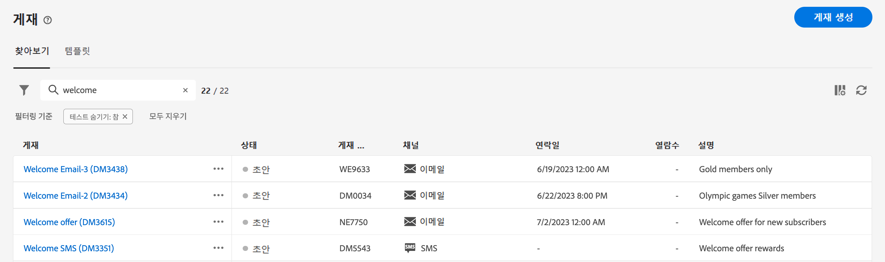
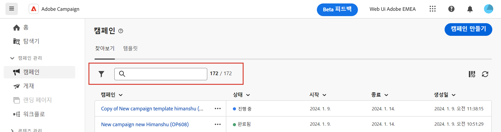

# 목록 찾아보기, 검색 및 필터링 {#list-screens}

왼쪽 탐색 메뉴의 대부분 링크에는 **게재** 또는 **캠페인** 목록 등 오브젝트 목록이 표시됩니다. 이들 중 일부 목록 화면은 읽기 전용입니다. 아래 설명대로 목록 표시를 사용자 정의하고 해당 목록을 필터링할 수 있습니다.

필터를 제거하려면 **모두 지우기** 버튼을 클릭합니다.

## 목록 화면 사용자 정의 {#custom-lists}

목록은 열에 표시됩니다. 열 구성을 변경하여 추가 정보를 표시할 수 있습니다. 이렇게 하려면 목록의 오른쪽 상단에 있는 **사용자 정의 레이아웃에 대한 열 구성** 아이콘을 클릭합니다.

{width="70%" align="left" zoomable="yes"}

**열 구성** 화면에서 열을 추가 또는 제거하고 열이 표시되는 순서를 변경합니다.

예를 들어 이 설정의 경우

{width="70%" align="left" zoomable="yes"}

목록에는 다음 열이 표시됩니다.

{width="70%" align="left" zoomable="yes"}

## 데이터 정렬 {#sort-lists}

열 머리글을 클릭하여 목록의 항목을 정렬할 수도 있습니다. 목록이 해당 열에 정렬되어 있음을 나타내는 화살표(위 또는 아래)가 표시됩니다.

숫자 또는 날짜 열의 경우 **위쪽** 화살표는 목록이 오름차순으로 정렬됨을 나타내고 **아래쪽** 화살표는 내림차순으로 정렬됨을 나타냅니다. 문자열 또는 영숫자 열의 경우 값이 알파벳순으로 나열됩니다.

## 내장 필터 {#list-built-in-filters}

검색 창을 사용하거나 상황별 기준에 따라 목록을 필터링하여 항목을 더 빨리 찾을 수 있습니다.

{width="70%" align="left" zoomable="yes"}

예를 들어 상태, 채널, 연락일 또는 폴더에서 게재를 필터링할 수 있습니다. 테스트를 숨길 수도 있습니다.

## 사용자 정의 필터{#list-custom-filters}

데이터에 사용자 정의 필터를 만들려면 필터 하단으로 이동하고 **규칙 추가** 버튼을 클릭하여 규칙 빌더에 액세스합니다.

에서 필터 기준을 정의하고 결합합니다. **고급 필터** 화면.

{width="70%" align="left" zoomable="yes"}

사용자 지정 필터는 Campaign 쿼리 모델러로 디자인되었습니다. 사용 방법에 대한 자세한 내용은에서 확인할 수 있습니다 [이 섹션](../query/query-modeler-overview.md).

<!--
## Use advanced attributes {#adv-attributes}

>[!CONTEXTUALHELP]
>id="acw_attributepicker_advancedfields"
>title="Display advanced attributes"
>abstract="Only the most common attributes are displayed by default in the attribute list. Activate the **Display advanced attributes** toggle to see all available attributes for the current list in the left palette of the rule builder, such as nodes, groupings, 1-1 links, 1-N links."

>[!CONTEXTUALHELP]
>id="acw_rulebuilder_advancedfields"
>title="Rule builder advanced fields"
>abstract="Only the most common attributes are displayed by default in the attribute list. Activate the **Display advanced attributes** toggle to see all available attributes for the current list in the left palette of the rule builder, such as nodes, groupings, 1-1 links, 1-N links."

>[!CONTEXTUALHELP]
>id="acw_rulebuilder_properties_advanced"
>title="Rule builder advanced attributes"
>abstract="Only the most common attributes are displayed by default in the attribute list. Activate the **Display advanced attributes** toggle to see all available attributes for the current list in the left palette of the rule builder, such as nodes, groupings, 1-1 links, 1-N links."

Only most common attributes are displayed by default in the attribute list and filter configuration screens. Attributes which were set as `advanced` attributes in the data schema are hidden from the configuration screens. 

Activate the **Display advanced attributes** toggle to see all available attributes for the current list in the left palette of the rule builder, such as nodes, groupings, 1-1 links, 1-N links. The attribute list is updated instantly.

{width="70%" align="left" zoomable="yes"}
-->