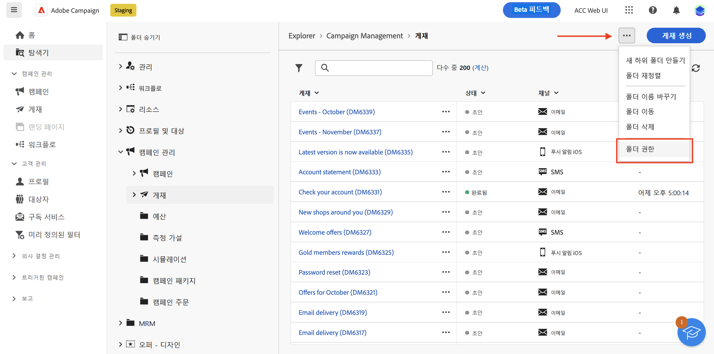
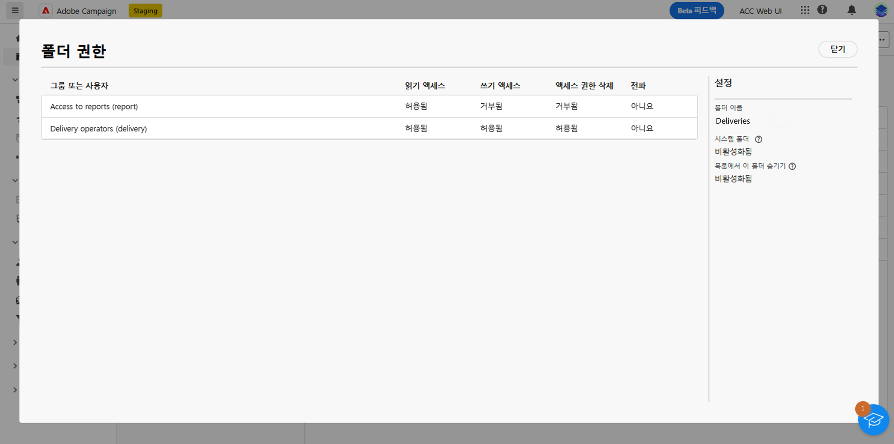
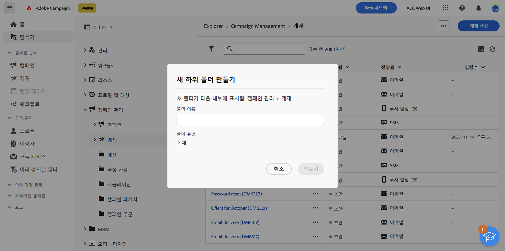
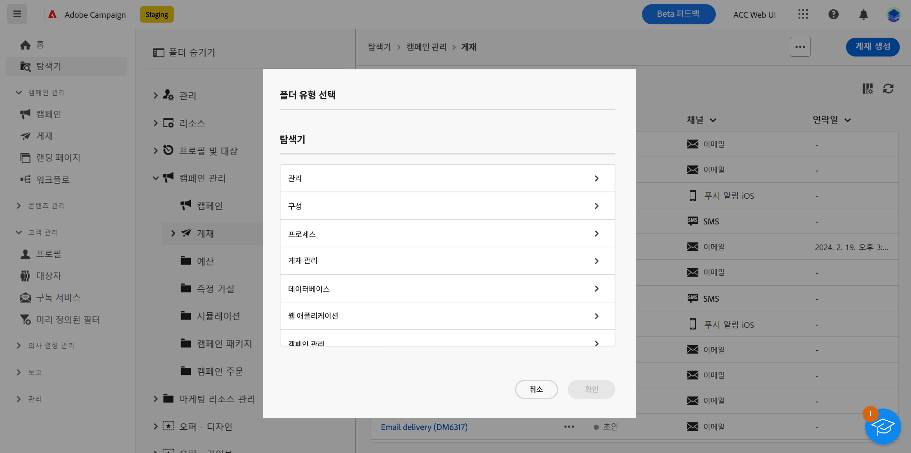
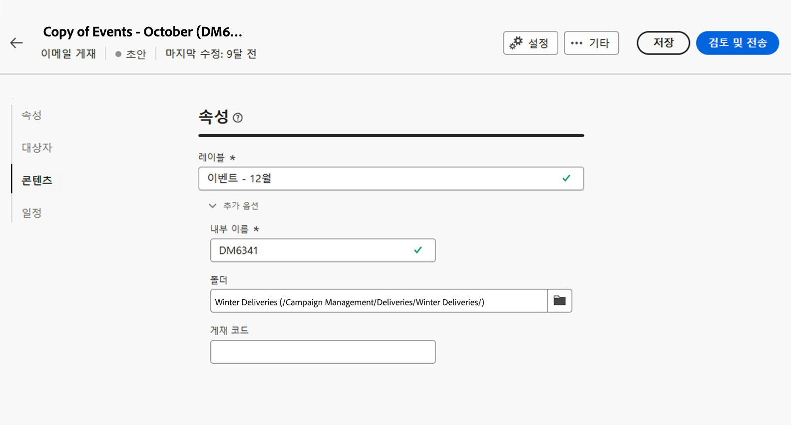

# 액세스 및 권한 {#access-and-permissions}

>[!CONTEXTUALHELP]
>id="acw_explorer_permissions_create"
>title="권한 필요"
>abstract="오브젝트를 만들려면 먼저 관리자가 권한을 부여해야 합니다."

>[!CONTEXTUALHELP]
>id="acw_audiences_read_only"
>title="이 대상자는 읽기 전용입니다."
>abstract="이 대상자를 편집할 권한이 없습니다. 필요한 경우 관리자에게 액세스 권한을 요청하십시오."

>[!CONTEXTUALHELP]
>id="acw_subscription_services_read_only"
>title="이 서비스는 읽기 전용입니다."
>abstract="이 서비스를 편집할 권한이 없습니다. 필요한 경우 관리자에게 액세스 권한을 요청하십시오."

>[!CONTEXTUALHELP]
>id="acw_recipients_readonlyprofile"
>title="수신자 읽기 전용 프로필"
>abstract="이 프로필을 편집할 권한이 없습니다. 필요한 경우 관리자에게 액세스 권한을 요청하십시오."

>[!CONTEXTUALHELP]
>id="acw_campaign_read_only"
>title="이 캠페인은 읽기 전용입니다."
>abstract="이 캠페인을 편집할 권한이 없습니다. 필요한 경우 관리자에게 액세스 권한을 요청하십시오."

>[!CONTEXTUALHELP]
>id="acw_deliveries_read_only"
>title="이 게재는 읽기 전용입니다."
>abstract="이 게재를 편집할 권한이 없습니다. 필요한 경우 관리자에게 액세스 권한을 요청하십시오."

>[!CONTEXTUALHELP]
>id="acw_wf_read_only"
>title="이 워크플로는 읽기 전용입니다."
>abstract="이 워크플로를 편집할 권한이 없습니다. 필요한 경우 관리자에게 액세스 권한을 요청하십시오."

액세스 제어를 통해 게재, 수신자 또는 워크플로와 같은 주요 목록의 오브젝트 및 데이터에 대한 액세스를 제한할 수 있습니다. 이러한 제한 사항은 **탐색기**&#x200B;의 탐색 트리에도 적용됩니다. 또한 사용자 인터페이스에서 오브젝트를 생성, 삭제, 복제 및 편집하려면 권한이 필요합니다.

액세스 제어는 Campaign 클라이언트 콘솔에서 관리됩니다. Campaign Web의 모든 권한은 Campaign 클라이언트 콘솔 권한과 동기화됩니다. Campaign 관리자만 사용자 권한을 정의하고 수정할 수 있습니다. 사용자 권한에 대한 자세한 내용은 [Campaign v8 (클라이언트 콘솔) 설명서](https://experienceleague.adobe.com/docs/campaign/campaign-v8/admin/permissions/gs-permissions.html?lang=ko){target="_blank"}를 참조하십시오.

Campaign Web 사용자 인터페이스를 탐색할 때 주어진 권한에 따라 데이터, 오브젝트 및 기능에 액세스할 수 있습니다. 예를 들어 폴더에 대한 액세스 권한이 없으면 해당 폴더를 볼 수 없습니다. 권한은 오브젝트 및 데이터 관리에도 영향을 미칩니다. 특정 폴더에 대한 쓰기 권한이 없으면 사용자 인터페이스에서 표시되더라도 해당 폴더에서 게재를 생성할 수 없습니다.

## 권한 보기 {#view-permissions}

**탐색기**&#x200B;에서 각 폴더에 대한 권한을 검색할 수 있습니다. 이러한 권한은 클라이언트 콘솔에서 설정되며 Campaign 데이터에 대한 액세스를 구성하고 제어하는 &#x200B;&#x200B;데 사용됩니다.

폴더에 대한 권한을 보려면 다음 단계를 따르십시오.

1. **탐색기** 왼쪽 탐색 메뉴에서 폴더를 선택합니다.
1. 오른쪽 상단에 있는 세 개의 점을 클릭하고 **폴더 권한**&#x200B;을 선택합니다.

   {zoomable="yes"}{width="70%" align="left" zoomable="yes"}

1. 아래와 같이 화면에서 자세한 내용을 확인하십시오.

   {zoomable="yes"}{width="70%" align="left" zoomable="yes"}

   그룹 또는 운영자는 선택한 폴더에 저장된 데이터에 대한 읽기, 쓰기 및/또는 삭제 권한을 가질 수 있습니다.

   **전파** 옵션이 활성화되면 폴더에 정의된 모든 권한이 모든 하위 폴더에 적용됩니다. 이러한 권한은 각 하위 폴더에 대해 오버로드될 수 있습니다.

   **시스템 폴더** 옵션이 활성화되면 권한에 관계없이 모든 운영자에 대해 액세스가 허용됩니다.

폴더 권한에 대한 자세한 내용은 [Campaign v8 (클라이언트 콘솔) 설명서](https://experienceleague.adobe.com/docs/campaign/campaign-v8/admin/permissions/folder-permissions.html?lang=ko){target="_blank"}를 참조하십시오.

## 폴더 작업 {#folders}

>[!CONTEXTUALHELP]
>id="acw_folder_properties"
>title="폴더 속성"
>abstract="폴더 속성"

>[!CONTEXTUALHELP]
>id="acw_folder_security"
>title="폴더 보안"
>abstract="폴더 보안"

>[!CONTEXTUALHELP]
>id="acw_folder_restrictions"
>title="폴더 제한 사항"
>abstract="폴더 제한 사항"

>[!CONTEXTUALHELP]
>id="acw_folder_schedule"
>title="폴더 일정"
>abstract="폴더 일정"

폴더를 만들고, 이름을 바꾸고, 순서를 변경하고, 이동하여 구성 요소 및 데이터를 정리할 수 있습니다. 또한 동일한 메뉴에서 폴더를 삭제할 수 있습니다.

>[!CAUTION]
>
>폴더를 삭제하면 해당 폴더에 저장된 모든 데이터도 삭제됩니다.

폴더를 만들려면 다음 단계를 따르십시오.

1. **탐색기** 왼쪽 탐색 메뉴에서 폴더를 선택합니다.
1. 오른쪽 상단에 있는 세 개의 점을 클릭하고 **새 폴더 만들기**&#x200B;를 선택합니다.
1. 폴더 이름을 입력합니다.

   {zoomable="yes"}{width="70%" align="left" zoomable="yes"}

1. 폴더 유형을 선택합니다. 기본적으로 이 예에서는 상위 폴더 유형인 “게재”가 선택됩니다. 폴더 유형을 변경하려면 폴더 아이콘을 클릭하고 다른 유형을 선택하십시오.

   {zoomable="yes"}{width="70%" align="left" zoomable="yes"}

1. **만들기**&#x200B;를 클릭합니다.

   폴더가 현재 폴더의 하위 폴더로 추가됩니다. 새 폴더를 찾아 해당 폴더에 직접 구성 요소를 만듭니다. 또한 게재에 대해 아래와 같이 속성의 **추가 옵션** 섹션에 있는 임의의 폴더에서 구성 요소를 만들고 해당 새 폴더에 저장할 수도 있습니다.

   {zoomable="yes"}{width="70%" align="left" zoomable="yes"}
