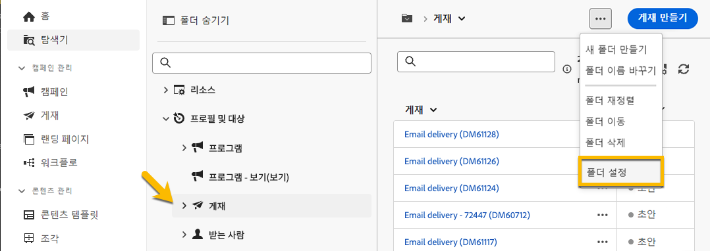
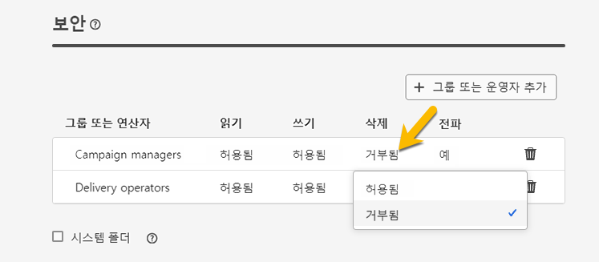

# 권한 {#permissions}

Adobe Campaign의 각 사용자는 애플리케이션에서 특정 권한과 제한을 갖습니다. 사용자는 운영자 그룹에 속할 수 있으며 그룹의 권한을 상속받을 수 있습니다.

운영자는 권한에 따라 다음과 같은 작업을 수행할 수 있습니다.

* 특정 기능 액세스
* 특정 데이터 액세스
* 특정 액션(만들기, 수정, 삭제) 액세스

Adobe Campaign에서 권한을 설정하는 자세한 절차는 [Adobe Campaign v8(콘솔) 설명서](https://experienceleague.adobe.com/ko/docs/campaign/campaign-v8/admin/permissions/gs-permissions){target="_blank"}에서 확인할 수 있습니다.

## 폴더에 대한 권한 {#folder-permissions}

권한에 따라 **[!UICONTROL 폴더 설정]**&#x200B;에서 폴더의 권한을 보고 관리할 수 있습니다.

게재 폴더의 예는 아래와 같습니다.

{zoomable="yes"}

**[!UICONTROL 폴더 설정]** 의 **[!UICONTROL 보안]** 섹션에서 폴더에 접근할 수 있는 운영자 또는 그룹을 조회 및 관리(추가 또는 삭제)할 수 있습니다.

{zoomable="yes"}

권한을 직접 클릭하여 **[!UICONTROL 허용]** 또는 **[!UICONTROL 거부됨]**&#x200B;으로 변경할 수 있습니다.

{zoomable="yes"}

>[!NOTE]
>
>쓰기 권한이 있는 폴더가 하나 이상 없는 객체를 만들 수 없습니다.
>
>관리자가 아니어도 조각을 만들 수 있지만 적어도 하나의 &quot;콘텐츠 시각적 조각&quot; 폴더에 대한 쓰기 권한이 있어야 합니다. 그렇지 않으면 시각적 조각을 만들 수 없습니다.

**[!UICONTROL 전파]** 옵션이 활성화되면 폴더에 정의된 모든 권한이 모든 하위 폴더에 적용됩니다. 이러한 권한은 각 하위 폴더에 대해 재정의될 수 있습니다.

**[!UICONTROL 시스템 폴더]** 옵션을 선택하면 권한에 관계없이 모든 운영자에 대해 액세스가 허용됩니다.

[Adobe Campaign 콘솔에서 폴더에 대한 권한을 관리](https://experienceleague.adobe.com/ko/docs/campaign/campaign-v8/admin/permissions/folder-permissions){target="_blank"}할 수도 있습니다.

Campaign Web 사용자 인터페이스의 모든 권한은 Campaign 클라이언트 콘솔 권한과 동기화됩니다.