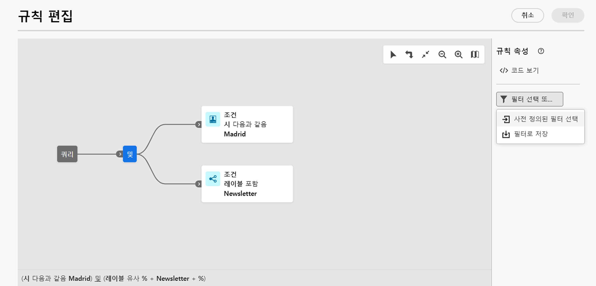
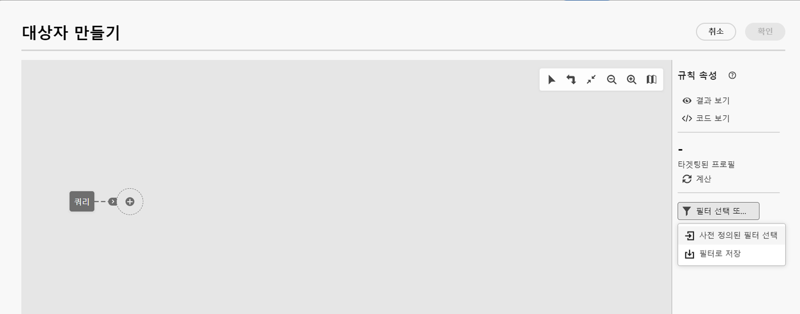
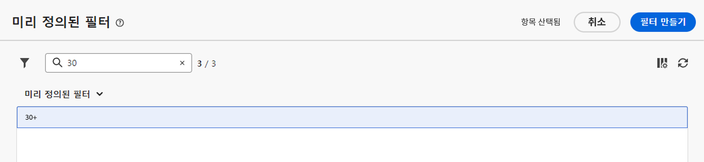

# 미리 정의된 필터 작업 {#predefined-filters}

>[!CONTEXTUALHELP]
>id="acw_homepage_learning_card4"
>title="미리 정의된 필터 관리"
>abstract="이제 Campaign Web은 특정 요구 사항에 맞게 미리 정의된 필터를 손쉽게 관리하고 맞춤화할 수 있는 사용자 친화적인 인터페이스를 제공합니다. 한 번 제작하여 나중에 사용할 수 있도록 저장합니다."

<!--TO REMOVE BELOW-->
>[!CONTEXTUALHELP]
>id="acw_homepage_card4"
>title="미리 정의된 필터 관리"
>abstract="이제 Campaign Web은 특정 요구 사항에 맞게 미리 정의된 필터를 손쉽게 관리하고 맞춤화할 수 있는 사용자 친화적인 인터페이스를 제공합니다. 한 번 제작하여 나중에 사용할 수 있도록 저장합니다."

<!--TO REMOVE ABOVE-->

>[!CONTEXTUALHELP]
>id="acw_predefined-filters-dashboard"
>title="미리 정의된 필터"
>abstract="이제 Campaign Web은 특정 요구 사항에 맞게 미리 정의된 필터를 손쉽게 관리하고 맞춤화할 수 있는 사용자 친화적인 인터페이스를 제공합니다. 한 번 제작하여 나중에 사용할 수 있도록 저장합니다."

미리 정의된 필터는 나중에 사용할 수 있도록 제작하여 저장되는 사용자 정의 필터입니다. 예를 들어 데이터 목록을 필터링하거나 게재 대상자를 생성할 때와 같이 쿼리 모델러를 사용한 필터링 작업 중에 단축키로 사용할 수 있습니다.

기존 내장 필터를 사용하여 데이터의 특정 하위 집합에 액세스하거나 미리 정의된 필터를 직접 만들어 저장할 수 있습니다.

>[!IMPORTANT]
>
>해당 버전의 제품에서는 규칙을 작성하거나 게재 대상을 선택하거나 워크플로에서 대상자를 구성할 때 일부 미리 정의된 필터를 사용자 인터페이스에서 사용할 수 없습니다. 일반적인 사용은 가능합니다. [자세히 알아보기](guardrails.md#predefined-filters-filters-guardrails-limitations)

## 미리 정의된 필터 만들기 {#create-predefined-filter}

>[!CONTEXTUALHELP]
>id="acw_predefined-filters-creation"
>title="미리 정의된 필터 만들기"
>abstract="미리 정의된 필터의 레이블을 입력하고 해당 레이블이 적용되는 테이블을 선택합니다. 추가 옵션을 열어 설명을 추가하고 이 필터를 즐겨찾기로 설정합니다. 그런 다음 &#39;규칙 만들기&#39; 버튼을 사용하여 필터링 조건을 정의합니다."

>[!CONTEXTUALHELP]
>id="acw_predefined-filters-rules"
>title="사전에 정의된 필터 규칙 만들기"
>abstract="&#39;규칙 만들기&#39; 버튼을 사용하여 사용자 정의 필터의 필터링 조건을 정의할 수 있습니다."

### 쿼리 모델러에서 필터 만들기 {#create-from-rule-builder}

나중에 사용할 수 있도록 [쿼리 모델러](../query/query-modeler-overview.md)에서 사용자 정의 필터를 저장할 수 있습니다. 다음 단계를 수행하십시오.

1. 쿼리 모델러를 열고 필터링 조건을 정의합니다. 아래 예에서는 마드리드에 거주하고 뉴스레터를 구독하는 수신자를 필터링합니다.
1. **필터 선택 또는 저장** 버튼을 클릭하고 **필터로 저장**&#x200B;을 선택합니다.

   

1. **새 필터 만들기**&#x200B;를 선택하고 해당 필터의 이름 및 설명을 입력합니다.

   

   필요한 경우 필터를 즐겨찾기로 저장할 수 있습니다. [이 섹션](#fav-filter)에서 자세히 알아보십시오.

1. **확인**&#x200B;을 클릭하여 변경 내용을 저장합니다.

이제 사용자 정의 필터를 **미리 정의된 필터** 목록에서 사용할 수 있으며 모든 Campaign 사용자가 액세스할 수 있습니다.

### 필터 목록에서 필터 만들기 {#create-filter-from-list}

왼쪽 메뉴의 **미리 정의된 필터** 항목에서 필터를 생성할 수 있습니다. 이렇게 하려면 아래 단계를 수행합니다.

1. 왼쪽 메뉴에서 **미리 정의된 필터** 항목을 탐색합니다.
1. **필터 만들기** 버튼을 클릭합니다.
1. 필터 이름을 입력하고 **문서 유형** 필드에서 필터가 적용되는 스키마를 선택합니다. 기본 스키마는 `Recipients(nms)`입니다.

1. 필터에 대한 규칙을 정의합니다. 예를 들어 30일 이상 지난 프로필입니다.

   

1. 변경 내용을 저장합니다.

   

해당 필터가 미리 정의된 필터 목록에 추가됩니다. 필요한 경우 필터를 즐겨찾기로 저장할 수 있습니다. [이 섹션](#fav-filter)에서 자세히 알아보십시오.

## 필터를 즐겨찾기로 저장 {#fav-filter}

미리 정의된 필터를 생성할 때 해당 미리 정의된 필터를 즐겨찾기에서 보려면 **즐겨찾기로 저장** 옵션을 활성화할 수 있습니다.

필터를 즐겨찾기로 저장하면 아래와 같이 필터 생성 목록의 **자주 사용하는 필터** 섹션에서 모든 사용자가 사용할 수 있습니다.

{width="30%" align="left"}

## 미리 정의된 필터 사용 {#use-predefined-filter}

규칙 속성을 정의할 때 미리 정의된 필터를 사용할 수 있습니다. 사전 정의된 필터에 액세스하려면 다음을 선택합니다. **사용자 정의 필터 선택** 쿼리 모델러의 드롭다운에 있는 옵션입니다.

그런 다음 현재 컨텍스트에 사용 가능한 미리 정의된 필터의 전체 목록에 액세스할 수 있습니다.

또한 드롭다운의 **자주 사용하는 필터** 섹션에서 사용할 수 있는 필터 단축키를 사용할 수 있습니다. [이 섹션](#fav-filter)에서 즐겨찾기에 대해 자세히 알아보십시오.

예를 들어 미리 정의된 필터로 대상자를 빌드하려면 다음 단계를 따르십시오.

1. 왼쪽 메뉴에서 **대상자** 항목을 탐색합니다.
1. **대상자 만들기** 버튼을 클릭합니다.
1. 대상자 이름을 입력하고 **대상자 만들기** 버튼을 클릭합니다.
1. **쿼리** 활동을 선택하고 오른쪽 창에서 **대상자 만들기** 버튼을 클릭합니다.

   

1. **필터 선택 또는 저장 버튼**&#x200B;에서 **사용자 정의 필터 선택** 옵션을 선택합니다.

   

1. 대상자를 만드는 데 사용할 미리 정의된 필터를 찾아 선택하고 확인합니다.

   

1. 이 필터의 규칙 속성을 검토하고 확인합니다.

   이제 필터가 **쿼리** 활동에서 쿼리로 사용됩니다.

   

1. 변경 사항을 저장하고 **시작** 버튼을 클릭하여 대상자를 빌드하고 대상자 목록에서 사용할 수 있도록 합니다.

## 미리 정의된 필터 관리 {#manage-predefined-filter}

미리 정의된 필터는 모두 왼쪽 탐색 메뉴의 전용 항목에 그룹화됩니다.

이 목록에서 위에서 설명한 대로 새 필터를 생성하고 다음과 같은 작업을 수행할 수 있습니다.

* 기존 필터를 편집하고 규칙 및 속성 변경
* 미리 정의된 필터 복제
* 미리 정의된 필터 삭제

대상자를 빌드할 때 빠르게 액세스할 수 있도록 미리 정의된 필터를 즐겨찾기로 추가할 수 있습니다. [이 섹션](#fav-filter)에서 자세히 알아보십시오.

<!--
## Built-in predefined filters {#ootb-predefined-filter}

Campaign comes with a set of predefined filters, built from the client console. These filters can be used to define your audiences, and rules. They must not be modified.
-->
