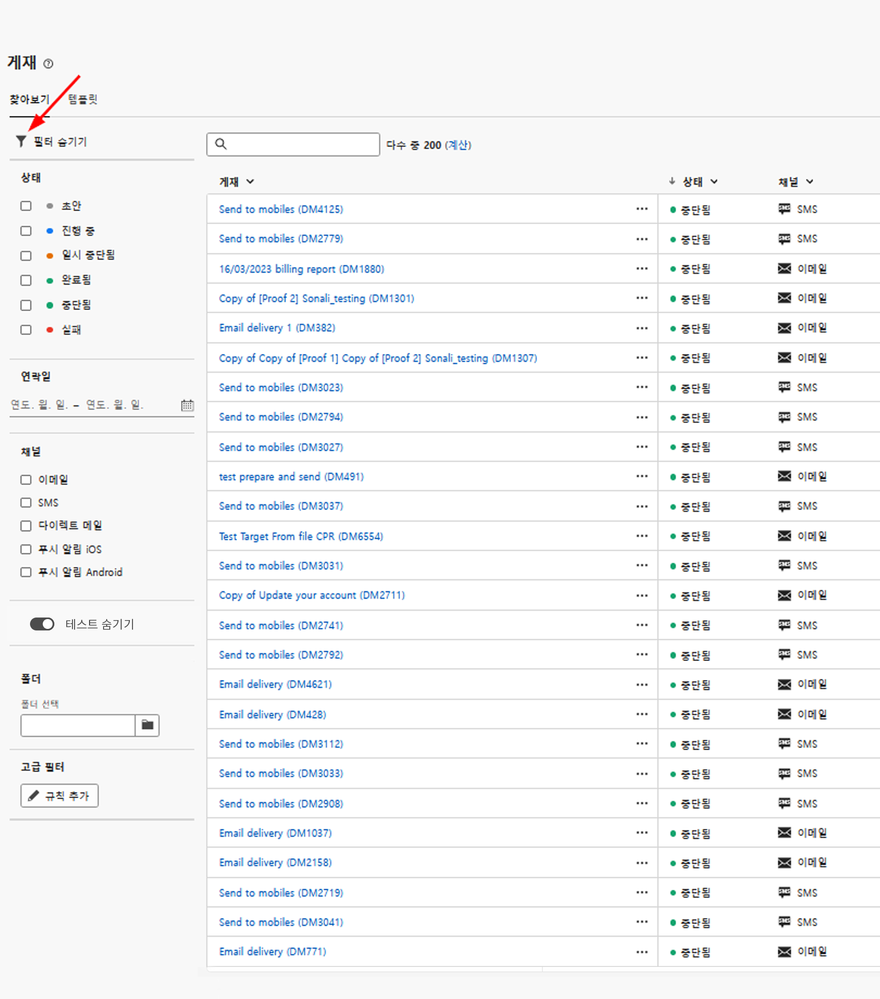
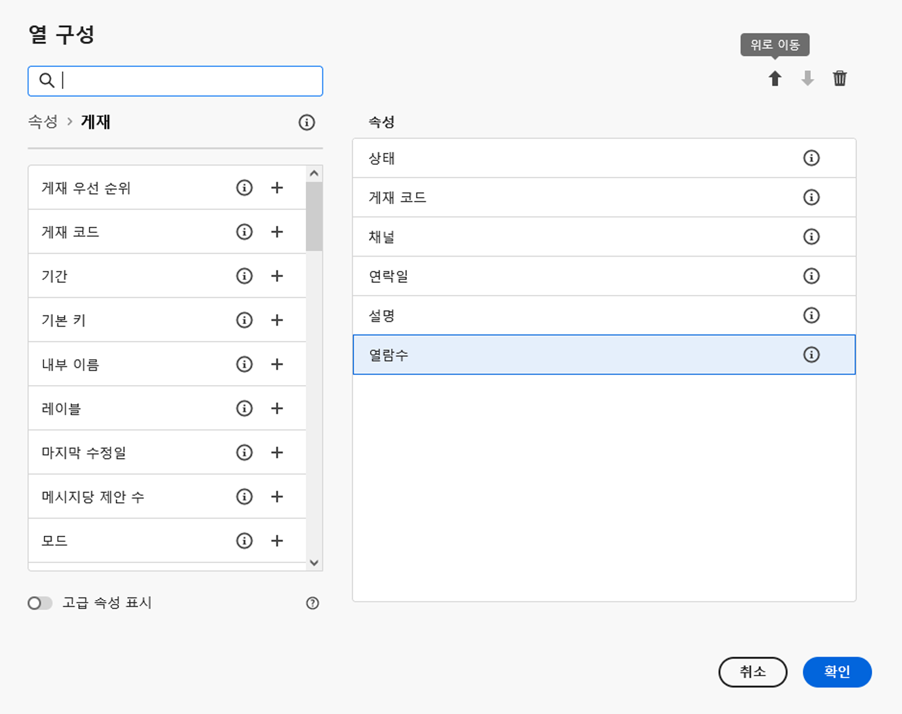
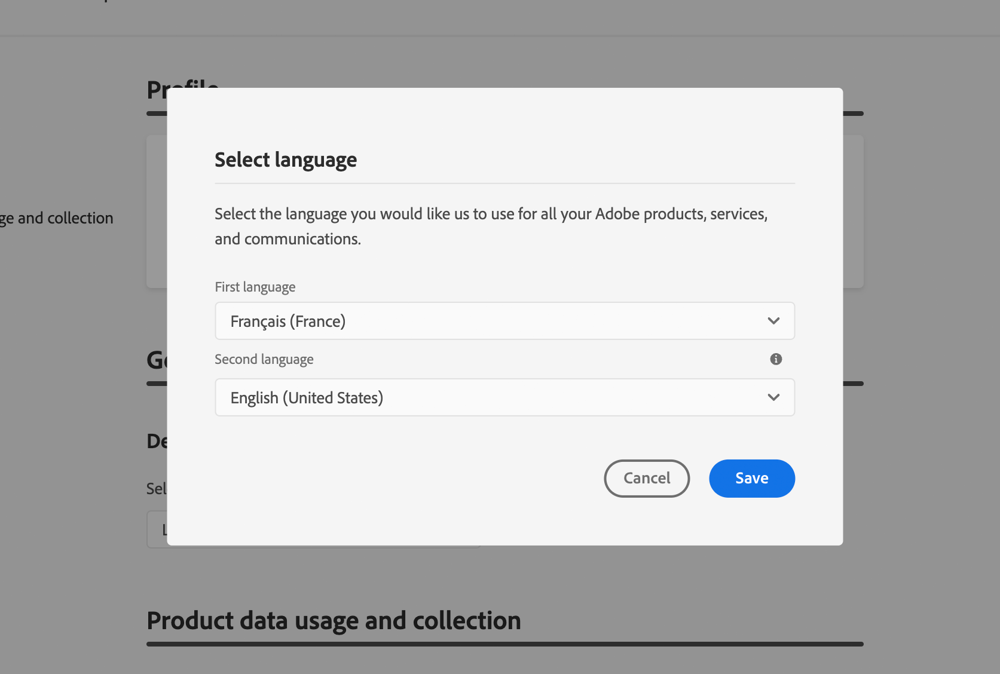

# 인터페이스 살펴보기 {#user-interface}

>[!CONTEXTUALHELP]
>id="acw_homepage_learnmore"
>title="인터페이스 살펴보기"
>abstract="새로운 Campaign v8 웹 인터페이스는 통합적이고 직관적이며 일관된 사용자 경험을 제공합니다."

새로운 Campaign v8 웹 인터페이스는 마케팅 캠페인 디자인과 게재를 간소화하는 현대적이고 직관적인 사용자 경험을 제공합니다. 이 새로운 인터페이스는 Adobe Experience Platform과 통합되었습니다.

<!--
Key concepts when browsing the user interface are common with Adobe Experience Platform. Refer to [Adobe Experience Platform documentation](https://experienceleague.adobe.com/docs/experience-platform/landing/platform-ui/ui-guide.html#adobe-experience-platform-ui-guide) for more details.
-->

>[!NOTE]
>
>이 설명서는 제품 사용자 인터페이스의 최신 변경 사항을 반영하도록 자주 업데이트됩니다. 그러나 일부 스크린샷은 사용자 인터페이스와 약간 다를 수 있습니다.

<!--
* console + web interface (overview, why use each of them)
* web UI made up of read-only lists that can be configured, show how to add columns
-->

## 왼쪽 탐색 메뉴

왼쪽의 링크를 탐색하여 Campaign v8 웹 기능에 액세스합니다. 여러 링크에는 정렬 및 필터링할 수 있는 객체 목록이 표시됩니다. 필요한 모든 정보를 표시하도록 열을 구성할 수도 있습니다. 다음 보기 [섹션](#list-screens). 전자 메일 게재 목록을 제외한 모든 목록 화면은 읽기 전용입니다. 편집/볼 목록 항목을 클릭하면 알파에서 사용할 수 없습니다. 모든 목록은 향후 버전에서 편집할 수 있습니다. 왼쪽 탐색 메뉴에 표시되는 항목은 사용자 권한에 따라 다릅니다.

### 홈

이 화면에는 기본 Campaign v8 웹 기능에 빠르게 액세스할 수 있는 주요 링크 및 리소스가 포함되어 있습니다. 다음 **최근 항목** 목록은 최근에 만들고 수정된 게재에 대한 바로 가기를 제공합니다. 이 목록에는 작성 및 수정 날짜 및 상태가 표시됩니다.

<!--
* Banner
* KPIs on email channel (cross-deliveries): open rate, delivery rate, etc
* Recent items
* Learning cards
-->

홈 페이지의 하위 섹션에서 Campaign v8 웹 키 도움말 페이지에 액세스합니다.

<!--
show global KPIs, recent items + left menu to access features)
CONTROL PANEL not alpha
Global report not alpha
-->

### 탐색기

>[!CONTEXTUALHELP]
>id="acw_explorer"
>title="탐색기"
>abstract="다음 **탐색기** 메뉴에는 클라이언트 콘솔에 있는 것과 동일한 폴더 계층 구조가 표시됩니다. 모든 Campaign v8 구성 요소, 폴더 및 스키마를 찾아봅니다. 전자 메일 게재 목록을 제외한 모든 목록 화면은 읽기 전용입니다."

다음 **탐색기** 메뉴에는 클라이언트 콘솔에 있는 것과 동일한 폴더 계층 구조가 표시됩니다. 모든 Campaign v8 구성 요소, 폴더 및 스키마를 찾아봅니다. 전자 메일 게재 목록을 제외한 모든 목록 화면은 읽기 전용입니다.

탐색기에 표시되는 항목은 사용자 권한에 따라 다릅니다.

목록 화면에서와 마찬가지로, 디스플레이를 개인화하여 필요한 모든 정보를 표시하도록 열을 구성할 수 있습니다. 다음 보기 [섹션](#list-screens).

Campaign 탐색기에 대한 자세한 내용은 다음을 참조하십시오 [설명서](https://experienceleague.adobe.com/docs/campaign/campaign-v8/new/ac-ui/campaign-ui.html#ac-explorer-ui){target="_blank"}.
<!--
Explorer' menu in web UI to navigate through console content: console navtree second view in addition to the left menu lists with filters. The Explorer gives the real folder hierarchy from the console. Make sure you find your deliveries in sub-folders. All lists can be accessed in read-only. No Create/Edit. You can configure lists (colums). All schema fields, linked tables are available. 

If you need to view your lists of recipients (age, gender), transactions or live transactional messages. To view each/edit -> console.

Navtree view depends on permissions (same as console).
-->

### 캠페인 관리

>[!CONTEXTUALHELP]
>id="acw_campaigns_list"
>title="캠페인"
>abstract="캠페인 목록입니다. 시작/종료/마지막 수정 날짜와 같은 유용한 정보와 해당 상태를 볼 수 있습니다. 상태 또는 시작/종료 날짜별로 목록을 필터링할 수 있습니다. 캠페인 템플릿도 사용할 수 있습니다. 이 목록은 읽기 전용입니다."

>[!CONTEXTUALHELP]
>id="acw_deliveries_list"
>title="게재"
>abstract="게재 목록을 탐색합니다. 상태, 마지막 수정 날짜 및 주요 KPI를 볼 수 있습니다. 상태, 연락 날짜 또는 채널별로 목록을 필터링할 수 있습니다. 이메일 게재를 클릭하여 대시보드를 엽니다. 다른 항목은 읽기 전용입니다. 게재 템플릿도 사용할 수 있습니다."

* **캠페인** - 캠페인 목록입니다. 기본적으로 시작/종료/마지막 수정 날짜와 해당 상태를 볼 수 있습니다. 상태 또는 시작/종료 날짜별로 목록을 필터링할 수 있습니다. 캠페인 템플릿도 사용할 수 있습니다. 이 목록은 읽기 전용입니다.

* **게재** - 게재 목록을 살펴봅니다. 기본적으로 상태, 마지막 수정 날짜 및 주요 KPI를 볼 수 있습니다. 상태, 연락 날짜 또는 채널별로 목록을 필터링할 수 있습니다. 이메일 게재 를 클릭하여 해당 대시보드를 열어 게재 세부 사항에 대한 개요를 확인합니다. 다른 채널에서의 게재는 읽기 전용입니다. 게재 템플릿은 읽기 전용 모드에서도 사용할 수 있습니다. 클라이언트 콘솔을 사용하여 편집할 수 있습니다. 다음 보기 [설명서](https://experienceleague.adobe.com/docs/campaign/campaign-v8/campaigns/send/create-templates.html){target="_blank"}.

   를 사용하십시오 **추가 작업** 버튼을 클릭하여 게재를 삭제하거나 복제합니다.

   {width="70%" align="left"}

### 고객 관리

>[!CONTEXTUALHELP]
>id="acw_recipients_list"
>title="수신자"
>abstract="수신자 데이터베이스에 액세스합니다. 이메일 주소, 이름 및 성 등 유용한 정보를 볼 수 있습니다. 이 목록은 읽기 전용입니다."

>[!CONTEXTUALHELP]
>id="acw_audiences_list"
>title="대상자"
>abstract="대상자 목록입니다. 유형, 원본, 생성/마지막 수정 날짜 및 레이블을 볼 수 있습니다. 목록을 원본별로 필터링할 수 있습니다. 이 목록은 읽기 전용입니다."

>[!CONTEXTUALHELP]
>id="acw_subscriptions_list"
>title="구독 목록"
>abstract="구독 목록을 검색합니다. 해당 유형, 모드 및 레이블을 볼 수 있습니다. 이 목록은 읽기 전용입니다."

>[!CONTEXTUALHELP]
>id="acw_targeting_workflow_list"
>title="타겟팅 워크플로우"
>abstract="Campaign 워크플로우 목록에 액세스합니다. 상태, 마지막/다음 처리 날짜 및 환경을 볼 수 있습니다. 상태, 마지막 처리 날짜 및 워크플로우 유형별로 목록을 필터링할 수 있습니다. 워크플로우 템플릿도 사용할 수 있습니다. 이 목록은 읽기 전용입니다."

* **수신자** - 수신자 데이터베이스에 액세스합니다. 기본적으로 이메일 주소, 이름 및 성을 볼 수 있습니다. 이 목록은 읽기 전용입니다.
* **대상** - 대상자 목록입니다. 기본적으로 유형, 원본, 생성/마지막 수정 날짜 및 레이블을 볼 수 있습니다. 목록을 원본별로 필터링할 수 있습니다. 이 목록은 읽기 전용입니다.
* **구독 목록** - 구독 목록을 검색합니다. 기본적으로 유형, 모드 및 레이블을 볼 수 있습니다. 이 목록은 읽기 전용입니다.
* **타겟팅 워크플로우** - Campaign 워크플로우 목록에 액세스합니다. 기본적으로 상태, 마지막/다음 처리 날짜 및 환경을 볼 수 있습니다. 상태, 마지막 처리 날짜 및 워크플로우 유형별로 목록을 필터링할 수 있습니다. 워크플로우 템플릿도 사용할 수 있습니다. 이 목록은 읽기 전용입니다.

### 의사 결정 관리

>[!CONTEXTUALHELP]
>id="acw_offers_list"
>title="오퍼"
>abstract="상호 작용 오퍼 목록을 탐색합니다. 기본적으로 상태, 시작/종료 날짜 및 환경을 볼 수 있습니다. 상태 및 시작/종료 날짜별로 목록을 필터링할 수 있습니다. 오퍼 템플릿을 사용할 수도 있습니다. 이 목록은 읽기 전용입니다."

* **오퍼** - 상호 작용 오퍼 목록을 살펴봅니다. 기본적으로 상태, 시작/종료 날짜 및 환경을 볼 수 있습니다. 상태 및 시작/종료 날짜별로 목록을 필터링할 수 있습니다. 오퍼 템플릿을 사용할 수도 있습니다. 이 목록은 읽기 전용입니다.

## 상단 표시줄

인터페이스 상단 표시줄에서는 다음 작업을 수행할 수 있습니다.

* 알파 테스터로 피드백 공유
* 조직과 인스턴스 간 전환
* Adobe Experience Cloud 애플리케이션 간 전환
* 도움말 페이지에 액세스하고 지원 센터에 문의하여 피드백을 공유하십시오. 검색 필드에서 도움말 문서와 비디오를 검색할 수 있습니다.

{width="70%" align="left"}
<!--
Org / Sub-org switcher to switch between instances. Only one for Alpha. Later: intermerdiate screen with Control Panel (beta). if v8 + ACS with one card per ACS instance. Maybe quickly explain the menu for Alpha?
-->

## 목록 화면 구성 {#list-screens}

예를 들어 왼쪽 탐색 메뉴의 몇 가지 링크 **게재** 또는 **캠페인**, 객체 목록을 표시합니다. 이러한 목록 화면은 이메일 게재 목록을 제외하고 읽기 전용입니다.

항목을 더 빨리 찾기 위해 검색 막대를 사용하거나 상황별 기준에 따라 목록을 필터링할 수 있습니다.

{width="70%" align="left"}

목록이 열에 표시됩니다. 열 구성을 변경하여 추가 정보를 표시할 수 있습니다. 이렇게 하려면 목록의 오른쪽 위 모서리에 있는 아이콘을 클릭합니다. 열을 추가하거나 제거하고 열을 표시하는 순서를 변경할 수 있습니다.

{width="70%" align="left"}

열 헤더를 클릭하여 목록에서 항목을 정렬할 수 있습니다. 목록이 해당 열에 정렬되었음을 나타내는 화살표가 표시됩니다(위쪽 또는 아래쪽). 숫자 또는 날짜 열의 경우 위쪽 화살표는 목록이 오름차순으로 정렬되었음을 나타내고, 아래쪽 화살표는 내림차순을 나타냅니다. 문자열 또는 영숫자 열의 경우 값은 알파벳 순서로 나열됩니다.

## 상황별 도움말 및 온보딩 안내서

인터페이스에서 상황별 도움말을 사용할 수 있습니다. 사용 가능한 경우 **?** 아이콘 을 클릭하여 도움말 정보 및 관련 설명서 링크를 표시합니다.

{width="70%" align="left"}

Campaign v8 웹을 시작하는 데 도움이 되는 온보딩 안내서도 제공됩니다. 오른쪽 아래 모서리에 있는 아이콘을 클릭하고, 사용 가능한 단계별 시나리오 중 하나를 선택한 다음, 지침을 따르십시오.

{width="70%" align="left"}

## 지원되는 브라우저 {#browsers}

Campaign v8 Web은 최신 버전의 Google Chrome, Safari 및 Microsoft Edge에서 최적으로 작동하도록 설계되었습니다. 이전 버전 또는 다른 브라우저에서 특정 기능을 사용하는 데 문제가 있을 수 있습니다.

## 언어 환경 설정 {#language-pref}

Campaign v8 Web은 현재 다음 언어로 사용할 수 있습니다.

<table>
<tr>
<td>

영어(미국) - 미국

프랑스어 - FR

독일어 - DE

이탈리아어 - IT

</td>
<td>

스페인어 - ES

포르투갈어(브라질) - PTBR

일본어 - JP

</td>
<td>

한국어 - KR

중국어 간체 - CHS

중국어 번체 - CHT

</td>
</tr>
</table>

기본 인터페이스 언어는 사용자 프로필에 지정된 기본 언어로 결정됩니다.

언어를 변경하려면 다음을 수행하십시오.

1. 오른쪽 상단에서 프로필 아이콘을 클릭한 다음 을 선택합니다 **기본 설정**.

   {width="70%" align="left"}

1. 그런 다음 이메일 주소 아래에 표시되는 언어를 클릭합니다.

   

1. 기본 언어를 선택하고 을(를) 클릭합니다 **저장**. 사용 중인 구성 요소가 첫 번째 언어로 현지화되지 않은 경우 두 번째 언어를 선택할 수 있습니다.

   

<!--
## Supported browsers {#browsers}

Adobe Campaign interface is designed to work optimally in the latest version of Google Chrome. You might have trouble using certain features on older versions or other browsers.
-->

<!--
######## This part stores the contextualHelp definition for WebUI BETA ###########
######## These blocks should be dispatched in the appropriate pages when available ###########
######## PLEASE DO NOT DELETE ###########
-->

>[!CONTEXTUALHELP]
>id="acw_sms_report_overview"
>title="SMS 보고서 요약"
>abstract="TBD"

>[!CONTEXTUALHELP]
>id="acw_push_report_overview"
>title="푸시 보고서 요약"
>abstract="TBD"

>[!CONTEXTUALHELP]
>id="acw_import_from_a_file"
>title="파일에서 대상자 가져오기"
>abstract="TBD"

>[!CONTEXTUALHELP]
>id="acw_import_from_a_file_formatting"
>title="형식 설정"
>abstract="TBD"

>[!CONTEXTUALHELP]
>id="acw_import_from_a_file_columns"
>title="열 설정"
>abstract="TBD"

>[!CONTEXTUALHELP]
>id="acw_push_notification_template"
>title="푸시 알림 템플릿"
>abstract="TBD"
