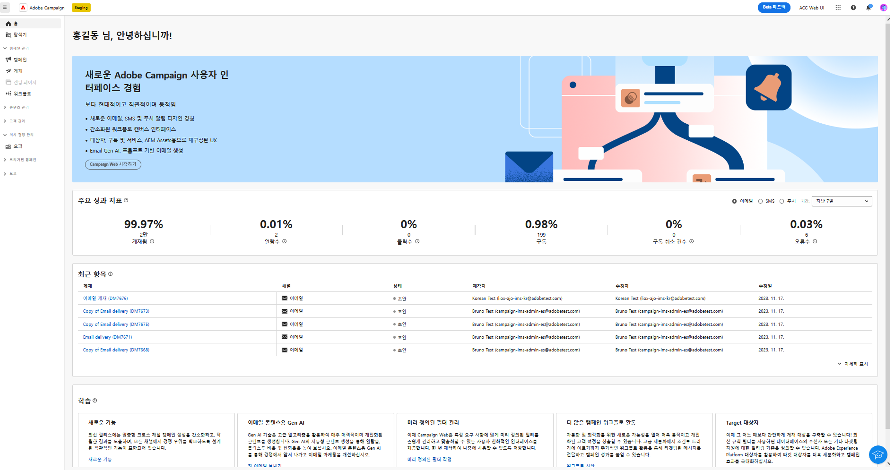
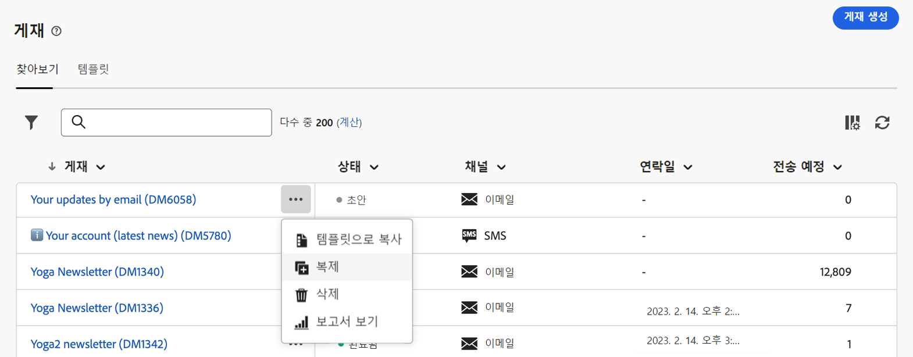
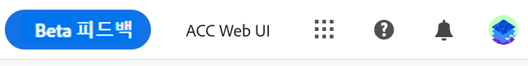

# 인터페이스 살펴보기 {#user-interface}

>[!CONTEXTUALHELP]
>id="acw_homepage_learnmore"
>title="인터페이스 살펴보기"
>abstract="새로운 Campaign v8 Web 인터페이스는 통합되고 직관적이며, 일관된 사용자 경험을 제공합니다."

새로운 Campaign v8 Web 인터페이스는 현대적이고 직관적인 사용자 경험을 제공하여 마케팅 캠페인 디자인 및 게재를 간소화합니다. 이 새로운 인터페이스는 Adobe Experience Cloud 앱 및 솔루션과 통합됩니다.

>[!NOTE]
>
>이 설명서는 제품 사용자 인터페이스의 최신 변경 내용을 반영하여 자주 업데이트됩니다. 단, 실제 사용자 인터페이스와 약간 다른 스크린샷도 있습니다.

## 왼쪽 탐색 메뉴 {#user-interface-left-nav}

왼쪽에 있는 링크를 찾아 Campaign v8 Web 기능에 액세스합니다. 여러 링크에 정렬 및 필터링할 수 있는 오브젝트 목록이 표시됩니다. 필요한 모든 정보를 표시하도록 열을 구성할 수도 있습니다. 이 [섹션](#list-screens)을 참조하십시오. 일부 목록 화면은 읽기 전용입니다. 왼쪽 탐색 메뉴와 목록에 표시되는 항목은 사용자 권한에 따라 다릅니다. 의 권한에 대해 자세히 알아보기 [이 섹션](permissions.md).

### 홈 {#user-interface-home}

이 화면에는 주요 Campaign v8 Web 기능에 빠르게 액세스할 수 있는 주요 링크와 리소스가 포함되어 있습니다.

**최근 항목** 목록은 최근 생성 및 수정된 게재에 대한 단축키를 제공합니다. 이 목록에는 채널, 상태, 소유자, 생성 및 수정일이 표시됩니다.

**주요 성과 지표**&#x200B;를 사용하면 공통 KPI를 통해 플랫폼 효율성을 확인할 수 있습니다. 에서 이러한 KPI에 대해 자세히 알아보십시오. [이 페이지](../reporting/kpis.md).

홈 페이지 **학습** 섹션의 Campaign v8 Web 주요 도움말 페이지에 액세스합니다.

### 탐색기 {#user-interface-explorer}

>[!CONTEXTUALHELP]
>id="acw_explorer"
>title="탐색기"
>abstract="**탐색기** 메뉴에는 클라이언트 콘솔의 폴더 계층과 동일한 폴더 계층과 함께 모든 Campaign 구성 요소 및 오브젝트가 표시됩니다. 이 메뉴에서 모든 Campaign v8 구성 요소, 폴더, 스키마를 찾아보고, 관련 권한을 확인하고, 폴더 및 하위 폴더를 생성할 수 있습니다."

**탐색기** 메뉴에는 클라이언트 콘솔의 폴더 계층과 동일한 폴더 계층과 함께 모든 Campaign 리소스 및 오브젝트가 표시됩니다. 모든 Campaign v8 구성 요소, 폴더 및 스키마를 찾아보고 게재, 워크플로 및 캠페인을 만듭니다.

에 표시되는 항목 **탐색기** 사용자 권한에 따라 다릅니다.  적절한 권한이 있는 경우 폴더 및 하위 폴더를 추가할 수도 있습니다. 의 권한에 대해 자세히 알아보기 [이 섹션](permissions.md).

모든 목록 화면과 마찬가지로 디스플레이를 개인화하고 필요한 모든 정보를 표시하도록 열을 구성할 수 있습니다. 이 [섹션](#list-screens)을 참조하십시오.

Campaign 탐색기, 폴더 계층 및 리소스에 대한 자세한 내용은 [Campaign v8(콘솔) 설명서](https://experienceleague.adobe.com/docs/campaign/campaign-v8/new/campaign-ui.html#ac-explorer-ui){target="_blank"}를 참조하십시오.

### 캠페인 관리 {#user-interface-campaign-management}

캠페인 관리 섹션에서 마케팅 캠페인, 게재 및 워크플로에 액세스할 수 있습니다.

* **캠페인** - 다음은 캠페인 목록 및 캠페인 템플릿입니다. 기본적으로 각 캠페인의 경우 시작/종료/생성/마지막 수정 일자, 현재 상태와 캠페인을 만든 캠페인 운영자 이름을 볼 수 있습니다. 상태, 시작/종료 일자, 폴더별로 목록을 필터링하거나, 고급 필터를 만들어 자신만의 필터링 기준을 정의할 수 있습니다. [이 섹션에서](../campaigns/gs-campaigns.md) 캠페인에 대해 자세히 알아보십시오.

* **게재** - 게재 목록을 탐색합니다. 기본적으로 상태, 마지막 수정 일자 및 주요 KPI를 볼 수 있습니다. 상태, 연락일 또는 채널별로 목록을 필터링할 수 있습니다. 이메일 게재를 클릭하여 대시보드를 열고 게재 세부 정보의 개요를 확인합니다. 다른 채널의 게재는 읽기 전용입니다. [이 섹션에서](../msg/gs-messages.md) 게재에 대해 자세히 알아보십시오.

  **추가 작업**&#x200B;을 사용하여 게재를 삭제하거나 복제할 수 있습니다.

  {width="70%" align="left"}

* **워크플로** - 이 화면에서 워크플로 전체 목록 및 워크플로 템플릿에 액세스할 수 있습니다. 상태, 마지막/다음 실행 일자를 확인하고 새 워크플로 또는 새 워크플로 템플릿을 만들 수 있습니다. 다른 오브젝트와 동일한 기준으로 목록을 필터링할 수 있습니다. 또한 캠페인에 속한 워크플로 또는 속하지 않은 워크플로를 필터링할 수 있습니다. [이 섹션에서](../workflows/gs-workflows.md) 워크플로에 대해 자세히 알아보십시오.

### 고객 관리 {#user-interface-customer-management}

고객 관리 섹션에서 수신자, 대상자 및 구독을 볼 수 있습니다. 이 목록은 읽기 전용입니다.

* **수신자** - 수신자 데이터베이스에 액세스합니다. 기본적으로 이메일 주소, 이름 및 성을 볼 수 있습니다. 에서 수신자에 대해 자세히 알아보기 [이 섹션](../audience/about-recipients.md).
* **대상자** - 대상자 목록입니다. 기본적으로 유형, 원본, 생성/마지막 수정 일자 및 레이블을 볼 수 있습니다. 원본을 기준으로 목록을 필터링할 수 있습니다. 의 대상자 및 목록에 대해 자세히 알아보기 [이 섹션](../audience/about-recipients.md).
* **구독** - 구독 목록을 탐색합니다. 기본적으로 해당 유형, 모드 및 레이블을 볼 수 있습니다. [Adobe Campaign v8(콘솔) 설명서](https://experienceleague.adobe.com/docs/campaign/campaign-v8/campaigns/send/subscriptions.html){target="_blank"}에서 구독 및 구독 취소를 관리하는 방법에 대해 알아봅니다.

### 의사 결정 관리 {#decision-management}

>[!CONTEXTUALHELP]
>id="acw_offers_list"
>title="오퍼"
>abstract="를 사용하여 콘솔에서 생성된 오퍼 및 오퍼 템플릿 목록을 탐색합니다. **상호 작용** 모듈. 이 목록은 읽기 전용입니다."
>additional-url="https://experienceleague.adobe.com/docs/campaign-web/v8/msg/offers.html" text="게재에 오퍼 추가"

고객 관리 섹션에서 오퍼 및 오퍼 템플릿을 볼 수 있습니다. 이 목록은 읽기 전용입니다.

* **오퍼** - 콘솔에서 만든 오퍼 및 오퍼 템플릿 목록을 사용하여 탐색 **상호 작용** 모듈. 기본적으로 상태, 시작/종료 일자 및 환경을 볼 수 있습니다. 상태 및 시작/종료 날짜별로 목록을 필터링할 수 있습니다. 오퍼 템플릿도 사용할 수 있습니다.

에서 이메일 및 SMS로 오퍼를 만들고 보내는 방법을 알아봅니다. [이 섹션](../content/offers.md).

## 상단 막대 {#top-bar}

인터페이스의 상단 막대를 사용하여 다음과 같은 작업을 수행할 수 있습니다.

* 베타 테스터로서 피드백 공유
* 조직과 인스턴스 간 전환
* Adobe Experience Cloud 애플리케이션 간 전환
* 도움말 페이지 액세스, 지원 팀에 문의 및 피드백 공유 검색 필드에서 도움말 문서와 비디오를 검색할 수 있습니다.

{width="50%" align="left"}
<!--
Org / Sub-org switcher to switch between instances. Only one for Alpha. Later: intermerdiate screen with Control Panel (beta). if v8 + ACS with one card per ACS instance. Maybe quickly explain the menu for Alpha?
-->

## 상황별 도움말 {#user-interface-help}

인터페이스에서 상황별 도움말을 사용할 수 있습니다. 사용 가능한 경우 `?` 아이콘을 클릭하면 도움말 정보 및 관련 설명서 링크가 표시됩니다.

{width="40%" align="left"}

새 Beta 버전을 사용하면 **Gen AI를 사용하는 기술 지원** 상황별 도움말에 포함되어 방대한 설명서 저장소를 손쉽게 탐색하여 설명서 검색 및 사용 방법 질문에 대한 대답 기능을 혁신적으로 개선하고 필요한 정확한 정보를 즉시 정확하게 찾아냅니다.

Campaign Gen AI의 기능 덕분에 이 도우미는 사용자 경험을 혁신하여 정보를 검색하고 문제를 쉽게 해결할 수 있습니다. 복잡한 작업에서 지침을 찾거나 광범위한 문서를 탐색하는 경우, Gen AI를 사용하는 Knowledge Assistant는 모든 상호 작용에 있어 탁월한 효율성과 정확성을 제공하는 최고의 동반자입니다.

[이 섹션](using-ai.md)에서 자세히 알아보십시오.

## 지원되는 브라우저 {#browsers}

Campaign v8 Web은 최신 버전의 Google Chrome, Safari 및 Microsoft Edge에서 최적으로 작동하도록 디자인되었습니다. 이전 버전이나 다른 브라우저에서 특정 기능 사용 시 문제가 발생할 수 있습니다.

## 언어 환경 설정 {#language-pref}

Campaign v8 Web은 현재 다음 언어로 제공됩니다.

* 영어(미국) - EN-US
* 프랑스어 - FR
* 독일어 - DE
* 이탈리아어 - IT
* 스페인어 - ES
* 포르투갈어(브라질) - PTBR
* 일본어 - JP
* 한국어 - KR
* 중국어 간체 - CHS
* 중국어 번체 - CHT

Campaign 웹의 기본 언어는 사용자 프로필에 지정된 기본 언어로 결정됩니다. Campaign 서버 및 클라이언트 콘솔의 언어와 관련이 없습니다.

언어를 변경하려면 다음 작업을 수행하십시오.

1. 오른쪽 상단의 프로필 아이콘을 클릭한 다음 **환경 설정**&#x200B;을 선택합니다.
1. 그런 다음 이메일 주소 아래에 표시되는 언어 링크를 클릭합니다.
1. 원하는 언어를 선택하고 **저장**&#x200B;을 클릭합니다. 사용 중인 구성 요소가 첫 번째 언어로 현지화되어 있지 않은 경우 두 번째 언어를 선택할 수 있습니다.

## 어두운 테마 {#dark-theme}

프로필 아이콘에서 어두운 테마로 전환할 수 있습니다. 사용 **어두운 테마** 활성화/비활성화하려면 전환합니다.

## 자세히 알아보기 {#learn-more}

[이 페이지](list-filters.md)에서 Campaign 환경에서 사용 가능한 목록을 탐색, 검색 및 필터링하는 방법에 대해 알아보십시오.

<!--
######## This part stores the contextualHelp definition for WebUI BETA ###########
######## These blocks should be dispatched in the appropriate pages when available ###########
######## PLEASE DO NOT DELETE ###########
REFER TO 
https://wiki.corp.adobe.com/pages/viewpage.action?spaceKey=neolane&title=v8+WebUI+Contextual+Help+%3CALPHA%3E-+Official+list
-->

>[!CONTEXTUALHELP]
>id="acw_push_permission_for_segment"
>title="권한 필요"
>abstract="세그먼트를 만들려면 먼저 관리자가 권한을 부여해야 합니다."

>[!CONTEXTUALHELP]
>id="acw_push_overview_edit"
>title="권한 필요"
>abstract="세그먼트를 만들려면 먼저 관리자가 권한을 부여해야 합니다."

<!-- Workflows-->

<!-- delivery template settings-->

>[!CONTEXTUALHELP]
>id="acw_reporting_email_exportation"
>title="내보내기"
>abstract="선택한 페이지만 내보낼 수 있습니다."

>[!CONTEXTUALHELP]
>id="acw_global_reporting_sending"
>title="글로벌 보고서 전송"
>abstract="추적 보고 지표는 이 화면에 표시됩니다"

>[!CONTEXTUALHELP]
>id="acw_global_reporting_tracking"
>title="글로벌 보고서 추적"
>abstract="추적 보고 지표는 이 화면에 표시됩니다"

>[!CONTEXTUALHELP]
>id="acw_campaign_workflow_list"
>title="캠페인의 워크플로 목록"
>abstract="캠페인의 워크플로 목록"

<!-- delivery settings-->

