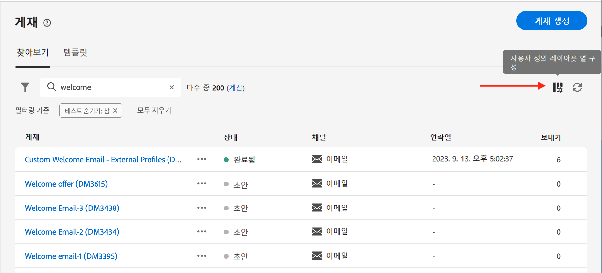
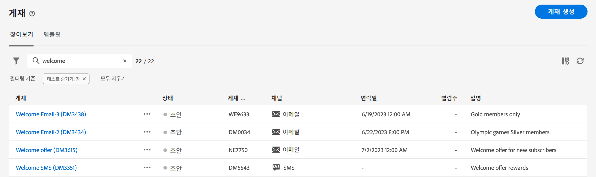
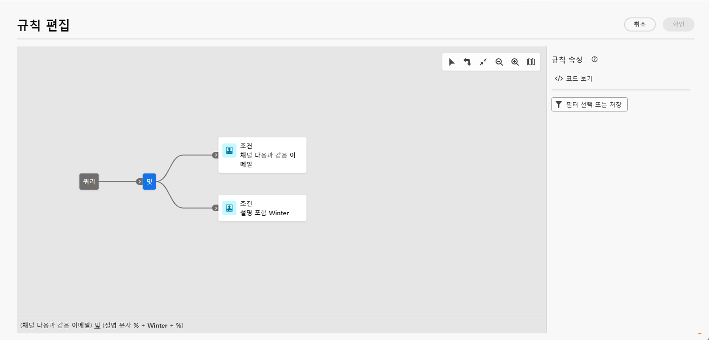

# 인터페이스 살펴보기 {#user-interface}

>[!CONTEXTUALHELP]
>id="acw_homepage_learnmore"
>title="인터페이스 살펴보기"
>abstract="새로운 Campaign v8 웹 인터페이스는 통합적이고 직관적이며 일관적인 사용자 경험을 제공합니다."

새로운 Campaign v8 Web 인터페이스는 현대적이고 직관적인 사용자 경험을 제공하여 마케팅 캠페인 디자인 및 게재를 간소화합니다. 이 새로운 인터페이스는 Adobe Experience Platform과 통합됩니다.

>[!NOTE]
>
>이 설명서는 제품 사용자 인터페이스의 최신 변경 내용을 반영하여 자주 업데이트됩니다. 단, 실제 사용자 인터페이스와 약간 다른 스크린샷도 있습니다.

## 왼쪽 탐색 메뉴 {#user-interface-left-nav}

왼쪽에 있는 링크를 찾아 Campaign v8 Web 기능에 액세스합니다. 여러 링크에 정렬 및 필터링할 수 있는 오브젝트 목록이 표시됩니다. 필요한 모든 정보를 표시하도록 열을 구성할 수도 있습니다. 이 [섹션](#list-screens)을 참조하십시오. 이메일 게재 목록을 제외한 모든 목록 화면은 읽기 전용입니다. Alpha에서는 편집/보기를 위해 목록 항목을 클릭할 수 없습니다. 향후 버전에서는 모든 목록을 편집할 수 있습니다. 왼쪽 탐색 메뉴에 표시되는 항목은 사용자 권한에 따라 다릅니다.

### 홈 {#user-interface-home}

이 화면에는 주요 Campaign v8 Web 기능에 빠르게 액세스할 수 있는 주요 링크와 리소스가 포함되어 있습니다.

**최근 항목** 목록은 최근 생성 및 수정된 게재에 대한 단축키를 제공합니다. 이 목록에는 채널, 상태, 소유자, 작성 및 수정 날짜가 표시됩니다.

다음에서 Campaign v8 웹 주요 도움말 페이지에 액세스: **학습** 섹션에 있는 마지막 항목이 될 필요가 없습니다.

### 탐색기 {#user-interface-explorer}

>[!CONTEXTUALHELP]
>id="acw_explorer"
>title="탐색기"
>abstract="다음 **탐색기** 메뉴에는 클라이언트 콘솔의 폴더 계층과 동일한 폴더 계층을 가진 모든 Campaign 구성 요소 및 개체가 표시됩니다. 모든 Campaign v8 구성 요소, 폴더 및 스키마를 탐색하고 게재, 워크플로우 및 캠페인을 만듭니다. 다른 모든 목록은 읽기 전용입니다."

다음 **탐색기** 메뉴에는 클라이언트 콘솔에 있는 것과 동일한 폴더 계층 구조를 가진 모든 Campaign 리소스 및 개체가 표시됩니다. 모든 Campaign v8 구성 요소, 폴더 및 스키마를 탐색하고 게재, 워크플로우 및 캠페인을 만듭니다. 다른 모든 목록은 읽기 전용입니다.

탐색기에 표시되는 항목은 사용자 권한에 따라 다릅니다.

모든 목록 화면과 마찬가지로 디스플레이를 개인화하고 필요한 모든 정보를 표시하도록 열을 구성할 수 있습니다. 이 [섹션](#list-screens)을 참조하십시오.

Campaign 탐색기, 폴더 계층 구조 및 리소스에 대한 자세한 내용은 다음을 참조하십시오. [Campaign v8(콘솔) 설명서](https://experienceleague.adobe.com/docs/campaign/campaign-v8/new/campaign-ui.html#ac-explorer-ui){target="_blank"}.

### 캠페인 관리 {#user-interface-campaign-management}

>[!CONTEXTUALHELP]
>id="acw_campaigns_list"
>title="캠페인"
>abstract="다음은 캠페인 목록입니다. 시작/종료/마지막 수정 일자 및 상태와 같은 유용한 정보를 볼 수 있습니다. 상태 또는 시작/종료 일자별로 목록을 필터링할 수 있습니다. “캠페인 만들기” 버튼을 클릭하여 새 캠페인을 추가합니다. 콘텐츠, 게재 및 세부 정보를 보려면 캠페인을 선택합니다. 템플릿을 보고 만들려면 “템플릿” 탭으로 이동합니다."

>[!CONTEXTUALHELP]
>id="acw_deliveries_list"
>title="게재"
>abstract="게재 목록을 탐색합니다. 상태, 연락처 및 수정 일자와 주요 KPI를 볼 수 있습니다. 상태, 연락일 또는 채널별로 목록을 필터링할 수 있습니다. “게재 만들기” 버튼을 클릭하여 새 게재를 추가합니다. 콘텐츠, 대상자 및 세부 정보를 보려면 게재를 선택합니다."

Campaign Management 섹션에서 마케팅 캠페인, 게재 및 워크플로우에 액세스할 수 있습니다.

* **캠페인** - 다음은 캠페인 목록 및 캠페인 템플릿입니다. 기본적으로 각 캠페인의 경우 시작/종료/생성/마지막 수정 일자, 현재 상태와 캠페인을 만든 캠페인 운영자 이름을 볼 수 있습니다. 상태, 시작/종료 일자, 폴더별로 목록을 필터링하거나, 고급 필터를 만들어 자신만의 필터링 기준을 정의할 수 있습니다. [이 섹션에서](../campaigns/gs-campaigns.md) 캠페인에 대해 자세히 알아보십시오.

* **게재** - 게재 목록을 탐색합니다. 기본적으로 상태, 마지막 수정 일자 및 주요 KPI를 볼 수 있습니다. 상태, 연락일 또는 채널별로 목록을 필터링할 수 있습니다. 이메일 게재를 클릭하여 대시보드를 열고 게재 세부 정보의 개요를 확인합니다. 다른 채널의 게재는 읽기 전용입니다. [이 섹션에서](../msg/gs-messages.md) 게재에 대해 자세히 알아보십시오.

  **추가 작업**&#x200B;을 사용하여 게재를 삭제하거나 복제할 수 있습니다.

  {width="70%" align="left"}

* **워크플로** - 이 화면에서 워크플로 전체 목록 및 워크플로 템플릿에 액세스할 수 있습니다. 상태, 마지막/다음 실행 일자를 확인하고 새 워크플로 또는 새 워크플로 템플릿을 만들 수 있습니다. 다른 오브젝트와 동일한 기준으로 목록을 필터링할 수 있습니다. 또한 캠페인에 속한 워크플로 또는 속하지 않은 워크플로를 필터링할 수 있습니다. [이 섹션에서](../workflows/gs-workflows.md) 워크플로에 대해 자세히 알아보십시오.

### 고객 관리 {#user-interface-customer-management}

>[!CONTEXTUALHELP]
>id="acw_recipients_list"
>title="수신자"
>abstract="수신자 데이터베이스에 액세스합니다. 이메일 주소, 이름, 성과 같은 유용한 정보를 볼 수 있습니다. 이 목록은 읽기 전용입니다."

>[!CONTEXTUALHELP]
>id="acw_audiences_list"
>title="대상자"
>abstract="다음은 대상자 목록입니다. 유형, 원본, 생성/마지막 수정 일자 및 레이블을 볼 수 있습니다. 원본을 기준으로 목록을 필터링할 수 있습니다. 이 목록은 읽기 전용입니다."

>[!CONTEXTUALHELP]
>id="acw_subscriptions_list"
>title="구독 목록"
>abstract="구독 목록을 탐색합니다. 유형, 모드 및 레이블을 볼 수 있습니다. 이 목록은 읽기 전용입니다."

고객 관리 섹션에서 수신자, 대상자 및 구독을 볼 수 있습니다. 이 목록은 읽기 전용입니다.

* **수신자** - 수신자 데이터베이스에 액세스합니다. 기본적으로 이메일 주소, 이름 및 성을 볼 수 있습니다. 에서 수신자에 대해 자세히 알아보기 [Adobe Campaign v8(콘솔) 설명서](https://experienceleague.adobe.com/docs/campaign/campaign-v8/audience/gs-audiences.html){target="_blank"}.
* **대상자** - 대상자 목록입니다. 기본적으로 유형, 원본, 생성/마지막 수정 일자 및 레이블을 볼 수 있습니다. 원본을 기준으로 목록을 필터링할 수 있습니다. 의 대상자 및 목록에 대해 자세히 알아보기 [Adobe Campaign v8(콘솔) 설명서](https://experienceleague.adobe.com/docs/campaign/campaign-v8/audience/create-audiences/create-audiences.html){target="_blank"}.
* **구독** - 구독 목록을 탐색합니다. 기본적으로 해당 유형, 모드 및 레이블을 볼 수 있습니다. 에서 구독 및 구독 취소를 관리하는 방법 알아보기 [Adobe Campaign v8(콘솔) 설명서](https://experienceleague.adobe.com/docs/campaign/campaign-v8/campaigns/send/subscriptions.html){target="_blank"}.

### 의사 결정 관리

>[!CONTEXTUALHELP]
>id="acw_offers_list"
>title="오퍼"
>abstract="상호 작용 오퍼 목록을 찾아보십시오. 기본적으로 상태, 시작/종료 일자 및 환경을 볼 수 있습니다. 상태 및 시작/종료 일자별로 목록을 필터링할 수 있습니다. 오퍼 템플릿도 사용할 수 있습니다. 이 목록은 읽기 전용입니다."

* **오퍼** - 상호 작용 오퍼 목록을 탐색합니다. 기본적으로 상태, 시작/종료 일자 및 환경을 볼 수 있습니다. 상태 및 시작/종료 일자별로 목록을 필터링할 수 있습니다. 오퍼 템플릿도 사용할 수 있습니다. 이 목록은 읽기 전용입니다.

에서 오퍼 관리를 만드는 방법을 알아봅니다. [Adobe Campaign v8(콘솔) 설명서](https://experienceleague.adobe.com/docs/campaign/campaign-v8/offers/interaction.html){target="_blank"}.

## 상단 막대

인터페이스의 상단 표시줄을 사용하여 다음을 수행합니다.

* Alpha 테스터로서 피드백 공유
* 조직과 인스턴스 간 전환
* Adobe Experience Cloud 애플리케이션 간 전환
* 도움말 페이지 액세스, 지원 팀에 문의 및 피드백 공유 검색 필드에서 도움말 문서와 비디오를 검색할 수 있습니다.

{width="70%" align="left"}
<!--
Org / Sub-org switcher to switch between instances. Only one for Alpha. Later: intermerdiate screen with Control Panel (beta). if v8 + ACS with one card per ACS instance. Maybe quickly explain the menu for Alpha?
-->

## 목록 검색 및 필터링 {#list-screens}

왼쪽 탐색 메뉴의 링크 대부분은 다음과 같은 객체 목록을 표시합니다. **게재** 또는 **캠페인**. 이러한 목록 화면 중 일부는 읽기 전용입니다. 목록 표시를 사용자 지정하고 아래에 자세히 설명된 대로 이러한 목록을 필터링할 수 있습니다.

필터를 제거하려면 **모두 지우기** 단추를 클릭합니다.

### 목록 화면 사용자 지정 {#custom-lists}

목록은 열에 표시됩니다. 열 구성을 변경하여 추가 정보를 표시할 수 있습니다. 이렇게 하려면 **사용자 지정 레이아웃에 대한 열 구성** 목록 오른쪽 위 모서리에 있는 아이콘.

{width="70%" align="left"}

다음에서 **열 구성** 열을 표시하거나 추가하거나 제거하고 표시되는 순서를 변경합니다.

예를 들어, 다음 설정의 경우:

{width="70%" align="left"}

이 목록에는 다음 열이 표시됩니다.

{width="70%" align="left"}

사용 **고급 속성 표시** 현재 목록의 속성을 모두 보려면 전환하십시오. [자세히 알아보기](#adv-attributes)

### 데이터 정렬 {#sort-lists}

열 머리글을 클릭하여 목록의 항목을 정렬할 수도 있습니다. 목록이 해당 열에 정렬되어 있음을 나타내는 화살표(위 또는 아래)가 표시됩니다.

숫자 또는 날짜 열의 경우 **위로** 화살표는 목록이 오름차순으로 정렬되고 **아래로** 화살표는 내림차순을 나타냅니다. 문자열 또는 영숫자 열의 경우 값이 알파벳순으로 나열됩니다.

### 기본 제공 필터 {#list-built-in-filters}

항목을 더 빨리 찾으려면 검색 창을 사용하거나 상황별 기준에 따라 목록을 필터링할 수 있습니다.

{width="70%" align="left"}

예를 들어 상태, 채널, 연락 날짜 또는 폴더에 대해 게재를 필터링할 수 있습니다. 테스트를 숨길 수도 있습니다.

### 맞춤형 필터{#list-custom-filters}

데이터에 대한 사용자 정의 필터를 만들려면 필터 하단으로 이동하여 **규칙 추가** 단추를 클릭합니다.

속성을 드래그 앤 드롭하여 **고급 필터** 화면.

{width="70%" align="left"}

사용 **고급 속성 표시** 현재 목록의 속성을 모두 보려면 전환하십시오. [자세히 알아보기](#adv-attributes)

### 고급 속성 사용 {#adv-attributes}

>[!CONTEXTUALHELP]
>id="acw_attributepicker_advancedfields"
>title="고급 속성 표시"
>abstract="대부분의 일반적인 속성만 기본적으로 속성 목록에 표시됩니다. 이 토글을 사용하여 고급 속성으로 필터를 빌드합니다."

속성 목록 및 필터 구성 화면에는 기본적으로 가장 일반적인 속성만 표시됩니다.

사용 **고급 속성 표시** 목록 아래에서 전환하여 현재 목록에 사용 가능한 모든 속성을 확인합니다.

## 상황별 도움말 {#contextual-help}

인터페이스에서 상황별 도움말을 사용할 수 있습니다. 사용 가능한 경우 `?` 도움말 정보 및 관련 설명서 링크를 표시하는 아이콘.

{width="70%" align="left"}

<!--An on-boarding guide is also available to help you get started with Campaign v8 Web. Click the icon in the bottom right corner, choose one of the available step-by-step scenarios, and simply follow the instructions.

{width="70%" align="left"}-->

## 지원되는 브라우저 {#browsers}

Campaign v8 Web은 최신 버전의 Google Chrome, Safari 및 Microsoft Edge에서 최적으로 작동하도록 디자인되었습니다. 이전 버전이나 다른 브라우저에서 특정 기능 사용 시 문제가 발생할 수 있습니다.

## 언어 환경 설정 {#language-pref}

Campaign v8 Web은 현재 다음 언어로 제공됩니다.

<table>
<tr>
<td>

영어(미국) - EN-US

프랑스어 - FR

독일어 - DE

이탈리아어 - IT

</td>
<td>

스페인어 - ES

포르투갈어(브라질) - PTBR

일본어 - JP

</td>
<td>

한국어 - KR

중국어 간체 - CHS

중국어 번체 - CHT

</td>
</tr>
</table>

기본 인터페이스 언어는 사용자 프로필에 지정된 기본 언어에 따라 결정됩니다.

언어를 변경하려면 다음 작업을 수행하십시오.

1. 오른쪽 상단의 프로필 아이콘을 클릭한 다음 **환경 설정**&#x200B;을 선택합니다.
1. 그런 다음 이메일 주소 아래에 표시된 언어 링크를 클릭합니다.
1. 원하는 언어를 선택하고 **저장**&#x200B;을 클릭합니다. 사용 중인 구성 요소가 첫 번째 언어로 현지화되어 있지 않은 경우 두 번째 언어를 선택할 수 있습니다.

<!--
######## This part stores the contextualHelp definition for WebUI BETA ###########
######## These blocks should be dispatched in the appropriate pages when available ###########
######## PLEASE DO NOT DELETE ###########
REFER TO 
https://wiki.corp.adobe.com/pages/viewpage.action?spaceKey=neolane&title=v8+WebUI+Contextual+Help+%3CALPHA%3E-+Official+list
-->

>[!CONTEXTUALHELP]
>id="acw_rulebuilder_advancedfields"
>title="규칙 빌더 고급 필드"
>abstract="고급 필드에서 열을 구성합니다."

>[!CONTEXTUALHELP]
>id="acw_rulebuilder_properties_advanced"
>title="규칙 빌더 고급 속성"
>abstract="고급 속성을 사용하여 규칙을 정의합니다."

>[!CONTEXTUALHELP]
>id="acw_deliveries_email_metrics_sent"
>title="전송된 지표"
>abstract="게재된 이메일 수."

>[!CONTEXTUALHELP]
>id="acw_deliveries_email_metrics_errors"
>title="오류 지표"
>abstract="오류 상태가 포함된 이메일 수."

>[!CONTEXTUALHELP]
>id="acw_email_preview_option_test_target"
>title="테스트 모집단"
>abstract="테스트 모집단 모드를 선택합니다."

>[!CONTEXTUALHELP]
>id="acw_email_preview_mode"
>title="미리보기 모드"
>abstract="기본 대상에 테스트 모집단을 포함하여 메시지를 미리 보고 테스트합니다."

>[!CONTEXTUALHELP]
>id="acw_targetdata_personalization_enrichmentdata"
>title="보강 데이터"
>abstract="TBD"

>[!CONTEXTUALHELP]
>id="acw_targetdata_personalization_dashboard"
>title="개인화"
>abstract="TBD"

>[!CONTEXTUALHELP]
>id="acw_campaign_reporting_sending"
>title="보고 전송"
>abstract="캠페인 보고에 전송 표시기를 참조하십시오."

>[!CONTEXTUALHELP]
>id="acw_campaign_reporting_tracking"
>title="보고 추적"
>abstract="캠페인 보고에 추적 표시기를 참조하십시오."

>[!CONTEXTUALHELP]
>id="acw_campaign_reporting_deliveries_overview"
>title="보고 개요"
>abstract="게재에 대한 주요 지표."

>[!CONTEXTUALHELP]
>id="acw_campaign_reporting_deliveries_target"
>title="대상 통계 보고"
>abstract="이 섹션에는 대상자에 따라 특정 지표가 표시됩니다."

>[!CONTEXTUALHELP]
>id="acw_campaign_reporting_deliveries_selection"
>title="집계된 게재 보고"
>abstract="집계된 데이터 보고서를 표시하려면 두 개 이상의 게재를 선택합니다."

>[!CONTEXTUALHELP]
>id="acw_orchestration_deduplication_fields"
>title="중복 제거 필드"
>abstract="TBD"

>[!CONTEXTUALHELP]
>id="acw_orchestration_deduplication_settings"
>title="중복 제거 설정"
>abstract="TBD"

>[!CONTEXTUALHELP]
>id="acw_orchestration_deduplication_complement"
>title="중복 제거 보완"
>abstract="TBD"

>[!CONTEXTUALHELP]
>id="acw_orchestration_dimension_complement"
>title="차원 보완"
>abstract="TBD"

>[!CONTEXTUALHELP]
>id="acw_push_permission_for_segment"
>title="권한 필요"
>abstract="세그먼트를 만들려면 먼저 관리자가 권한을 부여해야 합니다."

>[!CONTEXTUALHELP]
>id="acw_push_overview_edit"
>title="권한 필요"
>abstract="세그먼트를 만들려면 먼저 관리자가 권한을 부여해야 합니다."

>[!CONTEXTUALHELP]
>id="acw_deliveries_metrics_newquarantines"
>title="새 격리 지표"
>abstract="새 격리 지표."

>[!CONTEXTUALHELP]
>id="acw_keyindicators_delivered"
>title="게재됨"
>abstract="게재된 KPI"

>[!CONTEXTUALHELP]
>id="acw_keyindicators_opens"
>title="열람 수"
>abstract="KPI 열기"

>[!CONTEXTUALHELP]
>id="acw_keyindicators_clicks"
>title="클릭 수"
>abstract="KPI 클릭 수"

>[!CONTEXTUALHELP]
>id="acw_keyindicators_unsubscriptions"
>title="구독 취소"
>abstract="구독 취소 KPI"

>[!CONTEXTUALHELP]
>id="acw_keyindicators_spam"
>title="스팸"
>abstract="스팸 KPI"

>[!CONTEXTUALHELP]
>id="acw_keyindicators_errors"
>title="오류"
>abstract="오류 KPI"
