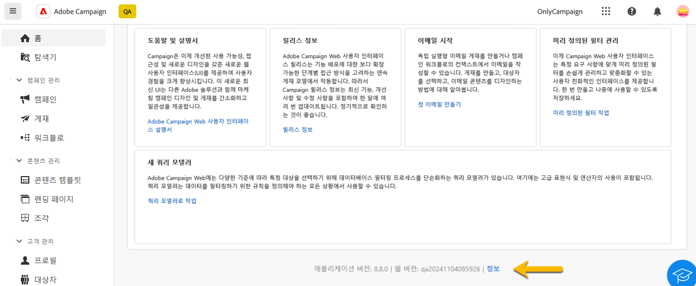
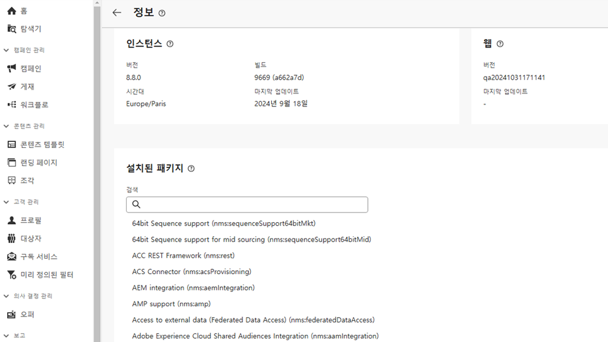

# 인터페이스 살펴보기 {#user-interface}

새로운 Adobe Campaign Web 인터페이스는 현대적이고 직관적인 사용자 경험을 제공하여 마케팅 캠페인 디자인 및 게재를 간소화합니다. 이 새로운 인터페이스는 Adobe Experience Cloud 앱 및 솔루션과 통합됩니다.

Adobe Campaign에 연결하는 방법과 Experience Cloud 탐색의 기본 사항은 [이 문서](connect-to-campaign.md)에서 알아볼 수 있습니다.

>[!NOTE]
>
>이 설명서는 제품 사용자 인터페이스의 최신 변경 내용을 반영하여 자주 업데이트됩니다. 단, 실제 사용자 인터페이스와 약간 다른 스크린샷도 있습니다.

## Campaign 홈 페이지 {#user-interface-home}

>[!CONTEXTUALHELP]
>id="acw_homepage_recent"
>title="최근 항목"
>abstract="**최근 항목** 목록은 최근에 생성되고 수정된 게재에 대한 단축키를 제공합니다. 이 목록에는 채널, 상태, 소유자, 생성 및 수정일이 표시됩니다."

Campaign 홈 페이지를 사용하면 주요 리소스, 지표, 구성 요소를 빠르고 쉽게 검색할 수 있습니다.

홈 페이지의 상단 섹션에서 릴리스 정보와 세부 설명서로 가는 링크가 있습니다. 또 제품에서 사용할 수 있는 최신 업데이트 및 새로운 기능의 자세한 내용을 볼 수 있습니다. 왼쪽 화살표를 사용하여 기능 카드를 스크롤할 수 있습니다.

{zoomable="yes"}

**주요 성과 지표**&#x200B;를 사용하면 공통 KPI를 통해 플랫폼 효율성을 확인할 수 있습니다. 이러한 KPI에 대한 자세한 내용은 [이 페이지](../reporting/kpis.md)를 참조하십시오.

**최근 항목** 목록은 최근에 생성되고 수정된 게재에 대한 단축키를 제공합니다. 이 목록에는 채널, 상태, 소유자, 생성 및 수정일이 표시됩니다. **더 보기** 링크를 클릭하면 더 많은 게재가 로드됩니다.

또한 페이지의 **학습** 섹션에서 Adobe Campaign Web 주요 도움말 페이지에 액세스할 수 있습니다.

### 정보 링크 {#user-interface-about}

>[!CONTEXTUALHELP]
>id="acw_about"
>title="정보 페이지"
>abstract="정보 페이지에서는 Adobe Campaign 인스턴스에 대한 세부 정보를 제공합니다."

>[!CONTEXTUALHELP]
>id="acw_about_instance"
>title="인스턴스 정보"
>abstract="인스턴스 섹션에서는 버전과 관련 빌드 번호를 포함하여 콘솔 클라이언트에 대한 주요 정보를 제공합니다."

>[!CONTEXTUALHELP]
>id="acw_about_web"
>title="Web 정보"
>abstract="Web 섹션에는 Campaign Web 사용자 인터페이스의 버전이 표시되며, 가능한 경우 마지막 업데이트 일자도 표시됩니다."

>[!CONTEXTUALHELP]
>id="acw_about_packages"
>title="설치된 패키지 정보"
>abstract="설치된 패키지 섹션에는 인스턴스에 있는 모든 모듈, 기능 및 통합이 나열됩니다."

페이지 하단의 **[!UICONTROL 정보]** 링크는 Adobe Campaign 인스턴스에 대한 세부 정보를 제공합니다. 해당 정보는 읽기 전용 모드로 사용할 수 있습니다.

{zoomable="yes"}

**인스턴스** 섹션에서는 **버전**&#x200B;과 관련 **빌드** 번호를 포함하여 콘솔 클라이언트에 대한 주요 정보를 제공합니다.

* **버전**&#x200B;은 사용 중인 공식 릴리스 버전을 나타냅니다.
* **빌드**&#x200B;는 해당 버전의 특정 반복을 나타냅니다.

버전 번호와 빌드 번호는 모두 문제 해결에 중요합니다. 이를 통해 사용자 환경에 어떤 기능과 수정 사항이 있는지 정확히 판단할 수 있기 때문입니다.

**Web** 섹션에는 Campaign Web 사용자 인터페이스의 버전이 표시되며, 가능한 경우 마지막 업데이트 일자도 표시됩니다. 이는 Campaign Web 사용자 인터페이스에 적용된 변경 사항이나 개선 사항을 추적하는 데 도움이 됩니다.

**설치된 패키지** 섹션에는 인스턴스에 있는 모든 모듈, 기능 및 통합이 나열됩니다. 이러한 패키지는 Adobe Campaign의 기능을 확장하며, 이를 통해 다른 Adobe 솔루션과 통합하거나 특정 워크플로를 활성화하는 등의 전문 작업을 수행할 수 있습니다. 패키지 수가 많으므로 이 섹션에서 조사를 수행하여 인스턴스에 특정 모듈이 설치되어 있는지 빠르게 확인할 수 있습니다.

{zoomable="yes"}

## 왼쪽 탐색 메뉴 {#user-interface-left-nav}

왼쪽에 있는 링크를 찾아Adobe Campaign Web 기능에 액세스합니다. 여러 링크에 정렬 및 필터링할 수 있는 오브젝트 목록이 표시됩니다. 필요한 모든 정보를 표시하도록 열을 구성할 수도 있습니다. 이 [섹션](#list-screens)을 참조하십시오. 일부 목록 화면은 읽기 전용입니다. 왼쪽 탐색 메뉴와 목록에 표시되는 항목은 사용자 권한에 따라 다릅니다. [이 섹션](permissions.md)에서 권한에 대해 자세히 알아보십시오.

### 탐색기 {#user-interface-explorer}

>[!CONTEXTUALHELP]
>id="acw_explorer"
>title="탐색기"
>abstract="**탐색기** 메뉴에는 클라이언트 콘솔의 폴더 계층과 동일한 폴더 계층과 함께 모든 Campaign 구성 요소 및 오브젝트가 표시됩니다. 이 메뉴에서 모든 Campaign v8 구성 요소, 폴더, 스키마를 찾아보고, 관련 권한을 확인하고, 폴더 및 하위 폴더를 생성할 수 있습니다."

**탐색기** 메뉴에는 클라이언트 콘솔의 폴더 계층과 동일한 폴더 계층과 함께 모든 Campaign 리소스 및 오브젝트가 표시됩니다. 모든 Campaign v8 구성 요소, 폴더 및 스키마를 찾아보고 게재, 워크플로 및 캠페인을 만듭니다.

**탐색기**&#x200B;에 표시되는 항목은 사용자 권한에 따라 다릅니다. 적절한 권한이 있는 경우 폴더 및 하위 폴더를 추가할 수도 있습니다. [이 섹션](permissions.md)에서 권한에 대해 자세히 알아보십시오.

디스플레이를 개인화하고 필요한 모든 정보를 표시하도록 열을 구성할 수 있습니다. 이 [섹션](#list-screens)을 참조하십시오. [이 섹션](permissions.md#folders)에 설명된 대로 폴더와 하위 폴더를 추가할 수도 있습니다.

Campaign 탐색기, 폴더 계층 및 리소스에 대한 자세한 내용은 [Campaign v8(콘솔) 설명서](https://experienceleague.adobe.com/docs/campaign/campaign-v8/new/campaign-ui.html?lang=ko#ac-explorer-ui){target="_blank"}를 참조하십시오.

### 캠페인 관리 {#user-interface-campaign-management}

캠페인 관리 섹션에서 마케팅 캠페인, 게재 및 워크플로에 액세스할 수 있습니다.

* **캠페인** - 다음은 캠페인 목록 및 캠페인 템플릿입니다. 기본적으로 각 캠페인의 경우 시작/종료/생성/마지막 수정 일자, 현재 상태와 캠페인을 만든 캠페인 운영자 이름을 볼 수 있습니다. 상태, 시작/종료 일자, 폴더별로 목록을 필터링하거나, 고급 필터를 만들어 자신만의 필터링 기준을 정의할 수 있습니다. [이 섹션에서](../campaigns/gs-campaigns.md) 캠페인에 대해 자세히 알아보십시오.

* **게재** - 게재 목록을 탐색합니다. 기본적으로 상태, 마지막 수정 일자 및 주요 KPI를 볼 수 있습니다. 상태, 연락일 또는 채널별로 목록을 필터링할 수 있습니다. 이메일 게재를 클릭하여 대시보드를 열고 게재 세부 정보의 개요를 확인합니다. 다른 채널의 게재는 읽기 전용입니다. [이 섹션에서](../msg/gs-messages.md) 게재에 대해 자세히 알아보십시오.

  **추가 작업**&#x200B;을 사용하여 게재를 삭제하거나 복제할 수 있습니다.

  {zoomable="yes"}{width="70%" align="left"}

* **워크플로** - 이 화면에서 워크플로 전체 목록 및 워크플로 템플릿에 액세스할 수 있습니다. 상태, 마지막/다음 실행 일자를 확인하고 새 워크플로 또는 새 워크플로 템플릿을 만들 수 있습니다. 다른 오브젝트와 동일한 기준으로 목록을 필터링할 수 있습니다. 또한 캠페인에 속한 워크플로 또는 속하지 않은 워크플로를 필터링할 수 있습니다. [이 섹션에서](../workflows/gs-workflows.md) 워크플로에 대해 자세히 알아보십시오.

### 콘텐츠 관리 {#user-interface-content-management}

콘텐츠 관리 섹션에서는 콘텐츠 템플릿과 조각을 볼 수 있습니다.

* **콘텐츠 템플릿** - 디자인 프로세스를 가속화하고 개선하기 위해 독립 실행형 템플릿을 만들어 사용자 정의 콘텐츠를 [!DNL Adobe Campaign] 쉽게 재사용할 수 있습니다. 이 기능은 이메일에서만 사용할 수 있고, 콘텐츠에 중점을 둔 작업자가 독립 실행형 템플릿에 작업하면 마케팅 작업자가 이메일 캠페인 내에서 이를 재사용하고 조정할 수 있습니다. [이 섹션](../email/create-email-templates.md)에서 자세히 알아보십시오.

* **조각** - 조각은 캠페인에서 하나 이상의 게재에 참조할 수 있는 재사용 가능한 구성 요소입니다. 조각을 수정하면 이를 사용하는 모든 콘텐츠가 업데이트됩니다. [조각을 사용한 작업 방법 알아보기](../content/fragments.md)

이 기능을 통해 여러 사용자 정의 콘텐츠 블록을 사전 빌드할 수 있으며, 마케팅 사용자는 이들 콘텐츠 블록을 사용하여 향상된 디자인 프로세스로 이메일 콘텐츠를 신속하게 조합할 수 있습니다.

### 고객 관리 {#user-interface-customer-management}

고객 관리 섹션에서는 프로필, 대상자, 구독을 볼 수 있습니다. 이 목록은 읽기 전용입니다.

* **프로필** - 프로필을 만들고 관리하며 수신자 데이터베이스에 액세스합니다. 기본적으로 이메일 주소, 이름 및 성을 볼 수 있습니다. [이 섹션](../audience/about-recipients.md)에서 프로필에 대해 자세히 알아볼 수 있습니다.
* **대상자** - 대상자 목록입니다. 기본적으로 유형, 원본, 생성/마지막 수정 일자 및 레이블을 볼 수 있습니다. 원본을 기준으로 목록을 필터링할 수 있습니다. [이 섹션](../audience/about-recipients.md)에서 대상자 및 목록에 대해 자세히 알아보십시오.
* **구독 서비스** - 구독 목록을 찾아봅니다. 기본적으로 해당 유형, 모드 및 레이블을 볼 수 있습니다. [Adobe Campaign v8(콘솔) 설명서](https://experienceleague.adobe.com/docs/campaign/campaign-v8/campaigns/send/subscriptions.html?lang=ko){target="_blank"}에서 구독 및 구독 취소를 관리하는 방법에 대해 알아봅니다.
* **미리 정의된 필터** - 미리 정의된 필터는 만들어서 나중에 사용할 수 있도록 저장하는 사용자 정의 필터입니다. 예를 들어 데이터 목록을 필터링하거나 게재 대상자를 생성할 때와 같이 쿼리 모델러를 사용한 필터링 작업 중에 단축키로 사용할 수 있습니다. [이 섹션](predefined-filters.md)에서 자세히 알아보십시오.

### 의사 결정 관리 {#decision-management}

>[!CONTEXTUALHELP]
>id="acw_offers_list"
>title="오퍼"
>abstract="**상호 작용** 모듈을 사용하여 콘솔에서 생성된 오퍼 및 오퍼 템플릿 목록을 탐색합니다. 이 목록은 읽기 전용입니다."
>additional-url="https://experienceleague.adobe.com/docs/campaign-web/v8/msg/offers.html?lang=ko" text="게재에 오퍼 추가"

의사 결정 관리 섹션에서 오퍼 및 오퍼 템플릿을 볼 수 있습니다. 이 목록은 읽기 전용입니다.

* **오퍼** - **상호 작용** 모듈을 사용하여 콘솔에서 생성된 오퍼 및 오퍼 템플릿 목록을 탐색합니다. 기본적으로 상태, 시작/종료 일자 및 환경을 볼 수 있습니다. 상태 및 시작일/종료일별로 목록을 필터링할 수 있습니다. 오퍼 템플릿도 사용할 수 있습니다.

[이 섹션](../msg/offers.md)에서 이메일 및 SMS로 오퍼를 만들고 전송하는 방법에 대해 알아봅니다.

### 보고 {#left-nav-reporting}

* **보고서** - **보고서** 항목은 Campaign 환경 내의 각 채널의 트래픽 및 참여 지표를 종합하여 전반적 요약을 제공합니다. 이러한 보고서는 다양한 위젯으로 구성되어 있으며, 각 위젯은 캠페인 또는 게재 성과에 대한 고유한 관점을 제공합니다. [이 섹션](../reporting/global-reports.md)에서 자세히 알아보십시오.

### 관리 {#left-nav-admin}

* **감사 추적** - **감사 추적** 항목은 사용자에게 인스턴스 내의 중요한 엔티티에 적용된 모든 수정 사항(일반적으로 인스턴스의 원활한 운영에 큰 영향을 미치는 사항)을 전체적으로 볼 수 있는 기능을 제공합니다. [자세히 알아보기](../reporting/audit-trail.md)

* **외부 계정** - Web 사용자 인터페이스를 사용하여 새로운 외부 계정을 만들어 특정 요구 사항을 충족하고 원활한 데이터 전송을 보장합니다. [자세히 알아보기](../administration/external-account.md)

* **스키마** - 사용자 정의 필드는 Adobe Campaign 콘솔을 통해 기본 스키마에 추가되는 추가 속성입니다. [자세히 알아보기](../administration/custom-fields.md)

* **계제 경고** - 게재 경고는 사용자 그룹이 게재 실행에 대한 정보가 포함된 이메일 알림을 자동으로 수신할 수 있는 경고 관리 시스템입니다. [자세히 알아보기](../msg/delivery-alerting.md)

<!--
## Contextual Help {#user-interface-help} 

A contextual help is available in the interface. When available, click on the `?` icon to display help information and related documentation links. 

{zoomable="yes"}{width="40%" align="left"}

Currently released as a Beta version within the new Campaign Web user interface, the **AI-powered Knowledge Assistant** embedded within contextual help revolutionizes documentation searching and answering how-to questions with effortlessly sifting through vast documentation repositories, instantly pinpointing the precise information you need.

Thanks to Campaign Gen AI's capabilities, this assistant transforms your experience, making information retrieval and problem-solving a breeze. Whether you're seeking guidance in a complex task or navigating extensive documents, our AI-powered Knowledge Assistant is your ultimate companion, providing unmatched efficiency and accuracy in every interaction.

Learn more in [this section](using-ai.md).

-->

## 자세히 알아보기 {#learn-more}

[이 페이지](list-filters.md)에서 Campaign 환경에서 사용 가능한 목록을 탐색, 검색 및 필터링하는 방법에 대해 알아보십시오.

<!--
######## This part stores the contextualHelp definition for WebUI BETA ###########
######## These blocks should be dispatched in the appropriate pages when available ###########
######## PLEASE DO NOT DELETE ###########
REFER TO 
https://wiki.corp.adobe.com/pages/viewpage.action?spaceKey=neolane&title=v8+WebUI+Contextual+Help+%3CALPHA%3E-+Official+list
-->

>[!CONTEXTUALHELP]
>id="acw_push_permission_for_segment"
>title="권한 필요"
>abstract="세그먼트를 만들려면 먼저 관리자가 권한을 부여해야 합니다."

>[!CONTEXTUALHELP]
>id="acw_push_overview_edit"
>title="권한 필요"
>abstract="세그먼트를 만들려면 먼저 관리자가 권한을 부여해야 합니다."

<!-- delivery template settings-->

>[!CONTEXTUALHELP]
>id="acw_global_reporting_sending"
>title="글로벌 보고서 전송"
>abstract="보고 추적 지표가 이 화면에 표시됩니다."

>[!CONTEXTUALHELP]
>id="acw_global_reporting_tracking"
>title="글로벌 보고서 추적"
>abstract="보고 추적 지표가 이 화면에 표시됩니다."

<!-- FOR BETA (alignment) -->
<!--https://wiki.corp.adobe.com/display/neolane/v8+WebUI+Contextual+Help+%3CBETA%3E-+Official+list-->

<!-- FOR GA -->
<!-- Aligned with https://wiki.corp.adobe.com/display/neolane/v8+WebUI+Contextual+Help+%3CGA%3E-+Official+list -->

>[!CONTEXTUALHELP]
>id="acw_recipients_creation_cardoverview"
>title="수신자 카드 개요"
>abstract="수신자 카드 개요"

>[!CONTEXTUALHELP]
>id="acw_recipients_creation_touchpoints"
>title="수신자 터치포인트"
>abstract="수신자 터치포인트"

>[!CONTEXTUALHELP]
>id="acw_recipients_subscription_selection"
>title="수신자 구독 선택"
>abstract="수신자 구독 선택"

>[!CONTEXTUALHELP]
>id="acw_recipients_offers_eligible_list"
>title="수신자 오퍼 적격 목록"
>abstract="수신자 오퍼 적격 목록"

>[!CONTEXTUALHELP]
>id="acw_recipients_offers_preview_proposition"
>title="수신자 오퍼 미리보기"
>abstract="수신자 오퍼 미리보기"

>[!CONTEXTUALHELP]
>id="acw_conditionalcontent_savefilter"
>title="조건부 콘텐츠 저장 필터"
>abstract="조건부 콘텐츠 저장 필터"

>[!CONTEXTUALHELP]
>id="acw_conditionalcontent_selectfilter"
>title="조건부 콘텐츠 선택 필터"
>abstract="조건부 콘텐츠 선택 필터"

>[!CONTEXTUALHELP]
>id="acw_conditionalcontent_subjectline"
>title="조건부 제목 줄의 콘텐츠"
>abstract="조건부 제목 줄의 콘텐츠"

>[!CONTEXTUALHELP]
>id="acw_conditionalcontent_subjectlinecondition"
>title="조건부 콘텐츠 제목 줄 조건"
>abstract="조건부 콘텐츠 제목 줄 조건"

>[!CONTEXTUALHELP]
>id="acw_deliveries_simulate_testprofiles"
>title="테스트 프로필 시뮬레이션"
>abstract="테스트 프로필 시뮬레이션"

<!--ML: not visible in UI-->

>[!CONTEXTUALHELP]
>id="acw_deliveries_simulate_profiles_selection"
>title="테스트 프로필 선택 시뮬레이션"
>abstract="테스트 프로필 선택 시뮬레이션"

<!-- ML: beta wiki page - not visible in UI-->

>[!CONTEXTUALHELP]
>id="acw_deliveries_simulate_send_testprofiles"
>title="테스트 프로필 전송 시뮬레이션"
>abstract="테스트 프로필 전송 시뮬레이션"

<!-- ML: beta wiki page - not visible in UI-->

>[!CONTEXTUALHELP]
>id="acw_deliveries_simulate_email_log"
>title="이메일 로그 시뮬레이션"
>abstract="이메일 로그 시뮬레이션"

<!-- ML: beta wiki page - not visible in UI-->

<!-- FOR POST-GA -->

<!--Update file-->

>[!CONTEXTUALHELP]
>id="acw_orchestration_updatedata"
>title="데이터 업데이트"
>abstract="**데이터 업데이트** 활동은 데이터베이스에서 필드의 대량 업데이트를 수행합니다."

>[!CONTEXTUALHELP]
>id="acw_orchestration_updatedata_operationtype"
>title="데이터 업데이트 방법 선택"
>abstract="**작업 유형** 필드를 사용하면 데이터베이스의 데이터에 대해 수행할 프로세스를 선택할 수 있습니다. 데이터를 추가하거나 업데이트하려면 첫 번째 옵션을 선택하십시오(이미 추가된 경우). 데이터를 추가만 하거나, 데이터를 업데이트만 하거나, 데이터를 삭제할 수도 있습니다. **컬렉션 업데이트 및 병합**&#x200B;을 선택하여 중복 항목을 연결할 기본 레코드를 선택하고 해당 중복 항목을 안전하게 삭제할 수 있습니다."

>[!CONTEXTUALHELP]
>id="acw_orchestration_updatedata_recordid"
>title="레코드 식별"
>abstract="데이터베이스에서 레코드를 식별하는 방법을 지정합니다. 데이터가 기존 타기팅 차원과 관련된 경우 **타기팅 차원 사용** 옵션을 선택하고 업데이트할 타기팅 차원과 필드를 선택합니다. 그렇지 않으면 하나 이상의 사용자 정의 링크를 지정하여 데이터베이스의 데이터를 식별하거나 조정 키를 직접 사용하십시오."

>[!CONTEXTUALHELP]
>id="acw_orchestration_updatedata_fieldsupdate"
>title="업데이트할 필드 선택"
>abstract="업데이트할 필드와 조정 설정을 선택합니다. **자동 매핑** 옵션을 사용하여 업데이트할 필드를 자동으로 식별할 수 있습니다."

>[!CONTEXTUALHELP]
>id="acw_orchestration_updatedata_advancedoptions"
>title="데이터 업데이트를 위한 고급 옵션"
>abstract="**고급 옵션** 섹션에서는 데이터 및 중복 항목을 관리하기 위한 추가 설정을 지정할 수 있습니다."

>[!CONTEXTUALHELP]
>id="acw_orchestration_updatedata_outboundtransition"
>title="아웃바운드 전환 생성"
>abstract="**아웃바운드 전환 생성** 옵션을 토글하여 **데이터 업데이트** 활동의 실행이 종료될 때 활성화될 아웃바운드 전환을 추가합니다. 업데이트는 일반적으로 타기팅 워크플로의 끝을 표시하므로 해당 옵션은 기본적으로 활성화되지 않습니다."

>[!CONTEXTUALHELP]
>id="acw_orchestration_updatedata_outboundtransition_rejects"
>title="거부에 대한 아웃바운드 전환을 생성합니다."
>abstract="**거부에 대한 아웃바운드 전환 생성** 옵션을 토글하여 업데이트 후 올바르게 처리되지 않은 레코드가 포함된 아웃바운드 전환을 추가합니다(예: 중복 항목이 있는 경우). 업데이트는 일반적으로 타기팅 워크플로의 끝을 표시하므로 해당 옵션은 기본적으로 활성화되지 않습니다."

<!-- Workflow settings -->

>[!CONTEXTUALHELP]
>id="acw_workflow_settings_initscript"
>title="초기화 스크립트"
>abstract="초기화 스크립트"

>[!CONTEXTUALHELP]
>id="acw_workflow_settings_execution_properties"
>title="실행 속성"
>abstract="실행 속성"

>[!CONTEXTUALHELP]
>id="acw_workflow_settings_execution_error"
>title="실행 오류"
>abstract="실행 오류"

>[!CONTEXTUALHELP]
>id="acw_workflow_settings_execution_initscript"
>title="실행 초기화 스크립트"
>abstract="실행 초기화 스크립트"

<!-- Schema creation -->

>[!CONTEXTUALHELP]
>id="acw_schema_type"
>title="스키마 유형"
>abstract="스키마 유형"

>[!CONTEXTUALHELP]
>id="acw_schema_properties"
>title="스키마 속성"
>abstract="스키마"

>[!CONTEXTUALHELP]
>id="acw_schema_existing"
>title="기존 스키마 선택"
>abstract="스키마"

>[!CONTEXTUALHELP]
>id="acw_schema_external"
>title="외부 데이터베이스 선택"
>abstract="스키마"

>[!CONTEXTUALHELP]
>id="acw_schema_add_tables"
>title="테이블 추가"
>abstract="스키마"

>[!CONTEXTUALHELP]
>id="acw_schema_logs_tasks"
>title="워크플로 로그 및 작업"
>abstract="스키마"

>[!CONTEXTUALHELP]
>id="acw_schema_update"
>title="데이터베이스 업데이트"
>abstract="스키마"

>[!CONTEXTUALHELP]
>id="acw_schema_update_script"
>title="스크립트 업데이트"
>abstract="스키마"

>[!CONTEXTUALHELP]
>id="acw_schema_start_update"
>title="데이터베이스 업데이트 시작"
>abstract="스키마"
