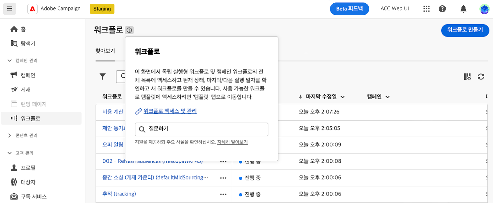

# AI 기반 기술 자료 지원 사용 {#using-ai}

제품 상황별 도움말 상자에서 AI 기반의 Knowkedge Assistant를 사용하여 제품 설명서 및 현재 제품 컨텍스트를 기반으로 AI가 생성한 빠른 답변을 얻을 수 있습니다.

>[!AVAILABILITY]
>
>이 기능은 10월 초에 사용할 수 있습니다.

다음 **Gen AI를 사용하는 기술 지원** 상황별 도움말에 포함되어 방대한 설명서 저장소를 손쉽게 탐색하여 설명서 검색 및 사용 방법 질문에 대한 대답 기능을 혁신적으로 개선하고 필요한 정확한 정보를 즉시 정확하게 찾아냅니다.

Campaign Gen AI의 기능 덕분에 이 도우미는 사용자 경험을 혁신하여 정보를 검색하고 문제를 쉽게 해결할 수 있습니다. 복잡한 작업에서 지침을 찾거나 광범위한 문서를 탐색하는 경우, Gen AI를 사용하는 Knowledge Assistant는 모든 상호 작용에 있어 탁월한 효율성과 정확성을 제공하는 최고의 동반자입니다.

{width="70%" align="left"}

<!--
## Consent {#consent-ai}

Campaign knowledge assistant embeeded in the contextual help boxes uses AI. Your use of this capability constitutes consent that the information you provide in your session will be collected, used, disclosed, and retained by Adobe in accordance with the terms of Adobe's Customer Feedback Program. Please do not provide any personal information about yourself or other parties (including your name or contact information) in the knowledge assistant.

## Privacy {#privacy-ai}

Your data is encrypted and private following our standard data protection practices. Learn more about [Adobe Privacy Policies](https://www.adobe.com/privacy/policy.html){target="_blank"}.

The knowledge assistant AI capability does not use your data to train our models. We do not allow any partners or 3rd parties to use your data for training their models or any other purpose.

For information specific to Adobe AI policies in Experience Cloud apps and solutions, refer to [this page](https://business.adobe.com/products/sensei/adobe-sensei.html){target="_blank"}.
-->

## 답변 {#answers-ai}

답은 부정확하거나 오해의 소지가 있을 수 있다. 그 결과, Adobe 지식 어시스턴트는 잘못된 정보를 출력할 수 있다. 모든 도움말 상자에 연결된 제품 설명서를 확인하십시오.

인공 지능과 머신 러닝 모델은 특정 사용 사례를 더 잘 해결하기 위해 시간이 지남에 따라 개선된다. Campaign AI 기반 지식 도우미는 앞으로 몇 달 동안 계속 향상될 것입니다. ??를 사용하는 것이 좋습니다 ??를 읽으면 언제든지 버튼을 눌러 엔지니어에 대한 부적절한 응답을 표시합니다.

## 권장 사항  {#recommendations-ai}

AI 기반 기술 지원에서 질문을 할 때는 현재 제품 컨텍스트(예: 현재 있는 캠페인 화면 및 현재 도움말 상자의 콘텐츠)가 고려됩니다.

AI 기반의 Knowledge Assistant를 최대한 활용하려면 질문을 할 때 다음을 권장합니다.

* 가능한 한 정확하고 구체적이며 모호함을 피하십시오. 그 답은 더 정확하고 도움이 될 것이다.
* AI 기반 지식 도우미가 올바른 정보를 찾을 수 있도록 학습 내용에 대한 세부 정보를 최대한 추가합니다.
* 더 나은 답변을 얻기 위해 질문을 수정하고 정교화합니다. 답변이 정확하지 않거나 유용하지 않다면 다른 접근 방식을 시도하고 컨텍스트를 추가하여 더 나은 결과를 얻으십시오.
* 중립적인 어조로 적절한 용어와 문구를 사용하십시오.
* 답변 등급을 매기고 피드백을 제공하여 엔지니어가 귀하의 경험을 통해 배우고 결과를 개선할 수 있도록 하십시오.

