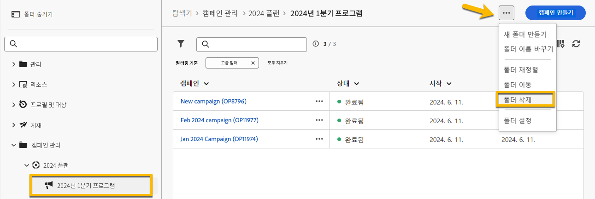
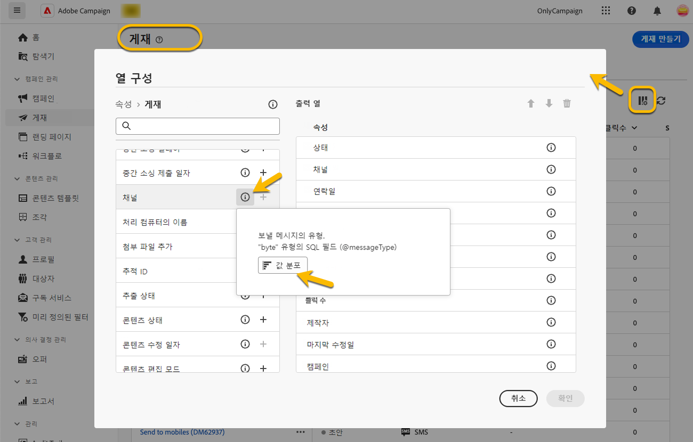

# 폴더 작업 {#folders}

>[!CONTEXTUALHELP]
>id="acw_folder_properties"
>title="폴더 속성"
>abstract="폴더 속성"

>[!CONTEXTUALHELP]
>id="acw_folder_security"
>title="폴더 보안"
>abstract="폴더 보안"

>[!CONTEXTUALHELP]
>id="acw_folder_restrictions"
>title="폴더 제한 사항"
>abstract="폴더 제한 사항"

>[!CONTEXTUALHELP]
>id="acw_folder_schedule"
>title="폴더 일정"
>abstract="폴더 일정"

## 폴더 정보 {#about-folders}

폴더는 Adobe Campaign의 오브젝트로, 구성 요소와 데이터를 구성하는 데 사용할 수 있습니다.

탐색 트리에서 폴더를 만들고, 이름을 바꾸고, 순서를 바꾸고, 이동할 수 있습니다. 권한에 따라 이들 폴더를 삭제할 수도 있습니다.

{zoomable="yes"}

폴더 유형을 설정할 수 있습니다. 그 예로는 게재 폴더가 있습니다.
이 유형에 따라 폴더의 아이콘이 변경됩니다.

## 새 폴더 만들기 {#create-a-folder}

Adobe Campaign Web UI에서 새 폴더를 만들려면 다음 단계를 따릅니다.

1. **[!UICONTROL 탐색기]**에서 새 폴더를 만들고자 하는 폴더로 이동합니다.
**[!UICONTROL ...]** 메뉴에 **[!UICONTROL 새 폴더 만들기]**&#x200B;가 표시됩니다.

{zoomable="yes"}

새 폴더를 만들 때 기본적으로 폴더 유형은 상위 폴더의 유형입니다. 이 예제에서는 **[!UICONTROL 게재]** 폴더에 폴더를 만든다고 가정합니다.

{zoomable="yes"}

1. 필요한 경우 폴더 유형 아이콘을 클릭하여 폴더 유형을 변경하고 아래와 같이 표시된 목록에서 해당 폴더 유형을 선택합니다.

{zoomable="yes"}

**[!UICONTROL 확인]** 버튼을 클릭하여 폴더 유형을 설정합니다.

특정 유형이 없는 폴더를 만들려면 **[!UICONTROL 일반 폴더]** 유형을 선택합니다.

[Adobe Campaign 콘솔에서 폴더를 만들고 관리](https://experienceleague.adobe.com/ko/docs/campaign/campaign-v8/config/configuration/folders-and-views)할 수도 있습니다.

## 폴더 삭제 {#delete-a-folder}

>[!CAUTION]
>
>폴더를 삭제하면 해당 폴더에 저장된 모든 데이터도 삭제됩니다.

폴더를 삭제하려면 **[!UICONTROL 탐색기]** 트리에서 해당 폴더를 선택하고 **[!UICONTROL ...]** 메뉴를 클릭합니다.
**[!UICONTROL 폴더 삭제]**&#x200B;를 선택합니다.

{zoomable="yes"}

## 폴더 내 값의 분포 {#distribution-values-folder}

값의 분포는 표 내에서 열에 있는 값의 백분율을 파악하는 데 도움이 됩니다.

폴더 내 값의 분포를 알아보려면 아래와 같이 진행하십시오.

게재 중에 **채널** 열의 값의 분포를 파악하고자 하는 경우를 예로 들어 보겠습니다.

이 정보를 얻으려면 **[!UICONTROL 게재]** 폴더로 이동하여 **[!UICONTROL 열 구성]** 아이콘을 클릭합니다.

**[!UICONTROL 열 구성]** 창에서 파악하고자 하는 열의 **[!UICONTROL 정보]** 아이콘을 클릭합니다. 그런 다음 **[!UICONTROL 값 분포]** 버튼을 클릭합니다.

{zoomable="yes"}

이렇게 하면 **[!UICONTROL 채널]** 열에 있는 값의 백분율을 구하게 됩니다.

{zoomable="yes"}

>[!NOTE]
>
> 값이 많은 열의 경우에는 처음 20개 값만 표시됩니다. 이 경우 **[!UICONTROL 부분 로드]** 알림이 표시됩니다.

링크 값의 분포도 구할 수 있습니다.

아래에 표시된 대로 속성 목록에서 원하는 링크 옆에 있는 **+** 버튼을 클릭합니다. 이렇게 하면 **[!UICONTROL 출력 열]**&#x200B;에 대한 링크가 추가됩니다. 이제 **[!UICONTROL 정보]** 아이콘을 사용하여 값의 분포를 조회할 수 있습니다. **[!UICONTROL 출력 열]**&#x200B;에 링크를 유지하지 않으려면 **[!UICONTROL 취소]** 버튼을 클릭하십시오.

{zoomable="yes"}

쿼리 모델러에서 값의 분포를 구하는 것도 가능합니다. [여기에서 자세히 알아보십시오](../query/build-query.md#distribution-of-values-in-a-query).

### 값 필터링 {#filter-values}

값 분포 창에서 **[!UICONTROL 고급 필터]**&#x200B;를 사용하면 지정된 조건을 기반으로 결과를 필터링할 수 있습니다.

채널별 분포를 보여 주는 위의 게재 목록의 예제에서 **완료됨** 상태의 게재만 표시하도록 필터링할 수 있습니다.

{zoomable="yes"}
