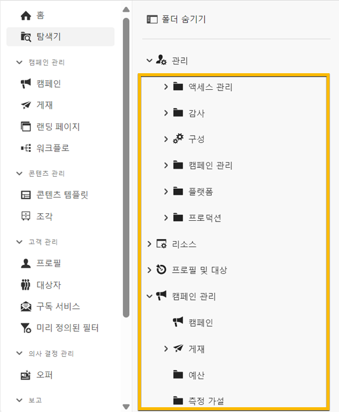

# 폴더 작업 {#folders}

>[!CONTEXTUALHELP]
>id="acw_folder_properties"
>title="폴더 속성"
>abstract="폴더 속성"

>[!CONTEXTUALHELP]
>id="acw_folder_security"
>title="폴더 보안"
>abstract="폴더 보안"

>[!CONTEXTUALHELP]
>id="acw_folder_restrictions"
>title="폴더 제한 사항"
>abstract="폴더 제한 사항"

>[!CONTEXTUALHELP]
>id="acw_folder_schedule"
>title="폴더 일정"
>abstract="폴더 일정"

## 폴더 정보

폴더는 Adobe Campaign의 오브젝트로, 구성 요소와 데이터를 구성하는 데 사용할 수 있습니다.

탐색 트리에서 폴더를 만들고, 이름을 바꾸고, 순서를 바꾸고, 이동할 수 있습니다. 권한에 따라 이들 폴더를 삭제할 수도 있습니다.

{zoomable="yes"}

폴더 유형을 설정할 수 있습니다. 그 예로는 게재 폴더가 있습니다.
이 유형에 따라 폴더의 아이콘이 변경됩니다.

## 새 폴더 만들기

Adobe Campaign Web UI에서 새 폴더를 만들려면 다음 단계를 따릅니다.

1. **[!UICONTROL 탐색기]**에서 새 폴더를 만들고자 하는 폴더로 이동합니다.
**[!UICONTROL ...]** 메뉴에 **[!UICONTROL 새 폴더 만들기]**&#x200B;가 표시됩니다.

{zoomable="yes"}

새 폴더를 만들면 기본적으로 폴더 유형은 상위 폴더와 같은 유형이 됩니다.
이 예제에서는 **[!UICONTROL 게재]** 폴더에 폴더를 만든다고 가정합니다.

{zoomable="yes"}

1. 필요한 경우 폴더 유형 아이콘을 클릭하여 폴더 유형을 변경하고 아래와 같이 표시된 목록에서 해당 폴더 유형을 선택합니다.

{zoomable="yes"}

**[!UICONTROL 확인]** 버튼을 클릭하여 폴더 유형을 설정합니다.

특정 유형이 없는 폴더를 만들려면 **[!UICONTROL 일반 폴더]** 유형을 선택합니다.

[Adobe Campaign 콘솔에서 폴더를 만들고 관리](https://experienceleague.adobe.com/ko/docs/campaign/campaign-v8/config/configuration/folders-and-views)할 수도 있습니다.

## 폴더 삭제

>[!CAUTION]
>
>폴더를 삭제하면 해당 폴더에 저장된 모든 데이터도 삭제됩니다.

폴더를 삭제하려면 **[!UICONTROL 탐색기]** 트리에서 해당 폴더를 선택하고 **[!UICONTROL ...]** 메뉴를 클릭합니다.
**[!UICONTROL 폴더 삭제]**&#x200B;를 선택합니다.

{zoomable="yes"}
