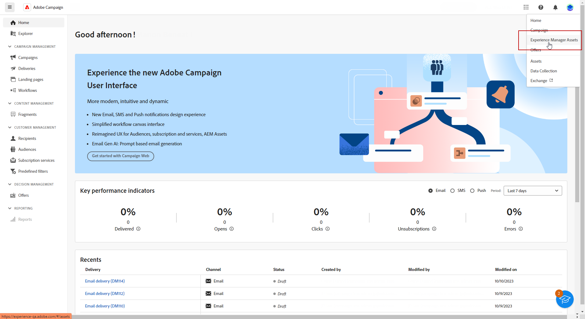

# [!DNL Adobe Experience Manager Assets as a Cloud Service]&#x200B;(으)로 자산 관리{#aem-assets}

## [!DNL Adobe Experience Manager Assets as a Cloud Service] 시작 {#get-started-assets-essentials}

[!DNL Adobe Experience Manager Assets as a Cloud Service]은(는) 크리에이티브 워크플로를 간소화하고 디지털 자산을 중앙 집중화하여 원활한 경험 전달을 제공하도록 설계된 통합 협업 플랫폼입니다. 승인된 프로덕션 자산의 구성, 태깅 및 검색을 단순화하여 팀 간의 브랜드 일관성을 보장합니다. 사용자에게 친숙한 인터페이스를 통해 [!DNL Assets as Cloud Service]을(를) 사용하면 Adobe Creative 및 Experience Cloud 애플리케이션 내에서 자산에 즉시 액세스하고 공유할 수 있습니다.

자세한 내용은 [Adobe Experience Manager Assets as a Cloud Service 설명서](https://experienceleague.adobe.com/docs/experience-manager-cloud-service/content/assets/home.html?lang=ko){target="_blank"}를 참조하세요.

## 에셋 업로드 및 삽입{#add-asset}

파일을 [!DNL Assets as Cloud Service]&#x200B;(으)로 가져오려면 파일을 저장할 폴더를 검색하거나 만드십시오. 그런 다음 이메일 콘텐츠에 삽입합니다.

에셋을 업로드하는 방법에 대한 자세한 내용은 [Adobe Experience Manager Assets as a Cloud Service 설명서](https://experienceleague.adobe.com/docs/experience-manager-cloud-service/content/assets/assets-view/add-delete-assets-view.html?lang=ko){target="_blank"}를 참조하세요.

1. 홈 페이지에서 고급 메뉴에 액세스하고 [!DNL Experience Manager Assets]을(를) 선택합니다.

   {zoomable="yes"}

1. **Assets 관리**&#x200B;에서 **Assets**&#x200B;을(를) 클릭하고 Adobe Campaign의 에셋에 대한 저장소를 선택합니다.

1. 중앙 섹션 또는 트리 보기에서 폴더를 클릭하여 엽니다.

   **[!UICONTROL 폴더 만들기]**&#x200B;를 클릭하여 새 폴더를 만들 수도 있습니다.

1. 선택한 폴더나 만든 폴더에서 **[!UICONTROL Assets 추가]**&#x200B;를 클릭하여 폴더에 새 자산을 업로드합니다.

   {zoomable="yes"}

1. **[!UICONTROL 파일 업로드]** 메뉴에서 **[!UICONTROL 찾아보기]**&#x200B;를 클릭하고 **[!UICONTROL 파일 찾아보기]** 또는 **[!UICONTROL 폴더 찾아보기]**&#x200B;를 선택합니다.

1. 업로드할 파일을 선택합니다. 완료되면 **[!UICONTROL 업로드]**&#x200B;를 클릭합니다.

   {zoomable="yes"}

1. 고급 에셋 관리 메뉴에 액세스하려면 방금 업로드한 에셋을 선택합니다.

   자산 관리에 대한 자세한 내용은 이 [페이지](https://experienceleague.adobe.com/docs/experience-manager-cloud-service/content/assets/assets-view/manage-organize-assets-view.html?lang=ko)를 참조하세요.

   {zoomable="yes"}

1. Adobe Photoshop Express으로 에셋을 추가로 편집하려면 에셋을 더블 클릭합니다. 그런 다음 오른쪽 메뉴에서 **[!UICONTROL 편집 모드]** 아이콘을 선택합니다. [자세히 알아보기](https://experienceleague.adobe.com/docs/experience-manager-cloud-service/content/assets/assets-view/edit-images-assets-view.html?lang=ko#edit-using-express){target="_blank"}.

1. [!DNL Adobe Campaign]에서 전자 메일 디자이너의 왼쪽 창에서 **[!UICONTROL 자산 선택기]** 메뉴를 선택하십시오.

   {zoomable="yes"}

1. 이전에 만든 **[!UICONTROL Assets]** 폴더를 선택하십시오. 검색 창에서 에셋 또는 폴더를 검색할 수도 있습니다.

   필요한 경우 **[!UICONTROL 자산 관리]**&#x200B;를 클릭하여 [!DNL Adobe Experience Manager Assets] 작업 영역에 직접 액세스합니다.

1. 에셋을 이메일 콘텐츠로 드래그하여 놓습니다.

   {zoomable="yes"}

1. **[!UICONTROL 설정]** 및 **[!UICONTROL 스타일]** 탭을 사용하여 외부 링크 또는 텍스트 추가와 같이 에셋을 추가로 사용자 지정합니다. [구성 요소 설정에 대해 자세히 알아보세요](../email/content-components.md).

   {zoomable="yes"}