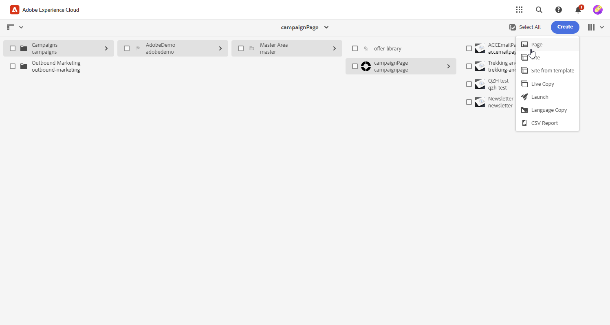

# [!DNL Adobe Experience Manager as a Cloud Service]&#x200B;(으)로 템플릿 관리{#aem-assets}

## [!DNL Adobe Experience Manager as a Cloud Service] 시작{#create-aem}

Adobe Campaign 웹 인터페이스와 Adobe Experience Manager의 통합을 통해 Adobe Experience Manager 플랫폼 내에서 직접 이메일 게재 콘텐츠 및 양식을 간소화하고 관리할 수 있습니다.

[Adobe Experience Manager as a Cloud Service에 대해 자세히 알아보기](https://experienceleague.adobe.com/docs/experience-manager-cloud-service/content/sites/authoring/getting-started/quick-start.html?lang=en)

## [!DNL Adobe Experience Manager as a Cloud Service]에서 템플릿 만들기{#create-aem-template}

1. [!DNL Adobe Experience Manager] 작성자 인스턴스로 이동하여 페이지의 왼쪽 상단에 있는 Adobe Experience를 클릭합니다. 메뉴에서 **[!UICONTROL 사이트]**&#x200B;를 선택합니다.

1. **[!UICONTROL 캠페인 > 브랜드 이름 > 주 영역 > 페이지 이름]**&#x200B;에 액세스합니다.

1. **[!UICONTROL 만들기]**&#x200B;를 클릭하고 드롭다운 메뉴에서 **[!UICONTROL 페이지]**&#x200B;을(를) 선택합니다.

   

1. **[!UICONTROL Adobe Campaign 이메일]** 템플릿을 선택하고 뉴스레터 이름을 지정합니다.

   ![[템플릿 선택 및 이름 지정 필드를 보여주는 &quot;Adobe Campaign 이메일&quot; 스크린샷입니다.]](assets/aem_2.png)

1. Adobe Campaign의 개인화 필드와 같은 구성 요소를 추가하여 이메일 콘텐츠를 사용자 정의합니다. [자세히 알아보기](https://experienceleague.adobe.com/docs/experience-manager-65/content/sites/authoring/aem-adobe-campaign/campaign.html?lang=en#editing-email-content)

1. 이메일이 준비되면 **[!UICONTROL 페이지 정보]** 메뉴로 이동한 다음 **[!UICONTROL 워크플로우 시작]**&#x200B;을 클릭합니다.

   

1. 첫 번째 드롭다운에서 워크플로 모델로 **[!UICONTROL Adobe Campaign 승인]**&#x200B;을 선택하고 **[!UICONTROL 워크플로 시작]**&#x200B;을 클릭합니다.

1. 페이지 맨 위에 `This page is subject to the workflow Approve for Adobe Campaign`을(를) 나타내는 면책조항이 나타납니다. 면책조항 옆에 있는 **[!UICONTROL 완료]**&#x200B;를 클릭하여 검토를 확인하고 **[!UICONTROL 확인]**&#x200B;을 클릭합니다.

   

1. **[!UICONTROL 완료]**&#x200B;를 다시 클릭하고 **[!UICONTROL 다음 단계]** 드롭다운에서 **[!UICONTROL 뉴스레터 승인]**&#x200B;을 선택합니다.

이제 뉴스레터가 준비되었으며 Adobe Campaign에서 동기화되었습니다.

## Adobe Experience Manager as a Cloud Service 템플릿 가져오기{#aem-templates-perso}

Experience Manager 템플릿을 Adobe Campaign 웹에서 콘텐츠 템플릿으로 사용할 수 있게 되면 개인화를 포함하여 이메일에 필요한 콘텐츠를 식별하고 통합할 수 있습니다.

1. Campaign 웹의 **[!UICONTROL 게재]** 메뉴에서 **[!UICONTROL 게재 만들기]**&#x200B;를 클릭합니다.

1. 전자 메일 템플릿 창에서 기본 제공 **[!UICONTROL AEM 콘텐츠가 포함된 전자 메일 게재]** 템플릿을 선택합니다.

   

1. 게재할 **[!UICONTROL 레이블]**&#x200B;을(를) 입력하고 필요에 따라 추가 옵션을 구성합니다.

   * **[!UICONTROL 내부 이름]**: 게재에 고유 식별자를 할당합니다.
   * **[!UICONTROL 폴더]**: 게재를 특정 폴더에 저장합니다.
   * **[!UICONTROL 게재 코드]**: 이 필드를 사용하여 고유한 명명 규칙에 따라 게재를 구성하십시오.
   * **[!UICONTROL 설명]**: 게재에 대한 설명을 지정합니다.
   * **[!UICONTROL 특성]**: 분류 목적으로 전자 메일의 특성을 지정합니다.

1. 전자 메일에 대한 **[!UICONTROL 대상]**&#x200B;을(를) 정의합니다. [자세히 알아보기](../email/create-email.md#define-audience)

1. **[!UICONTROL 콘텐츠 편집]**&#x200B;을 클릭합니다.

1. **[!UICONTROL 콘텐츠 편집]** 메뉴에서 **[!UICONTROL AEM 콘텐츠 선택]**&#x200B;을 클릭합니다.

   

1. AEM 템플릿을 탐색하고 Campaign 웹으로 가져올 템플릿을 선택합니다.

   

1. 콘텐츠는 자동으로 동기화되지 않습니다. Adobe Experience Manager에서 직접 템플릿을 변경한 경우 **[!UICONTROL AEM 콘텐츠 새로 고침]**&#x200B;을 선택하여 최신 버전의 템플릿으로 업데이트합니다.

1. Experience Manager과 Campaign 간의 연결을 제거하거나 이메일 디자이너에서 Experience Manager 템플릿을 추가로 개인화하려면 **[!UICONTROL AEM 콘텐츠 연결 해제]**&#x200B;를 클릭하십시오.

   

1. Experience Manager 템플릿에 개인화된 콘텐츠를 추가한 경우 **[!UICONTROL 콘텐츠 시뮬레이션]**&#x200B;을 클릭하여 테스트 프로필을 사용하여 메시지에 표시되는 방식을 미리 봅니다.

[미리 보기 및 테스트 프로필에 대해 자세히 알아보기](../preview-test/preview-content.md)

1. 메시지 미리 보기를 볼 때 개인화된 요소는 자동으로 선택한 테스트 프로필의 해당 데이터로 바뀝니다.

   필요한 경우 **[!UICONTROL 테스트 프로필 관리]** 단추를 통해 추가 테스트 프로필을 추가하십시오.

이제 게재를 보낼 준비가 되었습니다.