# Adobe Experience Manager을 사용하여 다국어 이메일 만들기 {#aem-multilingual}

>[!CONTEXTUALHELP]
>id="acw_homepage_welcome_rn3"
>title="Experience Manager 라이브 및 언어 사본"
>abstract="이제 Campaign에서 직접 Adobe Experience Manager 언어 및 라이브 카피에 액세스할 수 있습니다. 실시간 콘텐츠 새로 고침을 통해 수동으로 동기화할 필요가 없어 다국어 워크플로우가 간소화됩니다."
>additional-url="https://experienceleague.adobe.com/docs/campaign-web/v8/release-notes/release-notes.html?lang=ko" text="릴리스 정보 참조"

Adobe Experience Manager 통합을 사용하면 Adobe Experience Manager 언어 사본을 사용하여 다국어 이메일 게재를 만들 수 있습니다. 이를 통해 다양한 언어로 콘텐츠 변형을 관리하고 수신자 언어 환경 설정에 따라 개인화된 이메일을 전달할 수 있습니다.

## 필수 구성 요소 {#prerequisites}

다국어 이메일 게재를 만들기 전에 다음을 확인하십시오.

* Adobe Campaign 웹 인터페이스 통합을 위해 구성된 Adobe Experience Manager 인스턴스에 액세스합니다.
* 언어 사본이 있는 Adobe Experience Manager 콘텐츠가 이미 만들어지고 승인되었습니다. [Adobe Experience Manager 설명서](https://experienceleague.adobe.com/ko/docs/experience-manager-cloud-service/content/sites/administering/reusing-content/translation/wizard)에서 언어 복사 마법사에 대해 자세히 알아보세요
* Adobe Experience Manager 콘텐츠를 수신하도록 구성된 이메일 게재 템플릿입니다. [다국어 모드 사용](#enable-multilingual) 섹션에 설명된 단계를 참조하세요.

## 다국어 게재 만들기

다국어 이메일 게재를 만들려면 먼저 게재 설정에서 다국어 옵션을 활성화해야 합니다. 시스템에서 사용 가능한 언어 사본을 자동으로 감지하여 추가할 언어 사본을 선택할 수 있습니다.

### 다국어 모드 활성화 {#enable-multilingual}

새 게재를 만들고 고급 설정에서 다국어 옵션을 활성화합니다.

1. **[!UICONTROL 게재]** 메뉴에서 **[!UICONTROL 게재 만들기]**&#x200B;를 클릭합니다.

   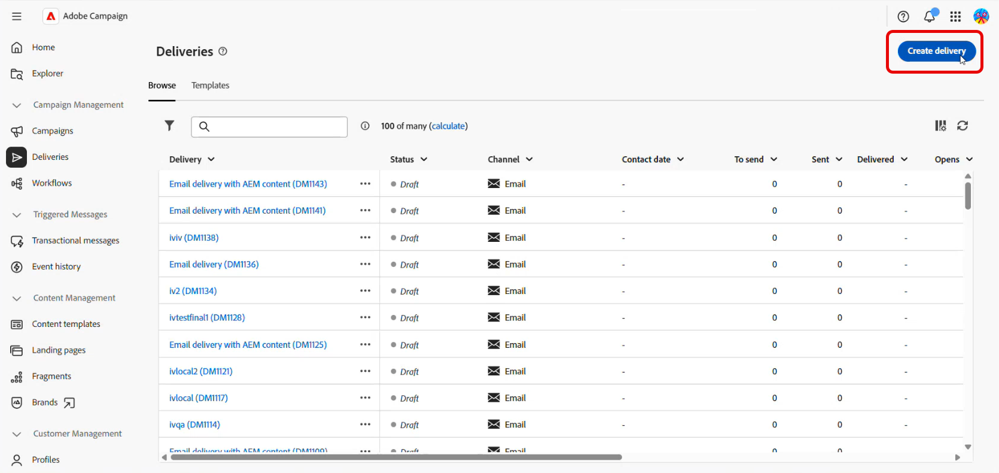

1. **[!UICONTROL AEM 콘텐츠를 사용한 전자 메일 게재]** 템플릿을 선택하고 **[!UICONTROL 게재 만들기]**&#x200B;를 클릭합니다.

   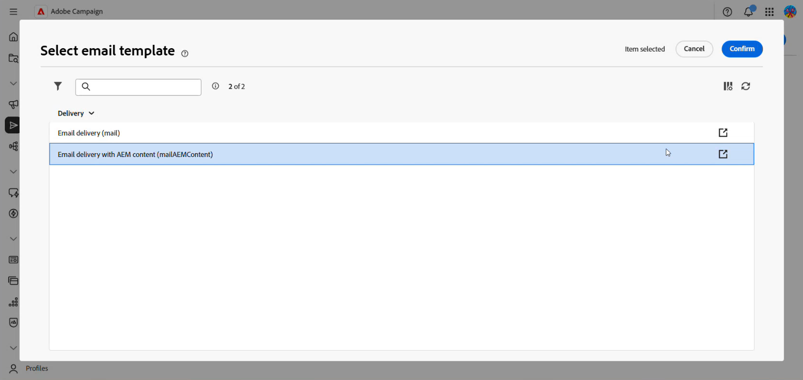

1. 게재 레이블을 입력하고 대상자를 구성합니다. [자세히 알아보기](../email/create-email.md)

1. 게재 **[!UICONTROL 설정]**&#x200B;에 액세스한 다음 **[!UICONTROL 고급]** 섹션으로 이동합니다.

1. **[!UICONTROL AEM 다국어 사용]** 옵션을 사용하도록 설정합니다.

   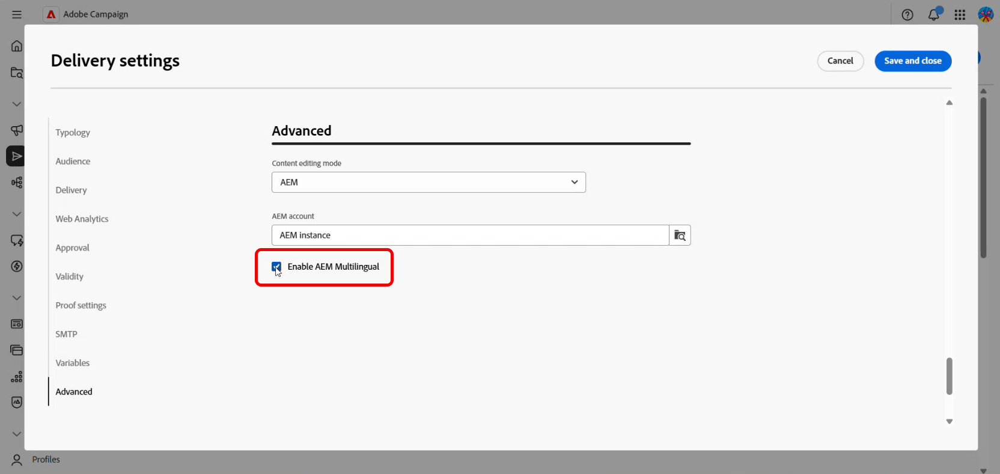

1. 다음을 확인하십시오.

   * **[!UICONTROL 콘텐츠 편집 모드]**&#x200B;가 **[!UICONTROL AEM]**(으)로 설정되어 있습니다.
   * 올바른 Adobe Experience Manager **[!UICONTROL 외부 계정]**&#x200B;을(를) 선택했습니다.

1. **[!UICONTROL 저장 후 닫기]**&#x200B;를 클릭합니다.

### 콘텐츠 변형 만들기 {#create-variants}

Adobe Experience Manager 콘텐츠를 선택하고 게재에 포함할 언어 변형을 선택합니다.

1. **[!UICONTROL 콘텐츠 편집]**&#x200B;을 클릭합니다.

1. **[!UICONTROL 콘텐츠 변형 만들기]**&#x200B;를 선택합니다.

   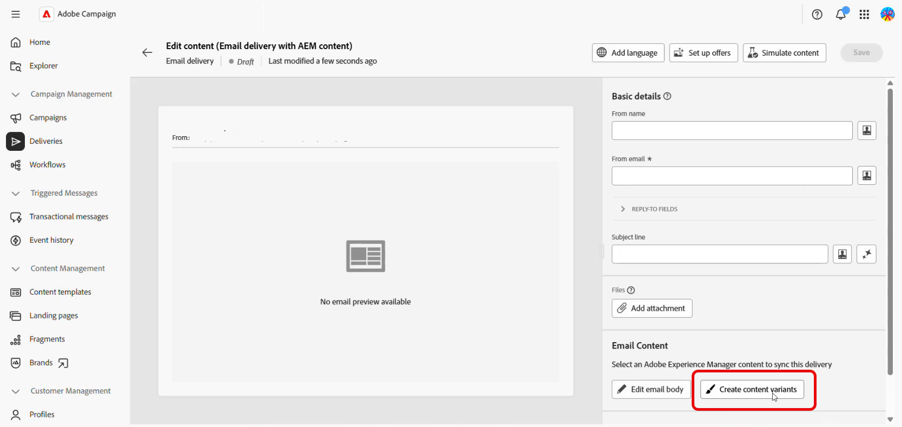

1. 목록에서 Adobe Experience Manager 콘텐츠를 선택합니다.

   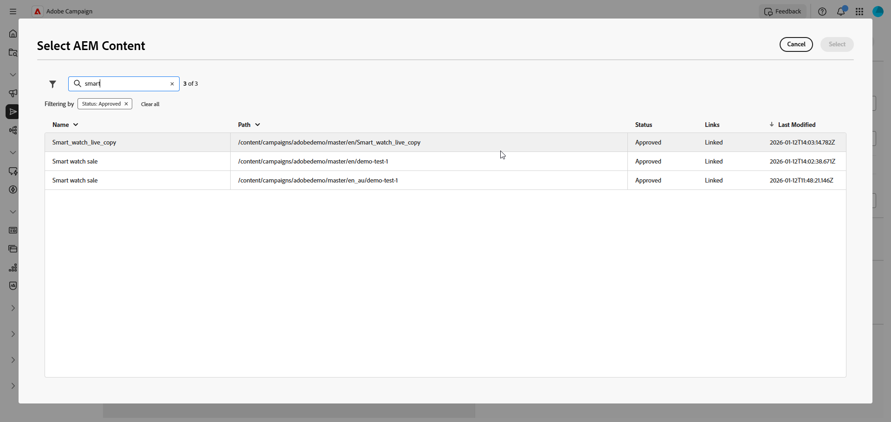

1. 시스템은 선택한 콘텐츠(상위-하위 관계)와 연결된 모든 언어 사본을 감지합니다. 예를 들어 Adobe Experience Manager 콘텐츠에 프랑스어, 독일어 및 이탈리아어의 변형이 있는 경우 모든 변형을 선택할 수 있습니다.

   게재에 포함할 언어 변형을 선택합니다.

   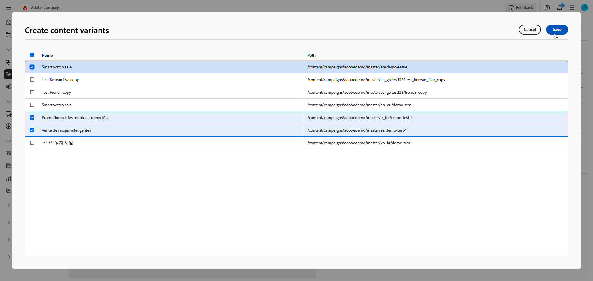

1. **[!UICONTROL 저장]**&#x200B;을 클릭합니다.

1. 콘텐츠 편집기에서 언어 변형을 검토합니다. 이제 [각 변형을 개별적으로 관리](#manage-variants)하거나 [게재 보내기](../monitor/prepare-send.md)를 진행할 수 있습니다.

   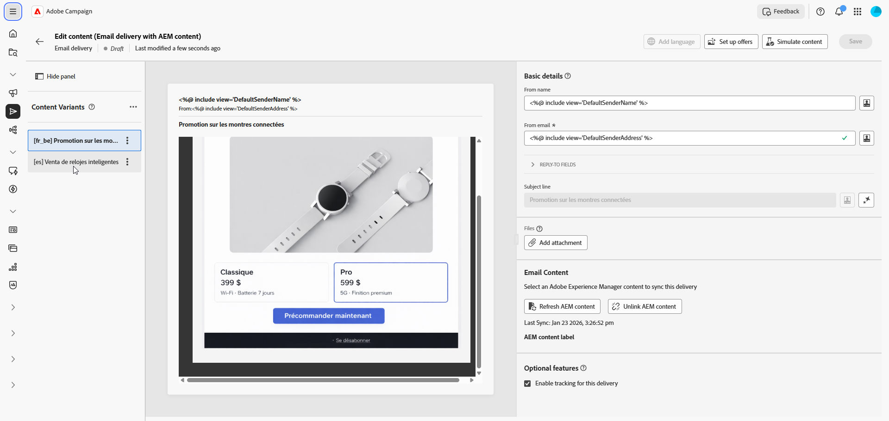

## 언어 변형 관리 {#manage-variants}

콘텐츠 변형을 만든 후 게재에서 직접 관리할 수 있습니다.

1. 기본 언어를 설정하려면 선택한 변형에 대한 고급 메뉴에 액세스하고 **[!UICONTROL 기본값으로 설정]**&#x200B;을 선택합니다. 프로필의 언어 기본 설정이 설정되어 있지 않거나 사용 가능한 변형과 일치하지 않을 경우 기본 언어가 사용됩니다.

   게재에서 변형을 제거하려면 **[!UICONTROL 삭제]**&#x200B;를 클릭하십시오.

   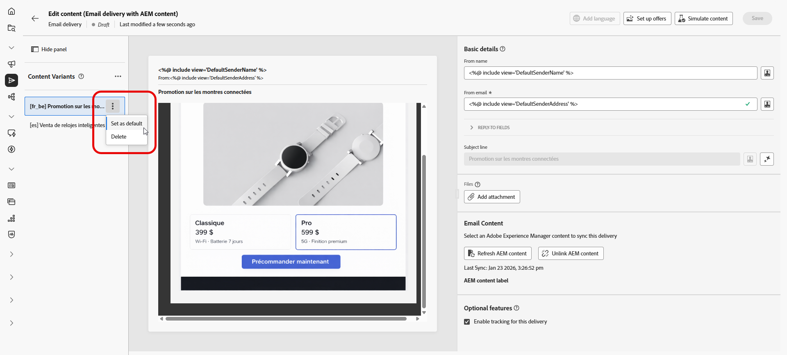

1. 콘텐츠 변형 고급 메뉴에서 **[!UICONTROL 로케일 관리]**&#x200B;를 클릭하여 게재에 다른 로케일을 추가합니다.

   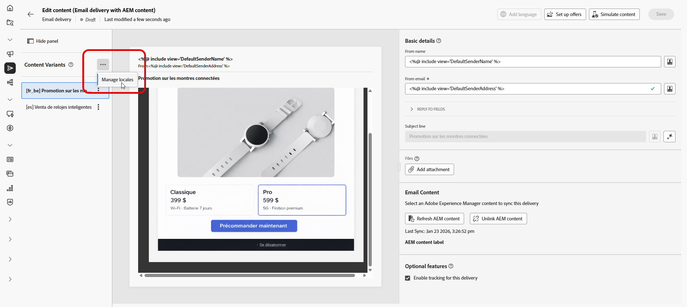

1. 더 많은 변형을 포함하려면 추가 언어 사본을 선택하고 **[!UICONTROL 저장]**&#x200B;을 클릭하세요.

   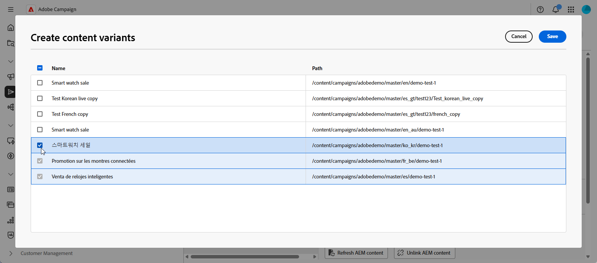

1. Adobe Experience Manager에서 콘텐츠가 업데이트되면 **[!UICONTROL AEM 콘텐츠 새로 고침]**&#x200B;을 클릭하여 모든 변형을 최신 버전과 동기화합니다.

   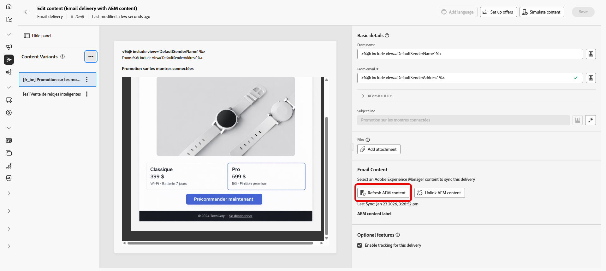

1. Campaign에서 직접 콘텐츠를 편집하거나 Adobe Experience Manager과의 연결을 끊으려면 **[!UICONTROL AEM 콘텐츠 연결 해제]**&#x200B;를 클릭하십시오.

   >[!CAUTION]
   >
   >연결을 해제하면 Adobe Experience Manager에서 콘텐츠를 새로 고치거나 새 변형을 만들 수 없습니다. 콘텐츠가 Adobe Experience Manager에서 독립됩니다.
