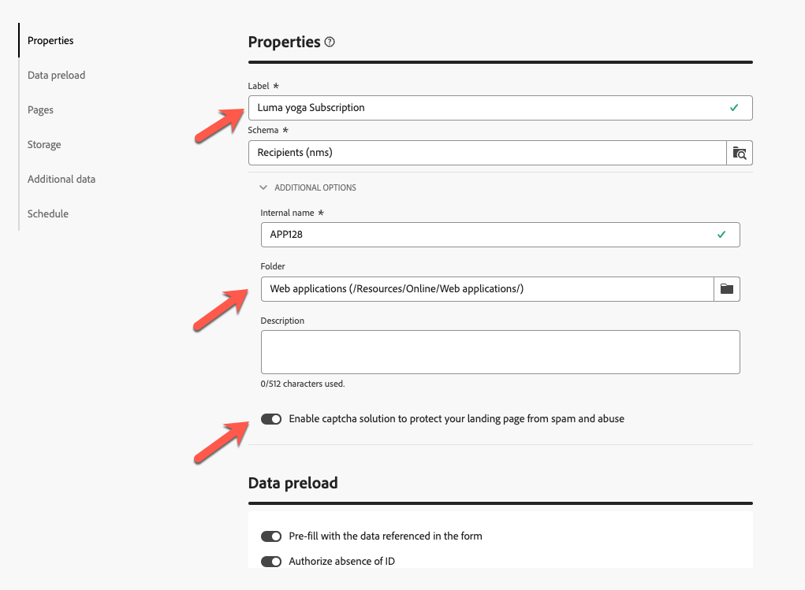

# 랜딩 페이지 만들기 및 게시 {#create-lp}

>[!CONTEXTUALHELP]
>id="acw_landingpages_menu"
>title="랜딩 페이지 만들기 및 관리"
>abstract="Adobe Campaign을 사용하면 기본 제공된 템플릿을 기반으로 확보, 구독/구독 취소 및 차단 목록 사용 사례를 관리할 수 있는 온라인 웹 페이지로 이동하는 랜딩 페이지를 생성, 디자인 및 공유할 수 있습니다."

Campaign 웹 사용자 인터페이스를 사용하면 랜딩 페이지를 만들고 디자인하고 게시할 수 있습니다. 게시 후 게재에 양식에 대한 링크를 삽입할 수 있습니다. 수신자가 해당 링크를 클릭하면 해당 랜딩 페이지로 이동합니다.

[!DNL Adobe Campaign]은(는) 다음 사용 사례를 관리하기 위한 템플릿으로 제공됩니다. **acquisition**, **subscription**, **unsubscription** 및 **차단 목록에 추가하다**. [자세히 알아보기](lp-use-cases.md)

## 랜딩 페이지 액세스 {#access-landing-pages}

랜딩 페이지 목록에 액세스하려면 왼쪽 메뉴에서 **[!UICONTROL 콘텐츠 관리]** > **[!UICONTROL 랜딩 페이지]**&#x200B;를 선택하십시오.

{zoomable="yes"}

**[!UICONTROL 랜딩 페이지]** 인벤토리에 생성된 모든 항목이 표시됩니다. **[!UICONTROL 필터 표시]** 단추를 사용하여 필터링할 수 있습니다.

* 만들거나 수정한 항목을 필터링할 수 있습니다.
* 드롭다운 목록을 사용하여 결과를 특정 [폴더](../get-started/permissions.md#folders)(으)로 제한하거나 [쿼리 모델러](../query/query-modeler-overview.md)를 사용하여 규칙을 추가할 수 있습니다.

{zoomable="yes"}

<!--From this list, you can access the [landing page Live report](../reports/lp-report-live.md) or [landing page Global report](../reports/lp-report-global.md) for published items.-->

>[!CAUTION]
>
>Campaign 웹 사용자 인터페이스에서는 클라이언트 콘솔에서 만든 랜딩 페이지(웹 양식)를 표시하거나 편집할 수 없습니다. 자세한 내용은 [Campaign 콘솔 설명서](https://experienceleague.adobe.com/docs/campaign/campaign-v8/content/webapps.html?lang=ko){target="_blank"}를 참조하세요.

<!--If you unpublish a landing page which is referenced in a message, the link to the landing page will be broken and an error page will be displayed. You cannot delete a published landing page. To delete it, you must first unpublish it.-->

랜딩 페이지를 복제하거나 삭제할 수 있습니다. 랜딩 페이지 옆에 있는 생략 부호를 클릭하여 원하는 작업을 선택합니다.

## 랜딩 페이지 만들기 {#create-landing-page}

>[!CONTEXTUALHELP]
>id="acw_landingpages_properties"
>title="랜딩 페이지 속성 정의"
>abstract="레이블과 같은 속성 필드를 입력하고 필요한 경우 스키마를 수정합니다. 내부 이름을 편집하고, 랜딩 페이지가 저장되는 폴더를 변경하고, 설명을 제공할 수도 있습니다."

>[!CONTEXTUALHELP]
>id="acw_landingpages_pages_list"
>title="각 페이지의 콘텐츠 정의"
>abstract="양식 자체, 양식 제출 시 표시되는 확인 페이지, 오류 발생 시 사용자가 이동되는 페이지 등 이 랜딩 페이지의 일부인 각 페이지의 콘텐츠를 조정합니다."

>[!CONTEXTUALHELP]
>id="acw_landingpages_schedule"
>title="랜딩 페이지 일정 예약"
>abstract="랜딩 페이지의 시작 날짜와 종료 날짜를 정의합니다. 페이지의 유효 기간이 끝나면 해당 양식을 더 이상 사용할 수 없습니다. 대신 **만료** 페이지가 표시됩니다."

>[!CONTEXTUALHELP]
>id="acw_landingpages_preload"
>title="미리 로드 옵션 정의"
>abstract="**양식에서 참조된 데이터로 미리 채우기** 옵션을 선택한 경우 랜딩 페이지 방문자가 데이터베이스의 프로필과 일치하면 프로필 정보가 자동으로 양식에 미리 로드됩니다. **ID 부재 승인** 옵션을 선택하면 익명 사용자를 포함한 모든 방문자가 랜딩 페이지에 액세스할 수 있습니다."

<!--With the **Skip preloading if no ID** option selected, each profile entered will be added to the database after approval of the form."-->

>[!CONTEXTUALHELP]
>id="acw_landingpages_storage"
>title="스토리지 옵션 정의"
>abstract="미리 로드 섹션을 사용하면 데이터베이스에서 업데이트할 레코드를 찾는 방법을 지정할 수 있습니다."

<!--The main steps to create landing pages are as follows:

{zoomable="yes"}-->

랜딩 페이지를 만들려면 다음 단계를 수행합니다.

1. **[!UICONTROL 랜딩 페이지]** 인벤토리에서 **[!UICONTROL 랜딩 페이지 만들기]**&#x200B;를 클릭합니다.

   {zoomable="yes"}

1. 템플릿 선택:
   * **[!UICONTROL 획득]**: 프로필 데이터를 캡처하고 업데이트할 수 있는 랜딩 페이지의 기본 템플릿입니다.
   * **[!UICONTROL 구독]**: 이 템플릿을 사용하여 사용자가 특정 [서비스](../audience/manage-services.md)에 가입할 수 있도록 하십시오.
   * **[!UICONTROL 구독 취소]**: 이 템플릿은 서비스 구독자에게 전송된 게재에서 이 [서비스](../audience/manage-services.md)에서 구독을 취소할 수 있도록 허용하는 데 사용할 수 있습니다.
   * **[!UICONTROL 차단 목록]**: 이 템플릿은 게재에서 옵트아웃 링크를 클릭하여 더 이상 연락하지 않으려는 경우에 사용해야 합니다.

   {zoomable="yes"}

   >[!NOTE]
   >
   >[이 페이지](lp-use-cases.md)에서 각 템플릿에 해당하는 다양한 사용 사례를 구현하는 방법에 대해 알아봅니다.

1. **[!UICONTROL 만들기]**&#x200B;를 클릭합니다.

1. 레이블과 같은 **[!UICONTROL 속성]** 필드를 채웁니다.

   기본적으로 랜딩 페이지는 **[!UICONTROL 웹 응용 프로그램]** 폴더에 저장됩니다. **[!UICONTROL 추가 옵션]**&#x200B;에서 원하는 위치로 이동하여 변경할 수 있습니다. [폴더 작업 방법 알아보기](../get-started/permissions.md#folders).

   또한 CAPTCHA를 설정하여 랜딩 페이지를 보호할 수 있습니다. [여기에서 자세히 알아보십시오](#captcha).

   {zoomable="yes"}

1. **[!UICONTROL 데이터 미리 로드]** 섹션에서 다음 옵션을 사용할 수 있습니다.

   * **[!UICONTROL 양식에서 참조된 데이터로 미리 채우기]** 옵션을 선택한 경우 랜딩 페이지 방문자가 데이터베이스의 프로필과 일치하면 프로필 정보가 자동으로 양식에 미리 로드됩니다. 사용자는 누락된 필드를 입력하고 필요한 경우 기존 값을 업데이트하기만 하면 됩니다. 이를 통해 중복을 만드는 대신 기존 프로필에 대한 데이터를 병합할 수 있습니다.

     >[!NOTE]
     >
     >이 옵션은 모든 랜딩 페이지 템플릿에 대해 기본적으로 선택됩니다.

   * **[!UICONTROL ID 부재 승인]** 옵션을 사용하면 모든 방문자가 랜딩 페이지에 액세스할 수 있습니다. 이 옵션을 선택 해제하면 익명 방문자가 이 옵션을 사용할 수 없습니다. 즉, 식별된 사용자만 양식에 액세스하고 양식을 제출할 수 있습니다.

     **[!UICONTROL 획득]** 및 **[!UICONTROL 구독]** 템플릿의 경우 기본적으로 이 옵션이 선택됩니다. **[!UICONTROL 구독 취소]** 및 **[!UICONTROL 차단 목록]** 템플릿의 경우 이 옵션은 기본적으로 선택되지 않으며 수정할 수 없습니다.

1. 랜딩 페이지에는 후속 페이지가 있을 수 있습니다. 페이지를 추가하려면 **[!UICONTROL 페이지]** 섹션을 찾은 다음 이 랜딩 페이지에 대해 디자인할 각 페이지에 대해 **[!UICONTROL 콘텐츠 편집]** 단추를 클릭하십시오. 각 페이지의 콘텐츠는 이미 사전에 채워져 있습니다. 필요에 따라 편집합니다. [자세히 알아보기](lp-content.md)

   {zoomable="yes"}

1. **[!UICONTROL 저장소]** 섹션에서 **[!UICONTROL 미리 로드된 레코드 업데이트]** 옵션이 기본적으로 선택됩니다. 랜딩 페이지를 통해 데이터베이스에 저장된 프로필을 업데이트할 수 있습니다. 미리 로드 상자를 사용하여 데이터베이스에서 업데이트할 레코드를 찾는 방법을 표시할 수 있습니다.

   랜딩 페이지의 현재 컨텍스트에 있는 필드 중에서 데이터베이스에서 해당 프로필을 찾는 데 사용할 필드를 선택할 수도 있습니다. 이렇게 하려면 **[!UICONTROL 미리 로드된 레코드 업데이트]** 옵션을 선택 취소하고 **[!UICONTROL 조정 옵션]**&#x200B;에서 원하는 필드를 선택하십시오.

   {zoomable="yes"}

1. 랜딩 페이지를 제출할 때 내부 데이터를 저장할 **[!UICONTROL 추가 데이터]**&#x200B;를 만듭니다. 이 데이터는 페이지를 방문한 사용자에게 표시되지 않습니다. 상수 값만 고려됩니다.

   {zoomable="yes"}

1. 랜딩 페이지의 시작 날짜와 종료 날짜를 정의할 수 있습니다. **[!UICONTROL 예약 사용]**&#x200B;을 선택하고 날짜를 설정합니다.

   {zoomable="yes"}

   * 랜딩 페이지는 지정된 시작 날짜/시간에 자동으로 게시됩니다.

     >[!NOTE]
     >
     >시작 날짜가 정의되지 않으면 랜딩 페이지가 게시되는 즉시 활성화됩니다.

   * 페이지가 종료 날짜에 도달하면 양식을 더 이상 사용할 수 없습니다. 대신 **[!UICONTROL 만료]** 페이지가 표시됩니다.

     >[!NOTE]
     >
     >보안과 플랫폼 성능을 위해 Adobe에서는 종료 날짜를 설정하는 것이 좋습니다.

1. **[!UICONTROL 검토 및 게시]**&#x200B;를 클릭합니다.

모든 설정과 [디자인](lp-content.md)을 정의하면 아래와 같이 랜딩 페이지를 [테스트](#test-landing-page)하고 [게시](#publish-landing-page)할 수 있습니다.

## captcha를 사용하여 랜딩 페이지 보안 {#captcha}

captcha를 설정하면 랜딩 페이지를 스팸 및 남용으로부터 보호할 수 있습니다.

사용하려면 랜딩 페이지의 **[!UICONTROL 속성]**(으)로 이동하십시오.
**[!UICONTROL 추가 옵션]**&#x200B;에서도 사용할 수 있습니다. **[!UICONTROL 추가 captcha 솔루션 사용]** 토글을 활성화합니다.

{zoomable="yes"}

captcha 설정을 확인하려면 **[!UICONTROL 검토 및 게시]** 단추를 클릭하고 **[!UICONTROL 콘텐츠 시뮬레이션]**&#x200B;을 클릭하십시오. 양식을 제출할 때 다음과 같이 유효성 검사 중에 captcha 위젯이 작동하는 것을 볼 수 있습니다.

{zoomable="yes"}

>[!NOTE]
>
>Adobe Campaign v8의 captcha 위젯은 부동 모드에서 작동하는 ALTCHA입니다. 유효성 검사 중에 나타나고 프로세스가 완료되면 사라집니다.

## 랜딩 페이지 테스트 {#test-landing-page}

>[!CONTEXTUALHELP]
>id="acw_landingpages_simulate"
>title="랜딩 페이지 시뮬레이션"
>abstract="Campaign Web 사용자 인터페이스에서 랜딩 페이지의 미리보기를 보거나 새 웹 브라우저 탭에서 열 수 있습니다."

>[!CONTEXTUALHELP]
>id="ac_preview_lp_profiles"
>title="랜딩 페이지 미리보기 및 테스트"
>abstract="랜딩 페이지 설정 및 콘텐츠가 정의되면 테스트 프로필을 사용하여 미리보기할 수 있습니다."

랜딩 페이지 설정 및 콘텐츠를 정의하고 나면 테스트 프로필을 사용하여 미리 볼 수 있습니다. [개인화된 콘텐츠](../personalization/gs-personalization.md)를 삽입하면 테스트 프로필 데이터를 사용하여 이 콘텐츠가 랜딩 페이지에 표시되는 방식을 확인할 수 있습니다.

>[!CAUTION]
>
>메시지를 미리 보고 증명을 보내려면 테스트 프로필을 사용할 수 있어야 합니다. [테스트 프로필에 대해 자세히 알아보기](../audience/test-profiles.md)

랜딩 페이지를 테스트하려면 다음 단계를 수행합니다.

1. **[!UICONTROL 검토 및 게시]**&#x200B;를 클릭한 후 랜딩 페이지 대시보드에서 **[!UICONTROL 콘텐츠 시뮬레이션]** 단추를 선택하여 테스트 프로필 선택에 액세스합니다.

   {zoomable="yes"}

1. **[!UICONTROL 시뮬레이션]** 화면에서 하나 이상의 테스트 프로필을 선택합니다.

   테스트 프로필을 선택하는 단계는 메시지를 테스트할 때와 동일합니다. 자세한 내용은 [미리 보기 및 테스트](../preview-test/preview-test.md) 섹션을 참조하세요.

1. 동적 랜딩 페이지(**[!UICONTROL URL의 서비스]** 옵션을 선택한 상태로)를 테스트할 때 - [자세히 알아보기](../landing-pages/create-lp.md#define-actions-on-form-submission)

1. **[!UICONTROL 미리 보기 열기]**&#x200B;를 선택하여 랜딩 페이지를 테스트합니다.

   미리 보기 열기 단추의 {zoomable="yes"}

1. 랜딩 페이지의 미리보기가 새 탭에서 열립니다. 개인화된 요소는 선택한 테스트 프로필 데이터로 대체됩니다.

   랜딩 페이지 설정에서 **[!UICONTROL 양식에 참조된 데이터로 미리 채우기]** 옵션을 선택한 경우, 양식 필드는 해당 테스트 프로필 데이터로 자동으로 미리 채워집니다.<!--TBC-->

   {zoomable="yes"}

1. 다른 테스트 프로필을 선택하여 랜딩 페이지의 각 변형에 대한 렌더링을 미리 봅니다.

<!--Can you preview Confirmation/Error/Expiration pages?-->

## 랜딩 페이지 게시 {#publish-landing-page}

랜딩 페이지가 준비되고 유효성이 확인되면 해당 버튼을 사용하여 게재에서 사용할 수 있도록 게시합니다.

게시 후:

* 랜딩 페이지가 **[!UICONTROL 게시됨]** 상태로 랜딩 페이지 목록에 추가됩니다. 이제 라이브가 되어 콘텐츠에서 참조할 수 있습니다.

* 페이지 상단에 표시되는 **[!UICONTROL 랜딩 페이지 URL]**&#x200B;을(를) 복사하여 웹 브라우저에 붙여 넣어 랜딩 페이지를 미리 볼 수 있습니다.

>[!CAUTION]
>
>랜딩 페이지를 완전히 테스트하거나 활용하려는 경우, 이 링크를 웹 브라우저나 게재에 직접 복사하여 붙여넣을 수 없습니다. 대신 [콘텐츠 시뮬레이션](#test-landing-page) 함수를 사용하여 테스트하고 [이 섹션](lp-use-cases.md)에 설명된 단계에 따라 랜딩 페이지를 적절히 사용하십시오.

{zoomable="yes"}

<!--and specific reports--> 로그를 통해 랜딩 페이지의 영향을 모니터링할 수 있습니다. **[!UICONTROL 로그]** 단추를 클릭합니다.