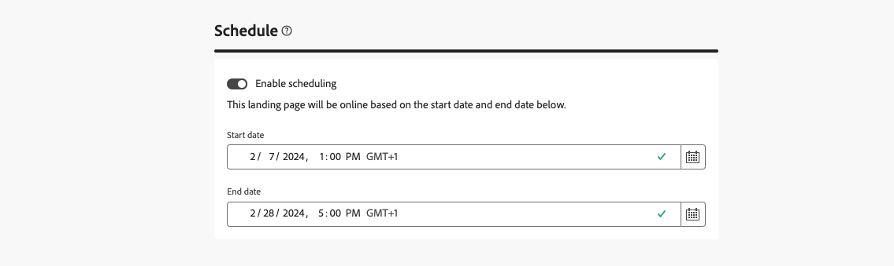

# 랜딩 페이지 만들기 및 게시 {#create-lp}

>[!CONTEXTUALHELP]
>id="acw_landingpages_menu"
>title="랜딩 페이지 만들기 및 관리"
>abstract="Adobe Campaign을 사용하면 랜딩 페이지를 만들고 공유하여 내장된 템플릿을 기반으로 획득 구독/구독 취소 및 차단 목록 사용 사례를 관리할 수 있는 온라인 웹 페이지로 사용자를 안내할 수 있습니다."

Campaign 웹 사용자 인터페이스를 사용하면 랜딩 페이지를 만들고 디자인하고 게시할 수 있습니다. 게시되면 게재에 양식에 대한 링크를 삽입할 수 있습니다. 수신자가 해당 링크를 클릭하면 해당 랜딩 페이지로 이동합니다.

[!DNL Adobe Campaign] 에는 다음 사용 사례를 관리할 수 있는 4개의 템플릿이 포함되어 있습니다. **acquisition**, **구독**, **구독 취소**, 및 **차단 목록**.

## 랜딩 페이지 액세스 {#access-landing-pages}

랜딩 페이지 목록에 액세스하려면 다음을 선택합니다. **[!UICONTROL 캠페인 관리]** > **[!UICONTROL 랜딩 페이지]** 왼쪽 메뉴에서

다음 **[!UICONTROL 랜딩 페이지]** 인벤토리는 생성된 모든 품목을 표시합니다. 다음을 사용하여 필터링할 수 있습니다. **필터 표시** 단추를 클릭합니다. 결과를 특정 항목으로 제한할 수 있습니다 [폴더](../get-started/permissions.md#folders) 드롭다운 목록을 사용하거나 [쿼리 모델러](../query/query-modeler-overview.md).

<!--From this list, you can access the [landing page Live report](../reports/lp-report-live.md) or [landing page Global report](../reports/lp-report-global.md) for published items.-->

>[!CAUTION]
>
>Campaign 웹 사용자 인터페이스에서는 클라이언트 콘솔에서 만든 랜딩 페이지(웹 양식)를 표시하거나 편집할 수 없습니다. 다음에서 자세히 알아보기 [Campaign 콘솔 설명서](https://experienceleague.adobe.com/docs/campaign/campaign-v8/content/webapps.html){target="_blank"}.

<!--If you unpublish a landing page which is referenced in a message, the link to the landing page will be broken and an error page will be displayed. You cannot delete a published landing page. To delete it, you must first unpublish it.-->

랜딩 페이지를 복제하거나 삭제할 수 있습니다. 랜딩 페이지 옆에 있는 생략 부호를 클릭하여 원하는 작업을 선택합니다.

## 랜딩 페이지 만들기 {#create-landing-page}

>[!CONTEXTUALHELP]
>id="acw_landingpages_properties"
>title="랜딩 페이지 속성 정의"
>abstract="레이블과 같은 속성 필드를 입력하고 필요한 경우 스키마를 수정합니다. 내부 이름을 편집하고, 랜딩 페이지가 저장되는 폴더를 변경하고, 설명을 제공할 수도 있습니다."

>[!CONTEXTUALHELP]
>id="acw_landingpages_pages_list"
>title="각 페이지의 콘텐츠 정의"
>abstract="양식 자체, 양식 제출 시 표시되는 확인 페이지 또는 오류가 발생할 경우 사용자가 이동하는 페이지 등 이 랜딩 페이지에 속하는 각 페이지의 콘텐츠를 조정합니다."

>[!CONTEXTUALHELP]
>id="acw_landingpages_schedule"
>title="랜딩 페이지 일정 예약"
>abstract="랜딩 페이지의 시작 날짜와 종료 날짜를 정의할 수 있습니다. 페이지가 유효 기간의 끝에 도달하면 양식을 더 이상 사용할 수 없습니다. 다음 **만료** 페이지가 대신 표시됩니다."

>[!CONTEXTUALHELP]
>id="acw_landingpages_primarypage"
>title="기본 페이지의 설정 정의"
>abstract="사용자가 이메일 또는 웹 사이트 등 랜딩 페이지 링크를 클릭하면 기본 페이지가 바로 표시됩니다."

>[!CONTEXTUALHELP]
>id="acw_landingpages_subscription"
>title="구독 랜딩 페이지 설정"
>abstract="고객은 구독 페이지를 통해 서비스를 구독할 수 있습니다."

<!--The main steps to create landing pages are as follows:

-->

1. 다음에서 **[!UICONTROL 랜딩 페이지]** 인벤토리, 클릭 **[!UICONTROL 랜딩 페이지 만들기]**.

   

1. 템플릿 선택:
   * **[!UICONTROL 고객 확보]**: 프로필 데이터를 캡처하고 업데이트할 수 있는 랜딩 페이지의 기본 템플릿입니다.
   * **[!UICONTROL 구독]**: 이 템플릿을 사용하여 사용자가 특정 항목에 가입할 수 있도록 합니다 [서비스](../audience/manage-services.md).
   * **[!UICONTROL 구독 취소]**: 이 템플릿은 서비스 구독자에게 전송된 게재에서 사용하여 구독자가 이에서 구독을 취소하도록 허용할 수 있습니다 [서비스](../audience/manage-services.md).
   * **[!UICONTROL 차단 목록]**: 이 템플릿은 Campaign에서 더 이상 프로필에 연락하지 않으려는 경우에 사용해야 합니다. 차단 목록에 추가하다 관리에 대해 자세히 알아보기

   

1. 클릭 **[!UICONTROL 만들기]**.

1. 다음을 입력합니다. **[!UICONTROL 속성]** 레이블과 같은 필드.

   기본적으로 랜딩 페이지는 **[!UICONTROL 웹 애플리케이션]** 폴더를 삭제합니다. 에서 원하는 위치로 이동하여 변경할 수 있습니다. **[!UICONTROL 추가 옵션]**. [폴더 작업 방법 알아보기](../get-started/permissions.md#folders)

   

1. 다음에서 **[!UICONTROL 데이터 미리 로드]** 섹션에는 기본적으로 아래 두 가지 옵션이 선택되어 있습니다.

   * 다음 **[!UICONTROL 양식에 참조된 데이터로 미리 채우기]** 옵션을 사용하면 양식의 입력 및 병합 필드와 일치하는 데이터를 자동으로 미리 로드할 수 있습니다.

   * 다음 **[!UICONTROL ID가 없는 경우 미리 로드 건너뛰기]** 프로필을 업데이트하지 않으려면 옵션을 선택해야 합니다. 이 경우 입력한 각 프로필은 양식 승인 후 데이터베이스에 추가됩니다. 이 옵션은 양식이 웹 사이트에 게시되는 경우 등에 사용됩니다.

1. 다음에서 **[!UICONTROL 페이지]** 섹션에서 **[!UICONTROL 콘텐츠 편집]** 이 랜딩 페이지에 디자인할 각 페이지의 단추입니다. 각 페이지의 콘텐츠는 이미 사전에 채워져 있습니다. 필요에 따라 편집합니다. [자세히 알아보기](lp-content.md)

   

1. 다음 **[!UICONTROL 미리 로드된 레코드 업데이트]** 기본적으로 옵션이 선택되어 있습니다. 랜딩 페이지를 통해 데이터베이스에 저장된 프로필을 업데이트할 수 있습니다. 미리 로드 상자를 사용하여 데이터베이스에서 업데이트할 레코드를 찾는 방법을 표시할 수 있습니다.

   랜딩 페이지의 현재 컨텍스트에 있는 필드 중에서 데이터베이스에서 해당 프로필을 찾는 데 사용할 필드를 선택할 수도 있습니다. 이렇게 하려면 선택을 해제합니다. **[!UICONTROL 미리 로드된 레코드 업데이트]** 아래에서 원하는 필드를 선택하고 확인합니다. **[!UICONTROL 조정 옵션]**.

   

1. 랜딩 페이지의 시작 날짜와 종료 날짜를 정의할 수 있습니다. 선택 **[!UICONTROL 예약 활성화]** 날짜를 설정합니다.

   

   * 랜딩 페이지는 지정된 시작 날짜/시간에 자동으로 게시됩니다.

     >[!NOTE]
     >
     >시작 날짜가 정의되지 않으면 랜딩 페이지가 게시되는 즉시 활성화됩니다.

   * 페이지가 종료 날짜에 도달하면 랜딩 페이지의 게시가 자동으로 취소되고 양식을 더 이상 사용할 수 없습니다. 다음 **[!UICONTROL 만료]** 페이지가 대신 표시됩니다.

     >[!NOTE]
     >
     >Adobe 보안상의 이유 및 플랫폼 성능을 위해 종료 날짜를 설정하는 것이 좋습니다.

1. 클릭 **[!UICONTROL 검토 및 게시]**.

모든 설정 및 [설계됨](lp-content.md) 모든 페이지에서 다음을 수행할 수 있습니다. [테스트](#test-landing-page) 및 [게시](#publish-landing-page) 랜딩 페이지입니다.

## 랜딩 페이지 테스트 {#test-landing-page}

>[!CONTEXTUALHELP]
>id="acw_landingpages_simulate"
>title="랜딩 페이지 시뮬레이션"
>abstract="Campaign Web 사용자 인터페이스에서 랜딩 페이지의 미리보기를 보거나 새 웹 브라우저 탭에서 열 수 있습니다."

>[!CONTEXTUALHELP]
>id="ac_preview_lp_profiles"
>title="랜딩 페이지 미리보기 및 테스트"
>abstract="랜딩 페이지 설정 및 콘텐츠가 정의되면 테스트 프로필을 사용하여 미리보기할 수 있습니다."

랜딩 페이지 설정 및 콘텐츠를 정의하고 나면 테스트 프로필을 사용하여 미리 볼 수 있습니다. 를 삽입한 경우 [개인화된 콘텐츠](../personalization/gs-personalization.md), 테스트 프로필 데이터를 사용하여 이 콘텐츠가 랜딩 페이지에 표시되는 방식을 확인할 수 있습니다.

>[!CAUTION]
>
>메시지를 미리 보고 증명을 보내려면 테스트 프로필을 사용할 수 있어야 합니다. [테스트 프로필에 대해 자세히 알아보기](../audience/test-profiles.md)

1. 을(를) 클릭한 후 **[!UICONTROL 검토 및 게시]**&#x200B;를 선택하고 **[!UICONTROL 콘텐츠 시뮬레이션]** 랜딩 페이지 대시보드의 버튼을 클릭하여 테스트 프로필 선택에 액세스합니다.

   

1. 다음에서 **[!UICONTROL 시뮬레이트]** 화면에서 하나 이상의 테스트 프로필을 선택합니다.

   테스트 프로필을 선택하는 단계는 메시지를 테스트할 때와 동일합니다. 자세한 내용은 [미리 보기 및 테스트](../preview-test/preview-test.md) 섹션.

1. 선택 **[!UICONTROL 미리보기 열기]** 랜딩 페이지를 테스트합니다.

   

1. 랜딩 페이지의 미리보기가 새 탭에서 열립니다. 개인화된 요소는 선택한 테스트 프로필 데이터로 대체됩니다.

   다음을 선택한 경우 **[!UICONTROL 양식에 참조된 데이터로 미리 채우기]** 랜딩 페이지 설정의 옵션에서 양식 필드는 해당 테스트 프로필 데이터로 자동으로 사전에 채워집니다.<!--TBC-->

   

1. 다른 테스트 프로필을 선택하여 랜딩 페이지의 각 변형에 대한 렌더링을 미리 봅니다.

<!--Can you preview Confirmation/Error/Expiration pages?-->

## 랜딩 페이지 게시 {#publish-landing-page}

랜딩 페이지가 준비되면 해당 버튼을 사용하여 게재에서 사용할 수 있도록 게시합니다.

게시 후:

* 랜딩 페이지는 를 사용하여 랜딩 페이지 목록에 추가됩니다. **[!UICONTROL 게시됨]** 상태. 이제 라이브가 되어 콘텐츠에서 참조할 수 있습니다.

* 다음을 복사하여 붙여 넣을 수 있습니다. **[!UICONTROL 랜딩 페이지 URL]** 랜딩 페이지를 미리 볼 수 있도록 페이지 맨 위에 웹 브라우저에 표시됩니다.

>[!CAUTION]
>
>랜딩 페이지를 완전히 테스트하거나 활용하려면 이 링크를 웹 브라우저나 게재에 직접 복사하여 붙여넣을 수 없습니다. 대신 [콘텐츠 시뮬레이션](#test-landing-page) 함수를 사용하여 테스트하고 다음에 설명된 단계를 수행합니다. [이 섹션](lp-use-cases.md) 랜딩 페이지를 적절히 활용합니다.

로그를 통해 랜딩 페이지 영향을 모니터링할 수 있습니다<!--and specific reports-->. 다음을 클릭합니다. **[!UICONTROL 로그]** 단추를 클릭합니다.
