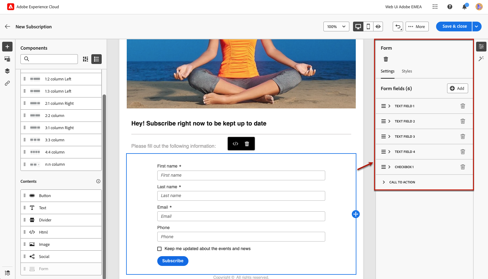
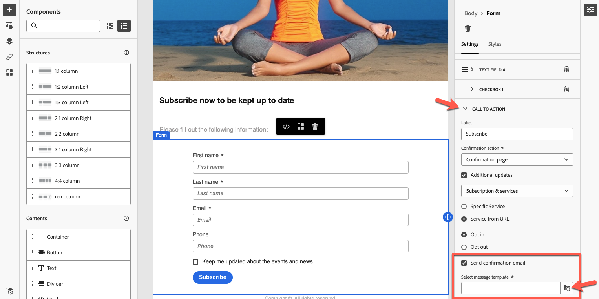

# 랜딩 페이지별 콘텐츠 정의 {#lp-content}

>[!CONTEXTUALHELP]
>id="ac_lp_components"
>title="콘텐츠 구성 요소 사용"
>abstract="콘텐츠 구성 요소는 랜딩 페이지 레이아웃 제작에 사용할 수 있는 빈 콘텐츠 플레이스홀더입니다. 사용자가 선택 항목을 선택하고 제출할 수 있도록 하는 특정 콘텐츠를 정의하려면 양식 구성 요소를 사용합니다."

>[!CONTEXTUALHELP]
>id="acw_landingpages_primarypage"
>title="기본 페이지의 설정 정의"
>abstract="기본 페이지는 이메일이나 웹 사이트 등과 같이 사용자가 랜딩 페이지에 대한 링크를 클릭한 후 사용자에게 즉시 표시됩니다."

랜딩 페이지의 모든 페이지 콘텐츠를 편집할 수 있습니다.

사용자가 랜딩 페이지 링크를 클릭하면 즉시 표시되는 첫 번째 페이지가 이미 선택한 템플릿에 대한 [랜딩 페이지별 양식 구성 요소](#use-form-component)<!-- to enable users to select and submit their choices-->로 채워져 있습니다.

**[!UICONTROL Confirmation]**, **[!UICONTROL Error]** 및 **[!UICONTROL Expiration]** 페이지의 콘텐츠도 미리 채워져 있습니다. 필요에 따라 편집합니다.

랜딩 페이지의 [스타일](#lp-form-styles)을(를) 정의할 수도 있습니다.

랜딩 페이지 콘텐츠를 추가로 디자인하려면 다음 작업을 수행하십시오.

* 이메일을 디자인하는 데 사용되는 구성 요소와 동일한 구성 요소를 사용합니다. [자세히 알아보기](../email/content-components.md#add-content-components)

* 이메일과 동일한 방식으로 랜딩 페이지에 조건부 콘텐츠를 추가합니다. [자세히 알아보기](../personalization/conditions.md#condition-condition-builder)

  >[!AVAILABILITY]
  >
  >이 기능은 LA(Limited Availability)에 있습니다. 이는 **Adobe Campaign Standard에서 Adobe Campaign v8**&#x200B;로 마이그레이션하는 고객으로 제한되며 다른 환경에는 배포할 수 없습니다.

## 양식 구성 요소 사용 {#use-form-component}

>[!CONTEXTUALHELP]
>id="ac_lp_formfield"
>title="양식 구성 요소 필드 설정"
>abstract="수신자가 랜딩 페이지에서 선택 사항을 표시하고 제출하는 방법을 정의합니다."

>[!CONTEXTUALHELP]
>id="acw_landingpages_calltoaction"
>title="버튼 클릭 시 나타나는 결과"
>abstract="사용자가 랜딩 페이지 양식을 제출할 때 나타나는 결과를 정의합니다."

사용자가 랜딩 페이지에서 선택한 항목을 선택하고 제출할 수 있는 특정 콘텐츠를 정의하려면 **[!UICONTROL 양식]** 구성 요소를 편집하십시오. 아래 단계를 수행합니다.

1. 선택한 템플릿에 대한 캔버스에 랜딩 페이지별 **[!UICONTROL 양식]** 구성 요소가 이미 표시됩니다.

   >[!NOTE]
   >
   >**[!UICONTROL Form]** 구성 요소는 같은 페이지에서 한 번만 사용할 수 있습니다.

1. 선택합니다. 양식의 여러 필드를 편집할 수 있도록 **[!UICONTROL 양식 콘텐츠]** 탭이 오른쪽 팔레트에 표시됩니다.

   {zoomable="yes"}

   >[!NOTE]
   >
   >언제든지 **[!UICONTROL 스타일]** 탭으로 전환하여 양식 구성 요소 콘텐츠의 스타일을 편집합니다. [자세히 알아보기](#lp-form-styles)

1. 필요한 경우 첫 번째 텍스트 필드를 확장하거나 **[!UICONTROL 추가]** 단추를 사용하여 텍스트 필드를 추가합니다. **[!UICONTROL 텍스트 필드 1]** 섹션에서 사용자가 값을 입력하기 전에 필드 유형, 업데이트할 데이터베이스 필드, 레이블 및 필드 내부에 표시된 텍스트를 편집합니다.

   {zoomable="yes"}

1. 필요한 경우 **[!UICONTROL 양식 필드 필수]** 옵션을 선택하십시오. 이 경우 랜딩 페이지는 사용자가 이 필드를 입력한 경우에만 제출할 수 있습니다.

   >[!NOTE]
   >
   >필수 필드를 입력하지 않으면 사용자가 페이지를 제출할 때 오류 메시지가 표시됩니다.

1. 확인란이 있는 경우 확장하거나 **[!UICONTROL 추가]** 단추를 사용하여 확인란을 추가하십시오. 해당 확인란이 데이터베이스의 서비스 또는 필드를 업데이트해야 하는지 선택합니다.

   {zoomable="yes"}

   **[!UICONTROL 구독 및 서비스]**&#x200B;을(를) 선택하는 경우 목록에서 [서비스](../audience/manage-services.md)을(를) 선택하고 아래의 두 옵션 중에서 선택하십시오.

   * **[!UICONTROL 선택한 경우 가입]**: 사용자가 동의(옵트인)하려면 확인란을 선택해야 합니다.
   * **[!UICONTROL 선택한 경우 구독 취소]**: 동의를 제거하려면(옵트아웃) 확인란을 선택해야 합니다.

   **[!UICONTROL 필드]**&#x200B;을(를) 선택하는 경우 [특성 목록](../get-started/attributes.md)에서 필드를 선택하고 아래 두 옵션 중에서 선택하십시오.

   * **[!UICONTROL 선택한 경우 예]**.
   * **[!UICONTROL 선택한 경우 없음]**.

1. 텍스트 필드, 라디오 버튼, 확인란, 드롭다운 목록 등 필드를 필요한 만큼 삭제하고 추가합니다.

1. 모든 필드가 추가되거나 업데이트되면 **[!UICONTROL 콜 투 액션]**&#x200B;을 클릭하여 해당 섹션을 확장합니다. 이를 통해 **[!UICONTROL Form]** 구성 요소에서 단추의 동작을 정의할 수 있습니다. [방법 알아보기](#define-actions-on-form-submission)

   {zoomable="yes"}

1. 콘텐츠를 저장하여 [랜딩 페이지 속성](create-lp.md#create-landing-page)(으)로 돌아갑니다.

### 양식 제출 시 작업 정의 {#define-actions-on-form-submission}

1. 버튼을 클릭할 때의 상황을 정의합니다.

   * **[!UICONTROL 확인 페이지]**: 기본적으로 사용자는 현재 랜딩 페이지에 설정된 **[!UICONTROL 확인]** 페이지로 리디렉션됩니다.

   * **[!UICONTROL 리디렉션 URL]**: 사용자가 리디렉션되는 페이지의 URL을 입력하십시오.

   * **[!UICONTROL 랜딩 페이지]**: 리디렉션할 사용자를 위한 다른 랜딩 페이지를 선택하십시오. 선택한 랜딩 페이지를 적절하게 구성해야 합니다.

1. 양식을 제출할 때 추가로 업데이트하려면 **[!UICONTROL 추가 업데이트]**&#x200B;를 선택하고 업데이트할 항목을 선택하십시오.
   * 구독 [서비스](../audience/manage-services.md) - 양식을 제출할 때 사용자를 옵트인 또는 옵트아웃할지 여부를 정의합니다. 이메일을 디자인할 때 이 랜딩 페이지에 대한 **[!UICONTROL 랜딩 페이지]** 유형 링크를 정의하면 선택한 서비스가 자동으로 사용됩니다. [링크 삽입에 대한 자세한 정보](../email/message-tracking.md)

     >[!NOTE]
     >
     >이 랜딩 페이지에서 여러 서비스를 사용하려면 아래 설명된 **[!UICONTROL URL의 서비스]** 옵션을 사용하십시오.

   * 채널 - 양식을 채울 때 사용되는 이메일 주소입니다.
   * 모든 채널 - 양식 제출 시 사용자가 모든 채널에서 브랜드의 모든 통신으로/에서 (선택한 템플릿에 따라) 옵트인 또는 옵트아웃됩니다.
   * 데이터베이스의 필드 - 속성 목록에서 필드를 선택하고 양식 제출 시 True 또는 False로 설정해야 하는지 여부를 정의합니다.

   {zoomable="yes"}

1. **[!UICONTROL URL의 서비스]** 옵션을 선택하여 랜딩 페이지를 여러 서비스에 사용할 수 있도록 하여 동적으로 만듭니다. 양식을 제출할 때 사용자를 옵트인할지 또는 옵트아웃할지 여부를 정의합니다.

   >[!AVAILABILITY]
   >
   >이 기능은 LA(Limited Availability)에 있습니다. 이는 **Adobe Campaign Standard에서 Adobe Campaign v8**&#x200B;로 마이그레이션하는 고객으로 제한되며 다른 환경에는 배포할 수 없습니다.

   양식 구성 요소의 URL 설정에서 {zoomable="yes"}

   이메일을 디자인할 때 이 랜딩 페이지에 대한 **[!UICONTROL 랜딩 페이지]** 유형 링크를 정의하는 경우 목록에서 서비스를 선택할 수 있습니다. 그런 다음 이 랜딩 페이지에 대한 다른 링크를 정의할 때 다른 서비스를 선택할 수 있습니다. [링크 삽입에 대한 자세한 정보](../email/message-tracking.md)

   {zoomable="yes"}

1. 랜딩 페이지 제출 시 메시지를 보냅니다. [자세히 알아보기](#lp-message)

### 제출 후 메시지 보내기 {#lp-message}

>[!AVAILABILITY]
>
>이 기능은 LA(Limited Availability)에 있습니다. 이는 **Adobe Campaign Standard에서 Adobe Campaign v8**&#x200B;로 마이그레이션하는 고객으로 제한되며 다른 환경에는 배포할 수 없습니다.

랜딩 페이지를 제출한 후 확인 메시지를 자동으로 보내려면 다음 단계를 수행합니다.

1. **[!UICONTROL CALL TO ACTION]** 섹션에서 **[!UICONTROL 확인 이메일 보내기]** 옵션을 확인하십시오.

1. 연결된 드롭다운 목록에서 전송해야 하는 트랜잭션 메시지 템플릿을 선택합니다.

{zoomable="yes"}

## 랜딩 페이지 양식 스타일 정의 {#lp-form-styles}

1. 양식 구성 요소 콘텐츠의 스타일을 수정하려면 언제든지 **[!UICONTROL 스타일]** 탭으로 전환하십시오.

1. **[!UICONTROL 텍스트 필드]** 섹션이 기본적으로 확장되어 있습니다. 레이블 글꼴, 레이블의 위치, 필드 배경색 또는 필드 테두리와 같은 텍스트 필드의 모양을 편집할 수 있습니다.

   {zoomable="yes"}

1. **[!UICONTROL Checkbox]** 섹션을 확장하여 확인란 및 해당 텍스트의 모양을 정의합니다. 예를 들어 글꼴 모음과 크기 또는 확인란 테두리 색상을 조정합니다.

   {zoomable="yes"}

1. 양식에 추가했을 수 있는 다른 필드(라디오 버튼, 드롭다운 목록, 날짜 및 시간 등)에 해당하는 다른 섹션을 확장하고 편집합니다.

1. **[!UICONTROL 콜 투 액션]** 섹션을 확장하여 구성 요소 양식의 단추 모양을 수정합니다. 예를 들어, 글꼴을 변경하거나, 테두리를 추가하거나, 마우스로 가리키면 레이블 색상을 편집하거나, 단추의 정렬을 조정합니다.

   {zoomable="yes"}

   **[!UICONTROL 콘텐츠 시뮬레이션]** 단추를 사용하여 마우스로 가리키면 단추 레이블 색상과 같은 일부 설정을 미리 봅니다. [자세히 알아보기](create-lp.md#test-landing-page)

1. 변경 내용을 저장합니다.