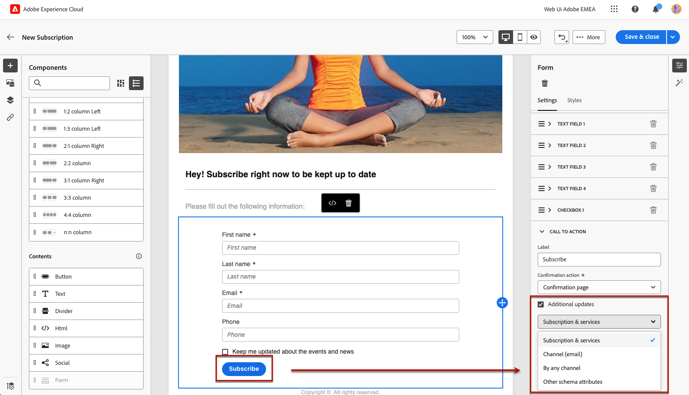

# 랜딩 페이지별 콘텐츠 정의 {#lp-content}

>[!CONTEXTUALHELP]
>id="ac_lp_components"
>title="콘텐츠 구성 요소 사용"
>abstract="콘텐츠 구성 요소는 랜딩 페이지 레이아웃 제작에 사용할 수 있는 빈 콘텐츠 플레이스홀더입니다. 사용자가 선택 사항을 선택하고 제출할 수 있는 특정 콘텐츠를 정의하려면 양식 구성 요소를 사용합니다."

랜딩 페이지의 콘텐츠를 편집할 때 이미 미리 채워져 있습니다.

기본 페이지는 이메일이나 웹 사이트 등과 같이 사용자가 랜딩 페이지에 대한 링크를 클릭한 후 즉시 표시되는 페이지입니다. 기본 페이지는 이미 다음으로 채워져 있습니다. [랜딩 페이지별 양식 구성 요소](#use-form-component) 을 사용하여 사용자가 자신의 선택 항목을 선택하고 제출할 수 있습니다. 다음을 정의할 수도 있습니다. [랜딩 페이지별 스타일](#lp-form-styles).

랜딩 페이지 콘텐츠를 추가로 디자인하기 위해 이메일과 동일한 구성 요소를 사용할 수 있습니다. [자세히 알아보기](../email/content-components.md#add-content-components)

<!--
The content of the **[!UICONTROL Confirmation]**, **[!UICONTROL Error]** and **[!UICONTROL Expiration]** pages is also pre-filled. Edit them as needed.

Set the subscription form to the appropriate fields from the database to make sure it will work correctly.

The landing page default fields are already there for the selected template.

>[!NOTE]
>
>You can also create a click-through landing page without a **[!UICONTROL Form]** component. In that case, the landing page will be displayed to users, but they will not be required to submit any form. This can be useful if you only want to showcase a landing page without requiring any action from your recipients such as opt-in or opt out, or want to provide information that doesn't require user input.

Using the landing page content designer, you can also leverage contextual data coming from the primary page in a subpage. [Learn more](#use-primary-page-context)-->

## 양식 구성 요소 사용 {#use-form-component}

>[!CONTEXTUALHELP]
>id="ac_lp_formfield"
>title="양식 구성 요소 필드 설정"
>abstract="수신자가 랜딩 페이지에서 선택 사항을 표시하고 제출하는 방법을 정의합니다."

>[!CONTEXTUALHELP]
>id="acw_landingpages_calltoaction"
>title="버튼 클릭 시 나타나는 결과"
>abstract="사용자가 랜딩 페이지 양식을 제출할 때 나타나는 결과를 정의합니다."

사용자가 랜딩 페이지에서 선택 사항을 선택하고 제출할 수 있도록 하는 특정 콘텐츠를 정의하려면 **[!UICONTROL 양식]** 구성 요소. 이렇게 하려면 아래 단계를 수행합니다.

1. 랜딩 페이지별 **[!UICONTROL 양식]** 선택한 템플릿에 대한 구성 요소가 캔버스에 이미 표시됩니다.

   >[!NOTE]
   >
   >다음 **[!UICONTROL 양식]** 구성 요소는 동일한 페이지에서 한 번만 사용할 수 있습니다.

1. 선택합니다. 다음 **[!UICONTROL 양식 콘텐츠]** 양식의 여러 필드를 편집할 수 있는 탭이 오른쪽 팔레트에 표시됩니다.

   

   >[!NOTE]
   >
   >다음으로 전환 **[!UICONTROL 스타일]** 언제든지 탭을 클릭하여 양식 구성 요소 콘텐츠의 스타일을 편집할 수 있습니다. [자세히 알아보기](#lp-form-styles)

1. 첫 번째 텍스트 필드를 확장합니다. 다음에서 **[!UICONTROL 텍스트 필드 1]** 섹션에서 필드 유형, 데이터베이스의 필드, 레이블 및 사용자가 필드를 채우기 전에 필드 내부에 표시되는 텍스트를 편집할 수 있습니다.

   

1. 다음 확인: **[!UICONTROL 양식 필드를 필수 항목으로 설정]** 필요한 경우 옵션을 선택합니다. 이 경우 랜딩 페이지는 사용자가 이 필드를 입력한 경우에만 제출할 수 있습니다.

   >[!NOTE]
   >
   >필수 필드를 입력하지 않으면 사용자가 페이지를 제출할 때 오류 메시지가 표시됩니다.

1. 확인란을 추가합니다. 해당 확인란이 데이터베이스의 서비스 또는 필드를 업데이트해야 하는지 선택합니다.

   

   이 확인란이 사용자를 옵트인 또는 옵트아웃할지 여부를 정의합니다. 아래 두 옵션 중에서 선택합니다.

   * **[!UICONTROL 선택한 경우 구독]**: 사용자가 동의(옵트인)하려면 확인란을 선택해야 합니다.
   * **[!UICONTROL 선택한 경우 구독 취소]**: 동의를 제거(옵트아웃)하려면 사용자가 확인란을 선택해야 합니다.

1. 필요한 만큼 텍스트 필드 및/또는 확인란을 삭제하고 추가할 수 있습니다.

1. 원하는 확인란 및/또는 텍스트 필드를 모두 추가한 후 **[!UICONTROL 클릭 유도 문안]** 를 클릭하여 해당 섹션을 확장합니다. 에서 버튼의 동작을 정의할 수 있습니다 **[!UICONTROL 양식]** 구성 요소.

   

1. 버튼을 클릭하면 발생할 작업을 정의합니다.

   * **[!UICONTROL 확인 페이지]**: 사용자가 로 리디렉션됩니다. **[!UICONTROL 확인]** 현재 랜딩 페이지에 대한 페이지 세트입니다.

   * **[!UICONTROL 리디렉션 URL]**: 사용자를 리디렉션할 페이지의 URL을 입력합니다.

1. 양식을 제출할 때 추가로 업데이트하려면 을(를) 선택합니다 **[!UICONTROL 추가 업데이트]**, 선택 **[!UICONTROL 옵트인]** 또는 **[!UICONTROL 옵트아웃]**&#x200B;을 클릭하고 구독 목록을 업데이트하려는 경우 사용되는 채널 또는 이메일 주소만 정의합니다.

   

1. 콘텐츠를 저장하여 다음으로 돌아가기 [랜딩 페이지 속성](create-lp.md).

## 랜딩 페이지 양식 스타일 정의 {#lp-form-styles}

1. 양식 구성 요소 콘텐츠의 스타일을 수정하려면 언제든지 **[!UICONTROL 스타일]** 탭.

   

1. 다음 **[!UICONTROL 필드]** 섹션은 기본적으로 확장되며 레이블 및 자리 표시자 글꼴, 레이블의 위치, 필드 배경색 또는 필드 테두리와 같은 텍스트 필드의 모양을 편집할 수 있습니다.

   

1. 확장 **[!UICONTROL 확인란]** 확인란 및 해당 텍스트의 모양을 정의하는 섹션입니다. 예를 들어 글꼴 모음이나 크기 또는 확인란 테두리 색상을 조정할 수 있습니다.

   

1. 확장 **[!UICONTROL 단추]** 구성 요소 양식에서 단추의 모양을 수정하는 섹션입니다. 예를 들어 글꼴을 변경하거나, 테두리를 추가하거나, 마우스로 가리키면 레이블 색상을 편집하거나, 단추의 정렬을 조정할 수 있습니다.

   

   마우스로 가리키면 표시되는 단추 레이블 색상과 같은 일부 설정을 **[!UICONTROL 콘텐츠 시뮬레이션]** 단추를 클릭합니다. 랜딩 페이지 테스트에 대한 자세한 정보 [여기](create-lp.md#test-landing-page).

1. 확장 **[!UICONTROL 양식 레이아웃]** 섹션 : 배경색, 패딩 또는 여백 등 레이아웃 설정을 편집합니다.

   

<!--
1. Expand the **[!UICONTROL Form error]** section to adjust the display of the error message that displays in case a problem occurs. Check the corresponding option to preview the error text on the form.

    -->

