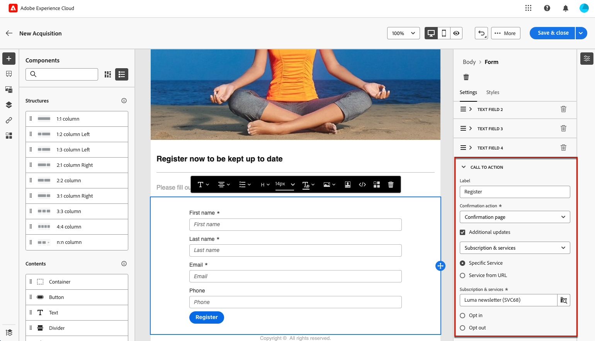

# 랜딩 페이지별 콘텐츠 정의 {#lp-content}

>[!CONTEXTUALHELP]
>id="ac_lp_components"
>title="콘텐츠 구성 요소 사용"
>abstract="콘텐츠 구성 요소는 랜딩 페이지 레이아웃 제작에 사용할 수 있는 빈 콘텐츠 플레이스홀더입니다. 사용자가 선택 사항을 선택하고 제출할 수 있는 특정 콘텐츠를 정의하려면 양식 구성 요소를 사용합니다."

랜딩 페이지의 콘텐츠를 편집할 때 이미 미리 채워져 있습니다.

사용자가 랜딩 페이지 링크를 클릭한 후 사용자에게 즉시 표시되는 첫 번째 페이지는 이미 로 채워져 있습니다. [랜딩 페이지별 양식 구성 요소](#use-form-component) 선택한 템플릿<!-- to enable users to select and submit their choices-->. 다음을 정의할 수도 있습니다. [랜딩 페이지의 스타일](#lp-form-styles).

랜딩 페이지 콘텐츠를 추가로 디자인하기 위해 이메일과 동일한 구성 요소를 사용할 수 있습니다. [자세히 알아보기](../email/content-components.md#add-content-components)

의 콘텐츠 **[!UICONTROL 확인]**, **[!UICONTROL 오류]** 및 **[!UICONTROL 만료]** 페이지도 미리 채워집니다. 필요에 따라 편집합니다.

## 양식 구성 요소 사용 {#use-form-component}

>[!CONTEXTUALHELP]
>id="ac_lp_formfield"
>title="양식 구성 요소 필드 설정"
>abstract="수신자가 랜딩 페이지에서 선택 사항을 표시하고 제출하는 방법을 정의합니다."

>[!CONTEXTUALHELP]
>id="acw_landingpages_calltoaction"
>title="버튼 클릭 시 나타나는 결과"
>abstract="사용자가 랜딩 페이지 양식을 제출할 때 나타나는 결과를 정의합니다."

사용자가 랜딩 페이지에서 선택 사항을 선택하고 제출할 수 있도록 하는 특정 콘텐츠를 정의하려면 **[!UICONTROL 양식]** 구성 요소. 이렇게 하려면 아래 단계를 수행합니다.

1. 랜딩 페이지별 **[!UICONTROL 양식]** 선택한 템플릿에 대한 구성 요소가 캔버스에 이미 표시됩니다.

   >[!NOTE]
   >
   >다음 **[!UICONTROL 양식]** 구성 요소는 동일한 페이지에서 한 번만 사용할 수 있습니다.

1. 선택합니다. 다음 **[!UICONTROL 양식 콘텐츠]** 양식의 여러 필드를 편집할 수 있는 탭이 오른쪽 팔레트에 표시됩니다.

   {zoomable=&quot;yes&quot;}

   >[!NOTE]
   >
   >다음으로 전환 **[!UICONTROL 스타일]** 언제든지 탭을 클릭하여 양식 구성 요소 콘텐츠의 스타일을 편집할 수 있습니다. [자세히 알아보기](#lp-form-styles)

1. 필요한 경우 첫 번째 텍스트 필드를 확장하거나 **[!UICONTROL 추가]** 단추를 클릭합니다. 다음에서 **[!UICONTROL 텍스트 필드 1]** 섹션에서 필드 유형, 업데이트할 데이터베이스 필드, 레이블 및 사용자가 값을 입력하기 전에 필드 내에 표시될 텍스트를 편집할 수 있습니다.

   {zoomable=&quot;yes&quot;}

1. 다음 확인: **[!UICONTROL 양식 필드를 필수 항목으로 설정]** 필요한 경우 옵션을 선택합니다. 이 경우 랜딩 페이지는 사용자가 이 필드를 입력한 경우에만 제출할 수 있습니다.

   >[!NOTE]
   >
   >필수 필드를 입력하지 않으면 사용자가 페이지를 제출할 때 오류 메시지가 표시됩니다.

1. 확인란이 있는 경우 확장하거나 **[!UICONTROL 추가]** 단추를 클릭합니다. 해당 확인란이 데이터베이스의 서비스 또는 필드를 업데이트해야 하는지 선택합니다.

   {zoomable=&quot;yes&quot;}

   다음을 선택하는 경우 **[!UICONTROL 구독 및 서비스]**&#x200B;목록에서 서비스를 선택하고 아래 두 옵션 중 하나를 선택합니다.

   * **[!UICONTROL 선택한 경우 가입]**: 사용자가 동의(옵트인)하려면 확인란을 선택해야 합니다.
   * **[!UICONTROL 선택한 경우 구독 취소]**: 동의를 제거(옵트아웃)하려면 사용자가 확인란을 선택해야 합니다.

   다음을 선택하는 경우 **[!UICONTROL 필드]**&#x200B;를 클릭하고 속성 목록에서 필드를 선택한 다음, 아래 두 옵션 중에서 선택합니다.

   * **[!UICONTROL 선택한 경우 예]**<!--TBC-->

   * **[!UICONTROL 선택된 경우 아니요]**<!--TBC-->

1. 텍스트 필드, 라디오 버튼, 확인란, 드롭다운 목록 등 필드를 삭제하거나 추가할 수 있습니다. 필요한 경우.

1. 모든 필드가 추가되거나 업데이트되면 **[!UICONTROL 클릭 유도 문안]** 를 클릭하여 해당 섹션을 확장합니다. 에서 버튼의 동작을 정의할 수 있습니다 **[!UICONTROL 양식]** 구성 요소.

   {zoomable=&quot;yes&quot;}

1. 버튼을 클릭하면 발생할 작업을 정의합니다.

   * **[!UICONTROL 확인 페이지]**: 사용자가 로 리디렉션됩니다. **[!UICONTROL 확인]** 현재 랜딩 페이지에 대한 페이지 세트입니다.

   * **[!UICONTROL 리디렉션 URL]**: 사용자를 리디렉션할 페이지의 URL을 입력합니다.

1. 양식을 제출할 때 추가로 업데이트하려면 을(를) 선택합니다 **[!UICONTROL 추가 업데이트]**&#x200B;을 클릭하고 업데이트할 항목을 선택합니다.
   * 구독 서비스 - 이 경우 양식 제출 시 사용자를 옵트인 또는 옵트아웃할지 여부를 정의합니다.
   * 양식 작성 시 사용되는 이메일 주소.
   * 모든 채널 - 양식 제출 시 사용자가 모든 채널에서 브랜드의 모든 통신으로/으로부터 옵트인 또는 옵트아웃(선택한 템플릿에 따라 다름)됩니다
   * 데이터베이스의 필드 - 속성 목록에서 필드를 선택하고 양식 제출 시 True 또는 False로 설정해야 하는지 여부를 정의합니다.

   {zoomable=&quot;yes&quot;}

1. 콘텐츠를 저장하여 다음으로 돌아가기 [랜딩 페이지 속성](create-lp.md#create-landing-page).

## 랜딩 페이지 양식 스타일 정의 {#lp-form-styles}

1. 양식 구성 요소 콘텐츠의 스타일을 수정하려면 언제든지 **[!UICONTROL 스타일]** 탭.

1. 다음 **[!UICONTROL 텍스트 필드]** 섹션은 기본적으로 확장되어 있습니다. 레이블 글꼴, 레이블의 위치, 필드 배경색 또는 필드 테두리와 같은 텍스트 필드의 모양을 편집할 수 있습니다.

   {zoomable=&quot;yes&quot;}

1. 확장 **[!UICONTROL 확인란]** 확인란 및 해당 텍스트의 모양을 정의하는 섹션입니다. 예를 들어 글꼴 패밀리와 크기 또는 확인란 테두리 색상을 조정할 수 있습니다.

   {zoomable=&quot;yes&quot;}

1. 추가한 다른 필드(라디오 버튼, 드롭다운 목록, 날짜 및 시간 등)에 해당하는 다른 섹션을 확장하거나 편집합니다. 양식입니다.

1. 확장 **[!UICONTROL 클릭 유도 문안]** 구성 요소 양식에서 단추의 모양을 수정하는 섹션입니다. 예를 들어 글꼴을 변경하거나, 테두리를 추가하거나, 마우스로 가리키면 레이블 색상을 편집하거나, 단추의 정렬을 조정할 수 있습니다.

   {zoomable=&quot;yes&quot;}

   마우스로 가리키면 표시되는 단추 레이블 색상과 같은 일부 설정을 **[!UICONTROL 콘텐츠 시뮬레이션]** 단추를 클릭합니다. [자세히 알아보기](create-lp.md#test-landing-page)

1. 변경 내용을 저장합니다.
