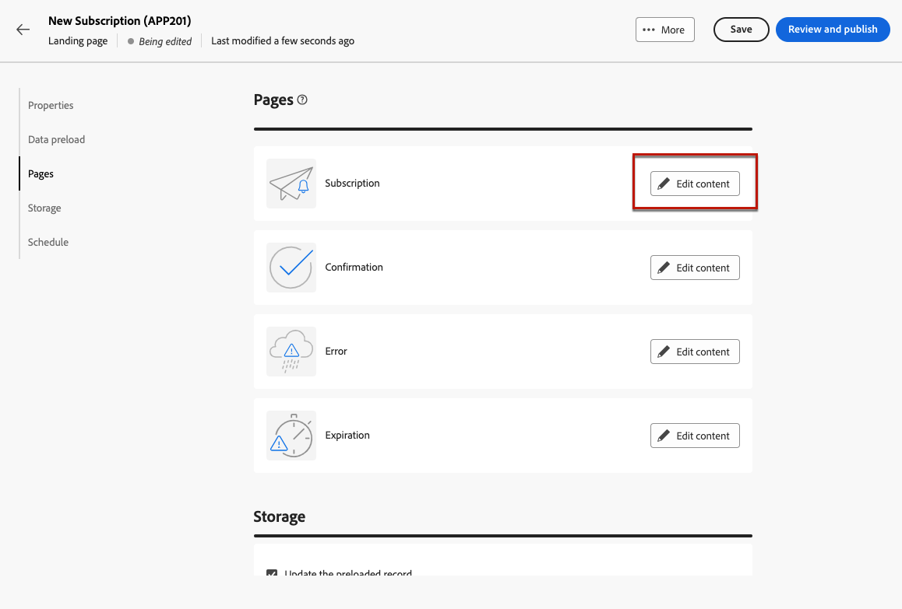

# 랜딩 페이지 사용 방법 {#lp-use-cases}

>[!CONTEXTUALHELP]
>id="acw_landingpages_url"
>title="주의해서 URL 복사"
>abstract="랜딩 페이지를 완전히 테스트하거나 활용하려면 이 링크를 웹 브라우저나 게재에 직접 복사하여 붙여넣을 수 없습니다. 대신 **콘텐츠 시뮬레이션** 함수를 사용하여 이를 테스트하고, 설명서에 설명된 단계에 따라 랜딩 페이지를 적절히 사용하십시오."

랜딩 페이지를 적절히 사용하려면 전용 옵션을 사용하여 게재에서 링크로 참조해야 합니다.

>[!CAUTION]
>
>랜딩 페이지를 완전히 활용하려면 게시된 게재 대시보드에 표시된 링크를 게재 또는 웹 페이지에 바로 복사하여 붙여넣을 수 없습니다.

다음에서 [!DNL Adobe Campaign Web] 4가지 기본 템플릿을 사용하면 다양한 사용 사례를 구현할 수 있습니다. 그러나 주요 단계는 동일하게 유지되며 아래에 자세히 설명되어 있습니다.

1. [랜딩 페이지 만들기](create-lp.md#create-landing-page) 사용 사례에 따라 원하는 템플릿을 선택합니다.

   * [고객 확보](#lp-acquisition)
   * [구독](#lp-subscription)
   * [구독 취소](#lp-unsubscription)
   * [차단 목록에 추가](#lp-denylist)

1. 랜딩 페이지 속성 및 설정을 정의합니다.

   

1. 경우에 따라 **[!UICONTROL 고객 확보]**, **[!UICONTROL 구독]**, **[!UICONTROL 구독 취소]** 또는 **[!UICONTROL 차단 목록]** 페이지를 가리키도록 업데이트하는 중입니다.

1. 페이지의 콘텐츠가 표시됩니다. 랜딩 페이지 양식에 해당하는 부분을 선택합니다.

   

1. 필요에 따라 랜딩 페이지 레이블 및 필드를 다른 횟수만큼 업데이트합니다. 나머지 콘텐츠를 원하는 대로 편집하고 변경 사항을 저장한 다음 닫습니다.

1. 각 사용 사례에 대해 아래에 설명된 단계를 따르십시오.

1. 편집 **[!UICONTROL 확인]** 필요에 따라 페이지를 **[!UICONTROL 오류]** 및 **[!UICONTROL 만료]** 페이지. 등록 양식을 제출하면 수신자에게 표시됩니다.

   

1. 테스트 및 [게시](create-lp.md#publish-landing-page) 랜딩 페이지입니다.

1. 만들기 [이메일](../email/create-email.md) 랜딩 페이지로 트래픽을 유도하는 게재.

1. [링크 삽입](../email/message-tracking.md#insert-links) 을 메시지 콘텐츠에 추가합니다. 선택 **[!UICONTROL 랜딩 페이지]** (으)로 **[!UICONTROL 링크 유형]** 및 선택 [랜딩 페이지](create-lp.md#configure-primary-page) 생성했습니다.

   

   >[!NOTE]
   >
   >메시지를 보내려면 선택한 랜딩 페이지가 아직 만료되지 않았는지 확인하십시오. 만료 날짜를 업데이트하는 방법 알아보기 [이 섹션에서](create-lp.md#create-landing-page).

이메일을 수신하면 수신자가 랜딩 페이지 링크를 클릭하고 랜딩 페이지 양식을 제출하면 확인 페이지로 이동하며 랜딩 페이지에 정의된 다른 작업이 적용됩니다(예: 사용자가 서비스에 가입되거나 더 이상 귀하로부터 커뮤니케이션을 받지 않음).

다음은 을 사용할 수 있는 방법의 몇 가지 예입니다 [!DNL Adobe Campaign] 고객이 일부 또는 모든 커뮤니케이션 수신을 옵트인/옵트아웃하도록 하는 랜딩 페이지

## 프로필 획득 {#lp-acquisition}

1. [랜딩 페이지 만들기](create-lp.md#create-landing-page). 다음 항목 선택 **[!UICONTROL 고객 확보]** 템플릿.

1. 랜딩 페이지 속성 및 설정을 정의합니다.

   

1. 다음 항목 선택 **[!UICONTROL 고객 확보]** 컨텐츠를 편집할 페이지입니다.

1. 페이지의 콘텐츠가 표시됩니다. 랜딩 페이지 양식에 해당하는 부분을 선택합니다.

## 서비스 구독 {#lp-subscription}

가장 일반적인 사용 사례 중 하나는 고객을 다음으로 초대하는 것입니다. [서비스 구독](../audience/manage-services.md) (뉴스레터 또는 이벤트 등) 랜딩 페이지를 통해. 아래 단계를 수행합니다.

<!--For example, let's say you organize an event next month and you want to launch an event registration campaign. To do this, you're going to send an email including a link to a landing page that will enable your recipients to register for this event. The users who register will be added to the subscription list that you created for this purpose.-->

1. 서비스를 만들 때 이벤트를 쉽게 선택할 수 있도록 이벤트를 구독하는 사용자에 대한 확인 템플릿을 만드는 것부터 시작합니다. [자세히 알아보기](../audience/manage-services.md#create-confirmation-message)

   

1. 등록된 사용자를 이벤트에 저장하는 구독 서비스를 만듭니다. [서비스를 만드는 방법 알아보기](../audience/manage-services.md)

1. 구독 시 사용자가 받게 되는 확인 이메일로 만든 템플릿을 선택합니다.

   

1. [랜딩 페이지 만들기](create-lp.md#create-landing-page) 을 클릭하여 수신자가 이벤트에 등록할 수 있도록 합니다. 다음 항목 선택 **[!UICONTROL 구독]** 템플릿.

   <!---->

1. 랜딩 페이지 속성 및 설정을 정의합니다.

   <!---->

1. 다음 항목 선택 **[!UICONTROL 구독]** 컨텐츠를 편집할 페이지입니다.

   

1. 페이지의 콘텐츠가 표시됩니다. 랜딩 페이지 양식에 해당하는 부분을 선택하고 **[!UICONTROL 확인란 1]** 섹션.

   다음에서 **[!UICONTROL 구독 및 서비스]** 필드에서 이벤트에 대해 만든 서비스를 선택합니다. 나가기 **[!UICONTROL 선택한 경우 구독]** 옵션이 활성화되었습니다.

   

1. 예를 들어 뉴스레터 구독을 제공하는 추가 확인란을 추가할 수 있습니다.

<!--

1. You can also update the profiles who register for your event for the email channel. Expand the **[!UICONTROL Call to action]** section and select Additional updates.

    -->

1. 필요에 따라 랜딩 페이지 레이블 및 필드를 다른 횟수만큼 업데이트합니다. 나머지 콘텐츠를 원하는 대로 편집하고 변경 사항을 저장한 다음 닫습니다.

1. 편집 **[!UICONTROL 확인]** 필요에 따라 페이지를 **[!UICONTROL 오류]** 및 **[!UICONTROL 만료]** 페이지. 등록 양식을 제출하면 수신자에게 표시됩니다.

   

1. 테스트 및 [게시](create-lp.md#publish-landing-page) 랜딩 페이지입니다.

1. 만들기 **이메일** 등록 랜딩 페이지로 트래픽을 유도하는 게재. 이제 이벤트에 대한 등록이 열렸음을 알리는 이메일을 디자인합니다.

1. [링크 삽입](../email/message-tracking.md#insert-links) 을 메시지 콘텐츠에 추가합니다. 선택 **[!UICONTROL 랜딩 페이지]** (으)로 **[!UICONTROL 링크 유형]** 및 선택 [랜딩 페이지](create-lp.md#configure-primary-page) 등록을 위해 생성한 것입니다.

   

   >[!NOTE]
   >
   >메시지를 보내려면 선택한 랜딩 페이지가 아직 만료되지 않았는지 확인하십시오. 만료 날짜를 업데이트하는 방법 알아보기 [이 섹션에서](create-lp.md#create-landing-page).

이메일을 수신하면 수신자가 랜딩 페이지 링크를 클릭하고 랜딩 페이지 양식을 제출하면 확인 페이지로 이동되고 구독 목록에 추가됩니다.

## 구독 취소 {#lp-unsubscription}

1. [랜딩 페이지 만들기](create-lp.md#create-landing-page). 다음 항목 선택 **[!UICONTROL 구독 취소]** 템플릿.

1. 랜딩 페이지 속성 및 설정을 정의합니다.

1. 다음 항목 선택 **[!UICONTROL 구독 취소]** 컨텐츠를 편집할 페이지입니다.

1. 페이지의 콘텐츠가 표시됩니다. 랜딩 페이지 양식에 해당하는 부분을 선택합니다.

## 옵트아웃 랜딩 페이지 설정 {#lp-denylist}

수신자가 브랜드로부터 커뮤니케이션 수신을 거부할 수 있는 기능을 제공하는 것은 법적 요구 사항입니다. 에서 해당 법률에 대해 자세히 알아보십시오. [Experience Platform 설명서](https://experienceleague.adobe.com/docs/experience-platform/privacy/regulations/overview.html#regulations){target="_blank"}.

따라서 항상 **구독 취소 링크** 수신자에게 보내는 모든 이메일:

* 이 링크를 클릭하면 수신자는 옵트아웃을 확인하는 버튼이 포함된 랜딩 페이지로 이동합니다.
* 옵트아웃 버튼을 클릭하면 프로필 데이터가 이 정보로 업데이트됩니다.

다음을 설정할 수 있습니다. **[!UICONTROL 차단 목록]** 사용자가 모든 게재에서 옵트아웃할 수 있는 랜딩 페이지.

사용자에게 모든 게재에서 옵트아웃할 수 있는 기능을 제공하려면 을(를) 만들고 게시해야 합니다 **[!UICONTROL 차단 목록]** 랜딩 페이지.

사용자가 랜딩 페이지 링크를 클릭하면 **[!UICONTROL 더 이상 연락하지 않음(모든 채널에서)]** 프로필의 옵션이 자동으로 선택됩니다.

정의 **[!UICONTROL 옵트아웃]** 확인란 및 업데이트를 선택합니다. **[!UICONTROL 채널(이메일)]**: 랜딩 페이지에서 옵트아웃 상자를 확인하는 프로필은 모든 통신에서 옵트아웃됩니다.

메시지가 수신되면 수신자가 이메일의 구독 취소 링크를 클릭하면 랜딩 페이지가 표시됩니다.

수신자가 확인란을 선택하고 양식을 제출하는 경우:

* 옵트아웃 수신자는 확인 메시지 화면으로 리디렉션됩니다.

* 프로필 데이터가 업데이트되며, 다시 구독하지 않는 한 브랜드로부터 커뮤니케이션을 받지 않습니다.

해당 프로필의 선택 사항이 업데이트되었는지 확인하려면 프로필 로 이동하여 프로필을 선택합니다.

