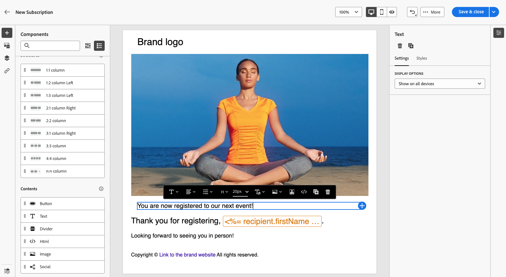
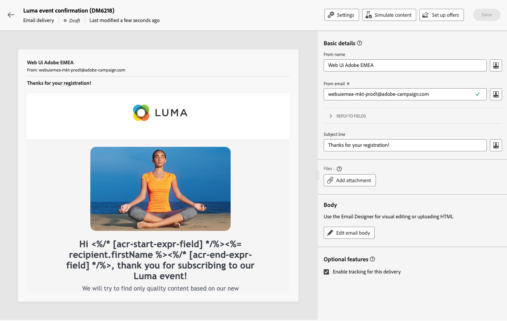

# 랜딩 페이지 사용 방법 {#lp-use-cases}

>[!CONTEXTUALHELP]
>id="acw_landingpages_url"
>title="URL 복사 시 주의"
>abstract="랜딩 페이지를 완전히 테스트하거나 활용하려는 경우, 이 링크를 웹 브라우저나 게재에 직접 복사하여 붙여넣을 수 없습니다. 대신 **콘텐츠 시뮬레이션** 기능을 사용하여 랜딩 페이지를 테스트하고 설명서에 기재된 단계에 따라 랜딩 페이지를 적절하게 활용하면 됩니다."

>[!CONTEXTUALHELP]
>id="acw_landingpages_templates"
>title="URL 복사 시 주의"
>abstract="랜딩 페이지를 생성할 때 기본으로 제공되는 4가지 템플릿을 사용하면 Campaign 데이터베이스에 프로필을 추가 &#x200B;&#x200B;또는 업데이트하고, 고객을 서비스에 구독시키고, 고객의 서비스 구독을 취소하고, 사용자를 옵트아웃하는 등 다양한 사용 사례를 구현할 수 있습니다."
>additional-url="https://experienceleague.adobe.com/docs/campaign-web/v8/landing-pages/create-lp.html?lang=ko-KR#create-landing-page" text="랜딩 페이지 만들기"

랜딩 페이지를 적절히 사용하려면 전용 옵션을 사용하여 게재에서 링크로 참조해야 합니다.

>[!CAUTION]
>
>랜딩 페이지를 완전히 활용하려면 게시된 게재 대시보드에 표시된 링크를 게재 또는 웹 페이지에 바로 복사하여 붙여넣을 수 없습니다. 이 섹션에서 이 작업을 올바르게 수행하는 방법을 알아봅니다.

다음에서 [!DNL Adobe Campaign Web] 4가지 기본 템플릿을 사용하면 다양한 사용 사례를 구현할 수 있습니다. 그러나 주요 단계는 동일하게 유지되며 아래에 자세히 설명되어 있습니다.

1. [랜딩 페이지 만들기](create-lp.md#create-landing-page) 사용 사례에 따라 원하는 템플릿을 선택합니다.

1. 랜딩 페이지 속성 및 설정을 정의합니다.

   {zoomable=&quot;yes&quot;}

1. 경우에 따라 **[!UICONTROL 고객 확보]**, **[!UICONTROL 구독]**, **[!UICONTROL 구독 취소]** 또는 **[!UICONTROL 차단 목록]** 페이지를 가리키도록 업데이트하는 중입니다.

1. 페이지의 콘텐츠가 표시됩니다. 랜딩 페이지 양식에 해당하는 부분을 선택합니다.

   {zoomable=&quot;yes&quot;}

1. 선택한 템플릿에 따라 콘텐츠를 편집합니다.

   * [고객 확보](#lp-acquisition)
   * [구독](#lp-subscription)
   * [구독 취소](#lp-unsubscription)
   * [차단 목록에 추가](#lp-denylist)

1. 필요에 따라 나머지 콘텐츠를 수정하고 변경 사항을 저장한 다음 닫습니다.

1. 편집 **[!UICONTROL 확인]** 필요에 따라 페이지를 **[!UICONTROL 오류]** 및 **[!UICONTROL 만료]** 페이지. 다음 **[!UICONTROL 확인]** 양식을 제출하면 수신자에게 페이지가 표시됩니다.

   {zoomable=&quot;yes&quot;}

1. [테스트](create-lp.md#test-landing-page) 및 [게시](create-lp.md#publish-landing-page) 랜딩 페이지입니다.

1. 만들기 [이메일](../email/create-email.md) 랜딩 페이지로 트래픽을 유도하는 게재.

1. [링크 삽입](../email/message-tracking.md#insert-links) 을 메시지 콘텐츠에 추가합니다. 선택 **[!UICONTROL 랜딩 페이지]** (으)로 **[!UICONTROL 링크 유형]** 만든 랜딩 페이지를 선택합니다.

   {zoomable=&quot;yes&quot;}

   >[!NOTE]
   >
   >메시지를 보내려면 선택한 랜딩 페이지가 아직 만료되지 않았는지 확인하십시오. [자세히 알아보기](create-lp.md#create-landing-page)

이메일을 수신하면 수신자가 랜딩 페이지 링크를 클릭하고 양식을 제출하는 경우:

* 확인 페이지로 이동합니다.

* 랜딩 페이지에 정의된 다른 모든 작업이 적용됩니다. 예를 들어 사용자가 서비스에 가입되거나 사용자로부터 더 이상 커뮤니케이션을 받지 않습니다.

다음은 을 사용할 수 있는 방법의 몇 가지 예입니다 [!DNL Adobe Campaign] 다양한 사용 사례의 랜딩 페이지.

## 프로필 획득 {#lp-acquisition}

첫 번째 템플릿을 사용하면 Campaign 데이터베이스에 프로필을 추가하거나 업데이트할 수 있습니다.

1. 날짜 [랜딩 페이지 만들기](create-lp.md#create-landing-page)를 선택하고 **[!UICONTROL 고객 확보]** 템플릿.

1. 랜딩 페이지 속성에서 다음을 선택해야 합니다. **[!UICONTROL 양식에 참조된 데이터로 미리 채우기]** 프로필에서 기존 정보를 미리 로드하고 중복을 주지 않도록 하기 위한 옵션입니다.

1. 다음 항목 선택 **[!UICONTROL 고객 확보]** 컨텐츠를 편집할 페이지입니다.

1. 프로필에서 수집하려는 정보에 따라 필요에 따라 텍스트 필드를 편집합니다.

1. 또한 고객이 뉴스레터 서비스를 구독하도록 초대하는 확인란을 추가할 수 있습니다. [서비스를 만드는 방법 알아보기](../audience/manage-services.md)

   {zoomable=&quot;yes&quot;}

1. 필요에 따라 콘텐츠를 조정하고 변경 사항을 저장합니다.

1. 검토 및 [게시](create-lp.md#publish-landing-page) 랜딩 페이지입니다.

1. 만들기 [이메일](../email/create-email.md) 및 [링크 추가](../email/message-tracking.md#insert-links) 랜딩 페이지로 이동합니다.

이메일을 수신하면 수신자가 랜딩 페이지 링크를 클릭하고 양식을 제출하면 프로필이 Campaign 데이터베이스에 추가되거나 제공된 정보로 업데이트됩니다.

{zoomable=&quot;yes&quot;}

고객이 뉴스레터를 수신하도록 옵트인한 경우 해당 서비스를 구독하게 됩니다.

{zoomable=&quot;yes&quot;}

## 서비스 구독 {#lp-subscription}

>[!CONTEXTUALHELP]
>id="acw_landingpages_subscription"
>title="구독 랜딩 페이지 설정"
>abstract="고객은 구독 페이지를 통해 서비스를 구독할 수 있습니다."

가장 일반적인 사용 사례 중 하나는 고객을 다음으로 초대하는 것입니다. [서비스 구독](../audience/manage-services.md) (뉴스레터 또는 이벤트 등) 랜딩 페이지를 통해. 아래 단계를 수행합니다.

<!--For example, let's say you organize an event next month and you want to launch an event registration campaign. To do this, you're going to send an email including a link to a landing page that will enable your recipients to register for this event. The users who register will be added to the subscription list that you created for this purpose.-->

1. 서비스를 만들 때 이벤트를 쉽게 선택할 수 있도록 이벤트를 구독하는 사용자에 대한 확인 템플릿을 만드는 것부터 시작합니다. [자세히 알아보기](../audience/manage-services.md#create-confirmation-message)

   {zoomable=&quot;yes&quot;}

1. 등록된 사용자를 이벤트에 저장하는 구독 서비스를 만듭니다. [서비스를 만드는 방법 알아보기](../audience/manage-services.md)

1. 구독 시 사용자가 받게 되는 확인 이메일로 만든 템플릿을 선택합니다.

   {zoomable=&quot;yes&quot;}

1. [랜딩 페이지 만들기](create-lp.md#create-landing-page) 을 클릭하여 수신자가 이벤트에 등록할 수 있도록 합니다. 다음 항목 선택 **[!UICONTROL 구독]** 템플릿.

1. 다음 항목 선택 **[!UICONTROL 구독]** 컨텐츠를 편집할 페이지입니다.

1. 페이지의 콘텐츠가 표시됩니다. 랜딩 페이지 양식에 해당하는 부분을 선택하고 **[!UICONTROL 확인란 1]** 섹션.

1. 다음에서 **[!UICONTROL 구독 및 서비스]** 필드에서 이벤트에 대해 만든 서비스를 선택합니다. 나가기 **[!UICONTROL 선택한 경우 가입]** 옵션이 활성화되었습니다.

   {zoomable=&quot;yes&quot;}
<!--
1. You can add an additional checkbox to offer subscription to your newsletter for example.-->

1. 필요에 따라 콘텐츠를 조정하고 변경 사항을 저장합니다.

1. 검토 및 [게시](create-lp.md#publish-landing-page) 랜딩 페이지입니다.

1. 만들기 [이메일](../email/create-email.md) 및 [링크 추가](../email/message-tracking.md#insert-links) 를 클릭하여 등록 랜딩 페이지로 트래픽을 유도합니다.

1. 이제 이벤트에 대한 등록이 열렸음을 알리는 이메일을 디자인합니다.

이메일을 수신하면 수신자가 랜딩 페이지 링크를 클릭하고 양식을 제출하면 확인 페이지로 이동되고 구독 목록에 추가됩니다.

## 구독 취소 {#lp-unsubscription}

고객은 랜딩 페이지를 사용하여 서비스 구독을 취소할 수 있습니다.

1. 서비스를 만들 때 사용자가 쉽게 선택할 수 있도록 서비스에서 구독 취소하는 사용자에 대한 확인 템플릿을 만들었는지 확인하십시오. [자세히 알아보기](../audience/manage-services.md#create-confirmation-message)

1. 내 [구독 서비스](../audience/manage-services.md)을(를) 통해 사용자가 구독 취소 시 받게 되는 확인 이메일로 만든 템플릿을 선택합니다.

1. [랜딩 페이지 만들기](create-lp.md#create-landing-page). 다음 항목 선택 **[!UICONTROL 구독 취소]** 템플릿.

1. 다음 항목 선택 **[!UICONTROL 구독 취소]** 컨텐츠를 편집할 페이지입니다.

1. 페이지의 콘텐츠가 표시됩니다. 랜딩 페이지 양식에 해당하는 부분을 선택합니다.

1. 다음을 추가할 수 있습니다. **[!UICONTROL 확인란]** 섹션에서 서비스를 선택하고 **[!UICONTROL 선택한 경우 구독 취소]** 옵션을 선택합니다.

   {zoomable=&quot;yes&quot;}

1. 또한 를 **[!UICONTROL 클릭 유도 문안]** 섹션을 선택하고 **[!UICONTROL 추가 업데이트]** 옵션을 선택합니다. 서비스를 선택하고 다음을 확인합니다. **[!UICONTROL 옵트아웃]** 옵션을 선택합니다.

   {zoomable=&quot;yes&quot;}

1. 필요에 따라 콘텐츠를 조정하고 변경 사항을 저장합니다.

1. 검토 및 [게시](create-lp.md#publish-landing-page) 랜딩 페이지입니다.

1. 만들기 [이메일](../email/create-email.md) 및 [링크 추가](../email/message-tracking.md#insert-links) 랜딩 페이지로 이동합니다.

이메일을 수신하면 수신자가 랜딩 페이지 링크를 클릭하고 양식을 제출하면 구독 취소 확인 페이지로 이동되고 해당 구독 서비스에서 제거됩니다.

## 차단 목록에 추가 {#lp-denylist}

수신자가 브랜드로부터 커뮤니케이션 수신을 거부할 수 있는 기능을 제공하는 것은 법적 요구 사항입니다. 따라서 항상 **구독 취소 링크** 을(를) 수신자에게 보내는 모든 이메일에 표시합니다. 이 링크를 클릭하면 수신자는 옵트아웃을 확인하는 버튼이 포함된 랜딩 페이지로 이동합니다.

다음을 설정할 수 있습니다. **[!UICONTROL 차단 목록]** 사용자가 모든 게재에서 옵트아웃할 수 있는 랜딩 페이지.

1. 날짜 [랜딩 페이지 만들기](create-lp.md#create-landing-page)를 선택하고 **[!UICONTROL 차단 목록]** 템플릿.

1. 다음 항목 선택 **[!UICONTROL 차단 목록]** 컨텐츠를 편집할 페이지입니다.

1. 확장 **[!UICONTROL 클릭 유도 문안]** 섹션을 선택하고 **[!UICONTROL 추가 업데이트]** 옵션을 선택합니다.

1. 해당 드롭다운 목록에서 을(를) 선택합니다 **[!UICONTROL 채널(이메일)]** 수신자가 이메일 커뮤니케이션에서만 옵트아웃할 수 있도록 합니다. 다음을 선택할 수도 있습니다. **[!UICONTROL 모든 채널별]** 모든 채널의 모든 통신에서 모두를 선택.

   {zoomable=&quot;yes&quot;}

1. 필요에 따라 콘텐츠를 조정하고 변경 사항을 저장합니다.

1. 검토 및 [게시](create-lp.md#publish-landing-page) 랜딩 페이지입니다.

1. 만들기 [이메일](../email/create-email.md) 및 [링크 추가](../email/message-tracking.md#insert-links) 사용자가 커뮤니케이션 수신을 거부할 수 있도록 랜딩 페이지로 이동합니다.

이메일을 수신하면 수신자가 랜딩 페이지 링크를 클릭하고 양식을 제출하면 차단 목록에 추가하다 확인 페이지로 이동되고 프로필이 제공된 정보로 업데이트됩니다.

해당 프로필의 선택 사항이 업데이트되었는지 확인하려면 **[!UICONTROL 프로필]** 메뉴를 클릭하고 해당 프로필을 선택합니다.

예를 들어 를 업데이트하도록 선택한 경우 **[!UICONTROL 채널(이메일)]** 랜딩 페이지의 옵션 **[!UICONTROL 더 이상 연락하지 않음(이메일)]** 옵션이 선택됩니다.

{zoomable=&quot;yes&quot;}

이 프로필은 다시 구독하지 않으면 브랜드로부터 이메일 통신을 받지 않습니다.
