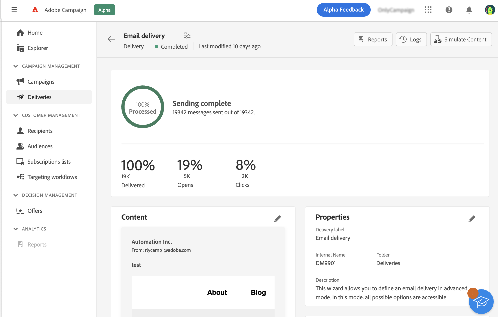

# 이메일 준비 및 보내기 {#prepare-send}

>[!CONTEXTUALHELP]
>id="acw_homepage_card5"
>title="이메일 준비 및 보내기"
>abstract="이메일을 준비하는 방법과 KPI 보내기에 대한 자세한 내용을 알아봅니다."

<!--

	show how to prepare and send the email + the live kpis in the dashboard

like acc when preparation, target calculated then send
real time KPIs, not in AJO. similar to ACS.
exclusion logs, causes
-->

<!--
send also KPIs
-->

## 보내기 준비{#prepare}

콘텐츠, 대상자 및 일정을 정의하면 메시지를 준비할 수 있습니다. 준비 중에 대상 모집단을 계산하고 대상에 포함된 각 프로필에 대해 생성된 메시지 콘텐츠를 생성합니다. 준비가 완료되면 즉시 또는 예약된 날짜와 시간에 메시지를 보낼 수 있습니다. 분석 중에 사용되는 검증 규칙은 [Campaign Classic v7 설명서](https://experienceleague.adobe.com/docs/campaign-classic/using/sending-messages/key-steps-when-creating-a-delivery/steps-validating-the-delivery.html#validation-process-with-typologies){target="_blank"}.

아래의 단계를 수행하십시오.

1. 게재 대시보드에서 **준비** 오른쪽 상단 모서리에 있는 버튼을 확인하고 확인합니다.

   

   준비 진행률이 표시됩니다. 타겟팅된 모집단의 크기에 따라 이 작업은 시간이 좀 걸릴 수 있습니다.

   >[!NOTE]
   >
   >언제든지 **준비 중지** 버튼을 클릭합니다. 준비 단계 동안 메시지가 전송되지 않습니다. 따라서 어떤 것이든 영향을 주지 않고 이 작업을 시작하거나 중지할 수 있습니다.

1. 준비가 완료되면 KPI를 확인합니다. 전송할 메시지 수가 예상과 일치하지 않는 경우 대상을 수정하고 준비를 다시 시작하십시오.

   

   다음은 다른 KPI입니다.

   * **타깃팅됨**: 타겟팅된 수신자 수
   * **게재하려면**: 전송할 메시지 수
   * **제외하려면**: 유형화 규칙에 의해 제외된 메시지 수

1. 을(를) 클릭합니다. **로그** 버튼을 클릭하고 오류가 없는지 확인합니다. 마지막 로그 메시지에는 오류 메시지와 오류 수가 표시됩니다. 자세한 내용은 이 [섹션](delivery-logs.md)을 참조하십시오.

   

준비에서 게재를 보낼 수 없는 중요한 오류를 발견하면 게재 대시보드에 준비 상태가 실패로 표시됩니다.

준비 후에 게재를 변경해야 하는 경우, 이러한 변경 사항을 고려하여 준비를 다시 시작해야 합니다.

준비가 오류 없이 완료되면 메시지를 보낼 수 있습니다. 자세한 내용은 이 [섹션](#send)을 참조하십시오.

## 메시지 보내기{#send}

준비가 완료되면 이제 메시지를 보낼 수 있습니다. 이 단계는 즉시 전송된 메시지에만 필요합니다. 메시지를 예약하면 정의된 날짜에 전송됩니다.

다음 단계를 수행합니다.

1. 게재 대시보드에서 **보내기** 오른쪽 상단 모서리의 단추를 클릭하고 확인합니다.

   

1. 전송 진행 상태가 표시됩니다. 표시되는 KPI를 확인합니다. 로그를 확인할 수도 있습니다. 자세한 내용은 이 [섹션](delivery-logs.md)을 참조하십시오.

   

   다음은 다른 KPI입니다.

   * **배달됨**: 배달된 메시지 수입니다. 표시되는 백분율은 총 보낸 메시지 수를 기반으로 합니다.
   * **열기**: 열린 메시지 수입니다. 표시된 백분율은 게재된 메시지 수와 비교하여 개별적인 열기 수입니다.
   * **클릭 수**: 이메일에서 최소 한 번 이상 클릭한 수신자 수입니다. 표시된 백분율은 게재된 메시지 수와 비교하여 개별적인 클릭 수의 비율입니다.

   >[!NOTE]
   >
   >다음 **열기** 및 **클릭 수** 표시기는 5분 후에 업데이트됩니다.

   언제든지 전송을 일시 중지한 다음 다시 시작할 수 있습니다. 전송 중에 게재를 중지하면 다시 시작할 수 없습니다.
