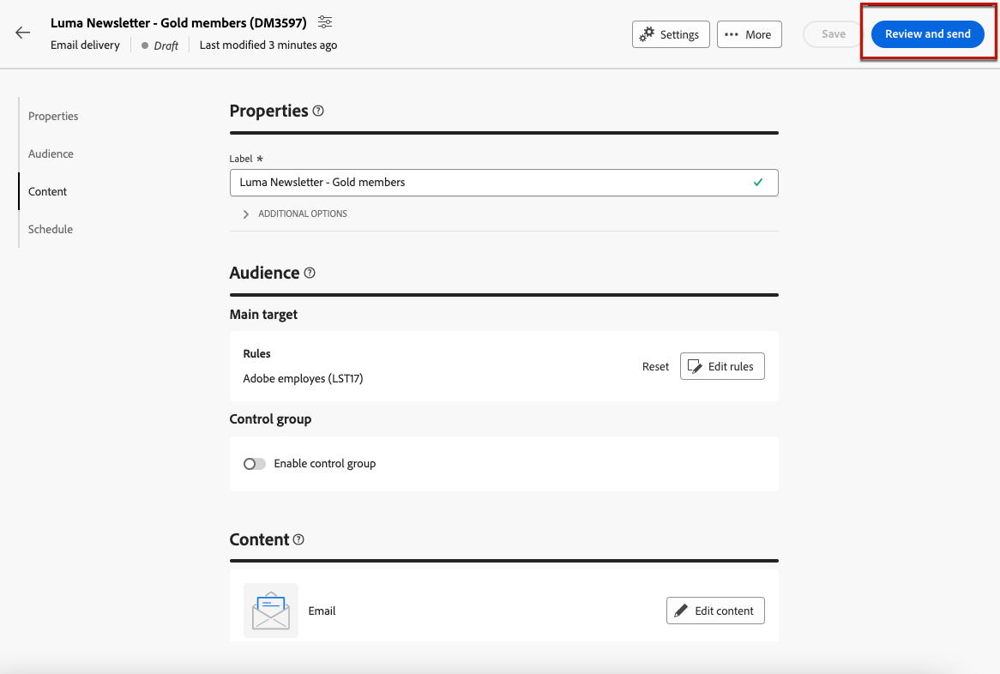

# 이메일 준비 및 전송 {#prepare-send}

## 전송 준비 {#prepare}

다음을 정의한 경우 [콘텐츠](../email/edit-content.md), [대상자](../audience/add-audience.md), 및 [예약](../msg/gs-messages.md#schedule-the-delivery-sending-gs-schedule), 이메일 게재를 준비할 준비가 되었습니다.

게재를 준비하는 동안 대상 모집단을 계산하고 대상에 포함된 각 프로필에 대해 생성된 메시지 콘텐츠를 계산합니다. 준비가 완료되면 메시지를 즉시 또는 예약된 날짜와 시간에 보낼 수 있습니다.

게재를 준비하는 동안 사용되는 유효성 검사 규칙은에 설명되어 있습니다 [Campaign v8(클라이언트 콘솔) 설명서](https://experienceleague.adobe.com/docs/campaign/campaign-v8/campaigns/send/validate/delivery-analysis.html){target="_blank"}.

전송을 준비하는 주요 단계는 아래에 나와 있습니다.

1. 게재 대시보드에서 **[!UICONTROL 검토 및 보내기]**.

   {zoomable=&quot;yes&quot;}

1. 다음을 클릭합니다. **[!UICONTROL 준비]** 오른쪽 상단 모서리에 있는 버튼을 확인하고 확인합니다.

   {zoomable=&quot;yes&quot;}

   >[!NOTE]
   >
   >게재를 예약하고 을(를) 비활성화한 경우 **[!UICONTROL 보내기 전 확인 활성화]** 옵션을 선택하면 준비 및 보내기 단계가 **[!UICONTROL 준비 및 보내기]** 단추를 클릭합니다. [예약에 대해 자세히 알아보기](../msg/gs-messages.md#gs-schedule)

1. 준비 진행률이 표시됩니다. 대상 모집단의 크기에 따라 약간의 시간이 소요될 수 있습니다.

   다음을 사용하여 언제든지 준비를 중지할 수 있습니다. **[!UICONTROL 준비 중지]** 단추를 클릭합니다.

   {zoomable=&quot;yes&quot;}

   >[!NOTE]
   >준비 단계 중에는 메시지가 전송되지 않습니다. 따라서 영향을 미칠 위험 없이 준비를 시작하거나 중지할 수 있습니다.

1. 준비가 끝나면 KPI를 확인합니다. 전송할 메시지 수가 예상과 일치하지 않으면 대상자를 수정하고 준비를 다시 시작하십시오.

   {zoomable=&quot;yes&quot;}

   표시되는 다양한 KPI는 다음과 같습니다.

   * **[!UICONTROL 타깃팅됨]**: 타겟팅된 수신자 수.
   * **[!UICONTROL 게재하기]**: 전송할 메시지 수.
   * **[!UICONTROL 제외하려면]**: 제외된 메시지 수 [유형화 규칙](../advanced-settings/delivery-settings.md#typology).

1. **[!UICONTROL 로그]** 버튼을 클릭하고 오류가 없는지 확인하십시오. 마지막 로그 메시지에는 오류 메시지와 오류 수가 표시됩니다. [자세히 알아보기](delivery-logs.md)

   {zoomable=&quot;yes&quot;}

1. 준비 과정에서 게재 전송을 방해하는 심각한 오류가 감지되면 게재 대시보드에 준비 상태가 실패로 표시됩니다.

   {zoomable=&quot;yes&quot;}

1. 준비 후 게재를 변경하는 경우 이러한 변경 사항을 고려하기 위해 준비를 다시 시작해야 합니다.

오류 없이 준비가 완료되면 메시지를 보낼 준비가 되었습니다.

## 메시지 전송 {#send}

한 번 [준비](#prepare) 이(가) 완료되었습니다. 이제 이메일을 전송할 수 있습니다.

메시지가 예약된 경우 정의된 날짜 및 시간에 전송됩니다. [자세히 알아보기](../msg/gs-messages.md#gs-schedule)

### 즉시 전송 {#send-immediately}

이메일을 즉시 보내려면 아래 단계를 따르십시오.

1. 게재 대시보드에서 **[!UICONTROL 보내기]** 오른쪽 상단의 버튼입니다.

   {zoomable=&quot;yes&quot;}

1. 메시지를 기본 타겟에게 즉시 보내려면 이 작업을 확인하십시오.

1. 전송 진행률이 표시됩니다.

### 전송 예약 {#schedule-the-send}

이메일을 나중 날짜 및 시간에 전송하도록 예약한 경우 아래 단계를 따르십시오.

1. 를 누르기 전에 **[!UICONTROL 검토 및 보내기]** 버튼에서, 이메일에 대한 일정을 정의했는지 확인하십시오. [자세히 알아보기](../msg/gs-messages.md#gs-schedule)

1. 게재 대시보드에서 **[!UICONTROL 예약됨으로 보내기 단추]** 오른쪽 상단의 버튼입니다.

   {zoomable=&quot;yes&quot;}

1. 클릭 **[!UICONTROL 전송 확인]**. 게재는 예약된 날짜에 주요 타겟에게 전송됩니다.

   >[!NOTE]
   >
   >을(를) 비활성화한 경우 **[!UICONTROL 보내기 전 확인 활성화]** 옵션을 선택하면 준비 및 보내기 단계가 **[!UICONTROL 준비 및 보내기]** 단추를 클릭합니다. [예약에 대해 자세히 알아보기](../msg/gs-messages.md#gs-schedule)

## 전송 일시 중지 또는 중지 {#pause-stop-sending}

게재 예약 여부<!--TBC-->, 전송 프로세스 중에 언제든지 두 가지 작업을 수행할 수 있습니다.

* 클릭 **[!UICONTROL 전송 일시 중지]** 메시지 전송을 중단합니다. 언제든지 전송을 재개할 수 있습니다.

* 클릭 **[!UICONTROL 전송 중지]** 즉시 전송을 중단합니다. 일단 중지되면 준비나 전송을 재개할 수 없습니다.

{zoomable=&quot;yes&quot;}

## KPI 확인 {#check-kpis}

>[!CONTEXTUALHELP]
>id="acw_deliveries_email_metrics_delivered"
>title="게재됨"
>abstract="정상적으로 게재된 메시지 수. 이 표시기는 5분마다 업데이트됩니다. 표시되는 백분율은 전송된 총 메시지 수를 기준으로 합니다."
>additional-url="https://experienceleague.adobe.com/docs/campaign-web/v8/reports/kpis.html" text="KPI 이해"

>[!CONTEXTUALHELP]
>id="acw_deliveries_email_metrics_opens"
>title="열람 수"
>abstract="열린 메시지 수입니다. 이 표시기는 5분마다 업데이트됩니다. 표시되는 백분율은 게재된 메시지 수와 비교되는 고유 열람 수의 비율입니다."
>additional-url="https://experienceleague.adobe.com/docs/campaign-web/v8/reports/kpis.html" text="KPI 이해"

>[!CONTEXTUALHELP]
>id="acw_deliveries_email_metrics_clicks"
>title="클릭수"
>abstract="이메일에서 최소 한 번 클릭한 수신자 수입니다. 이 표시기는 5분마다 업데이트됩니다. 표시되는 백분율은 게재된 메시지 수와 비교되는 고유 클릭 수의 비율입니다."
>additional-url="https://experienceleague.adobe.com/docs/campaign-web/v8/reports/kpis.html" text="KPI 이해"

>[!CONTEXTUALHELP]
>id="acw_deliveries_email_metrics_sent"
>title="전송된 지표"
>abstract="게재 분석 시 처리된 총 메시지 수입니다."
>additional-url="https://experienceleague.adobe.com/docs/campaign-web/v8/reports/kpis.html" text="KPI 이해"

>[!CONTEXTUALHELP]
>id="acw_deliveries_email_metrics_errors"
>title="오류 지표"
>abstract="총 전송된 총 메시지 수와 관련하여 게재 및 자동 반환 처리 시 누적된 오류의 총계입니다."
>additional-url="https://experienceleague.adobe.com/docs/campaign-web/v8/reports/kpis.html" text="KPI 이해"

전송이 완료되면 표시된 KPI를 확인할 수 있습니다.

{zoomable=&quot;yes&quot;}

* **[!UICONTROL 전송됨]**: 게재된 메시지 수. 표시되는 비율은 게재할 총 메시지 수를 기반으로 합니다.

* **[!UICONTROL 게재됨]**: 정상적으로 게재된 메시지 수입니다. 표시되는 백분율은 전송된 총 메시지 수를 기준으로 합니다.

* **[!UICONTROL 열람 수]**: 열린 메시지 수입니다. 표시되는 백분율은 게재된 메시지 수와 비교하여 고유 열람 수입니다.

* **[!UICONTROL 클릭수]**: 이메일에서 최소 한 번 이상 클릭한 수신자 수입니다. 표시되는 백분율은 게재된 메시지 수와 비교한 고유 클릭 수입니다.

* **[!UICONTROL 오류]**: 오류 상태의 이메일 수입니다. 표시되는 백분율은 전송된 총 메시지 수를 기준으로 합니다.

>[!NOTE]
>
>모든 지표는 게재 시작 후 5분마다 업데이트됩니다. 게재 준비 지표는 실시간으로 표시됩니다.

에서 KPI에 대해 자세히 알아보기 [이 페이지](../reporting/kpis.md).

로그를 확인할 수도 있습니다. [자세히 알아보기](delivery-logs.md)