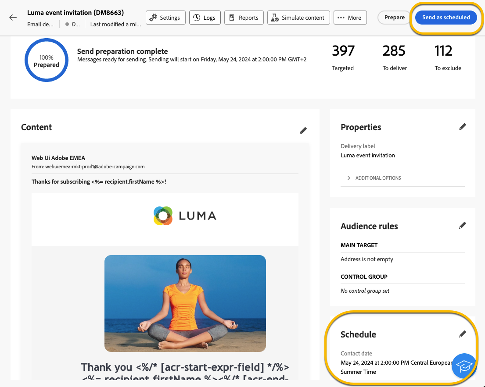

# 게재 전송 예약 {#schedule-sending}

게재 전송을 예약할 수 있습니다. 이에 대한 단계는 독립 실행형(일회성) 게재인지 또는 캠페인 워크플로우의 컨텍스트에서 작업 중인지 여부에 따라 다릅니다.

## 독립형 게재

독립형 게재의 경우 게재의 날짜 및 시간을 직접 예약할 수 있습니다.
각 게재 유형에 대한 이메일, SMS, 푸시 알림의 아래 예를 참조하십시오.

### 이메일 {#schedule-email-standalone}

이메일 게재 전송을 예약하려면 아래 단계를 따르십시오.

1. 게재 속성의 **[!UICONTROL 예약]** 섹션에서 **[!UICONTROL 예약 사용]** 토글을 활성화합니다

1. 원하는 전송 날짜와 시간을 설정하고 **[!UICONTROL 검토 및 보내기]** 단추를 클릭합니다.

   {zoomable="yes"}

>[!NOTE]
>
>기본적으로 **[!UICONTROL 전송 전에 확인 활성화]** 옵션이 활성화되어 있습니다. 이 옵션을 활성화하면 게재가 예약된 날짜 및 시간에 전송되기 전에 전송을 확인해야 합니다. 예약된 날짜와 시간에 **자동으로 게재를 보내기**&#x200B;해야 하는 경우 이 옵션을 비활성화해야 합니다.
>

1. 일정이 올바른지 확인하고 **[!UICONTROL 준비]** 단추를 클릭하세요.

{zoomable="yes"}

1. 준비가 완료되면 메시지를 보낼 준비가 되었습니다. 총 대상 모집단, 게재할 메시지 수, 제외된 수신자 수와 같은 게재의 주요 지표가 표시됩니다. **[!UICONTROL 일정에 따라 보내기]** 단추를 클릭하여 예약된 날짜와 시간에 게재를 기본 대상으로 보낼 수 있도록 허용합니다.

{zoomable="yes"}

### SMS

SMS 게재를 특정 날짜 및 시간으로 예약하려면 전자 메일 게재와 단계가 동일합니다. [위의 내용](#schedule-email-standalone).

{zoomable="yes"}

일정이 고려되었는지 확인할 수도 있습니다.

{zoomable="yes"}

### 푸시 알림

독립 실행형 푸시 게재를 특정 날짜 및 시간으로 예약하려면 전자 메일 게재와 단계가 동일합니다. [위의 내용](#schedule-email-standalone).

{zoomable="yes"}

일정이 고려되었는지 확인할 수도 있습니다.

{zoomable="yes"}

### 캠페인의 독립 실행형 게재

워크플로우를 사용하지 않고 캠페인 내에서 독립형 게재를 만들 수 있습니다. 위에 설명된 대로 이 게재의 날짜 및 시간 일정을 설정할 수 있습니다.
캠페인에 시작 날짜와 종료 날짜가 포함된 일정이 있을 수 있습니다. 이 일정은 게재 일정에 영향을 주지 않습니다.

{zoomable="yes"}

## 캠페인 워크플로우에서 게재 예약

캠페인 워크플로우의 컨텍스트에서 **모범 사례**&#x200B;는 **[!UICONTROL 스케줄러]** 활동을 사용하여 게재 전송과 관련된 워크플로우를 시작할 날짜와 시간을 적용하는 것입니다. [스케줄러에 대해 자세히 알아보기](../workflows/activities/scheduler.md)

{zoomable="yes"}

**[!UICONTROL 스케줄러]** 활동에서 날짜와 시간을 구성해야 합니다.

{zoomable="yes"}

>[!NOTE]
>
>**[!UICONTROL 스케줄러]** 활동을 사용하여 워크플로우에서 게재 전송을 예약하는 경우 **[!UICONTROL 게재]** 활동 설정에서 **[!UICONTROL 예약 활성화]** 토글을 **활성화하지 않음**&#x200B;합니다. 게재가 자동으로 전송됩니다.
>

**[!UICONTROL 게재]** 활동 설정에서 **[!UICONTROL 예약 사용]** 토글을 활성화하고 날짜와 시간을 설정하는 경우 이 날짜 및 시간에 게재가 전송될 때까지 대기합니다. 즉, 워크플로우 시작 날짜와 전송 날짜 사이에 지연이 있을 경우 대상자가 최신 상태가 아닐 수 있습니다.
